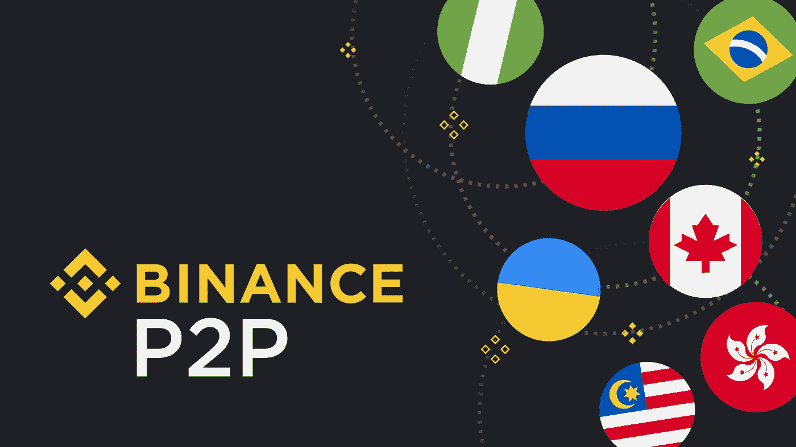
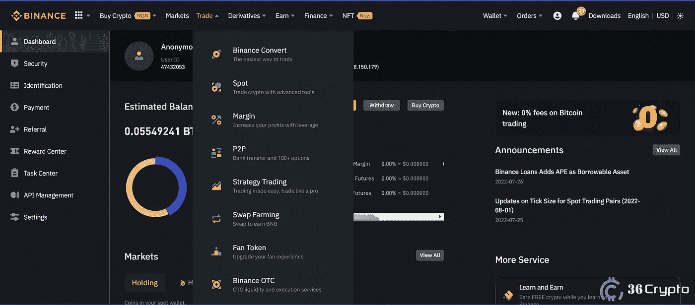
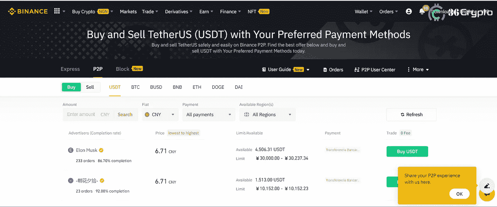
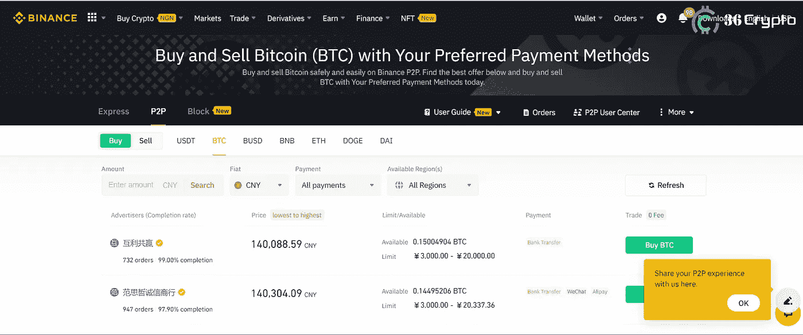

# 教程:如何使用 P2P 在币安购买比特币(分步指南)

> 原文：<https://medium.com/coinmonks/tutorial-how-to-buy-bitcoin-on-binance-using-p2p-step-by-step-guide-d4d0c4ddd108?source=collection_archive---------19----------------------->

币安是世界上最受欢迎的加密货币交易所之一，在这里你可以通过 P2P 和其他方式购买和交易比特币和数百种加密货币。

作为一个密码新手，币安可能看起来非常复杂，但相信我，一旦你掌握了它，它会变得非常容易。币安也被认为是可信度和安全性最高的交易所之一。

多年来，比特币越来越受欢迎，许多人都在寻找如何投资数字资产。如果你属于这一类，币安是你应该尝试的一个平台。

在本教程中，我们将向你展示如何在币安使用 P2P(点对点)购买比特币。首先，我稍微解释一下 P2P 是什么意思。

# 什么是币安点对点(P2P)？

P2P 是币安交易所平台上提供的一项服务，允许用户以零费用即时相互购买比特币和其他加密货币。币安 P2P 的目标之一是让用户能够方便地用他们当地的法定货币购买[加密货币](https://36crypto.com/cryptocurrency/)。

全球约有 55 种当地货币和 150 多种支付渠道。

自 2019 年以来，币安不断为 P2P 添加新功能，用户数量增长了 6 倍多。用户可以在平台上添加购买或销售广告，也可以评论或删除对已完成交易的评论。

# 币安的 P2P 是如何运作的？

在使用币安 P2P 之前，你必须要么卖，要么买。一旦你下了订单(例如购买)，想要接受订单的第二方必须同意你的条件，例如费率，交易需要多长时间，然后币安会提醒你。

如果你想购买，币安会告诉你支付应用程序上显示的金额。卖家的密码由币安保管，一旦卖家确认收到你的付款，就会交给你。

根据交易的速度，交易的持续时间可以从几分钟到最多 45 分钟。一旦时间过去，你(买家)没有付款，订单将被取消，你将不得不重新开始。

# 币安 P2P 是为谁服务的？

在你使用币安 P2P 之前，就像其他任何一个交易平台一样，你需要成为一个经过验证的用户。如果你还没有被验证，你可以点击[这个链接](https://www.binance.com/)来注册和验证。

完成后，您可以继续设置您的 P2P 帐户，添加您的付款详情和地址。一旦完成，你就可以用你的本地货币来换取比特币和其他货币。

# 如何在币安 P2P 上购买比特币

一旦你完成注册并设置了上面的步骤，接下来你要做的就是购买比特币。请遵循以下步骤:

*   登录您的帐户并导航至交易。将鼠标悬停在它上面，会显示一个下拉菜单。点击 P2P 选项。

*   P2P 市场打开，您可以看到买卖选项。既然你想买的是比特币，那就点击 BTC。除了 USDT，其他所有加密货币都必须这样做。

*   接下来，你必须从标有“fiat”的小框中选择你想购买的当地货币，然后选择你的货币。

*   接下来，在市场左上方标有“金额”的小搜索栏中输入你想用自己的货币购买多少比特币。输入金额后，点击搜索，然后点击所有愿意出售与你想购买的比特币数量相同的比特币的人的列表。

*   你可能不需要输入你想买的确切数量，但是你输入的数量应该在你想买的和他们愿意卖的范围之内。
*   接下来，点击屏幕右下角的绿色“购买 BTC”按钮。点击购买后，下一页打开，你可以看到卖家的信息，如姓名和银行信息，你可以发送你想用来购买比特币的法定货币。
*   复制卖家的号码，打开你的银行应用程序，然后将准确的金额发送给卖家，点击确认按钮，提醒卖家你已经付款。
*   接下来你要做的就是等待卖家确认你发出的付款，然后释放你的比特币。一旦确认，比特币就会被发送到你的“资金钱包”(也就是你的 P2P 钱包)。当 BTC 进入你的钱包时，你会收到一个提醒，一个点击并检查你的钱包的按钮会出现。
*   你要做的最后一件事(虽然是可选的)，是将比特币转移到你的现货钱包或你想发送到的任何钱包。

# 使用币安 P2P 安全吗？

币安 P2P 使用起来非常安全。如前所述，币安将密码保存在一个托管账户中，一旦付款被确认，它就会释放到你的钱包中。币安有一套系统来确保没有人在交易中欺骗对方或系统。

举个例子，你寄钱给卖家，卖家拒绝释放密码，你可以使用“上诉”按钮，提出投诉，然后币安会进来尝试解决问题。

此外，有时会弹出警告消息，告诉您在付款得到确认之前不要释放任何资产。因此，总而言之，在币安 P2P 上交易是非常安全的，尽管你必须保持警惕，反复检查你在交易中采取的每一步。

# 结论

币安 P2P 平台是一个市场，旨在让用户能够快速便捷地将当地货币兑换成比特币和其他加密货币。它安全可靠。该平台面向任何希望买卖比特币和其他替代货币的人。

您必须先注册，然后验证您的帐户，然后才能使用该平台。

在这里阅读我们对币安**的综合评论。**

**最初发布于 [36crypto](https://36crypto.com/how-to-buy-bitcoin-on-binance-using-p2p-step-by-step-guide/)**

> **交易新手？尝试[加密交易机器人](/coinmonks/crypto-trading-bot-c2ffce8acb2a)或[复制交易](/coinmonks/top-10-crypto-copy-trading-platforms-for-beginners-d0c37c7d698c)**