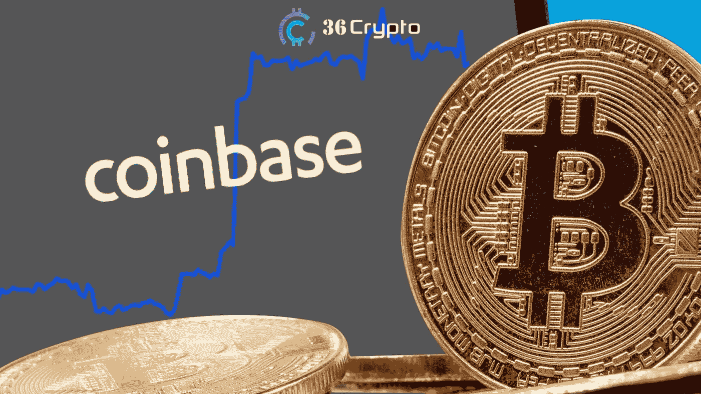
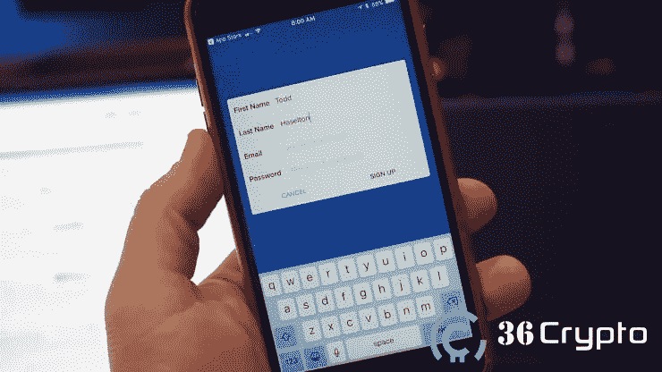
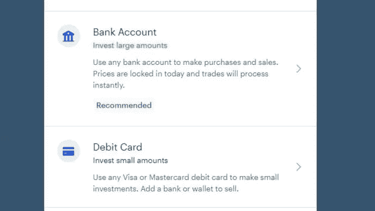
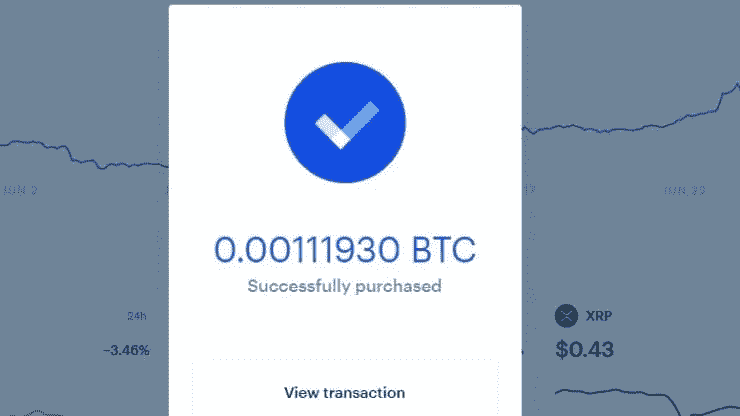

# 教程:如何在比特币基地购买比特币(分步指南)

> 原文：<https://medium.com/coinmonks/tutorial-how-to-buy-bitcoin-on-coinbase-step-by-step-guide-9cdf6a29e44?source=collection_archive---------33----------------------->

[比特币基地](https://36crypto.com/coinbase-review-2022/)是一家总部位于美国的上市公司，允许你在其交易平台上买卖比特币和其他加密货币。众所周知，这是最简单的加密平台之一，尤其是对初学者来说。

该公司由 [Brian Armstrong](https://www.google.com/search?rlz=1C1RLNS_enNG983NG983&sxsrf=ALiCzsb_5k8lM6QTjPhihKw9eCOZnzGALg:1658916867511&q=Brian+Armstrong&stick=H4sIAAAAAAAAAOPgE-LSz9U3KC8yLswqVOIGsQ0NMszTsk211LOTrfSTSosz81KLi-GM-PyC1KLEksz8PKu0_NK8lNSiRaz8TkWZiXkKjkW5xSVF-XnpO1gZd7EzcTACAMLvV-deAAAA&sa=X&ved=2ahUKEwi89-X06pj5AhWoX_EDHeYSBxsQmxMoAHoFCJsCEAI) 和 [Fred Ehrsam](https://www.google.com/search?rlz=1C1RLNS_enNG983NG983&sxsrf=ALiCzsb_5k8lM6QTjPhihKw9eCOZnzGALg:1658916867511&q=Fred+Ehrsam&stick=H4sIAAAAAAAAAOPgE-LSz9U3KC8yLswqVOIGsQ0NMszTiuK11LOTrfSTSosz81KLi-GM-PyC1KLEksz8PKu0_NK8lNSiRazcbkWpKQquGUXFibk7WBl3sTNxMAIAmof1jVoAAAA&sa=X&ved=2ahUKEwi89-X06pj5AhWoX_EDHeYSBxsQmxMoAXoFCJsCEAM) 于 2012 年创立，没有实体总部。在安全性和交易便利性方面，比特币基地也是顶级交易所之一。

如果你是一个寻求开始投资加密货币的初学者，那么比特币基地可能是你开始旅程的最佳地点。随着比特币和其他加密技术的不断发展，你现在开始还不晚。

在这篇文章中，我们详细介绍了如何在比特币基地交易所平台上购买你的第一枚[比特币](https://36crypto.com/what-is-bitcoin-and-why-is-it-valuable/)。

*   在比特币基地上创建帐户
*   添加您喜欢的付款方式
*   点击应用程序或网站上的“交易”
*   从可用资产列表中选择比特币
*   指定您想要购买的比特币数量
*   预览并最终确定您的购买

# 1.创建一个比特币基地帐户

不先创建账户，你就不能在任何交易所开始购买[比特币](https://36crypto.com/what-is-bitcoin-and-why-is-it-valuable/)。在比特币基地注册非常简单。首先，下载应用程序并开始注册过程。

输入您的姓名、电子邮件和密码以完成填写。您可能会被要求在交易前提供有效的身份证和地址证明。根据您的居住地，可能需要几分钟来验证您的 ID。

# 2.添加您喜欢的付款方式

在这里，你有三个选择。你可以增加一个银行账户或借记卡，或者使用即时电汇。点击付款方式框并添加您喜欢的方式。使用银行账户的限额是 25，000 美元，而借记卡的交易限额是 3，000 美元。此外，当您使用银行帐户时，您的购买将被搁置几天，但借记卡可以让您立即访问您的加密购买。

# 3.点击应用程序或网站上的“交易”

点击交换箭头按钮，并从选项中选择购买。

# 4.从可用资产列表中选择比特币

在搜索栏中输入比特币，当它出现在选项列表中时，选择它将带您进入购买屏幕。

# 5.指定您想要购买的比特币数量

在这里，你可以选择你想买多少比特币。你一定不能买整个比特币，你可以选择买它的任何一个分数(称为 Sats)。

相关: [***阅读此文，看看如何在熊市中积累 sat(Satoshi)。***](https://36crypto.com/3-ways-to-take-advantage-of-the-bitcoin-bear-market/)

使用数字键盘输入您想用当地法定货币消费的金额，然后比特币基地应用程序会自动将其转换为比特币金额。

然后选择您的支付方式，无论是您设置的银行账户还是通过借记卡。

# 6.预览并最终确定您的购买

最后，点击“预览购买”确认您的购买详情。将显示您购买的详细信息，其中也包括费用。确保一切看起来不错，你没有犯任何错误，然后确认您的购买。

正如你在上面的步骤中看到的，从比特币基地购买比特币非常容易，非常简单，只需点击几下鼠标。你也可以卖掉你的比特币换成现金，存入你在比特币基地交易所应用上的银行账户。

在这里阅读我们广泛的 [**coinbase 评论**](https://36crypto.com/coinbase-review-2022/)

***免责声明:*** *就此内容表达的观点仅是作者的想法，绝不是对从上述交易所购买的认可。在选择去哪里购买或交易密码之前，一定要先做研究。*

最初发布于 [36crypto](https://36crypto.com/tutorial-how-to-buy-bitcoin-on-coinbase-step-by-step-guide/)

> 交易新手？试试[加密交易机器人](/coinmonks/crypto-trading-bot-c2ffce8acb2a)或者[复制交易](/coinmonks/top-10-crypto-copy-trading-platforms-for-beginners-d0c37c7d698c)