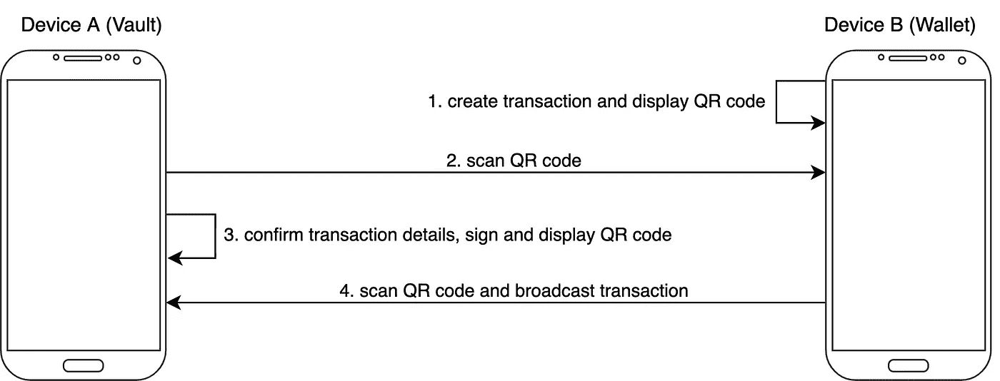

# 教程:用 AirGap 免费设置你自己的气隙钱包

> 原文：<https://medium.com/coinmonks/tutorial-set-up-your-own-air-gapped-wallet-for-free-with-airgap-7ef4d7b7b0cc?source=collection_archive---------5----------------------->

## *如何将旧设备重新用作气隙加密钱包*

# 关于气隙加密钱包

气隙钱包将你的私钥保存在一个独立的设备上，这个设备永远不会连接到互联网。这使得(几乎)不可能窃取你的私钥，从而窃取你的密码。如果你想知道为什么气隙钱包是最安全的加密钱包，看看我前段时间写的这篇文章:[为什么气隙钱包是管理你的密码最安全的方式](/coinmonks/why-air-gapped-wallets-are-the-most-secure-way-to-manage-your-crypto-d50dd83b7529)。

有各种各样的气隙钱包解决方案，许多公司提供专用硬件，如 [ELLIPAL Titan](https://www.ellipal.com/products/ellipal-titan) 、 [SafePal](https://www.safepal.com/) 和 [Keystone](https://keyst.one/) 。这些产品的价格大约在 150-200 美元之间。

然而，也有可能重复使用您已经拥有的旧设备，并简单地保持它与互联网断开连接。 [AirGap](https://airgap.it/) 提供了这样一个解决方案，这篇文章将向你展示如何免费建立一个 AirGap 钱包解决方案。除了是最便宜的解决方案之外，使用 AirGap 还有其他好处

*   您不会将任何私人信息(如送货地址)提供给第三方。这些信息可能会被用于有针对性的攻击。
*   AirGap 可以安装在各种各样的硬件设备上，您的确切设备不太可能成为攻击的目标(与专用硬件钱包相比)。
*   代码是开源的，可以在这里查看[https://github.com/airgap-it](https://github.com/airgap-it)。如果你有技术技能，你甚至可以将源代码直接部署到你的设备上。

# 气隙钱包是如何工作的？

对于一个气隙钱包，你需要两个设备，我将这些设备称为“保险库”，设备 B 称为“钱包”。

基本思想是，你的设备 A 存储私钥，并且从不连接到互联网或任何其他设备。这使得(几乎)不可能窃取您的私钥。您应该将设备 A 仅用于一个目的，即签署交易，而不是其他目的。

设备 B 可以是您喜欢的任何日常设备，可以是您的智能手机、笔记本电脑或台式电脑。在设备 B 上，你将保留你的钱包应用程序**，但没有你的私钥**。这意味着，你可以在设备 B 上看到你的当前余额和过去的交易，但是你不能发送加密。如果你想发送加密，你需要与设备 a 签署交易。

transaction flow with an air-gapped wallet

上图显示了如何使用气隙钱包进行加密交易:

1.  您使用钱包应用程序在设备 B 上创建交易。您将选择收件人和要发送的加密量。创建交易后，设备 B 将显示包含交易信息的二维码。
2.  你用设备 A 扫描二维码，获取交易信息。
3.  设备 A 要求您确认交易，例如通过指纹扫描或密码。确认交易后，设备 A 使用私钥对交易进行签名，并显示包含签名的 QR 码。
4.  你用设备 B 扫描二维码，得到签名。一旦完成，交易就被广播到网络。

如您所见，**设备 A 从未连接到互联网，您的私钥也从未被转移过**，这使得您的私钥几乎不可能被盗。

看看 AirGap 的这个视频，看看它是如何工作的【https://www.youtube.com/watch?v=9L04TkMeH0o &ab _ channel = AirGap . it

# 逐步安装指南

## 你需要什么

*   设备 A:带有摄像头的旧 Android 或 iOS 设备(你应该不再需要这个设备来做其他任何事情)。
*   设备 B:带摄像头的日常设备(智能手机、笔记本电脑、台式机)。
*   备份种子短语的安全方法，例如 [Steelwallet](https://shiftcrypto.shop/en/products/steelwallet-13/)

## 步骤 1，准备设备 A

设备 A 将存储您的私钥，并且在初始设置后将永远不会连接到互联网或其他设备。

你可以使用任何旧的 Android 或苹果设备，只要它有摄像头并支持 AirGap Vault 应用程序( [Apple Store](https://itunes.apple.com/us/app/airgap-vault-secure-secrets/id1417126841?l=de&ls=1&mt=8) ， [Google Store](https://play.google.com/store/apps/details?id=it.airgap.vault) )。但是要确保你在生活中不需要这个设备来做其他事情。设置完成后，您只能将其用于签署交易。

在您的旧设备(设备 A)上:

*   从设备中取出所有 SIM 卡和 SD 卡
*   工厂重置设备—所有数据都将丢失
*   重启设备
*   连接到 wifi
*   安装最新的 Android/iOS 软件更新
*   设置锁定屏幕
*   如果您的设备支持加密，请启用加密。
    在 Android 上:设置→安全&锁屏→加密&凭证

## 步骤 2，在设备 A 上安装 Vault 应用程序

现在设备 A 已经准备好了，从以下来源之一安装 Vault 应用程序:
[苹果商店](https://itunes.apple.com/us/app/airgap-vault-secure-secrets/id1417126841?l=de&ls=1&mt=8)，[谷歌商店](https://play.google.com/store/apps/details?id=it.airgap.vault)，[安卓 APK。](https://github.com/airgap-it/airgap-vault/releases)

## 步骤 3，断开设备 A 与互联网的连接

安装 Vault 应用程序后，您将不再需要互联网连接。

*   转到您的 WIFI 设置并移除所有网络
*   在 Android 上，转到 WIFI 设置，并确保“扫描总是可用”被禁用
*   启用飞行模式**并永远保持启用状态**

## 步骤 4，导入或创建种子短语

现在，您的设备已与互联网断开连接，可以安全地导入私钥或使用 Vault 应用程序创建新的私钥。

*   启动 Vault 应用程序
*   当询问安装类型时，选择“脱机”。请记住，不要再将此设备连接到互联网。如果你需要，首先做另一个工厂重置删除你所有的应用程序和私人数据。当然，一定要准备好种子短语的备份！

现在，您可以导入现有的种子短语(如果您想要重用现有的加密地址)或创建一个新的种子短语。为了安全起见，我建议生成一个新的，然后将所有的密码转移到新的地址。如果您想要导入现有的种子短语，请跳至下一步。

要生成新的种子短语:

*   按照说明，这将要求您访问您的相机
*   一旦生成了种子短语，请确保对其进行备份。如果您丢失了您的种子短语，您将无法访问您的密码！

要备份种子短语，您可以使用金属存储装置，例如耐火的[钢钱包](https://shiftcrypto.shop/en/products/steelwallet-13/)。查看本页，了解各种不同的金属储存选项:[https://jlopp.github.io/metal-bitcoin-storage-reviews/](https://jlopp.github.io/metal-bitcoin-storage-reviews/)

## 步骤 5，设置设备 B

在您的日常设备(设备 B)上，例如您的智能手机，安装 AirGap Wallet 应用程序:
[应用商店](https://itunes.apple.com/us/app/airgap-wallet/id1420996542?l=de&ls=1&mt=8)、[谷歌商店](https://play.google.com/store/apps/details?id=it.airgap.wallet)、 [Windows、iOS 或 Linux 电脑](/airgap-it/airgap-wallet-now-available-for-desktop-aa3836c6b088)。

**边注**:不需要使用 AirGap 钱包 App。AirGap 还集成了 [MetaMask](/airgap-it/airgap-now-supports-metamask-mobile-ef8c81b8116b) 和其他钱包应用:[https://airgap.it/supported-wallet](https://airgap.it/supported-wallet/)。

## 第六步，导入账户

现在我们需要将在设备 A 上创建的帐户导入到设备 b 上的钱包应用程序中。

*   在设备 A 上，打开 Vault 应用程序，然后单击帐户。该应用程序将显示一个二维码
*   在设备 B 上，打开钱包应用，点击“扫描 QRs”。扫描设备 a 上显示的二维码。

这会将帐户导入到钱包应用程序中，而不会传输私钥。私钥将安全地保存在设备 a 上。

## 第七步，总结

🍾🍾🍾好了🍾🍾🍾

您已经使用自己的设备成功设置了一个气隙硬件钱包。在把你所有的钱转移到新地址之前，我建议你要小心:

*   请确保您备份了种子短语，以便在设备丢失、被盗或损坏时可以恢复您的帐户。
*   在将所有加密转移到新地址之前，先测试少量加密的接收和发送。这也将使你熟悉交易工作流程。

通过 AirGap 查看此视频，了解如何创建交易:[https://www.youtube.com/watch?v=9L04TkMeH0o&ab _ channel = AirGap . it](https://www.youtube.com/watch?v=9L04TkMeH0o&ab_channel=AirGap.it)

**最后一句警告:**需要注意的是，气隙钱包并非完全不受安全威胁的影响，因此采取措施保护您的资金仍然很重要，例如使用强密码和确保您的恢复短语安全。

# 来源和链接:

*   如何创建交易的详细分步指南:[https://medium . com/air gap-it/air gap-the-step-by-step-guide-C4 C3 D3 Fe 9a 05](/airgap-it/airgap-the-step-by-step-guide-c4c3d3fe9a05)
*   Airgap 网站: [https://airgap.it](https://airgap.it/offline-device/)
*   使用 Airgap 搭配 meta mask:[https://medium . com/air gap-it/air gap-now-supports-meta mask-mobile-ef 8 c 81 b 8116 b](/airgap-it/airgap-now-supports-metamask-mobile-ef8c81b8116b)

> 交易新手？试试[密码交易机器人](/coinmonks/crypto-trading-bot-c2ffce8acb2a)或者[复制交易](/coinmonks/top-10-crypto-copy-trading-platforms-for-beginners-d0c37c7d698c)
> 
> 加入 Coinmonks [电报频道](https://t.me/coincodecap)和 [Youtube 频道](https://www.youtube.com/c/coinmonks/videos)获取每日[加密新闻](http://coincodecap.com/)

## 另外，阅读

*   [复制交易](/coinmonks/top-10-crypto-copy-trading-platforms-for-beginners-d0c37c7d698c) | [加密税务软件](/coinmonks/crypto-tax-software-ed4b4810e338)
*   [网格交易](https://coincodecap.com/grid-trading) | [加密硬件钱包](/coinmonks/the-best-cryptocurrency-hardware-wallets-of-2020-e28b1c124069)
*   [密码电报信号](/coinmonks/top-3-telegram-channels-for-crypto-traders-in-2021-8385f4411ff4) | [密码交易机器人](/coinmonks/crypto-trading-bot-c2ffce8acb2a)
*   [最佳加密交易所](/coinmonks/crypto-exchange-dd2f9d6f3769) | [印度最佳加密交易所](/coinmonks/bitcoin-exchange-in-india-7f1fe79715c9)
*   开发人员的最佳加密 API
*   最佳[密码借贷平台](/coinmonks/top-5-crypto-lending-platforms-in-2020-that-you-need-to-know-a1b675cec3fa)
*   [免费加密信号](/coinmonks/free-crypto-signals-48b25e61a8da) | [加密交易机器人](/coinmonks/crypto-trading-bot-c2ffce8acb2a)
*   [杠杆代币的终极指南](/coinmonks/leveraged-token-3f5257808b22)