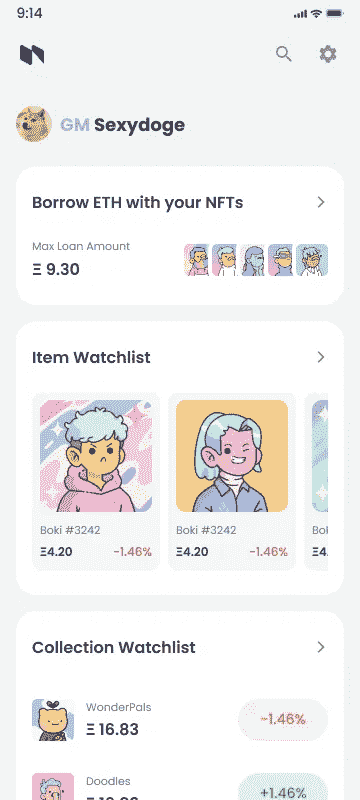
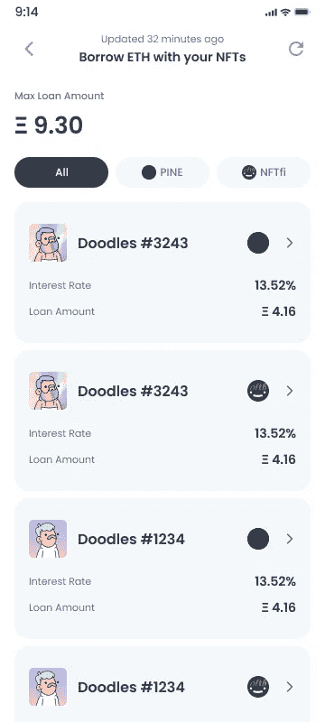
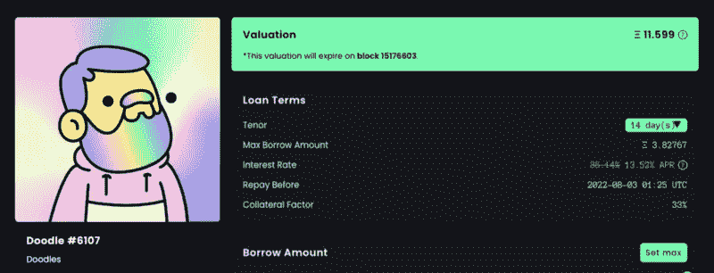
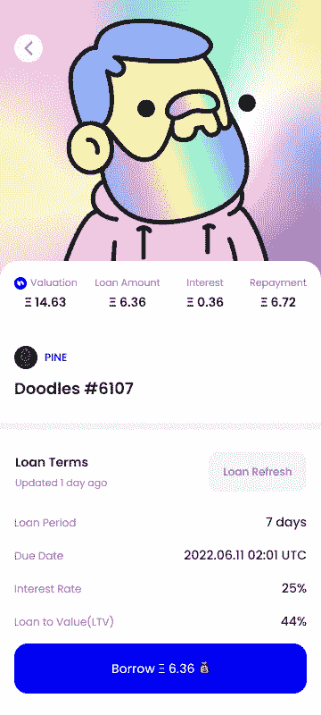
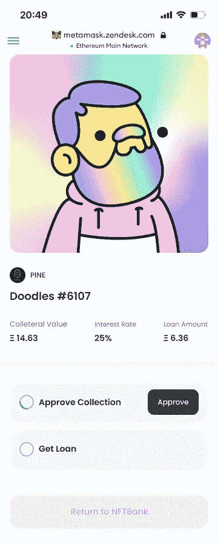
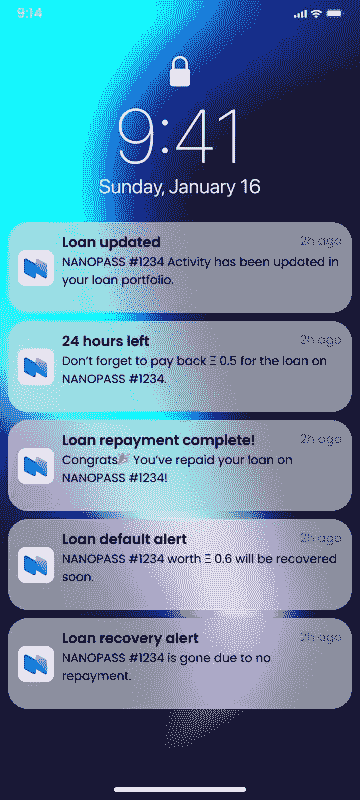

# 教程:在同一个地方跟踪和利用你的 NFT

> 原文：<https://medium.com/coinmonks/tutorial-track-and-leverage-on-your-nft-at-the-same-place-f2f9d59cf236?source=collection_archive---------13----------------------->

嗨，松鼠们，我们很高兴支持 NFTBank iLoan 功能！🔥 **(iLoan =即时 NFT-Pine 协议支持的抵押贷款)**

Pine 和 NFTBank 的合作使 NFTBank 能够利用 Pine 协议，在其 NFT 投资组合管理服务的基础上，向其用户提供即时贷款功能。在技术上，德根斯现在可以通过 NFTBank 的移动应用程序调用 Pine 的智能合约。

首先，你可以使用这个链接下载应用程序。
iOS/Android:https://nftbank.onelink.me/8FKZ/qqd09nfs

在您按照应用程序中的说明使用您的钱包(例如 Metamask)登录后，您将进入此页面，在这里您可以立即看到您可以通过抵押您的 NFT 投资组合使用 Pine 立即借款的价值(在 ETH 中，即本例中的 9.3ETH)。

您可以点击第一张卡片，显示您可以抵押的特定 NFT 的详细信息页面。在这个版本中，您可以逐个抵押 NFT。

你会在每张 NFT 卡上看到两个数字:

*   ***利率*** 是贷款池对贷款金额收取的年化百分比(APR)。例如，如果用户贷款 1 周，那么贷款池将收取大约 1/52 的利率。
*   ***借款金额*** 是用户通过质押 NFT 可以借款的金额。

这两个参数在 Pine 网站上也可以看到( [https://app.pine.loans](https://app.pine.loans) )。NFTBank app 上显示的 ***利率*** 对应 Pine 网站上显示的 ***利率*** ，NFTBank app 上显示的 ***借款金额*** 对应 Pine 网站上显示的 ***最大借款金额*** ，*其他条件不变*。

点击其中一张 NFT 卡后，你将进入贷款条款页面。

用户首先想看的是 ***到期日*** 。 ***到期日*** 是贷款金额**必须全部偿还**的时间。否则，贷款人有权清算贷款头寸。

如果您在到期日还款，NFTBank 应用程序会为您计算利息成本，在这种情况下，利息成本为 36ETH。用户在到期日总共需要偿还 6.72ETH。

下一步是确认链上借款。确认过程分为两步。

*   第一步是 ***批准***NFT 集合在借贷池中进行交易。这将允许贷款池将 NFT 作为抵押品。
*   第二步是**的*确认*的**贷款交易。你借的钱会马上到你的钱包里。

使用 NFTBank 应用程序的优势之一是投资组合管理的能力。NFTBank 将推送关于用户贷款状态的近乎实时的通知。这提醒用户在到期日临近时偿还贷款。

快乐的阿平，松鼠们！

> 交易新手？尝试[加密交易机器人](/coinmonks/crypto-trading-bot-c2ffce8acb2a)或[复制交易](/coinmonks/top-10-crypto-copy-trading-platforms-for-beginners-d0c37c7d698c)