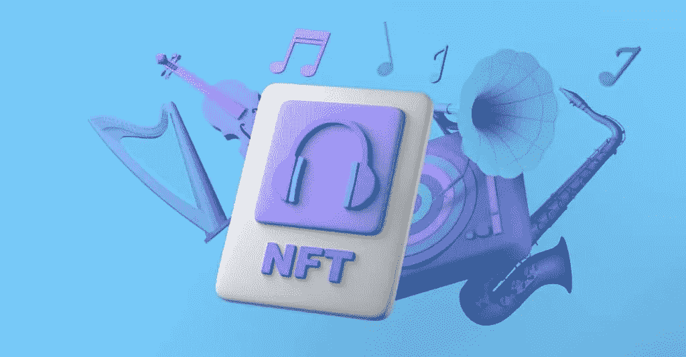
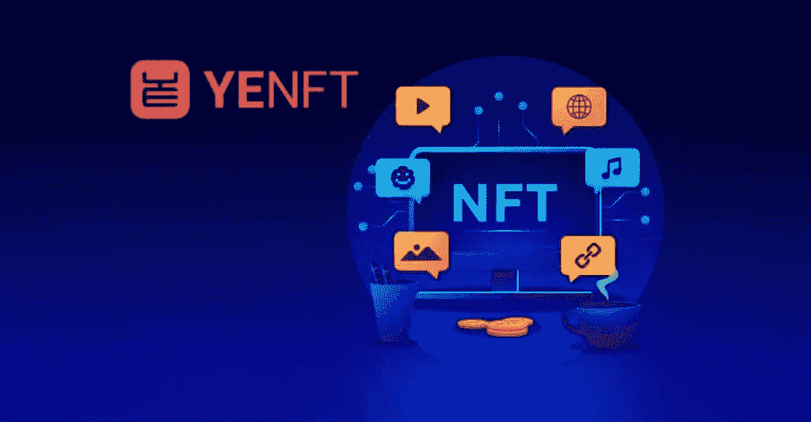
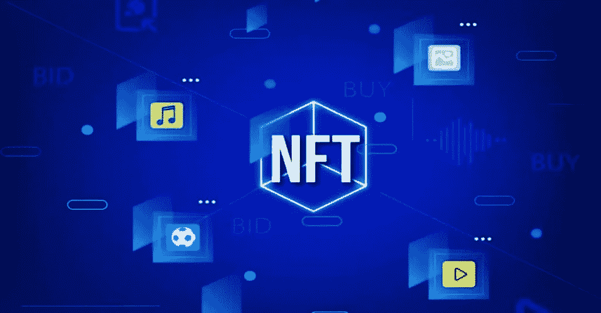

# 电视流媒体服务应该使用 NFTs。

> 原文：<https://medium.com/coinmonks/tv-streaming-services-should-use-nfts-61b9db857ad6?source=collection_archive---------24----------------------->

# 电视流媒体服务

 [## 电视流媒体服务应使用 NFTs - Koop360

### 电视流媒体服务应该使用 NFTs。NFTs 可以通过让用户出售或出租他们的…

koop360.com](https://koop360.com/blog/tv-streaming-services-should-use-nfts/) 

> NFTs 可以通过让用户出售或出租他们的订阅来改变订阅服务。很难回忆起什么时候基于订阅的服务不是常规的，因为它们现在很普遍。流媒体行业的公司利用了这种预期，比如网飞决定引入广告。

[NFT 技术](https://koop360.com/blog/how-fashion-and-nfts-became-beneficial-partners/)的另一个积极影响是流媒体服务的社会价值增加。像所有的消费文化一样，我们在数字世界消费。非食物疗法可以显著地加强个人和所消费的事物之间的联系。

# 存在一种用于流式“流失”的解决方案

十年前，谁能预料到专注于 JPEG 家庭的数字社区会成为亿万美元的公司？NFT 已经发展成为身份证、VIP 通行证、所有权验证和数字艺术——所有这些都是任何人都可以使用的便利产品，包括无聊的猿到聚会退化者。那么为什么不提供流媒体服务呢？

如果你的观看习惯主要受[大卫·爱登堡](https://en.wikipedia.org/wiki/David_Attenborough)作品的影响，NFT 可能会围绕你对自然世界的热情而设计。其他像你一样的人会购买这种专门的会员资格，这可能会跨平台流动，并在分销商、知识产权持有者和内容创作者之间分配资金。我们将有一个积累了超利基成员的社区，有一个典型的关系。该社区有潜力为外部各方带来可观的收入，并提供广泛的合作和参与机会。这可能包括提前观看新大卫·爱登堡秀，与顶级动物学家的直播问答，以及博物馆和野生动物园门票的大幅折扣。

成为消费者身份一部分的利基会员产品将增加流媒体服务的感知价值。订阅可以转化为会员资格，解决流媒体行业的许多周转问题。平台可以为所有内容创作者建立强大的、专注的社区。

# 保持市场领先地位

你可能会想， ***“我们今天可以做到这一切，”*** 如果你做到了，你就不会完全错了。例如，为特定材料类别创建交互式会员服务对网飞来说是可行的。然而，与 Web3 不同，流媒体提供商的主要信用卡、填写表格和电子邮件策略需要改进。

通过使用 NFTs，用户可以享受门控内容，因为它可以保持他们的兴趣，然后将他们的密钥转移给新用户，而不会有任何损失。此外，内容提供商将从与高度参与的受众的直接用户对用户关系中获益。最后，创作者可以为特定的 NFTs 打包内容或奖励特定的行为，而不是常规订阅的*或什么都不做的方式。比如快速看完所有集就可以获得奖金，或者反馈一季就可以获得幕后内容。*

***结论***

**

*作为消费者，我们注意到交易式视频点播和单点购买正在变得过时。因此，对于希望保持领先的服务来说，考虑 Web3 的可能性是谨慎的。*

> *交易新手？尝试[加密交易机器人](/coinmonks/crypto-trading-bot-c2ffce8acb2a)或[复制交易](/coinmonks/top-10-crypto-copy-trading-platforms-for-beginners-d0c37c7d698c)*