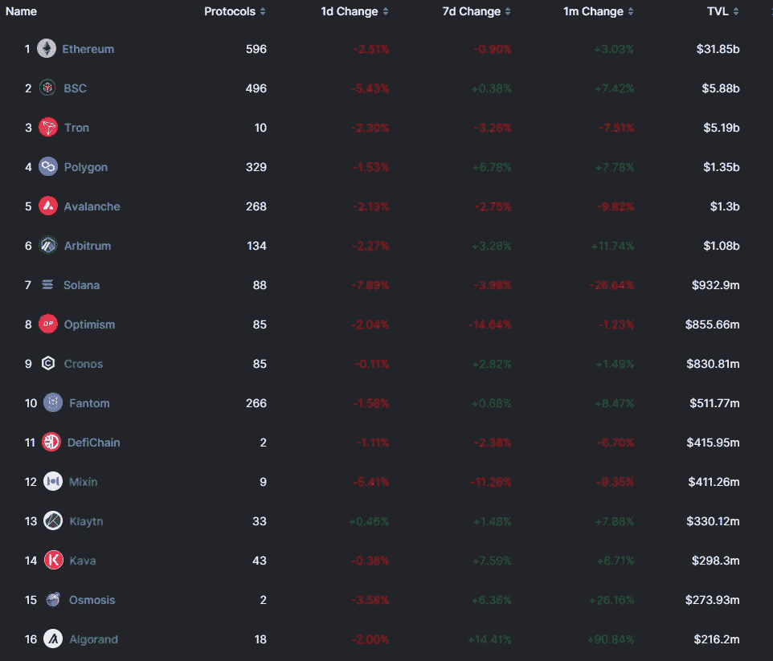
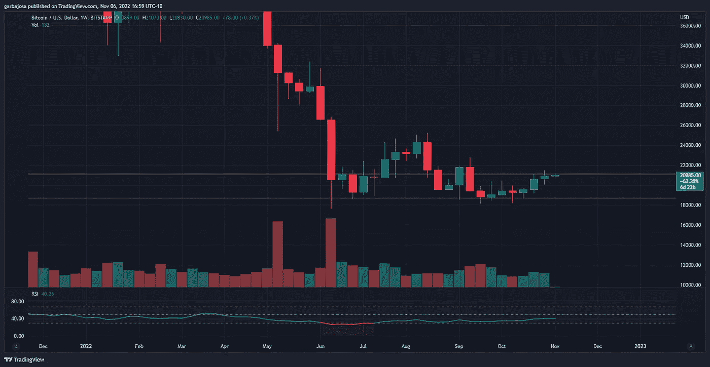
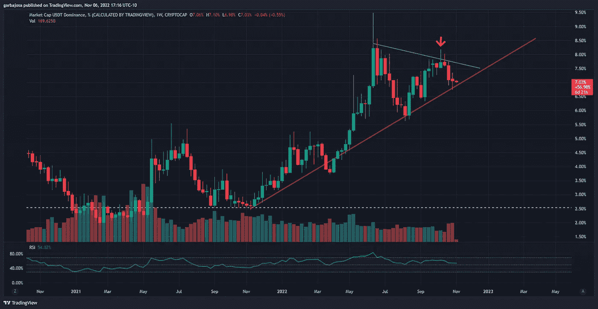
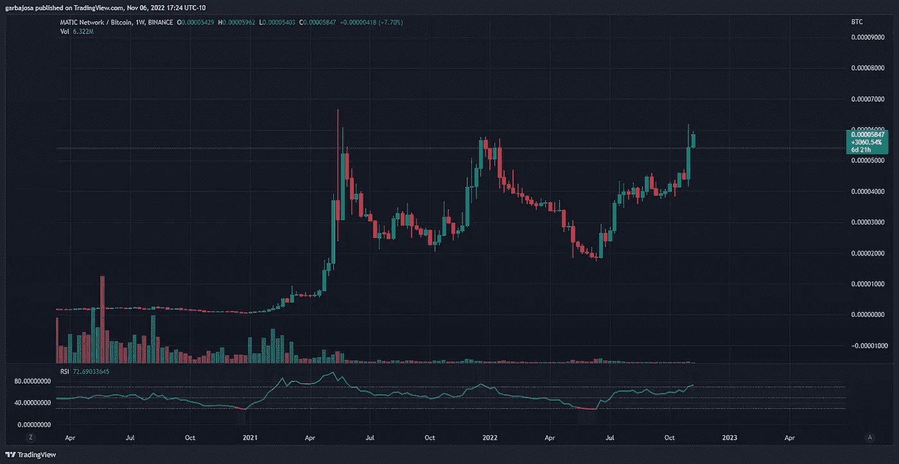
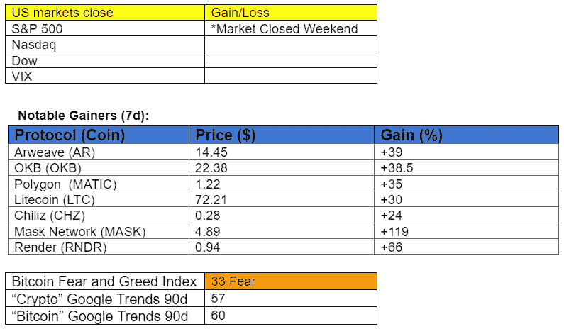

# TVL 更新:大规模资本离开索拉纳/雪崩以太坊和 L2s。

> 原文：<https://medium.com/coinmonks/tvl-update-mass-capital-leaving-solana-avalanche-for-ethereum-and-l2s-71ae728161f2?source=collection_archive---------8----------------------->

## 秘密征服#120

***最好的每日新闻、见解和阿尔法来源。***

Photo by [eberhard 🖐 grossgasteiger](https://unsplash.com/@eberhardgross?utm_source=medium&utm_medium=referral) on [Unsplash](https://unsplash.com?utm_source=medium&utm_medium=referral)

***密码市场是一个狂野、奇妙而令人生畏的地方；不要一个人跋涉！订阅加密征服者，让我们成为您的向导。***

**S** [***订阅***](https://tradergabi.substack.com/subscribe?) ***到此每日简讯，永不错过一期。*(零成本)**

**概述**

*   TVL 概览:索拉纳/雪崩输给以太坊，L2s
*   市场:BTC 平静的一周，一些替代货币找到了上涨的理由。
*   新闻:谷歌云将在 2023 年引入 Solana 验证器支持。
*   索拉纳智能手机利用氦移动。
*   埃尔隆德更名为 MultversX

早上好，家人，

新闻简报计划报道阿拉米达研究公司的资产负债表和币安的崩溃，但是冉在周日抢先报道了事态发展。

因此，我们将把注意力转移到总价值锁定(TVL)图表上，希望在 crypto 的背景下找到不断发展的趋势。

尽管市场仍处于冬季，但 TVL 总体保持平静，少量外部现金流进入 TVL 圈。TVL 目前拥有 548.1 亿美元。

尽管缺乏外来流入，但大量 TVL 人一直在连锁迁移。

**TVL 锁链**

月度变化显示，投资者继续离开 Solana、Tron 和 Avalanche 等替代层(L1 ),转向以太坊的生态系统和扩展解决方案(Polygon 和 Arbitrum)。TVL 的币安和阿尔格兰德也出现了大幅增长。

**Solana 和 Avalanche 分别流出了 3.55 亿美元和 1.5 亿美元，而下面的连锁企业则有大量资金流入:**

**以太坊+$1.33b，**

**BSC+4.3 亿美元，**

**多边形+$ 1.1 亿，**

**阿尔格兰德+101 米**

仲裁处+1.15 亿美元

*来源:*

# *TVL 议定书*

*在协议层面，一些 Dapps 继续大幅超越竞争对手。比如以太坊网上，**利多(LDO)** 持续增长，看到**一个月 1.65 亿美元**的涨幅， **28%** 的涨幅。*

****关于多边形****

*多边形上的平衡器增长了+84%*

*多边形上的 Tetu 增长了+ **549% (Tetu token 在 30d 内攀升了 381)***

****公断日****

*GMX 增长了+ **14%***

*寿司增长+ **32%***

***上*BSC*下***

*金星贷款增长+ **27%***

# *结论*

***投资者离开 Avalanche、Tron 和 Solana，转而青睐以太坊、Arbitrum 和 Polygon，这将继续成为一种长期趋势**。低廉的燃气费帮助以太坊在 TVL 方面超越了市场，这一趋势可能会继续下去，除非燃气费的上涨开始迫使用户转向其他连锁店。*

*2021 年，以太坊上的燃气费变得旺盛时，资本逃到了 BSC、Solana、Terra 和 Avalanche。既然 L2s (Arbitrum、Polygon 和乐观主义)已经发展，如果同样的情况发生，资本可能会选择对 L2s 阻力最小的路径。*

# *市场更新🌍*

***BTC/USDT 1W***

*虽然在重要催化剂的支持下，各种替代硬币本周强劲反弹，但比特币表现温和，在达到 21，480 美元的高点后，稳定在 20，905 美元。在 BTC 跨越 19k 美元支撑一个半月之后，BTC 在过去三周内上涨了 12%，看起来准备在未来几天内再次测试 21k 美元阻力。BTC 完成了一周上涨 1.35%。*

**

**高分辨率* [*图表*](https://www.tradingview.com/x/vSJ9SRTj/) 。*

*USDT。d11w(USDT 优势)*

*稳定的货币统治(USDT)。d)继续在加密领域占据主导地位，而投资者则躲在马厩里度过加密的冬天。然而，随着 10 月初一个较低高点(黄色箭头)的形成，稳定币的优势在周线图上似乎正在减弱。此外，该比率正在测试 2021 年 11 月开始的上升趋势阻力(红色)。一两周的价格攀升可能最终打破阻力，并显示投资者愿意放弃马厩的安全性，寻找风险更高的资产。*

**

**高分辨率* [*图表*](https://www.tradingview.com/x/ezbR1k8Y/) 。*

***自动/BTC 比 1W***

*Polygon 的本土资产 MATIC 自 6 月份以来一直是表现最好的资产之一，其在 BTC 上惊人的 222%的涨幅突显了这一点。虽然 BTC 仍然依赖于 19k 美元的支持，但马蒂奇在各种合作伙伴的推动下开始了积极的攀登，例如与迪士尼的合作。因此，马蒂奇/BTC 突破了 0.000054(红色)的长期阻力位，看起来准备进入价格发现模式，对抗 BTC。*

**

**高清* [*图表*](https://www.tradingview.com/x/E41ZK7xo/) 。*

**

# *新闻观察📰*

*谷歌帮助索拉纳。谷歌云服务正在运行一个 Solana 验证器来帮助[支持](https://twitter.com/googlecloud/status/1588912775291609093?s=20&t=RTm67u8fItx73W8ayDdxvw)网络。此外，该公司希望明年为区块链增加节点服务，允许任何人通过云服务启动索拉纳验证器。*

*埃尔隆德现在是多元宇宙。第一层的区块链·埃尔隆德已经[更名为](https://twitter.com/beniaminmincu/status/1588162448103612416?s=20&t=D5lCMc8SyrLtDuPqJbmSnA)MultiversX，通过元宇宙的产品表明其对 Web3 技术的关注。该团队在埃尔隆德的巴黎 X 日会议上宣布了更名。*

***SEC 紧随 Trade Coin Club 之后**。美国证券交易委员会[指控](https://twitter.com/PamelaH27688333/status/1588845914990424064?s=20&t=D5lCMc8SyrLtDuPqJbmSnA) Trade Coin Club 是一个价值 2 . 95 亿美元的比特币庞氏骗局。该俱乐部从 2016 年至 2018 年净赚 82，000 BTC，同时通过 bot 交易向投资者承诺 0.35%的日回报率。*

***新闻花絮:***

*   *DDoS 攻击后，环路服务[中断](https://twitter.com/loopringorg/status/1589034582242099200?s=20&t=MLbzMoWLHB-2J0fXO49pzA)11 小时。*
*   ***Web3 基础转 SEC:** [**DOT 是软件，不是安全。**](https://cointelegraph.com/news/web3-foundation-makes-bold-claim-to-sec-dot-is-not-a-security-it-is-merely-software)*
*   ***氦移动到** [**电源**](https://twitter.com/SolanaConf/status/1589268878408167425?s=20&t=D5lCMc8SyrLtDuPqJbmSnA) **索拉纳的佐贺智能手机。***
*   ***索拉纳断点日一** [**时段**](https://twitter.com/SolanaConf/status/1589032088610963456?s=20&t=OAjMfhHqbqNimypjCTUxnA) **可供查看。***
*   ***英国议员** [**开启**](https://twitter.com/Cointelegraph/status/1588688045166952451?s=20&t=D5lCMc8SyrLtDuPqJbmSnA) **NFT 质询。***
*   ***SEC** [**向 HEX、Pulsechain 和 PulseX 影响者发出**](https://cointelegraph.com/news/sec-issues-subpoena-to-influencers-promoting-hex-pulsechain-and-pulsex) **传票。***
*   ***Arthur Hayes:cbdc 实施时，银行将** [**与比特币**](https://cointelegraph.com/news/buying-bitcoin-will-quickly-vanish-when-cbdcs-launch-arthur-hayes) **结盟。***

***NFT &元宇宙更新🐵***

*   ***Opensea 对** [**新 NFT 项目强制执行**](https://opensea.io/blog/announcements/on-creator-fees/) **创作者费用***
*   ***Avalanche NFT 现在** [**可通过 Shopify via Venly**](https://twitter.com/avalancheavax/status/1587882315329728513?s=20&t=D5lCMc8SyrLtDuPqJbmSnA)**获得。***

# ***我的五分钱……***

*宏观未来一周*

*随着 11 月 8 日星期二的中期选举，接下来的一周可能会很疯狂。然后**核心通胀率将于美国东部时间周四 0830 发布。专家预测 8.1%的印刷量将比上月减少 0.1%。***

*其他有影响的事件:*

*   **美联储主席讲话，美国东部时间周一下午 3:40**
*   **美联储柯林斯讲话，美国东部时间周一下午 3:40**
*   **美联储狂吠讲话，美国东部时间周一下午 6:00**
*   **首次申请失业救济人数，美国东部时间周四上午 8:30**
*   **美联储哈克，洛根讲话美国东部时间周四上午 9:00**
*   **英国 GDP MoM，美国东部时间周五凌晨 2:00**

# *加百列*

**关注我* [*推特*](https://twitter.com/web3_gabri) *每日更新！**

***S**[***subscribe***](https://tradergabi.substack.com/subscribe?)***对这种每日通迅从不错过一期。*(零成本)***

**出于娱乐目的，非理财建议。**

> *交易新手？试试[加密交易机器人](/coinmonks/crypto-trading-bot-c2ffce8acb2a)或者[复制交易](/coinmonks/top-10-crypto-copy-trading-platforms-for-beginners-d0c37c7d698c)*