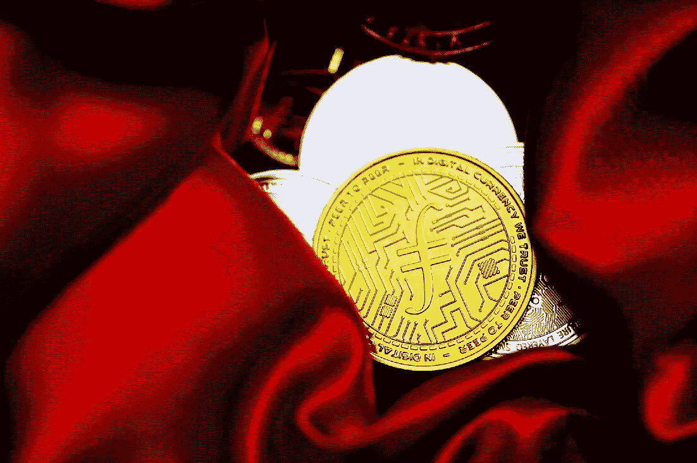

# TWB: FTX 案& SFB 的垮台

> 原文：<https://medium.com/coinmonks/twb-ftx-case-the-downfall-of-sfb-ab0cbcb70d08?source=collection_archive---------28----------------------->

Photo by [Traxer](https://unsplash.com/@traxer?utm_source=medium&utm_medium=referral) on [Unsplash](https://unsplash.com/?utm_source=medium&utm_medium=referral)

> [***从俄国制裁到 SFB 倒台——FTX 案暴露数字资产的未来&全球大宗商品***](/areas-producers/from-russia-sanctions-to-the-downfall-of-sfb-ftx-case-exposes-future-of-digital-assets-global-f2b79321f5c8) ***原载于《周末简讯》(TWB)由地区&制片人***

FTX 的法律案件是一个广泛的故事。让我们从 2022 年 12 月 21 日发生的****事件说起，当时 FTX 和阿拉米达研究公司的创始人萨姆·班克曼-弗里德(SFB 饰)和他的两名同事卡罗琳·埃里森和王微都面临联邦层面的金融欺诈指控。向巴哈马的美国当局屈服，同意被引渡到美国面对他的罪行，而埃里森和王都承认在加密交易平台上支付加密投资者的费用。****

> ****交易新手？在[最佳加密交易](/coinmonks/crypto-exchange-dd2f9d6f3769)上尝试[加密交易机器人](/coinmonks/crypto-trading-bot-c2ffce8acb2a)或[副本交易](/coinmonks/top-10-crypto-copy-trading-platforms-for-beginners-d0c37c7d698c)****

****金融科技和数字资产的游说者应该继续在加密交易市场的结果中发挥重要作用。比如，多读一些关于 [**币安案的密码游说**](/coinmonks/crypto-lobbying-binance-joins-the-race-470a44dbb85d) 来多了解那些方面。****

****这对全球金融市场的去中心化趋势意味着什么？****

****通过金融科技行业和区块链技术的进步，去中心化一直是加密货币和数字金融出现的一个重要话题。许多加密倡导者认为，去中心化应该是数字支付的唯一形式，不受中央银行等机构的控制。在 FTX 的案例中，我担心那些拥护者会在争论中处于劣势。加密法规已经在制定中，SFB 和 FTX 的垮台是近来加密货币市场暴跌的一个征兆——尽管有着巨大的法律后果。****

> ****[***从俄国制裁到 SFB 倒台——FTX 案暴露数字资产的未来&全球大宗商品***](/areas-producers/from-russia-sanctions-to-the-downfall-of-sfb-ftx-case-exposes-future-of-digital-assets-global-f2b79321f5c8) ***原载于《周末简讯》(TWB)由地区&制片人*******

******我将定期出版《周末简报》( TWB ),涉及全球市场(包括股票市场)的方方面面，这些都是科技、工业和全球大宗商品的核心。请关注刊物** [**地区&生产者**](https://medium.com/areas-producers) **阅读更多关于全球经济核心地区和关键生产者未来的内容。******

****报名参加 TWB 时事通讯 [**这里**](/areas-producers/newsletters/the-weekend-brief-twb) 阅读上市公司，如 [**雀巢&星巴克**](/areas-producers/nestle-starbucks-anticipating-higher-growth-during-a-new-age-of-consumerism-this-christmas-f154af18b06d) 如何在全球市场的长期博弈中竞争。****

> ****加入 Coinmonks [电报频道](https://t.me/coincodecap)和 [Youtube 频道](https://www.youtube.com/c/coinmonks/videos)了解加密交易和投资****

# ****另外，阅读****

*   ****[如何使用 Solidity 在以太坊上创建 DApp？](https://coincodecap.com/create-a-dapp-on-ethereum-using-solidity)****
*   ****[加密交易机器人](/coinmonks/crypto-trading-bot-c2ffce8acb2a) | [OKEx vs 币安](https://coincodecap.com/okex-vs-binance)****
*   ****[币安 vs FTX](https://coincodecap.com/binance-vs-ftx) | [最佳(索尔)索拉纳钱包](https://coincodecap.com/solana-wallets)****
*   ****[如何在 Uniswap 上交换加密？](https://coincodecap.com/swap-crypto-on-uniswap) | [A-Ads 评论](https://coincodecap.com/a-ads-review)****