# 改变我们世界的两项发明。

> 原文：<https://medium.com/coinmonks/two-inventions-that-changed-our-world-d863929e7c0d?source=collection_archive---------41----------------------->

## 我们所知道的罗马已经从古典、中世纪、文艺复兴时期发展到今天的现代。

梦想家们，实干家们，男人们，女人们，你们好，

我非常兴奋能给你写这封信。

上周，在我的第一篇时事通讯中，我介绍了两篇关于如何获得财务信息、技术敏捷和社交联系的论文。如果你还没看过，你可以在这里看一下。

我得到了压倒性的积极回应，我想说，谢谢你们每一个人。这是我们成为更好的人，让我们的世界变得更美好的旅程。

在本周的问题中，我想带你去看看人类文明史上最重要的(至少在某些方面)发明之一，以及另一个可能紧随其后的类似发明。

但在此之前，我想提醒你，伟大的事情需要时间来建造。无论是建一座城，开一家公司，建立一份事业，还是找到自己的真爱，都需要数年。

在某些情况下，甚至需要几个世纪到几千年。

这是大约 2000 年前罗马的样子。

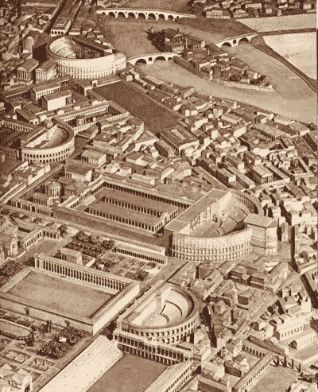

这是罗马今天的样子。

我们都知道罗马不是一天建成的。我们所知道的罗马已经从古典、中世纪、文艺复兴时期发展到今天的现代。

但它经受住了时间、战争、破坏、冲突和政治混乱的考验。罗马今天依然美丽。(嘿，我从来没去过罗马，不过它在我的清单上)。

我们这个时代最重要的发明之一。互联网。

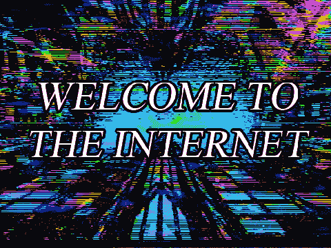

今天，地球上有超过 50 亿人使用互联网。

但互联网最初是由美国政府在 20 世纪 60 年代发明的，用于军事用途，以应对冷战。

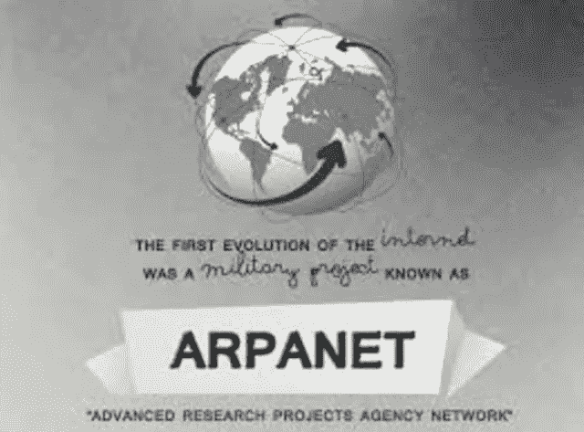

第一条信息是在 1969 年 10 月 29 日，由阿帕网在加州大学洛杉矶分校和斯坦福大学的一个研究实验室的计算机之间传送的。

我们今天使用的电子邮件是由计算机程序员汤姆林森在 1971 年发明的。

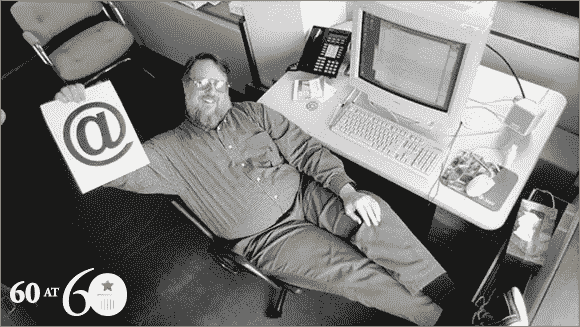

他加了一个“@”，我们一直沿用至今。

到 1991 年，我们有了万维网，这是第一个有助于传播和阅读信息的网页。

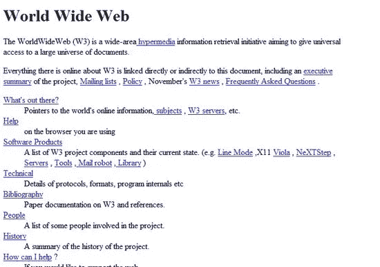

在互联网使用了大约 20 年之后，美国人仍然不知道它是什么。看看这个三个人讨论 1994 年互联网是什么的短视频。

1998 年，谷歌推出了革命性的搜索引擎。从那时起，信息和在线内容的世界已经发生了变化。

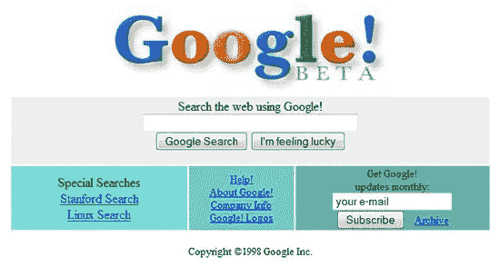

但是今天，互联网是巨大的，已经成为我们日常生活的一部分。

我们支付账单，购买任何东西，与人联系和交往，玩视频游戏，等等，都在互联网上进行。

生活在城镇或城市，很难想象没有互联网的生活。

这就是今天的互联网；地球上超过 60%的人都在使用它。

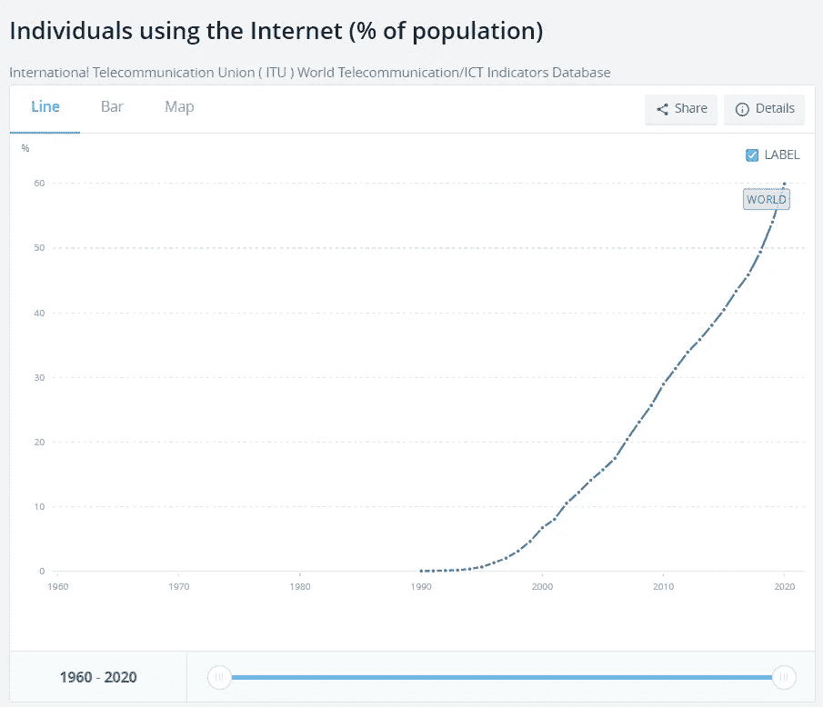

那是人类历史上最重要的发明之一。

我说是最重要的一个，因为像火和电灯泡这样的其他发明同样具有影响力，推动了人类的进步。

接下来是第二个发明，我相信它会像互联网对人类一样有影响力。

这项发明尚未被证明是人类文明最重要的发明之一，但由于它的哲学、它的基本原理，以及它像互联网一样开放和分布的事实，任何地方的任何人都可以使用和拥有，这使它成为人类历史上最有趣的发明或创新。

在我介绍这项发明或创新之前，我想带大家回顾一下 1999 年的这段视频，当时诺贝尔经济学奖得主米尔顿·弗里德曼讨论了一种数字电子现金的想法，即在政府或任何第三方都不知道的情况下进行点对点交易。

嘿，你一定累了，或者觉得一下子处理这么多信息太多了，如果你需要休息一下也没关系；如果你在网上阅读，你可以把它保存在你的电子邮件里或者在你的浏览器上做个书签，以后再来看。

如果没有，我们继续。

我想现在你知道我在说什么了，第二项发明或创新可能会像互联网一样产生类似的影响；毕竟，我们生活在一个充满信息的网络世界。

第二个，也可能是人类历史上最重要的发明或创新之一是:比特币。

我对比特币使用了“创新”一词；我会在这篇时事通讯的最后告诉你为什么。

2008 年 10 月 31 日，在经济衰退的余波中，也就是美国最大的银行之一雷曼兄弟倒闭整整 45 天后，一个笔名为中本聪的笔名发布了一份九页的白皮书[比特币:一个点对点的电子现金系统](https://bitcoin.org/bitcoin.pdf)。

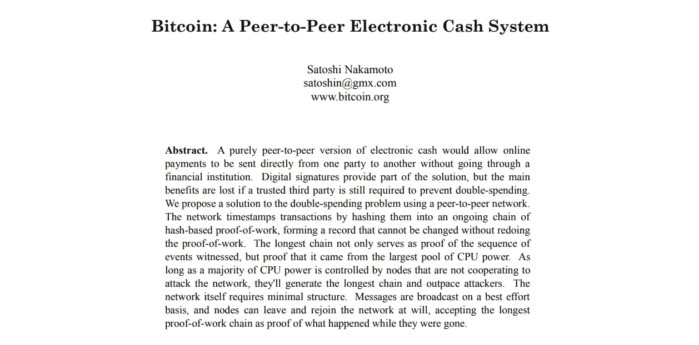

这份 3219 字的白皮书解决了我们这个时代最大的问题之一，并成为 21 世纪最具创新性的技术。

从那时起，我们所知的货币时代结束了。

一切都达到了一个没有许可、没有信任、任何人都可以读、写、拥有的公开账本的程度。

比特币本身不是货币，而是一种为货币概念提供动力的技术。

今年早些时候，我写过一篇关于比特币的文章；如果你想了解更多，请阅读这里的。

我不会详细讨论什么是比特币，因为这超出了本文的范围。

为了解释什么是比特币，首先，我们需要了解历史、社会政治、金融、数学、计算机科学、经济学、地缘政治等等。(大部分我肯定会在即将到来的几期解释；我们每周都会进步，亲爱的)。

但现在，只要知道比特币是一种建立在开放、分布式、去中心化账本技术基础上的货币概念，其供应量有限，只有 2100 万，满足了货币的所有标准。

看看这张图表。上面显示了比特币的价格和活跃地址。

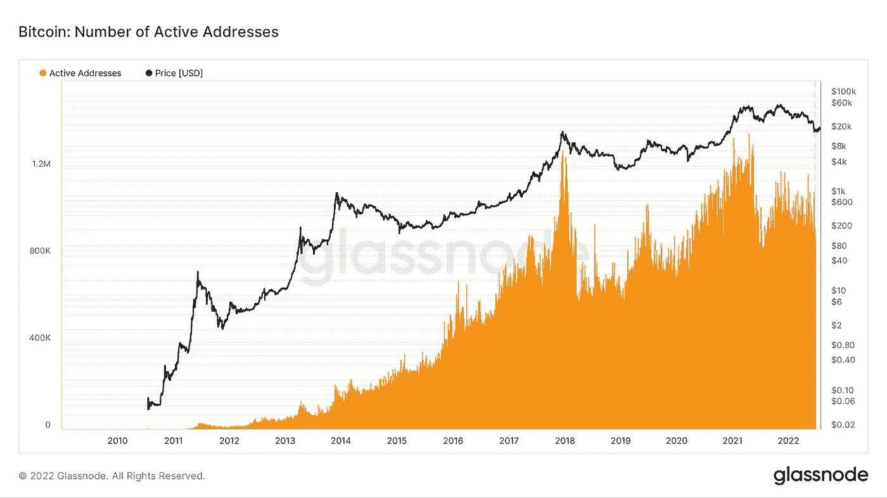

不像谷歌、脸书、Instagram 等互联网平台。，它统计用户数量，比特币统计活跃钱包数量。一个用户可以有多个活动钱包(更多信息请见下期)。

在短短 10 年间，比特币已经拥有超过 100 万个活跃钱包。

如果把比特币的成长和互联网做一个对比，看起来是这样的。

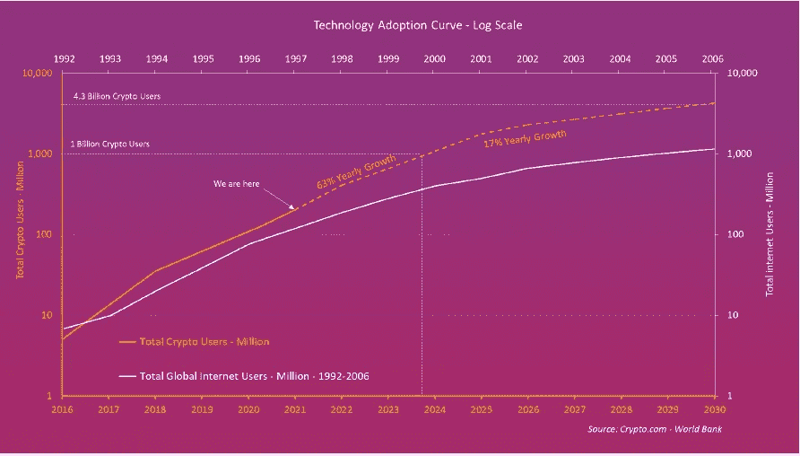

注意到哪里写着“我们在这里”吗？

现在，看看上面提到互联网增长的年份，下面提到加密增长的年份。

是的，我们就在那里；还是在 1998 年互联网增长比特币的情况下，谷歌才刚刚推出。

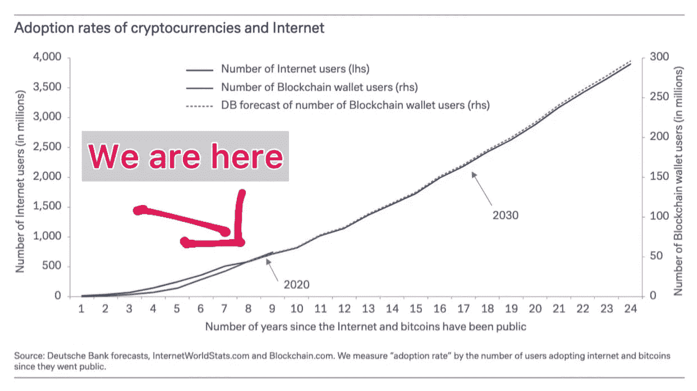

因此，如果比特币像互联网一样发展，这种革命性的发明或创新看到其全部潜力还为时过早。

我把比特币既是发明，也是创新；发明，因为我们第一次有了可靠的货币，这种货币是稀缺的、不变的、可证实的；创新，因为它结合了以前解决的加密问题，使用时间戳到双分类账分录簿，创建形成区块链的信息块。(这对你来说可能太专业了，别担心，这不重要。)

想象一下，你在脸书、YouTube 甚至谷歌之前就发现了互联网；你可能已经创建了一些今天如此受欢迎的网站。或者如果你是互联网上的第一批作家之一呢？

机会是无穷无尽的。

嘿，这不是要说服你购买或投资比特币或任何密码。

我不做理财建议；我在这里只是通知并帮助你获得财务知识、技术敏捷和社会关系。所以只把这当成信息，或许是要学习的知识。

这是一个很长的问题；如果你一次读完太长了，我很抱歉。

下次我会尽量写得短一些。

如果这些信息对你有用，请考虑与你的朋友分享。

如果你在社交网站上分享，别忘了给我加标签或者告诉我。

我在这里的社交: [Instagram](https://www.instagram.com/akuzolohe/) ， [Twitter](https://twitter.com/Kuzotelohe) 。

一定要看看我的朋友维尼·日莫米[在这里](https://www.instagram.com/vinizhimomii/)，他正在帮我为你编辑所有这些内容。她一直是我的好朋友。

这就是本周的内容，我迫不及待地想下周再给你写信。

嘿，如果我们是第一次见面，我是库佐特·洛赫(阿库佐)，web3 和区块链的研究员。我帮你简化 Web3 和区块链的概念。

请随时订阅这份旨在帮助您获得财务信息、技术敏捷和社交联系的时事通讯。

干杯，并有一个伟大的未来。

如果您希望在收件箱中收到未来的邮件，请点击此处订阅我的时事通讯。

 [## Kuzote Lohe 的时事通讯

### 网络 3、区块链和金融。点击阅读 Kuzote Lohe 的时事通讯，作者 Kuzote Lohe (Akuzo)，子栈…

kuzotelohe.substack.com](https://kuzotelohe.substack.com/) 

> 加入 Coinmonks [电报频道](https://t.me/coincodecap)和 [Youtube 频道](https://www.youtube.com/c/coinmonks/videos)了解加密交易和投资

# 另外，阅读

*   [币安期货交易](https://coincodecap.com/binance-futures-trading)|[3 commas vs Mudrex vs eToro](https://coincodecap.com/mudrex-3commas-etoro)
*   [如何购买 Monero](https://coincodecap.com/buy-monero) | [IDEX 评论](https://coincodecap.com/idex-review) | [BitKan 交易机器人](https://coincodecap.com/bitkan-trading-bot)
*   [CoinDCX 评论](/coinmonks/coindcx-review-8444db3621a2) | [加密保证金交易交易所](https://coincodecap.com/crypto-margin-trading-exchanges)
*   [红狗赌场评论](https://coincodecap.com/red-dog-casino-review) | [Swyftx 评论](https://coincodecap.com/swyftx-review) | [CoinGate 评论](https://coincodecap.com/coingate-review)