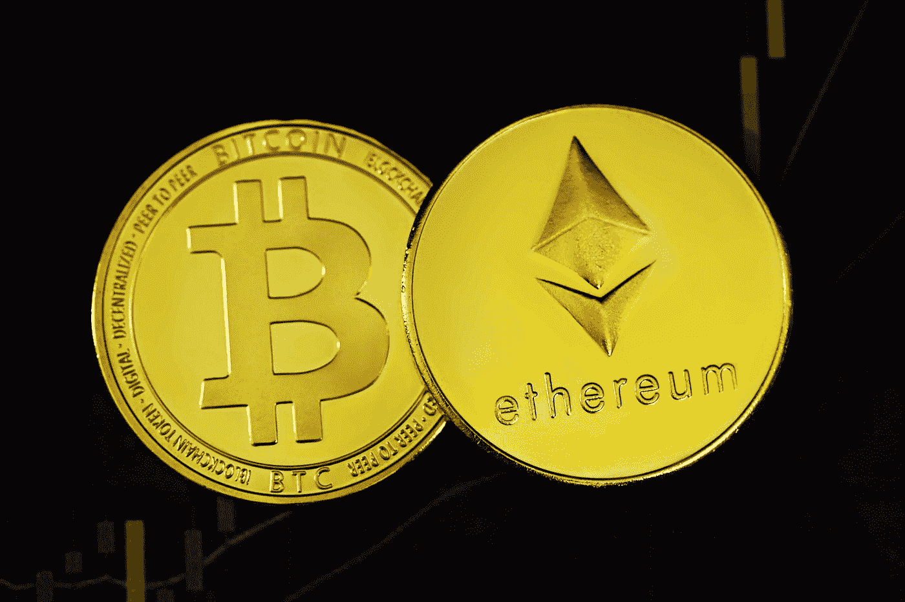

# 区块链的类型和问题

> 原文：<https://medium.com/coinmonks/types-and-problems-of-blockchain-388cb24bc348?source=collection_archive---------54----------------------->

Photo by [Kanchanara](https://unsplash.com/@kanchanara?utm_source=medium&utm_medium=referral) on [Unsplash](https://unsplash.com?utm_source=medium&utm_medium=referral)

又见面了，希望你们都很好。

我的上一篇博客("[向父母解释区块链了吗👨‍👩‍👦](/@patilsaurabh1799/explaining-blockchain-to-parents-e0d1212c801e)))帮了你？让我知道我对它的评论🤗。

在上一篇博客中，我们看到区块链是不可变的分布式账本技术。今天让我们学习不同类型的区块链。

直到最近几年，区块链才被视为只处理加密货币的地方。许多人仍然不知道区块链可以用来做什么。很少有人知道，区块链在塑造未来数据处理方式的过程中扮演着怎样的角色。

> 从顶级交易者那里复制交易机器人。免费试用。

在当今时代，数据就是一切，我所说的一切就是一切。如果一些人记录下你的每一步行动，你的每一个决定，等等，然后创建一个数据集，并输入到人工智能算法中，他们就可以创建你的双胞胎。现在你可以理解它有多重要了。

当前应用程序的问题是它们被一个人控制，他们可以访问我们的数据。由于依赖这些应用程序，我们放弃了数据来换取服务，却不知道他们会如何使用我们的数据。没人知道他们是会卖掉它，还是会把它用于自己的目的。

为了解决这个问题，我们开始转向区块链。现在区块链不仅用于加密货币或 NFT。应用程序可以建立在它的基础上，其功能类似于当前的应用程序，但它们更好、更安全。

有不同类型的允许构建应用程序的区块链。
例如:以太坊、多边形、超格织物、米娜等。

区块链有几层:
第一层，第二层，…..

第 1 层区块链是母链。第 2 层区块链构建在第 1 层区块链之上，作为扩展解决方案。

例如:

以太坊是第一层区块链。你可以做交易，你可以写智能合同等等。但交易的天然气成本(支付给矿商以确认你区块的金额)相当高。

为了缩放第二层区块链是建立在它的上面，像多边形。它是第二层区块链，具有与第一层区块链相同的功能，但是具有更低的燃气成本和一些更好的特性。

目前有 10000 多个区块链。但是你知道，这是他们的一个主要问题。他们不能互相交谈。

所有区块链都有不同的运行配置。因此，一个区块链人不能与其他人互动。

这对所有用户来说都是一个大问题，因为他们无法将资产从一个区块链转移到另一个。有一些解决方案，我们将在下一篇博客中讨论。

> 加入 Coinmonks [电报频道](https://t.me/coincodecap)和 [Youtube 频道](https://www.youtube.com/c/coinmonks/videos)了解加密交易和投资

# 另外，阅读

*   [如何使用 MetaMask Wallet 获取 KCC 地址？](https://coincodecap.com/kcc-address-metamask)
*   [如何获得自己的。XYZ 领域？](https://coincodecap.com/xyz-domain)
*   [最佳加密交换平台](https://coincodecap.com/best-crypto-swap-platforms) | [最佳加密交易所](https://coincodecap.com/crypto-exchange)
*   [购买比特币印度](/coinmonks/buy-bitcoin-in-india-feb50ddfef94) | [Pionex 评论](/coinmonks/pionex-review-exchange-with-crypto-trading-bot-1e459d0191ea) | [加密交易机器人](/coinmonks/crypto-trading-bot-c2ffce8acb2a)