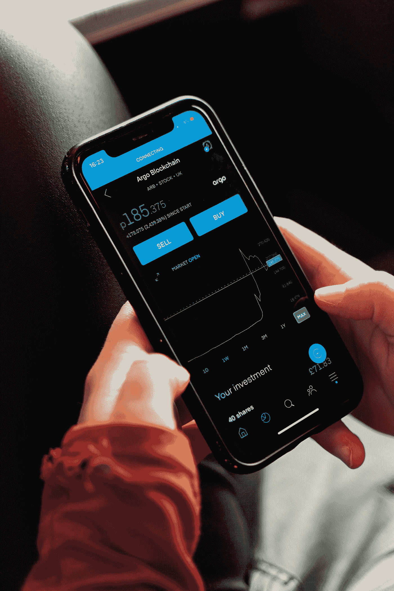
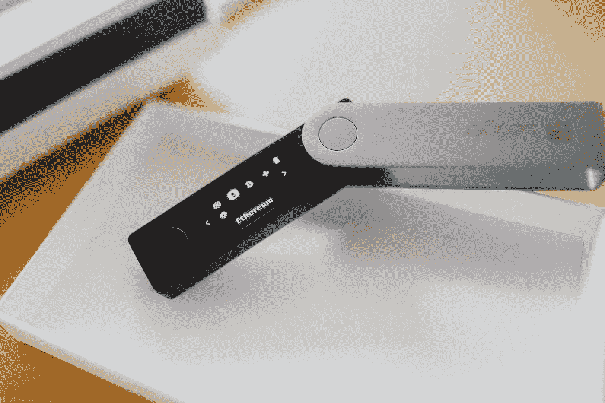
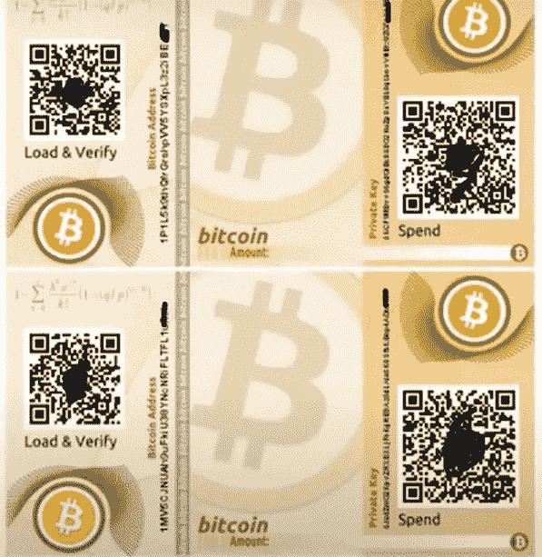

# 加密货币钱包的种类？

> 原文：<https://medium.com/coinmonks/types-of-cryptocurrency-wallets-b4167888758?source=collection_archive---------40----------------------->

对加密货币钱包类型的初学者介绍。

加密钱包的一个常见目标是接收、转移、处理交易和存储加密资产，如加密货币、NFT 或 defi 令牌。虽然他们都致力于实现相同的主要目标，但有几个特征突出了他们的差异，并展示了他们如何履行自己的职责。根据它们的功能，几个加密钱包的例子可以分为这些不同的类型。大多数加密钱包分为三类。

Photo by [Wes Hicks](https://unsplash.com/@sickhews?utm_source=medium&utm_medium=referral) on [Unsplash](https://unsplash.com?utm_source=medium&utm_medium=referral)

假设您已经注册了加密货币交易所，兑换了一种或多种加密货币，或者正计划开始交易加密货币。一个安全系统将帮助存储你所有的加密货币，并给他们一个保护和可靠性的方法。这就是加密货币钱包派上用场的时候。在选择特定的钱包之前，有必要对每一类加密货币有一个基本的了解。

加密货币钱包分类如下。

Photo by [Krzysztof Hepner](https://unsplash.com/@nsx_2000?utm_source=medium&utm_medium=referral) on [Unsplash](https://unsplash.com?utm_source=medium&utm_medium=referral)

1)软件钱包:这些是由安全和软件公司提供的钱包。在区块链和加密货币行业，它们是最流行的加密货币钱包类型。它们之所以受欢迎，是因为我们可以像在设备上使用其他程序一样使用它们。当您登录时，软件钱包会生成一个私钥，并要求您创建一个 pin，以便您可以使用该程序或应用程序。可以在桌面或移动设备上使用的软件钱包通过额外提供恢复字来访问每个加密货币钱包。考虑恢复密钥或短语的一种方法是将它作为加密钱包中所有私钥的主密钥。

根据访问它们的方法，它们可以分为三类:桌面钱包、移动钱包和网络钱包。

虽然它们的操作都相似，但也有一定的差异。网络钱包是最令人担忧的，尽管它们是安全的，因为它们只能通过网站访问，并且经常成为 DDOS 攻击的目标。

Photo by [Max Saeling](https://unsplash.com/@maxsaeling?utm_source=medium&utm_medium=referral) on [Unsplash](https://unsplash.com?utm_source=medium&utm_medium=referral)

2)硬件钱包:物理的、硬件的钱包，可以夹在手和口袋之间，是看得见摸得着的钱包。除了操作方法上的细微差别，它们的作用与软件钱包相同。硬件钱包离线保存私钥，并在设备的小屏幕上显示密码短语。这为资金/资产提供了额外的安全性。可以指定硬件只接受未签名的事务并返回签名的事务。因为私钥总是放在钱包里，不能泄露。私钥签署的数字签名是实体钱包完成交易所需要的。硬件钱包是安全的，不会受到攻击和利用，因为它被设置为仅接收特定数据，而不连接到互联网。假设你正在考虑为价值不菲的加密货币准备一个保险箱。在这种情况下，您最好考虑购买新的硬件钱包，因为它可能是目前区块链行业中最安全、最具性价比的钱包。

 [## 加密货币的硬件钱包和软件钱包的区别。

### 软件与硬件钱包

medium.com](/codex/the-differences-between-a-hardware-wallet-and-a-software-wallet-for-cryptocurrencies-be9ea26fa36f) 

3)纸质钱包是一种你可能不熟悉的加密货币钱包，因为加密生态系统并不经常讨论它们。纸质钱包也是如此；它们由纸制成，上面印有私钥和公钥。此外，它们还具有一个条形码，加密货币钱包可以扫描该条形码来访问存储的加密货币。

然而，尽管它们可能是离线转移金钱或硬币的绝佳方式，但它们通常不如其他加密钱包安全。由于私钥和公钥都显示在纸上，每次这张纸落入坏人之手，投资组合就会面临风险。

此外，纸质钱包容易损坏；当它们进入水或火中或放置很长时间后，文本或墨水开始褪色，这可能会影响对钱包进行的操作。它们只是纸，并且具有常规纸在记录保存方面的局限性。

你可能也熟悉冷热钱包，这是加密货币钱包的另一个类别。这种分类的唯一依据是存放私钥的位置。

hot wallet 是一种钱包，其私钥保存在钱包的浏览器上或在线。这一类别包括所有桌面钱包和移动钱包。app 或者 app 主要执行的区块链托管着你的私钥。

冷钱包是一种其私钥离线托管的钱包。硬件钱包是这类钱包的最好例子。

需要注意的一点是，你可以选择使用硬件或软件钱包，这取决于你存储了多少加密货币，你为什么要保留它，以及你希望有多灵活。您可能会持有一些加密货币更长时间或稍后进行交易。当购买用于交易的加密货币时，通常优选使用热钱包，特别是移动加密钱包，因为这允许比需要连接到 PC 的硬件更灵活的交易。大多数冷钱包都是为长期加密货币存储而制造的。

本文的主要目的是帮助我们理解加密钱包的类型以及它们是如何工作的。

请确保您在媒体和 Twitter 上分享和关注我。

[https://twitter.com/PrinceSamuel_A](https://twitter.com/PrinceSamuel_A)

您想深入了解什么是区块链和加密货币的更多细节吗？

 [## 什么是比特币:适合初学者的比特币

### 揭秘比特币白皮书

medium.com](/coinmonks/what-is-bitcoin-bitcoin-for-beginners-620c0986b467)  [## 什么是加密货币？

### 它是如何工作的？

medium.com](/coinmonks/what-is-cryptocurrency-5255ff3625a5)