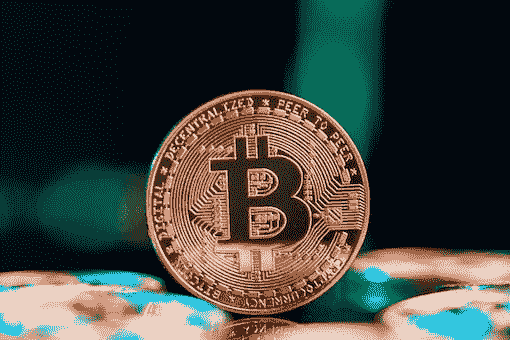
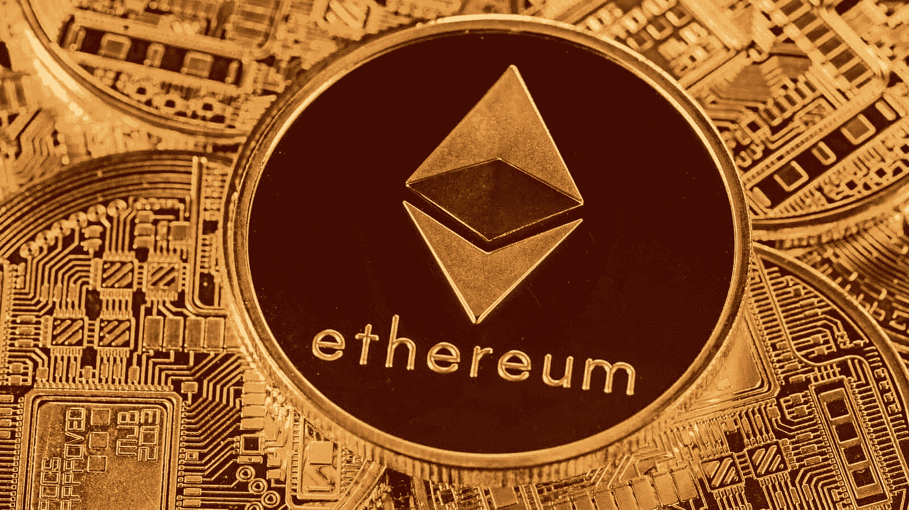
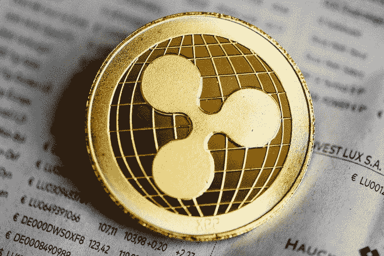
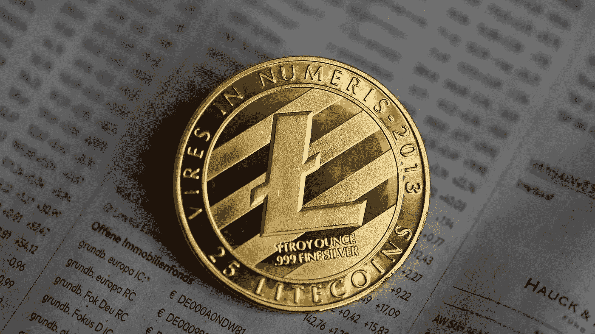

# 加密货币的类型:哪种最适合你？

> 原文：<https://medium.com/coinmonks/types-of-cryptocurrency-which-one-is-best-for-you-99a9ae50b610?source=collection_archive---------47----------------------->

## 订阅我的媒介账号:[https://aryanbajaj13.medium.com/subscribe](https://aryanbajaj13.medium.com/subscribe)

## 这是加密货币系列的第二篇文章…保持联系，了解更多信息！

加密货币是一种使用密码学为交易提供安全性的数字货币。最广为人知的加密货币类型是比特币、莱特币、以太币和 Monero，但当你第一次想到加密货币时，比特币可能是你首先想到的类型。比特币是最知名的数字货币，也是最大的数字货币，但其他几种电子货币最近也浮出了水面。在这篇文章中了解更多！

# 几种类型的加密货币

当谈到投资加密货币时，有许多不同的类型可供选择。但是哪个最适合你呢？

以下是一些不同类型的加密货币及其功能:

## 比特币:

比特币是最原始、最知名的加密货币。它创建于 2009 年，提供点对点电子现金系统。交易记录在公共账本上，使其成为一种透明而安全的资金收付方式。

## 以太坊:

以太坊是一个流行的平台，允许开发人员构建分散的应用程序。它也有自己的货币以太。以太坊比比特币速度更快，可扩展性更强，并提供智能合约等功能。

## 波纹:

Ripple 是一个实时支付结算系统，还提供货币兑换和汇款网络。它是为银行和金融机构设计的。Ripple 比 SWIFT 等其他系统更快、更便宜。

## 莱特币:

莱特币是比特币的一个分支，提供更快的交易时间。它通常被称为“比特币的黄金”莱特币也比比特币更实惠，对于那些希望在预算内投资加密货币的人来说，这是一个不错的选择。

> 如果你想了解更多类型的加密货币，请留言或发邮件给我，地址是 aryanbajaj104@gmail.com

# 一些利弊

有许多不同类型的加密货币，每种都有自己的优缺点。下面是最受欢迎的加密货币类型的简要介绍，以帮助您决定哪一种适合您:

## 比特币有趣的事实:

比特币是最原始、最知名的加密货币。它也是最有价值的，目前市值超过 600 亿美元。

## 优点:

比特币被广泛接受，可用于在线和离线购买商品和服务。

## 缺点:

比特币的波动性相对较大，众所周知，一天之内其价值会波动 10%或更多。

## 以太坊有趣的事实:

以太坊是市值第二大的加密货币，目前价值超过 200 亿美元。

## 优点:

以太坊的用途非常广泛，可以用于多种用途。此外，以太坊的交易费用远低于比特币。

## 缺点:

以太坊可能很难理解，因为它的底层技术很复杂。

## 涟漪有趣的事实:

按市值计算，Ripple 是第三大加密货币，目前价值超过 100 亿美元。

## 优点:

Ripple 交易速度极快，只需 4 秒钟即可完成。此外，Ripple 的交易费用非常低。

## 缺点:

Ripple 不是特别通用，只能和特定的合作银行一起使用，方便银行间的交易。

## 比特币现金有趣的事实:

比特币现金是比特币的第一个硬分叉，创建于 2017 年。直到最近，按市值计算，它是第三大加密货币，目前价值超过 100 亿美元。

## 优点:

比特币现金交易比比特币或 Ripple 快得多。由于对可能的硬币数量没有限制，这可能会使人们在未来更容易获得加密货币。

## 缺点:

与任何新技术一样，新系统总有可能取代旧系统。随着比特币现金的使用持续增长，由于其网络活动的增加，交易时间将大大增加。

# 结论

最适合你的加密货币是什么？这真的取决于你个人的需求和目标。如果你正在寻找稳定和安全的东西，那么比特币可能是正确的选择。如果你对投机投资更感兴趣，那么像以太坊这样的货币可能是更好的选择。最终，由您来做研究并决定哪种加密货币最适合您的特定需求。

## 这是加密货币系列的第二篇文章…保持联系，了解更多信息！

# 关于作者

我最近完成了 BBA(商业分析)从基督大学，拉瓦萨，浦那校区。

**网站—**[**【acumenfinalysis.com】**](http://acumenfinalysis.com/)**(看看这个)**

# 联系人:

如果你对我下一篇文章的内容有任何问题或建议，请给我写信，地址是**aryanbajaj104@gmail.com**。

如果您想了解我的最新文章和项目，请在媒体上关注我。

## 订阅我的媒介账号:[https://aryanbajaj13.medium.com/subscribe](https://aryanbajaj13.medium.com/subscribe)

# 通过以下方式与我联系:

[**领英**](https://www.linkedin.com/in/aryan-bajaj-b62364191)

> 交易新手？试试[加密交易机器人](/coinmonks/crypto-trading-bot-c2ffce8acb2a)或者[复制交易](/coinmonks/top-10-crypto-copy-trading-platforms-for-beginners-d0c37c7d698c)