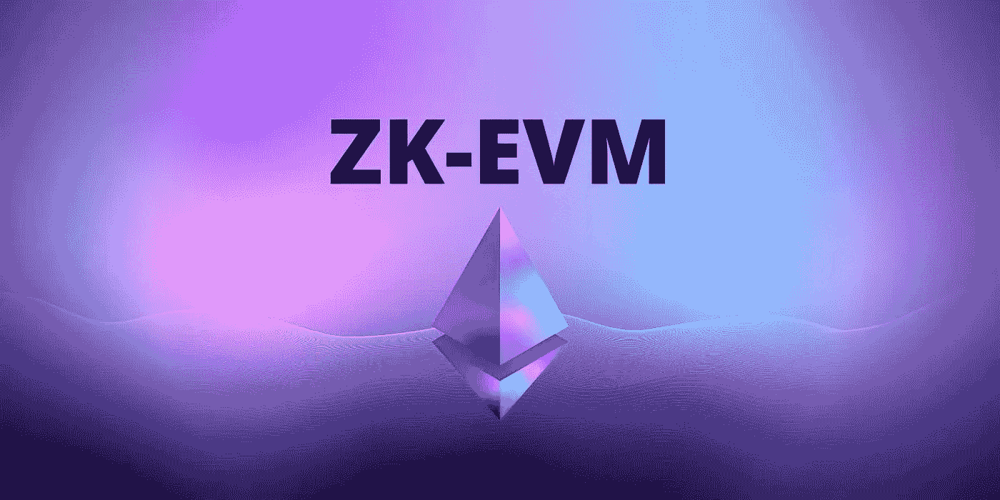

# ZK EVM 的类型

> 原文：<https://medium.com/coinmonks/types-of-zk-evms-510110aeff41?source=collection_archive---------8----------------------->

有许多项目正在使用 ZK-斯纳克技术来创建类似以太坊的交易执行的加密证明。这些项目的目标是促进以太坊区块链的验证或构建一个更具可扩展性的以太坊版本。这些项目在如何权衡实用性和速度上有所不同。在这篇文章中，我们将涵盖目前试图建立一个 EVM 兼容的 Zk 汇总项目，以及…