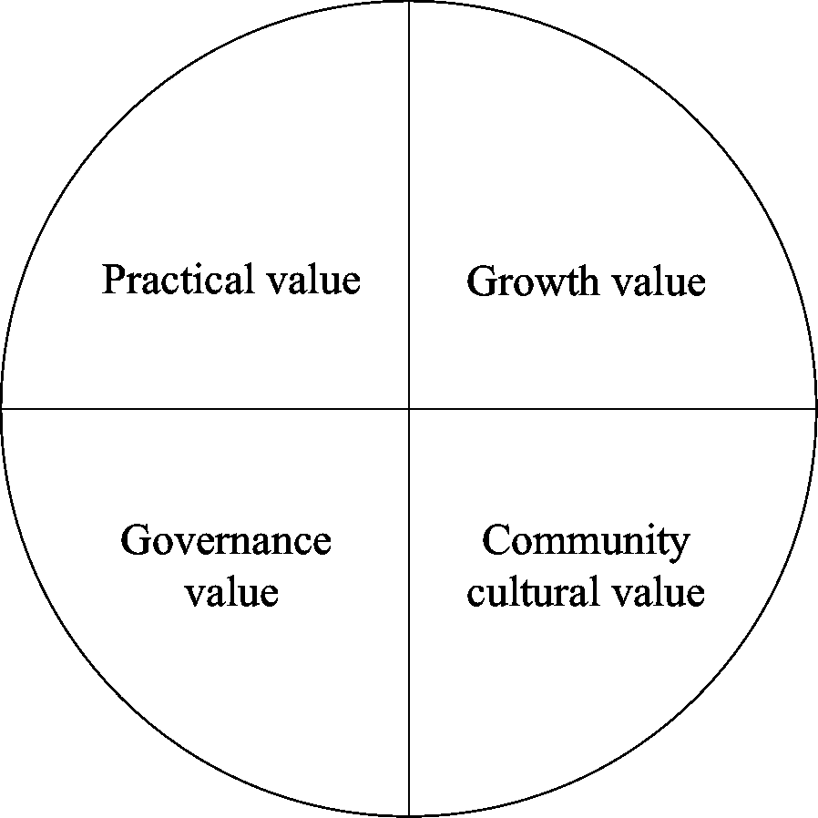

# Web3 数字资产及其价值的典型范式(1)——可替代令牌

> 原文：<https://medium.com/coinmonks/typical-paradigm-of-web3-digital-assets-and-its-value-1-fungible-token-60300bde68b?source=collection_archive---------26----------------------->

Bitcoin is the most important cryptocurrency

在亚里士多德的形式逻辑中，思维的组织方式与柏拉图对话中的方式非常不同。在这种形式逻辑中，思想对其对象漠不关心。无论它们是精神上的还是物质上的，无论它们是属于社会还是属于自然，它们都服从于同样的组织、计算和结论的一般规律，但它们是作为可替换的符号或象征，从它们特定的“物质”中抽象出来的。这种普遍的质量(数量的质量)在逻辑上是法律和秩序的先决条件，在社会上也是普遍控制的代价。

— *马尔库塞*

我选择引用德裔美国哲学家、社会学家和政治理论家马尔库塞的话作为开头。上面这句话基本上揭示了西方哲学领域的一个重要问题，即普遍性问题，即是否存在某种真理来解释一切。在我看来，这个问题源于**可替代物品**的出现，如货币，这是描述世界的一种方式。在以前的文章中，我们探讨了一些关于 Web3 的基本问题，如 Web3 的核心价值和数字资产对 Web3 的意义等。我希望这些讨论可以帮助您建立对 Web3 的统一认识，并认识到数字资产创新对 Web3 的重要性。在接下来的几篇文章中，我们将详细讨论 Web3 数字资产的发展现状，让大家快速掌握这一领域的研究边界。这很重要，因为任何有价值的创新的先决条件是弄清楚当前研究领域的边界，否则就像现在重新发明蒸汽机一样，很酷但毫无价值。

# 可替换令牌的概念

相信大家都已经知道 Token/Coin 一般用来指代 Web3 领域的资产。由于 Web3 的出现源于比特币的加密电子货币系统，因此与传统经济学相关的金融资产 web 3 化一直是一个重要的话题。传统经济学领域有一个重要概念，就是可替代性。所谓可替代性，就是一种商品或资产与其他类似商品或资产交换的能力。可替代资产简化了交换和交易过程，因为可替代性意味着资产之间的价值相等。

这个概念对于现代人来说很容易理解，因为本质上，现代金融体系是建立在可替代资产的基础上的，比如货币、股票、债券等。，不同地理位置的不同用户以不同方式获得的资产类型没有区别，唯一物理意义上的区别是数量。你在银行柜台从银行账户中取出的 1 美元和你的朋友从百货商店销售商品的顾客那里得到的 1 美元完全一样。所以我们可以发现，这种类型的资产依赖于一种数量计量方法，或者记账系统，可以是纸币、支票或者合同。

随着计算机科学的发展，人们已经逐渐习惯于用基于数据库的电子记录取代纸质的书面记录，这对银行系统和华尔街产生了重要影响，电子记账系统极大地改善了相关的资产交易。区块链的处理效率最初是作为一个电子货币会计系统，试图从非性能方面优化现有的模型。甚至可以说，发行可替代资产是 Web3 的固有功能或产品。

至于为什么用 Token 来指代 Web3 领域的资产，或者 Token/Coin 有什么区别，这些都不重要。我觉得只是俚语的区别。在不同的语境下，人们习惯使用不同的称呼。似乎许多区块链原生资产，或第一层资产，喜欢指硬币，而代币更多地用于指 Dapps 发行的数字资产，这种资产一般通过智能合约来实现。相比之下，我更喜欢 Token，因为它来自计算机领域，代表一种证书，比 Coin 更广泛。

那么 Web3 中的可替换令牌有什么特点呢？为了解释这个问题，我们引用一段简单的代码，这是一个常见的可替换令牌开发接口标准，名为[以太坊请求注释 20 (ERC-20)](https://eips.ethereum.org/EIPS/eip-20) 。之所以取这个名字，是因为这个概念来自以太坊社区的命题 20，也被称为 EIP-20:

> 函数名()公共视图返回(字符串)
> 
> 函数符号()公共视图返回(字符串)
> 
> 函数小数()公共视图返回(uint8)
> 
> 函数 totalSupply()公共视图返回(uint256)
> 
> 函数 balanceOf(address _owner)公共视图返回(uint256 balance)
> 
> 函数传递(address _to，uint256 _value)公共返回(bool 成功)
> 
> 函数 transferFrom(address _from，address _to，uint256 _value)公共返回(bool 成功)
> 
> 函数 approve(address _spender，uint256 _value)公共返回(bool 成功)
> 
> 功能津贴(address _owner，address _spender)公共视图返回(剩余 uint256)

我们不需要关心具体的代码实现。从这些接口的名称中，我们可以看到它指定了一个可以交易的资产。最关键的要求是，转账的时候，只需要提供对方的地址和转账次数。并且需要记录每个业主的余额。

# 可替换令牌的值类型

我们知道能够产生价值的东西叫做资产，所以无论你是投资还是创业，都需要明确所涉及的资产背后的价值。随着应用的发展，可替代令牌逐渐形成了四种类型的价值，之前的文章简单提到过，包括实用价值、成长价值、治理价值和社区文化价值。接下来我们详细描述这四个值。

The value composition of Fungible token

## (1)实用价值

所谓实用价值，是指某个代币作为用户使用某个产品或服务的必需品所产生的价值。一般来说，代币的实用价值主要体现在以下几个方面:

***支付场景:**这种数值的代币很常见，通常可以作为手续费或者某种“代币”，比如很多工作证明(POW)区块链的原生代币。可以说，没有人认为比特币是合格的因此，除了可以投机，这种类型的代币只能作为使用相应网络的费用。如果你想向别人支付 BTC，你需要使用 BTC 作为交易费用，否则你的交易将不会被执行。从这个角度来看，战俘区块链的原生代币都具有相同的机制设计，因此都具有实用价值。此外，还有许多应用程序或 Dapps 发行的令牌，可用于支付使用其服务或产品过程中产生的费用。例如，BNB 可以作为交易费用在币安扣除(当然，这只是 BNB 的价值观之一)。

***凭证场景:**具有此类值的令牌通常用于特定组的筛选标准。持有这类令牌意味着拥有参与某件事情的资格，持有这类资产的多少似乎决定了用户参与事件的优势。类似的设计不难找到。以 Chainlink(一个链上 oracle 项目)发布的 Link 令牌为例。只有持有 Link 并完成承诺书，才有机会成为正式的节点运营者，负责将外链信息路由到链上。(从这个角度来看，许多由 Proof of Stake (POS)类型的 Layer1 区块链发行的原生代币在一定程度上具有这种价值，但我们将在关于增长价值的章节中详细分析这种代币。)，第二个例子是去中心化的 IDO 平台 DAOMaker。其发行的 DAO 令牌也有类似的价值。只有下注一定数量的道，才有资格参与其平台上的 IDO 活动。

***金融场景:**这类项目通常以某种方式实现具有某种特征的金融衍生代币，或者说这类代币是他们的产品，其价值在于实用价值。具有代表性的稳定币如、戴、，以及一些金融衍生品，如 Synthetix，这是一个合成资产平台，用户可以根据自己的需要创建一个价格锚定链外资产的代币，如黄金、特斯拉股票等。，在其平台上发行的一系列衍生代币也有这样的价值。

## (2)成长价值

所谓增长价值，是指令牌捕获协议或项目开发带来的价值增长。一般来说，代币的增长价值是通过以下三种机制实现的:

***通过分红机制实现:**这个机制大家都不陌生。事实上，这种代币在分红机制的设置上非常类似于股票分红。但不同的是，持有代币并不等同于拥有协议或项目的所有权，与股票有本质区别。在这种背景下，这种代币可以视为分红权的凭证，协议会将开发过程中产生的利润按比例分配给这种代币的持有者。

例如，POS-type Layer1 区块链发行的许多原生令牌在一定程度上具有该值。在以太坊的 POS 版中，持有 ETH 并参与正确区块的质押，将获得 ETH 奖励，而 ETH 的价值是由以太坊的网络使用费支撑的，因此可以视为网络成长的红利。目前不同的是，这个分红过程不是通过手续费收入的直接分配，而是通过手续费的销毁。ETH 的通货紧缩和新发行 ETH 带来的通货膨胀都是通过这种货币政策实现的。再比如更直观的，阿尔法金融，一个多链的流动性挖掘和借贷协议，它发行的令牌叫阿尔法，在分红权的表现上更直观。阿尔法持有者可以通过入股的方式获得协议运营过程中产生的协议费；

***通过公开市场操作实现:**该机制一般存在于一些 CeFi 协议中，而非 Dapps 发行的代币设计中。该公司将使用部分收入定期从二级市场回购代币并销毁。这样就减少了发行量，从而间接使得代币获得了协议的收益，比如 BNB、FTT 等。，显然是一个聪明的做法，因为这样会避免一些监管上的麻烦；

***通过协议的原生机制实现:**这个机制比较特殊。有人称之为 DeFi 的创新，也有人称之为庞氏骗局。实际上，这些产品并没有实际业务，或者以一个次要目的作为其表面业务，但本质上，其机制的设计通常围绕着如何捕获其发行的某些令牌。夸大的溢价。以奥林巴斯道为例，很难讲它的具体业务是什么，因为官方他自称是算法 stablecoin，但你会发现欧姆远高于 1 美元，最重要的是，它并不稳定，而是利用大量精密的原生机制设计，实现对短期溢价的高效捕捉。虽然很难判断它是好是坏，但这种范式确实在 Web3 的发展中发挥了重要作用。考虑 Luna 在崩溃前的表现，以及其生态发展的状态。

## (3)治理价值

事实上，去中心化自治组织曾被视为 Web3 的重要发明，也称为 DAO。如何在一个分布式的松散组织中有效地对某件事达成共识，是道的一个重要课题。常见的范例是发行代表投票权的令牌。在对一个事件或提案进行投票时，投票者需要通过代币，他们持有代币的数量通常意味着他们拥有相等比例的决策权重。例如，Compound 发行的 Comp 和 CurveFi 发行的 CRV 分别代表两个产品中某些系统性参数的投票权，如利率调整。需要注意的是，这种治理价值通常并不完全等同于项目的所有权，因为治理的范围通常是有限的，仅具有在指定范围内对协议或项目参数或机制进行决策的能力。诸如关闭、破产清算等决策。通过这种范式通常是不可能的。

## (4)社区文化价值

这个价值类似于品牌价值。在前面的讨论中，我们知道 Web3 的基本价值是一种意识形态价值，这是一种文化价值。所以这种文化价值通常由它发行的 Token 来承载，基本上贯穿了所有的 Web3 项目。事实上，BTC 在某种程度上已经成为了 Web3 的象征。虽然 BTC 的原生网络不具备成为图灵完全计算设备的能力，但其符号价值是支撑其市场价值的最大因素。对于 Web3 项目，这个价值是基于对其产品、愿景、团队、文化等的认可。所以我们称之为社区文化价值观。从这个角度来看，就不难理解为什么 Shib，Dogecoin 等的买家那么多了。

在 Web3 的下一步开发中，我认为如何探索新的可替换令牌的值类型是一个有意义的问题。我们之前说过，这是一个重要的创新方向和驱动力。

> 交易新手？试试[加密交易机器人](/coinmonks/crypto-trading-bot-c2ffce8acb2a)或者[复制交易](/coinmonks/top-10-crypto-copy-trading-platforms-for-beginners-d0c37c7d698c)