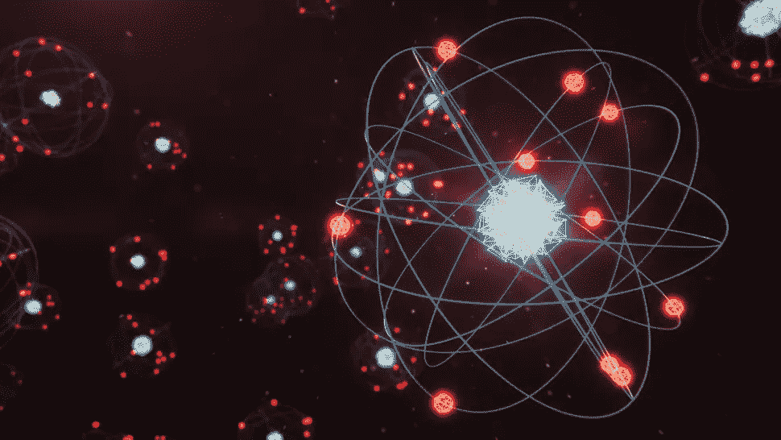
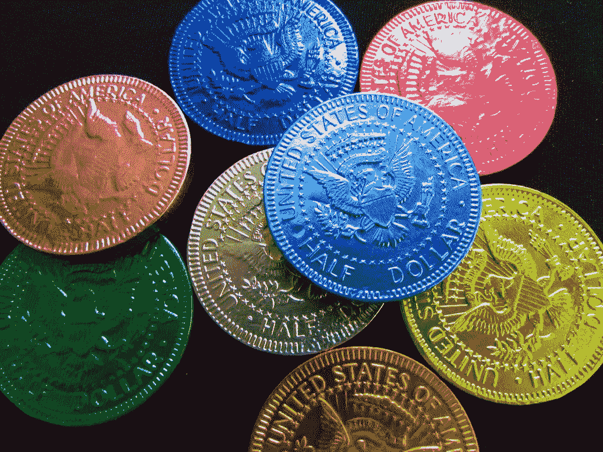
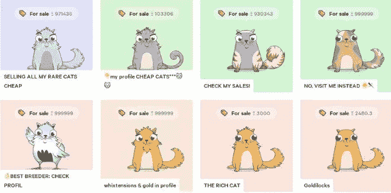
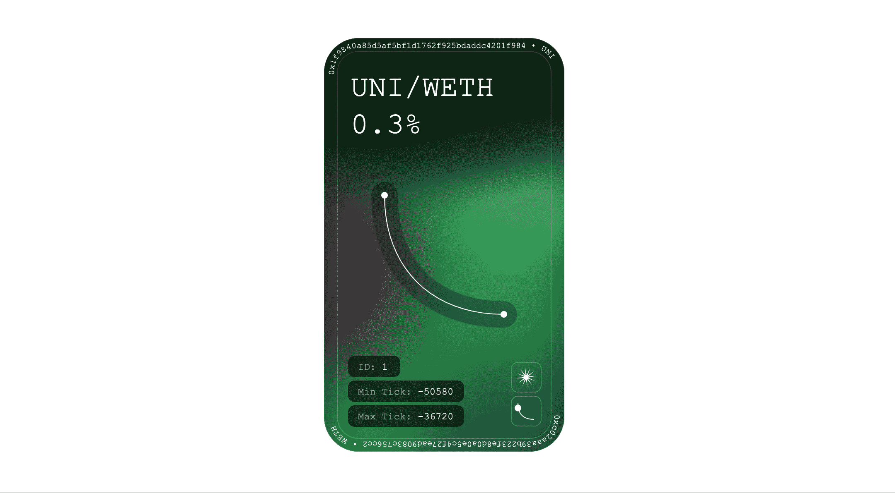
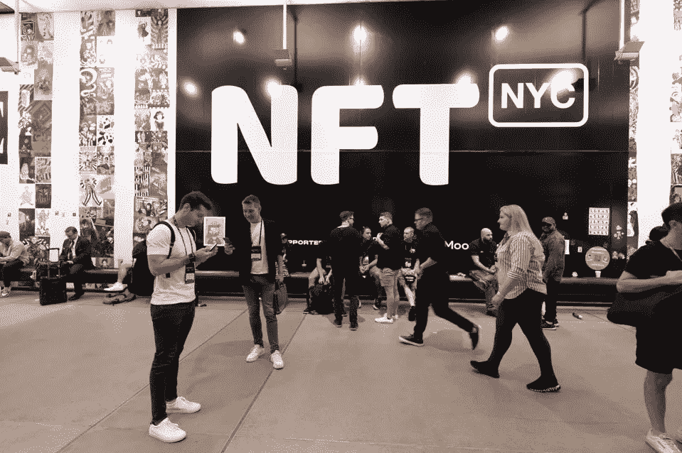

# Web3 数字资产及其价值的典型范式(二)——不可替代的令牌

> 原文：<https://medium.com/coinmonks/typical-paradigm-of-web3-digital-assets-and-its-value-2-non-fungible-token-fb21f5671479?source=collection_archive---------40----------------------->

Atom and NFT

习惯上甜是甜，习惯上苦是苦，习惯上热是热，习惯上冷是冷，习惯上色是色。但事实上有原子和虚空。也就是说，感觉的对象应该是真实的，习惯上认为它们是真实的，但事实上它们不是真实的。只有原子和虚空是真实的。

*———德谟克里特斯*

在这篇文章的开始，我引用了古希腊著名哲学家德谟克里特斯的话，德谟克里特斯是最早致力于原子论的人，他通常被认为是发明了原子论，所谓的原子论，是一种自然哲学，提出物质宇宙是由基本的不可分割的组成部分组成的，这些组成部分被称为原子。事实上，我们普遍认为原子论是科学诞生的前提，因为它提出了一种非目的性的解释事物的方式，一切都是基于客观存在的规律运作的。这里不详细讨论原子论，因为会涉及到量子力学对它的影响。我只是感叹两千多年前先贤的智慧。这种优秀的思想甚至对当前的 Web3 开发产生了重大影响。

在上一篇文章中，我们探讨了可替换令牌的概念和价值。在这篇文章中，我们将讨论 Web3 领域的另一个典型的数字资产范式及其价值——不可替代的令牌，无论你是否了解区块链或 Web3，我想你应该听说过或见过那些非常昂贵的 Twitter 图片，或者这是你进入 Web3 领域的重要激励，在这篇文章中，我将尝试从多个角度和价值来分析 NFT 的现状，我相信在理解本文的观点后，至少会知道为什么这些图片如此昂贵？或者说投机是围绕什么展开的？

# 不可替代令牌的概念

首先，我们来介绍一下不可替代令牌的概念。在上一篇文章中，我们已经知道 Web3 中的数字资产通常被称为令牌。像 FT 一样，NFT 指的是另一个具有有限属性的令牌。这种令牌通常是不可替代的，不可分割的。每个 NFT 理论上都是唯一的，尽管在代码实现中，它只是一个唯一的 ID 或 URL。

对于新生事物，我通常希望从根源上探究想法的来源，或者说是什么样的语境催生了想法。我相信，所谓不可分割或不可替代的资产的提出者一定是坚定的原子论者，而我之所以选择引用德谟克里特斯作为开篇论点，也是有此意义的。这代表了一种认识世界的思维方式，在这种指导下，自由主义和个人主义发展起来了，这为什么是不可替代的抽象概念提供了最关键的驱动力，所以我相信它的发展脉络源于此，承认不同个体的差异，但同时赋予解释一些共同现象的能力，就像我们提出的 NFT，一种数字资产描述方法，可以用来描述一些不同的资产类别，同时，同一类别之间存在某种联系。当然，除此之外，如果你认为你所生活的世界遵循着一个叫做“普遍”的统一规律，而不同事物之间存在差异的原因是因为在“普遍”之上还有“具体”，那么你就有很大概率是柏拉图信徒，FT 似乎就属于这种思想指导下的产物，发行一个带有“普遍”的数字资产，“特殊”在于数量。

说起 NFT 的历史，有人认为可以追溯到 2012 年的一个名为 Colored Coin 的 altcoin 项目，该项目通过使用比特币交易的 OP_RETURN 来保存额外的数据，并通过这种方式可以在比特币网络中发行各种类型。公司的资产有各种用途，其愿景描述了发行不可分割资产的一些场景，如商业票据、契约等。但是，我觉得这种说法很牵强。充其量只能说它给 NFT 提供了一些启发。无论从开发方式、应用场景等方面。，这与目前 NFT 的发展大不相同。

Colored Coin

事实上，我认为将 2017 年发布的 CryptoPunks 视为 NFT 的诞生标志更为合理。CryptoPunks 是由最初从事移动应用程序开发的 John 和 Matt 创建的。他们在 2017 年初制作了一个像素字符生成器，并使用以太坊智能合约发布了一系列链上可交易的头像。随着这种 Dapp 的流行，一系列类似的项目被发明出来。直到 2017 年底，一个名为 CryptoKitties 的游戏项目爆发，该项目提出了一个标准化的以太坊资产发行标准，名为 ERC-721，并基于其实现了其原生资产，一只可以进化和繁殖的链上小猫。

CryptoPunks

ERC-721 的提出可以说是故事的开始。人们发现，除了可爱的小猫，这个协议可以承载比 FT 更多的资产类型，大大丰富了 Web3 领域的应用场景(当然还有一个更重要的原因是 FT 领域已经存在过度的资产泡沫，增长乏力，市场需要寻找新的叙事来继续泡沫的增加)，那么这个协议和 ERC-20 有什么区别呢？我们截取一些代码来说明:

> 函数 tokenByIndex(uint256 _index)外部视图返回(uint 256)；
> 
> 函数 tokenOfOwnerByIndex(address _ owner，uint256 _index)外部视图返回(uint 256)；
> 
> 函数 balanceOf(address _owner)常量返回(uint balance)；
> 
> 函数 ownerOf(uint256 _tokenId)常量返回(地址所有者)；
> 
> 函数 approve(address _to，uint 256 _ token id)；
> 
> 函数传递(address _to，uint 256 _ token id)；
> 
> 函数 tokenMetadata(uint256 _tokenId)常量返回(string infoUrl)；
> 
> 事件转移(address indexed _from，address indexed _to，uint 256 _ token id)；
> 
> 事件批准(address indexed _owner，address indexed _approved，uint 256 _ token id)；
> 
> event approval for all(address indexed _ owner，address indexed _operator，bool _ approved)；

仔细分析可以发现，与 ERC-20 相比，该标准最大的不同在于，当用户发起资产转移时，不需要提供交易量，只需要提供一个名为 tokenId 的参数，其中 tokenId 的作用类似于名称，说明你需要明确告诉协议你交易的是哪个标的物。不同的令牌 id 对应不同的数字资产。此外，还有一个名为 tokenMetadata 的函数，它返回 url 的值，最常见的 NFT 是图像。事实上，从开发的角度来看，您只需要在链上记录一个图像链接(最常见的是 IPFS 链接)，并将 tokenId 绑定到该链接。关系，主要开发任务完成。

CryptoKitties

# 不可替换令牌的值类型

那么为什么这个看似简单的改变，却给整个行业带来了如此大的创新价值呢？经过总结，我认为 NFT 凭借其 Web3 数字资产的可编程性和可验证稀缺性([详见我关于 Web3 数字资产的文章](/coinmonks/innovation-around-digital-assets-is-the-core-driver-of-the-next-web3-revolution-783e9d6ed8b3))等特点，在某些场景下凸显了其价值，主要价值类型包括以下几点:

**(1)文化价值**

文化价值基本上可以说是迄今为止最直观的 NFT 价值。由于加密艺术品的快速发展，我认为 NFT 的文化价值通常由两部分组成:

*   **链外艺术品价值:**特指 NFT 绑定的保存单个或批量艺术品图片、视频、音乐等的 URL 所带来的文化价值。由一些所谓的加密艺术家创作的。一般来说，普通艺术品艺术品的类型包括单品艺术品、PFP 系列艺术品等。，通常是最常见的，比如 CryptoPunk，BAYC 等。有效地评估这些价值通常是困难的，因为定价通常是主观的和亚文化的。

Bored Ape Yacht Club

*   **NFT 原创文化价值:**这部分价值由 Web3 给出。NFT 的交易及其所影响的对其稀缺性的验证并不依赖于一个权威，所以它具有反对权威和草根文化的特征，这通常是一件大事。一些 NFT 项目希望传播这种文化。

**(2)数据载体值**

所谓数据载体价值，是指 NFT 作为不可篡改的分散数据载体所产生的价值。这类项目通常使用 NFT 来存储某种类型的链外数据或链上数据，利用 NFT 的不可篡改、可交易、可编程三大技术特性来达到更好的效果。比如 Uniswap V3，由于其核心创新是主动做市，允许用户设定合适的价格区间，根据自己的意愿提供订单，而 Uniswap 则选择使用 NFT 来承载用户的定制做市证书。此外，去哪儿的集中式博客平台 Mirror 开发了一个有趣的功能，可以从用户的博客中自动生成 NFT，从而实现内容的不可篡改功能。

Uniswap V3 Position NFT

**(3)实用价值**

所谓实用价值，根据不同业务场景的需求略有不同。这里我们只分析一个最典型的使用场景，凭证场景。由于 NFT 不可替代的特性，NFT 往往可以承载比 FT 更多的用户信息，所以在用户运营方面，给项目带来了更丰富的策略。因此，这类项目往往选择颁发 NFT 作为用户的参与证书，并希望建立一个链上账户系统。回想一下最近 NFT.NYC 发的 NFT 门票

NFT.NYC

至此，我们已经完成了 Web3 中一些基础理论的描述。相信看完这些文章，大家会对 Web3 有一个初步的了解。接下来我就从一些实时事件的分析开始，从技术，商业模式，市场。估值和其他观点为 Web3 投资者、从业者和企业家提供了灵感。

> 交易新手？试试[加密交易机器人](/coinmonks/crypto-trading-bot-c2ffce8acb2a)或者[复制交易](/coinmonks/top-10-crypto-copy-trading-platforms-for-beginners-d0c37c7d698c)