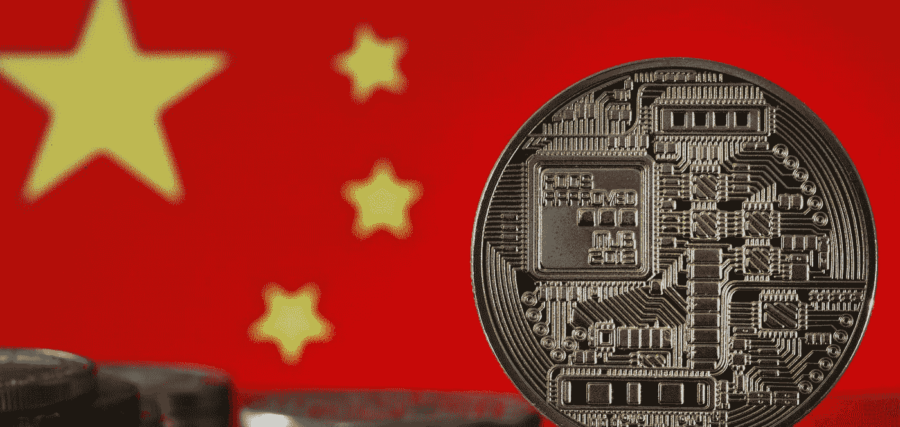

# 美国立法者推动数字美元对抗数字人民币

> 原文：<https://medium.com/coinmonks/u-s-lawmakers-push-for-digital-dollar-to-fight-digital-yuan-657174149b8e?source=collection_archive---------38----------------------->

本文由《大纪元时报》
[【https://www.epochtimes.com/gb/22/8/10/n13799236.htm】](https://www.epochtimes.com/gb/22/8/10/n13799236.htm)记者吴伟翻译

美国立法者推动数字美元对抗数字人民币。
大纪元 2022 年 8 月 10 日，大纪元记者吴伟采写报道

Some lawmakers in both parties in America are pushing for a Federal Reserve issued digital dollar in order to compete with China and other countries digital currency as they worry one day digital currency will threaten Americas reserve currency status.
Washington Post on the 8th of August reported that bipartisan lawmakers including Democrat representatives Maxine Waters and Republican representative, French Hill, are pushing for America to compete with other countries digital currencies. They both serve on the House Financial Services Committee where they could propose the bill as soon as next month.
Waters says this central bank digital currency is a “new digital assets space race,” but the Biden administration and the Federal reserve are yet to have the same sense of urgency.
The difference between bitcoin and the central bank issued digital currencies is that it will receive the support of the federal reserve, just like how the current currency is backed by the federal reserve.
Fed Chairman Jeremy Powell stated that the fed is is no hurry to launch a digital dollar, because it faces inflation and a slowing economy. He said further, without the support of elected officials, the fed won’t be able to issue the digital currency. The white house has largely been neutral on the topic of digital currencies with the Biden administration looking into doing further investigation on it to determine the impact on economic growth and stability. But chair of the Financial Services Panel, Waters, has drafted legislation requesting the federal reserve to establish the groundwork for the digital US dollar and design a protocol for a possible digital currency issued by the United States in the future.
This kind of proposal has encountered not a small amount of resistance. The banking industry across the board has said that the operating costs of a central bank digital currency exceed the benefits, and private banks would directly compete for depositors, making loans more expensive.
Since a century ago, The U.S. dollar has reigned supreme as the world’s most important currency because in almost all trade the US dollar is the most accepted; from a cup of coffee at a nearby cafe to a bond purchase in Hong Kong. Right now there is a worthwhile argument to be made. That is, whether the status of the dollar will be threatened by technological progress, and whether it needs to keep pace with the times to digitize the dollar.
The digital US dollar can provide consumers with a “new” way of purchasing goods and services. Aside from using credit or debit cards, Venmo or Apple pay, people can pay with digital currency anywhere using the existing financial system with their phone giving a faster, more convenient option than cash.
This kind of shift could make cross-border payments easier and reduce associated fees. Advocates of the digital USD can be used by the government to issue welfare payments such as stimulus checks and unemployment benefits in a faster and safer way.
Some people are saying in congress, America is already behind the times. According to data from the Atlantic Council, a Washington based think tank, in 20 of the worlds most important economies there are 16 that are currently in the development or pilot stage of a digital currency. The European Central Bank representing Germany and France are currently in the process of preparing to test the feasibility of digital currency.
Arkansas Republican, Hill said, he worries about the influence of the communist party. The Communist party in 2020 started the process of testing the digital Yuan. In an interview he said, the Communist party will extend the reach of its currency, the RMB, internationally by making available loans in the form of digital currencies to developing countries. He says this is a threat to the dollar based economy. “We should pay attention to the Communist parties predatory practices,” he said.
Chinese authorities have not ruled out the international use of the digital yuan (e-CNY), but they state that the e-CNY is planned to be used for small transaction purchased for Chinese consumers.
Analysis's are closely paying attention to weather the Peoples Bank of China, along with other national banks, will adopt concrete steps and make it possible to use digital currency for trade between countries. All in all, the Communist government is concerned about the role that the USD has as the dominant currency for trade, especially if a war with Taiwan breaks out, they will be cut off from the USD based global finance system.
The Communist Chinese embassy in Washington did not respond to our request for comment.
Some members of congress should receive permission to establish a digital US dollar and not just conduct a feasibility study. “I do have a sense of urgency because other countries are moving forward.” House of Representatives Jim Himes in an interview says, “right now is the time for a Central Bank Digital Currency (CBDC).”
Banks and lawmakers countered saying the promise of a digital dollar can only be opened up through private-sector innovation.
“In that case central bank issued digital currency in the end needs to solve a specific problem.” North Carolina representative, Patrick McHenry early this year asked at a hearing. He is the highest-ranking Republican on the House Financial Services Committee.
Some analysts say that global markets will use the digital RMB or another countries issued digital currency to replace the USD but maintain skepticism that that could be possible.
Fed Vice Chairman Brainard is most interested in promoting the idea of a digital dollar within the central bank, although she does not publicly support digital currencies.
Brainard says that with the increase in privately issued stablecoins, digital currency would steadily shape our environment and the digital dollar can one day provide consumers a certain amount of safety. However early this year, the collapse in the stablecoin market gave rise to concern for this kind of digital currency.
In July Brainard said in a speech, “reliable, safe, centrally issued digital currencies can no doubt give more trust to the transaction settlements of the crypto currency financial system in the future.”

> 交易新手？试试[加密交易机器人](/coinmonks/crypto-trading-bot-c2ffce8acb2a)或者[复制交易](/coinmonks/top-10-crypto-copy-trading-platforms-for-beginners-d0c37c7d698c)

— — — — — — — — — — — — — — — — — — — — — — — — — — — — — — — —

🔴点对点加密货币交易现在是、将来也会是规避日益恶化的资本管制的最重要工具。加入点对点加密交易革命。立即报名— [https://Wild-West。贸易](https://www.youtube.com/redirect?event=video_description&redir_token=QUFFLUhqbEs0WWgybWhXelY1SGZoRC1mN1FYS2tyZGRFd3xBQ3Jtc0tueUt1d01FcS00ZllzQzBBTndkOXktbVZnY2Rha1c1Q0xVWHp6aVJpNjdqMXUyN0FzMmpoaWJWT3NGQm5acE84V1Qtc0lUcGpaYU9ralN0NUVINlBlNGVzb1JCV3c3RElqaVVsQXRrUm9pR0RnTEFYaw&q=https%3A%2F%2Fwild-west.trade%2F&v=snmHTbk-DSU)