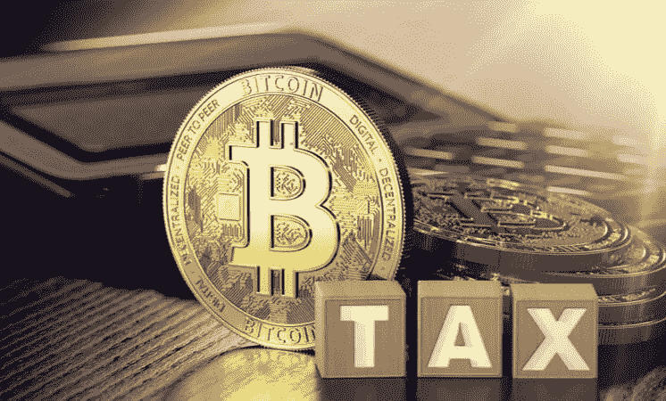

# 美国参议员提议对 50 美元的加密支付减税

> 原文：<https://medium.com/coinmonks/u-s-senators-propose-bill-cut-taxes-on-50-crypto-payments-d917a8debd54?source=collection_archive---------60----------------------->

根据周二的公告，参议员帕特里克·图米(共和党。)和 Kyrsten Sinema (D-Ariz .)向美国参议院提交了一项法案，旨在使价值高达 50 美元的加密交易免缴资本利得税。

一项旨在削减小额加密支付税收的新法案已经进入美国参议院。

根据周二的公告，参议员帕特里克·图米(共和党。)和 Kyrsten Sinema (D-Ariz .)向美国参议院提交了一项法案，旨在使价值高达 50 美元的加密交易免缴资本利得税。

目前的情况是，美国国税局(Internal Revenue Service)将加密资产视为财产，将加密交易视为投资而非支付，这意味着美国人有义务在每次兑换或出售加密货币时跟踪并缴纳资本利得税。

这极大地阻碍了该资产类别在主流商业中的潜在用途，而这反过来又被许多批评者和监管者用作反对密码作为货币的论点。

这项两党法案被称为虚拟货币税收公平法案，旨在将小型加密交易排除在资本利得税要求之外。如果投票通过成为法律，该法案将适用于价值低于 50 美元的交易，并规定随着通货膨胀调整该基准。

值得注意的是，类似的条款过去也曾被提交给国会，包括 2 月份由众议员苏珊·德尔贝内(Suzan DelBene)、戴维·施韦克特(David Schweikert)、达伦·索托(Darren Soto)和汤姆·埃默(Tom Emmer)提出的同名两党法案，该法案将门槛基准设定为 200 美元。

6 月，参议员 Kirsten Gillibrand 和 Cynthia Lummis 提出了一项全面的加密法案，其中包括对所有低于 200 美元的加密交易减税。

虽然加密游说团体和更广泛的社区广泛赞扬免除小型加密交易资本利得税要求的努力，但任何法案在年底前通过成为法律的可能性相对较低。

当前的立法日程——充满了与非密码相关的问题——将在 11 月中期选举前结束。此外，参议员 Toomey 将不会竞选连任，这意味着他不会在下一届国会推动该法案的潜在颁布。

点击这里关注我们了解更多故事[。](http://t.me/etellworld)

> 交易新手？试试[密码交易机器人](/coinmonks/crypto-trading-bot-c2ffce8acb2a)或者[复制交易](/coinmonks/top-10-crypto-copy-trading-platforms-for-beginners-d0c37c7d698c)