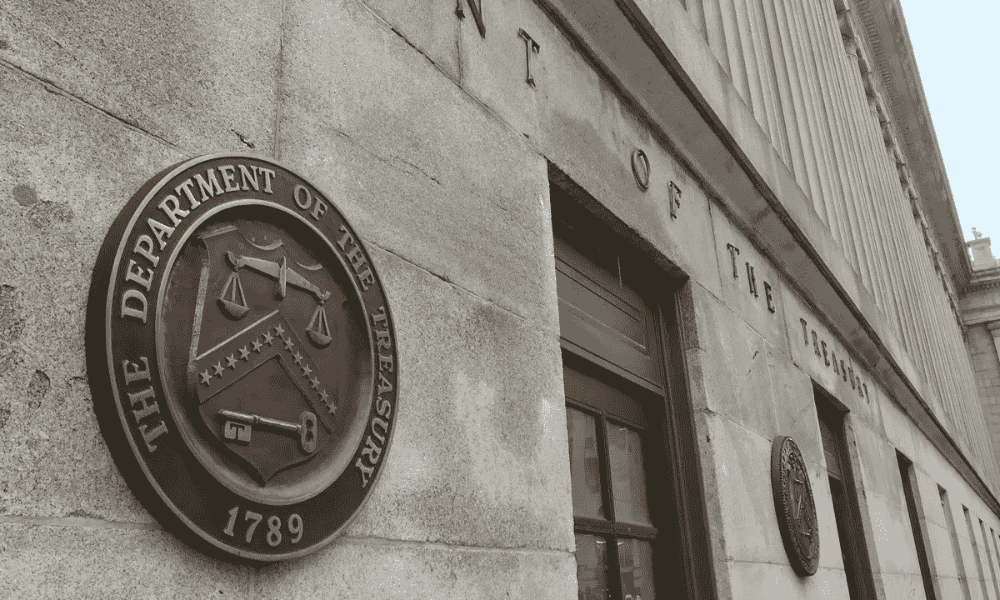

# 美国将利用全球优势监管加密技术

> 原文：<https://medium.com/coinmonks/u-s-to-use-global-dominance-in-regulating-crypto-29fb04c59c4f?source=collection_archive---------49----------------------->

美国财政部是最新一个分享监管加密货币提案的联邦机构，这是该国正在为该行业推出普通法的举措的一部分。

该部门于 7 月 7 日发布了一个国际加密监管框架，详细说明了美国国内金融价值应如何得到尊重，以及对参与加密行业的企业和消费者的保护。

根据概况介绍，加密货币应受到监管，以最大限度地减少数字资产在犯罪中的可能使用。此外，该机构指出，受监管的加密货币可以促进金融包容性和推动创新。

> 交易新手？试试[加密交易机器人](/coinmonks/crypto-trading-bot-c2ffce8acb2a)或者[复制交易](/coinmonks/top-10-crypto-copy-trading-platforms-for-beginners-d0c37c7d698c)

该部副部长珍妮特·耶伦指出，美国应利用其在金融市场的全球地位，与合作伙伴一起设计加密部门的框架。

> *“美国必须继续与国际伙伴合作，制定数字支付架构和中央银行数字货币(CBDC)的标准，以降低支付效率，并确保任何新的支付系统都符合美国的价值观和法律要求，”该简报称。*

在理想的框架下，财政部希望美国通过确保“协调一致的信息，限制重复，并鼓励工作在其主要利益相关者之间保持一致”，推动与全球合作伙伴的一致性。

在其他地方，该出版物表示，美国将继续举行接触和论坛，以建立作为乔·拜登总统向联邦机构发出的关于开发数字货币的行政命令的一部分的概况介绍。

点击关注我们的更多故事[。](http://t.me/etellworld)