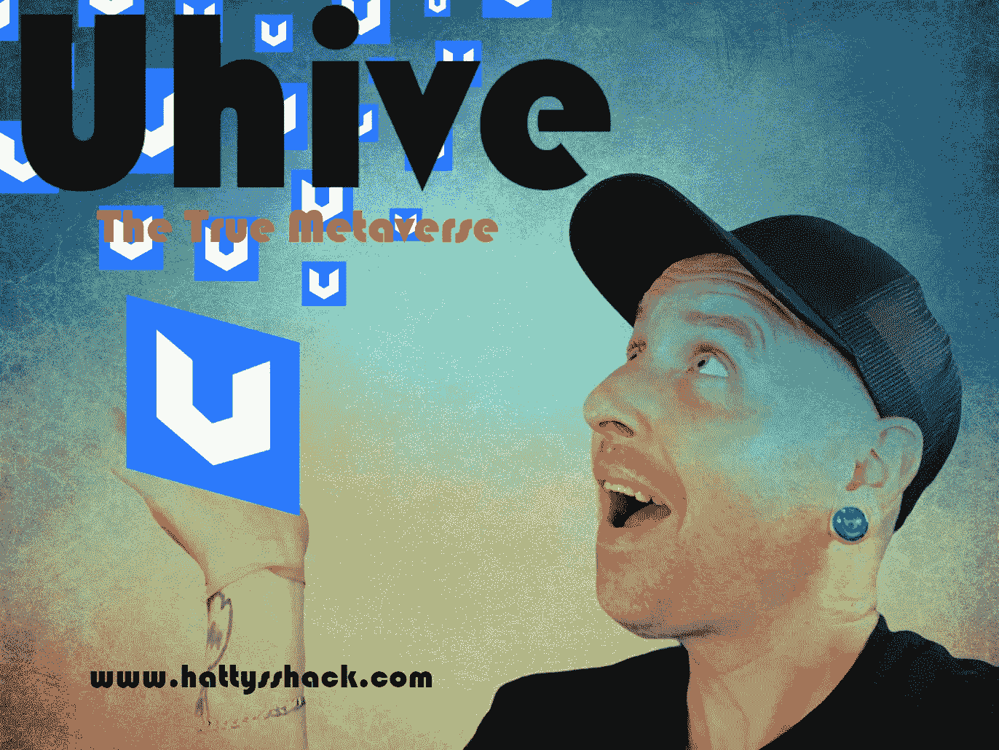
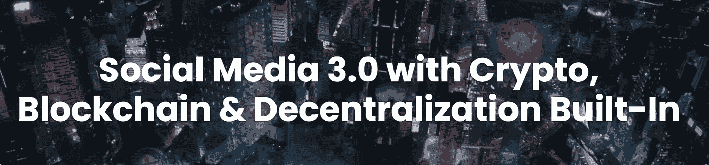
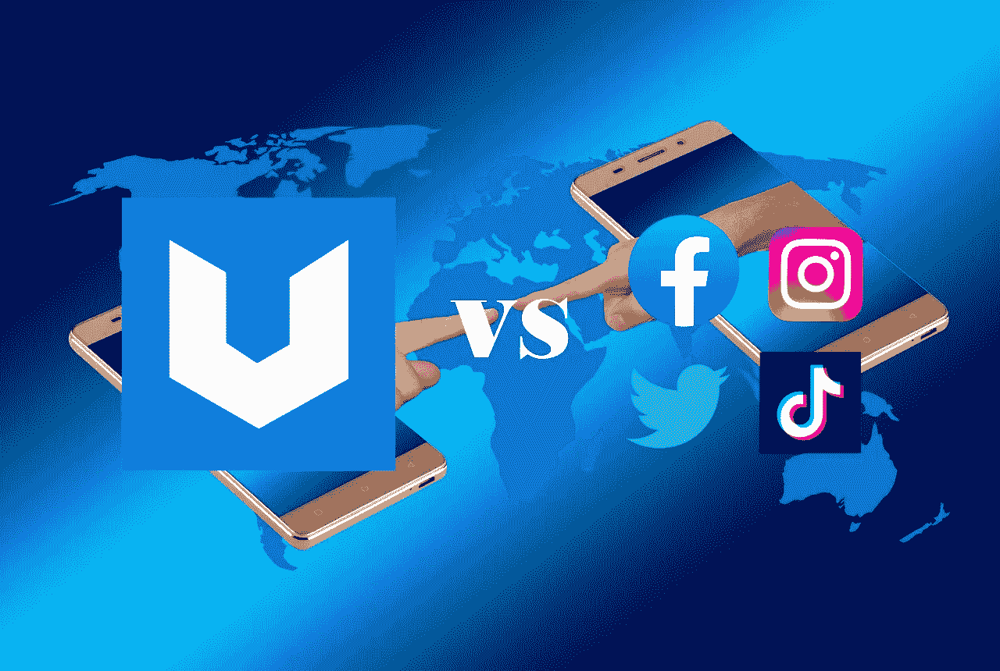
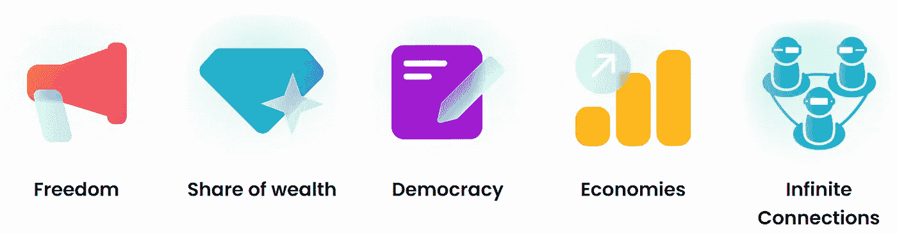
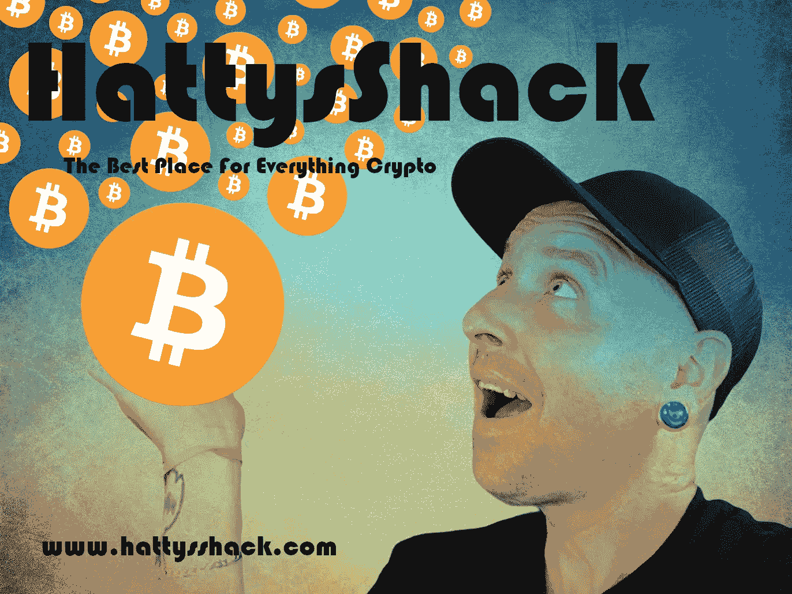

# uhive——真正的元宇宙

> 原文：<https://medium.com/coinmonks/uhive-the-true-metaverse-4e92883bf009?source=collection_archive---------23----------------------->

Uhive 是一个相当新的社交媒体平台，旨在改变我们在线互动的方式。它基于元宇宙的概念，这是一个任何人都可以通过互联网连接访问的虚拟世界。Uhive 仍处于早期阶段，但正如我们所知，它有可能彻底改变社交媒体。

Uhive 正在做一个新的特别联盟计划，让你通过传播信息和让人们知道它是关于什么的来赚取更多的钱。你带到平台上的人越多，奖励越高。所以如果你决定加入，让你的朋友和家人知道。

[Uhive](https://rt.uhive.com/deeplink?action=InvitationCode&ref_code=VD4R7R) 最初于 2018 年 2 月开始，于 2020 年 5 月在 Google Play 和 App Store 上推出，此后一直呈爆炸式增长，截至 2021 年 4 月注册用户达到 40 万。

因为他们首先构建了他们的社交媒体元素，他们证明了网络模型，然后他们在交易所上市了他们的加密令牌(HVE2)。正因为如此，他们的令牌背后是真实的效用，而不是投机(像大多数其他密码)，用户可以立即体验到拥有 HVE2 的价值。

[Uhive](https://rt.uhive.com/deeplink?action=InvitationCode&ref_code=VD4R7R) 一直在快速增长，我认为它不会很快停止。它在苹果和安卓系统上的下载量已经超过了 100 万次，这对一个成长中的公司来说是一个很大的进步。下一步是 500 万。尽管该平台仍处于测试阶段，但其发展速度之快令人吃惊。

社交网络用隐藏的议程淹没用户的反馈，这是将他们的数据拍卖给出价最高者的结果。

[Uhive](https://rt.uhive.com/deeplink?action=InvitationCode&ref_code=VD4R7R) 是一种完全不同类型的社交网络——他们利用自己的加密货币——u hive Token[hve 2](https://coinmarketcap.com/currencies/uhive/)—来创造收入流，包括点对点交易、NFT 的销售、基于兴趣的广告以及应用内数字资产的销售，因此用户的隐私永远不会以利润的名义受到损害。

**乌亥夫才是真正的元宇宙**

元宇宙是尼尔·斯蒂芬森在他的科幻小说《冰雪奇缘》中创造的一个术语。它指的是一个由计算机网络支持的模拟现实，用户可以在其中彼此互动，也可以与虚拟对象互动。虽然元宇宙的概念仍处于初级阶段，但已经有公司致力于创造这种替代现实。Uhive 就是这样一家公司，他们正在使用区块链技术来创建一个分散的元宇宙，任何人都可以访问。

# 与其他社交媒体网络的对比

[Uhive](https://rt.uhive.com/deeplink?action=InvitationCode&ref_code=VD4R7R) 是一个基于区块链的社交媒体网络。Uhive 在几个方面不同于其他社交媒体网络。

第一，Uhive 不把用户数据卖给广告商。Uhive 用户拥有自己的数据，他们可以选择与他人分享或保持隐私。

第二，Uhive 没有中央权威。Uhive 是分散的，这意味着它不受任何一家公司或政府的控制。这使得 Uhive 对审查更加抵触。

第三，Uhive 提供了两种不同类型的体验:蜂巢和宇宙。Hive 是一个私有的封闭网络，用户可以在这里与志同道合的人联系。宇宙是一个公共的、开放的网络，任何人都可以加入和参与其中。

[Uhive](https://rt.uhive.com/deeplink?action=InvitationCode&ref_code=VD4R7R) 有自己的货币，叫做 Hive token([hve 2](https://coinmarketcap.com/currencies/uhive/))。你可以用这些代币在 app 上消费或者在 [ProBit](https://www.probit.com/r/22378367) 等交易所提现兑换。目前，您可以在用于发布内容的空间上使用 Uhive 代币，更改空间名称和 NFT。从长远来看，他们会给你更多的钱，所以我建议你把你的 HVE2 存起来。他们也允许赌注，但你需要 100，000 HVE2 或更多的赌注。总的来说，Uhive 是一个独特的社交媒体网络，与其他网络相比有几个优势。

# [Uhive 的好处](https://read.cash/@HattyHats/uhive-the-true-metaverse-1b1c0270#the-benefits-of-uhive)

Uhive 是一个新的社交媒体平台，为传统的社交媒体体验提供了独特的视角。通过 Uhive，用户可以探索一个名为元宇宙的虚拟世界。这个虚拟世界由许多不同的星球组成，每个星球都有自己独特的大气和环境。Uhive 为用户提供了在这个虚拟世界中以各种方式与他人互动的能力，包括聊天、游戏和购物。

T2 u hive T3 的一个好处是，它为用户提供了更加身临其境的社交媒体体验。与倾向于关注文本和图像的传统社交媒体平台不同，Uhive 允许用户探索三维世界。这可以使社交媒体体验对用户来说更加吸引人和令人兴奋。此外，Uhive 对虚拟现实的关注也可能使其成为企业和组织以新的创新方式推广其产品或服务的宝贵工具。

T4 Uhive 的另一个好处是它为用户提供了更多的隐私控制。在传统的社交媒体平台上，用户的信息通常可以被任何想要查看的人获得。然而，在 Uhive 上，用户可以选择将自己的信息保密，或者只允许某些人访问。这让用户可以更好地控制

# [Uhive 的](https://rt.uhive.com/deeplink?action=InvitationCode&ref_code=VD4R7R)路线图

Uhive 仍在开发中，但该团队已经发布了他们未来计划的路线图。第一阶段已经开始，重点是开发 Uhive 平台。这包括创建用户将与之互动的社交媒体功能和 3D 世界。第二阶段将是扩展 Uhive 生态系统。这包括向平台添加新功能和内容，以及与其他元宇宙平台集成。第三阶段是 Uhive 将开始专注于货币化的时候。这可能包括应用内购买、高级会员和广告等。

[**Uhive**](https://rt.uhive.com/deeplink?action=InvitationCode&ref_code=VD4R7R) **有 5 个定律。这 5 条法律如下。**

**法则** [**#1**](https://read.cash/search?q=%231) **自由法则**

元宇宙必须尽可能利用权力下放来提供完全的自由

**法则******财富法则****

**元宇宙必须致力于通过允许和促进财富分配，为每一个用户创造全球普遍收入**

****法律******民主的法律******

****元宇宙必须让整个社会系统民主化，允许用户通过议会和公共委员会控制其政策****

******定律******经济定律********

****元宇宙必须基于循环经济，这意味着一切都被视为数字资产，可以使用区块链进行销售和交易****

******定律******无限连接定律********

****一个元宇宙必须在一个虚拟世界中包含并连接上述所有定律，作为通往我们现实世界的桥梁****

******那么，为什么要加入 Uhive？******

****用户可以像任何社交媒体一样简单地使用[u live](https://rt.uhive.com/deeplink?action=InvitationCode&ref_code=VD4R7R)，但有了言论自由的额外好处，可以通过创建和购买/销售 NFTs 等数字资产、交易虚拟房地产、邀请他人加入 u live 等来赚取收入。****

********

****[**u 五**](https://rt.uhive.com/deeplink?action=InvitationCode&ref_code=VD4R7R)****

# ****[结论](https://read.cash/@HattyHats/uhive-the-true-metaverse-1b1c0270#conclusion)****

****Uhive 是一个有决心的项目，它有可能改变我们与互联网互动的方式。这是一个强大的想法，有很大的潜力，我很期待看到它如何发展。如果你对探索 Uhive 感兴趣，一定要查看他们的网站并注册他们的测试版。Uhive 是一个将改变世界的惊人项目。它已经测试了两年，离它成为主流已经没有多少时间了。现在它是通过口头传播建立起来的。测试阶段结束后，他们会做广告，传播消息。****

****如果你对 [Uhive](https://rt.uhive.com/deeplink?action=InvitationCode&ref_code=VD4R7R) 感兴趣，请使用我的链接查看。我们都会受益。如果你注册了，请在评论中分享你的用户名，我会关注你的。我的代号是 [VD4R7R](https://rt.uhive.com/deeplink?action=InvitationCode&ref_code=VD4R7R)****

****我希望你喜欢我的文章。请喜欢和关注更多的内容，并帮助我的网页成长。****

********

****不要忘记查看我的网站，了解我所有的内容和更多内容。****

****[https://www.hattysshack.org/](https://www.hattysshack.org/)原创文章 [read.cash](https://read.cash/@HattyHats/uhive-the-true-metaverse-1b1c0270)****

> ****交易新手？尝试[加密交易机器人](/coinmonks/crypto-trading-bot-c2ffce8acb2a)或[复制交易](/coinmonks/top-10-crypto-copy-trading-platforms-for-beginners-d0c37c7d698c)****