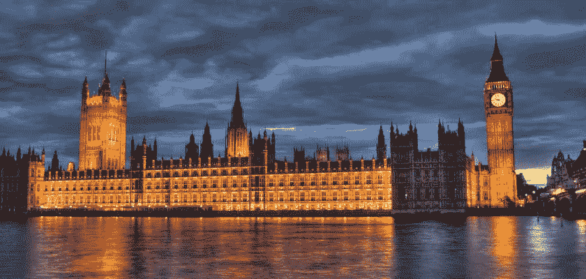

# 英国议会开始调查区块链技术

> 原文：<https://medium.com/coinmonks/uk-parliament-opens-inquiry-on-blockchain-technology-5fb2d2e2e060?source=collection_archive---------51----------------------->

曾经被认为是我们未来之路的区块链技术，不知何故已经演变成了一台生成迷因的机器。当然，曾经决定所有殖民地命运的英国议会现在正在调查非关税壁垒。毕竟，在资金流动的地方，立法者会乘坐他们的直升机向该行业投掷监管炸弹。所以这一次，英国议会将对区块链技术和 NFTs 展开调查。或许，在这里做出大胆的预测并不是专业的记者行为。但是，如果说对非关税壁垒征收更多的税会不会很疯狂？

## **区块链技术和 NFTs**

为了对该行业进行适当的调查，英国议会成员正在对区块链展开调查。此外，他们正在探索不可替代的令牌(NFT ),以便能够适当地调节空间。

在很大程度上，他们将研究非功能性金融服务和区块链的风险、收益和运作。英国数字、文化、媒体和体育(DCMS)将负责这项任务。

首先，这是对 2021 年 NFT 繁荣的回应。总的来说，NFT 去年的销售额达到了 170 亿美元左右，这充分说明了摩根大通的潜力。现在很明显，有人担心 Jpeg 市场存在泡沫，随后会崩溃。

“NFT 价格和销量的下降加剧了人们的担忧:杰克·多西第一条推文的 NFT 最初售价为 290 万美元；当拍卖重新上市时，最高出价是 280 美元。同样，从 2021 年 8 月到 2022 年 3 月，NFT 的周销量下降了 90%以上。”

## **170 亿美元关注**

DCMS 委员会主席朱利安·奈特议员表示，英国在这方面的法规基本上不存在。和其他国家一样，英国在[监管](https://blog.hi.exchange/crypto-regulations-eu-parliament/)派对上姗姗来迟。

“NFT 席卷数字世界的速度如此之快，以至于我们没有时间停下来思考。现在市场正在疯狂转向，有人担心泡沫可能会破裂，我们需要了解这项开创性技术的风险、好处和监管要求。

投资者，尤其是脆弱的投资者，面临着被骗购买非金融资产的风险，这些资产的价值可能会在购买时暴跌。我们的调查将调查是否需要更大的监管来保护这些消费者和更广泛的市场免受不稳定投资的影响。

这项调查还将有助于议会理解一项激动人心的新技术带来的机遇，这项技术可能会使资产买卖民主化。"

抛开自由主义不谈，某种程度的诚实监管可能终究不是一个坏主意。在去年的 NFT 繁荣时期，疯狂的波动和百万起诈骗案让人们的钱包瘪了一大块。无论如何，我们都应该拭目以待，看看即将出台的区块链技术和非功能性技术法规会有什么结果。然而，更严格的 KYC 要求和更多的税收肯定会到来。

> 交易新手？试试[加密交易机器人](/coinmonks/crypto-trading-bot-c2ffce8acb2a)或者[复制交易](/coinmonks/top-10-crypto-copy-trading-platforms-for-beginners-d0c37c7d698c)