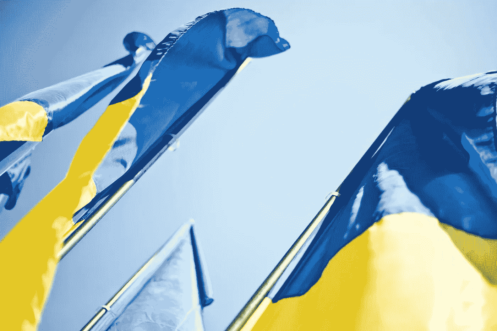

# 乌克兰部长表示，尽管“熊市”，加密技术仍将存在。

> 原文：<https://medium.com/coinmonks/ukraines-minister-says-crypto-is-here-to-stay-despite-the-bear-market-ce7585aedeb0?source=collection_archive---------57----------------------->

自俄罗斯入侵以来，饱受战争蹂躏的乌克兰已经筹集了超过 1.25 亿美元的秘密捐款。

乌克兰数字化转型部副部长表示，在这场战争中，加密技术已经成为乌克兰国防的必备工具。

“提供灵活性和速度，挽救了我们士兵的生命，亚历克斯·博尔尼亚科夫在推特上说。

在评论正在进行的熊市时，乌克兰部长表示，每个“加密的冬天”都会导致“加密的春天”，但该行业将留在这里。

来自世界各地的秘密捐款被用来提供必需品，如平民的食物和该国士兵的防护装备。

点击这里关注我们了解更多故事[。](http://t.me/etellworld)

> 交易新手？试试[密码交易机器人](/coinmonks/crypto-trading-bot-c2ffce8acb2a)或者[复制交易](/coinmonks/top-10-crypto-copy-trading-platforms-for-beginners-d0c37c7d698c)