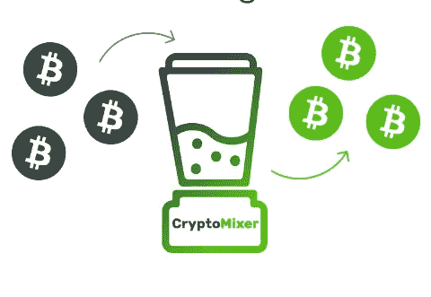
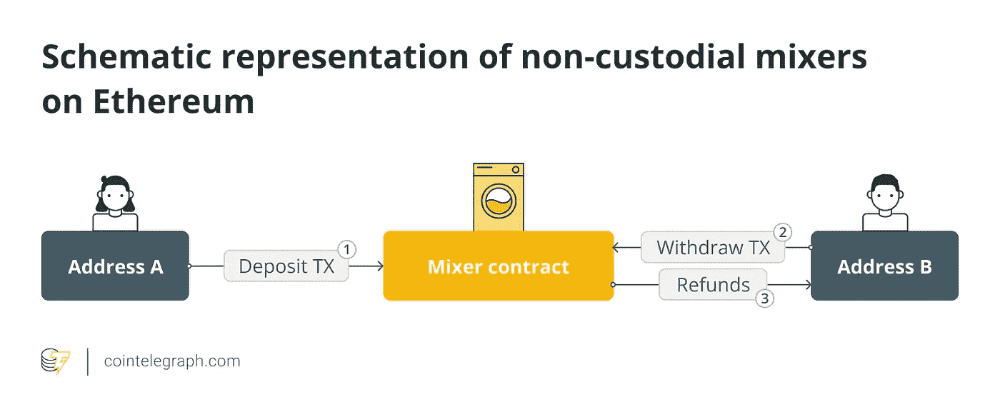
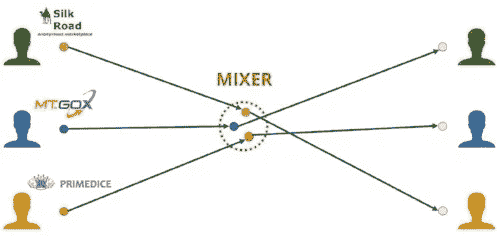
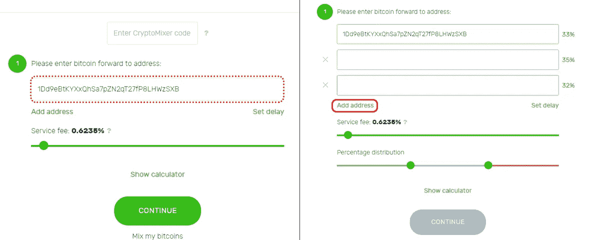
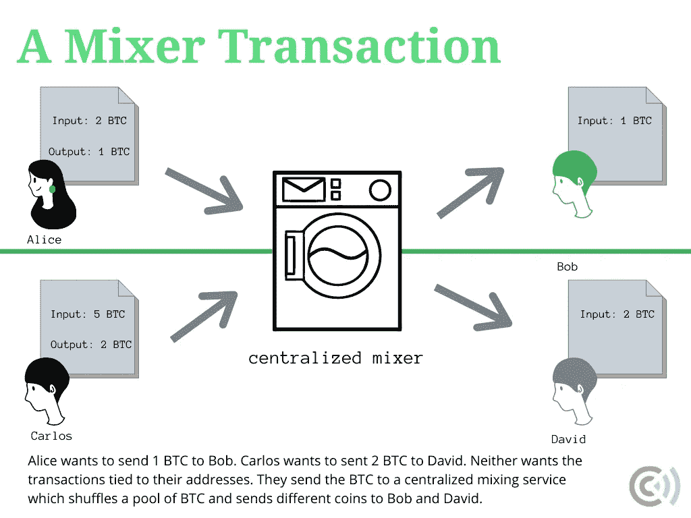
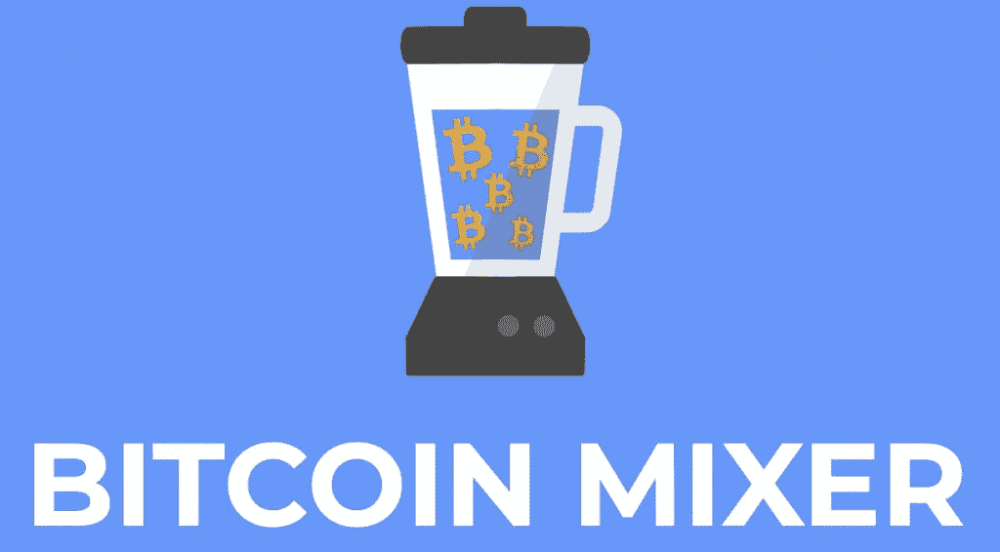
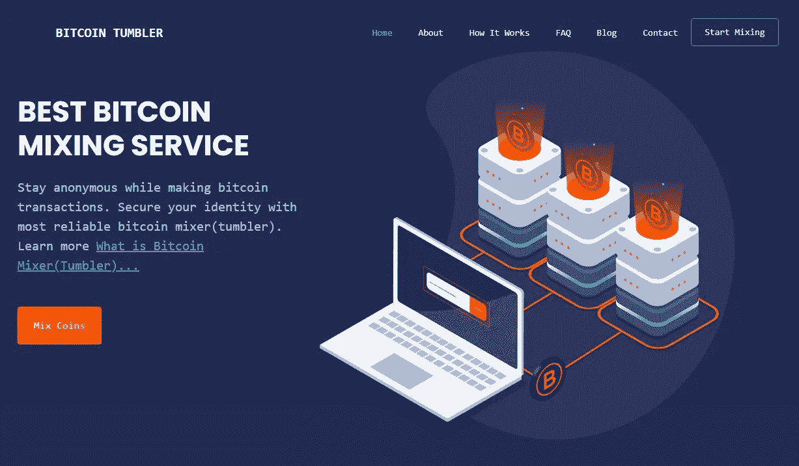
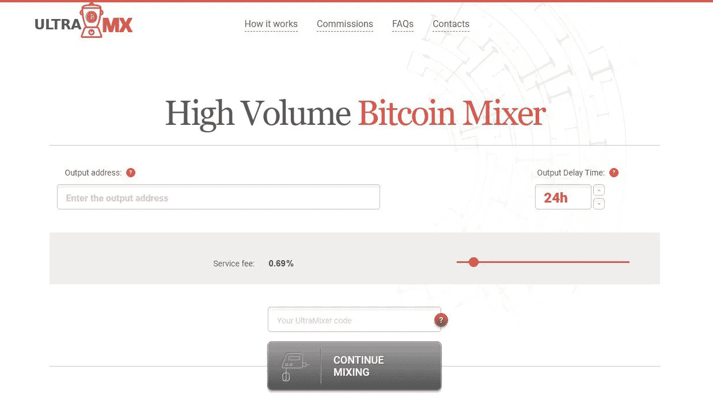
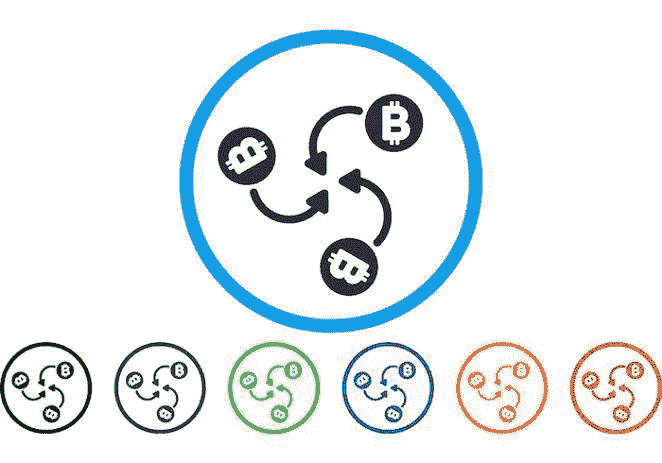

# 比特币搅拌器终极指南

> 原文：<https://medium.com/coinmonks/ultimate-guide-to-bitcoin-mixers-af169edaf6ba?source=collection_archive---------21----------------------->

什么是比特币搅拌机？

比特币混合器是让用户“混合”他们的硬币的解决方案，目的是匿名交易和保护个人信息。

比特币混合器是一项服务，使您能够通过一系列匿名交易发送您的比特币。这使得追踪资金来源变得更加困难，这使得比特币混合器成为那些希望隐藏身份的人的热门选择。

比特币搅拌机是如何工作的？

比特币混合器是一种软件服务，它将你的资金分解成更小的集合，然后将它们与其他交易混合在一起。在这个过程之后，我们称之为比特币翻滚，接收者获得相同价值的比特币，但收到不同的一组硬币。这使得比特币追踪更加困难，并打破了这些特定硬币和个人之间的联系。

由于比特币混合器的想法是防止追踪者收集个人信息并暴露交易背后的人的真实身份，比特币混合器不会存储用户的日志。此外，该服务不会收集用户的电子邮件地址或个人数据。

比特币搅拌器是自动化的，无需人工干预。这意味着，一旦交易被混合并发布在比特币区块链上，交易的相关细节就会被自动删除，通常是在 24 小时后。

作为提供混音服务的交换，他们收取 2-5%的赎金。除了混合比特币，这些混合器还提供 ETH 和 LTC 匿名服务。

比特币搅拌机怎么用？

以下是使用比特币混合器的步骤:

步骤 1)将您的硬币发送到服务地址，并提供您希望接收混合硬币的钱包的地址。

步骤 mixer 服务将从不同的地址发回相同数量的硬币，这使得很难追踪资金的来源。

注意:比特币混合器通常会收取少量服务费用，通常最低费用约为 0.001 BTC -0.005 BTC。这个过程叫做比特币翻滚。

这里有一些比特币搅拌器和转盘，你可以用它们来保护你的身份

1.Blender.io

Blender.io 是一个面向初学者的用户友好且安全的平台。这是市场上最好的比特币混合器之一，因为它不需要你有任何技术知识，用户界面非常容易交互。

2.UniJoin

UniJoin 是一个混合服务，它使用 CoinJoin 技术将您的事务与池中的其他事务混合在一起。它目前只支持比特币交易，但未来将支持以太坊、lite coin 和系绳交易。

3.超级搅拌机

UltraMixer 是最好的比特币混合器之一，通过混合使用比特币地址进行交易，提供了高度的保密性。该系统确保了快速可靠的交易，他们只有在付款被确认后才收取小额佣金。所有数据都被删除，并且没有数据日志。

4.比特币搅拌机(不倒翁)

比特币混合器(Tumbler)是一个比特币混合器，允许您发送 BTC 资金，同时保护您的身份。比特币搅拌机有几个比特币池，用于所有用户的低价值和高价值交易，您将从这些用户那里接收新的和不可追踪的硬币。

点击这里关注我们了解更多故事[。](http://t.me/etellworld)

> 交易新手？试试[密码交易机器人](/coinmonks/crypto-trading-bot-c2ffce8acb2a)或者[复制交易](/coinmonks/top-10-crypto-copy-trading-platforms-for-beginners-d0c37c7d698c)