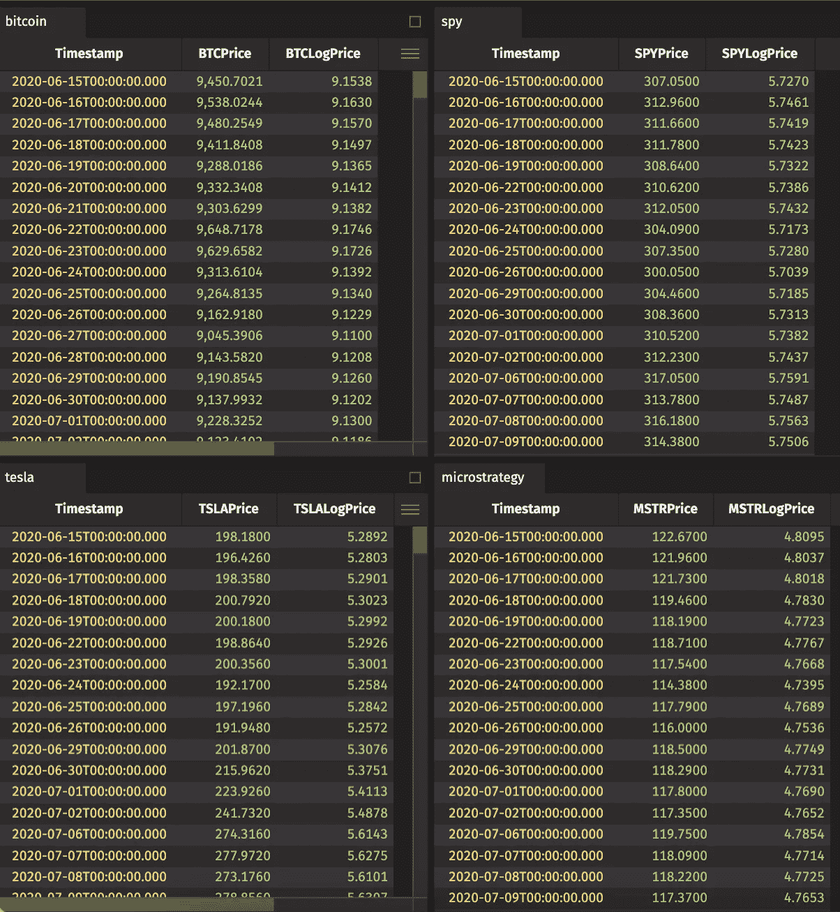
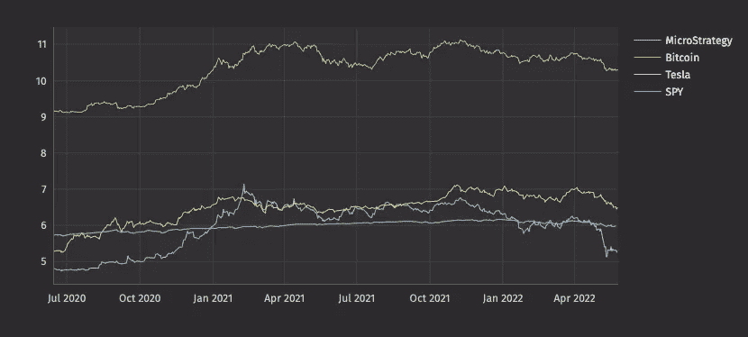
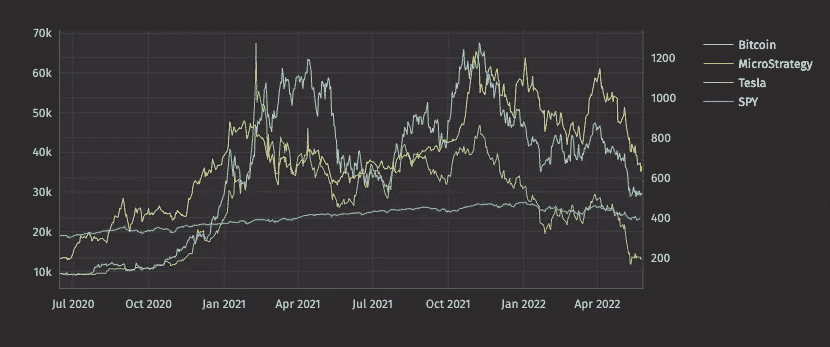
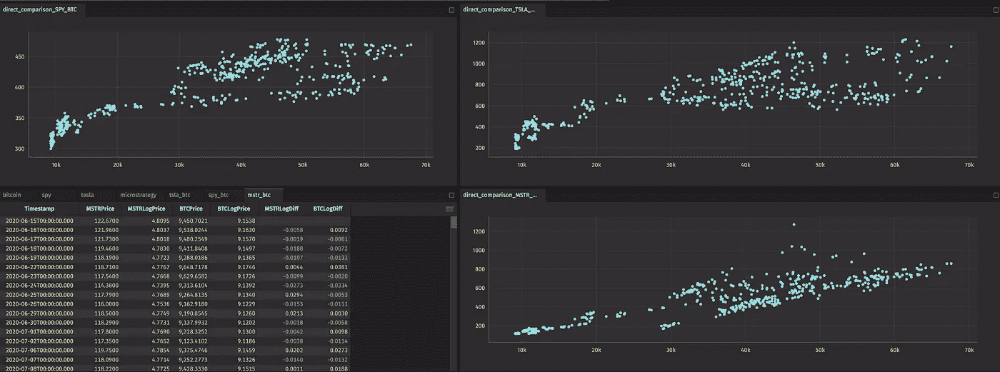
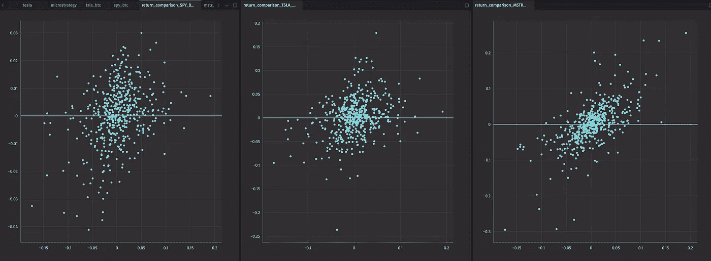
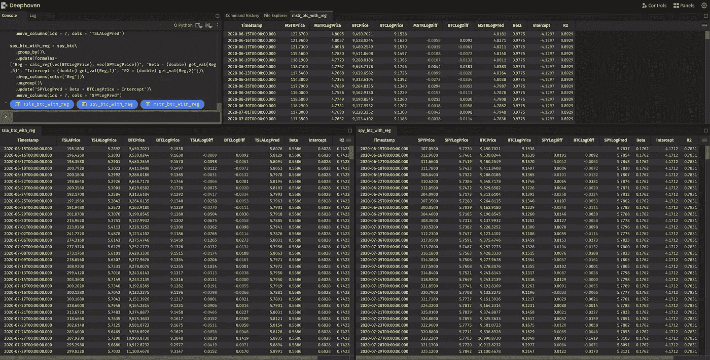
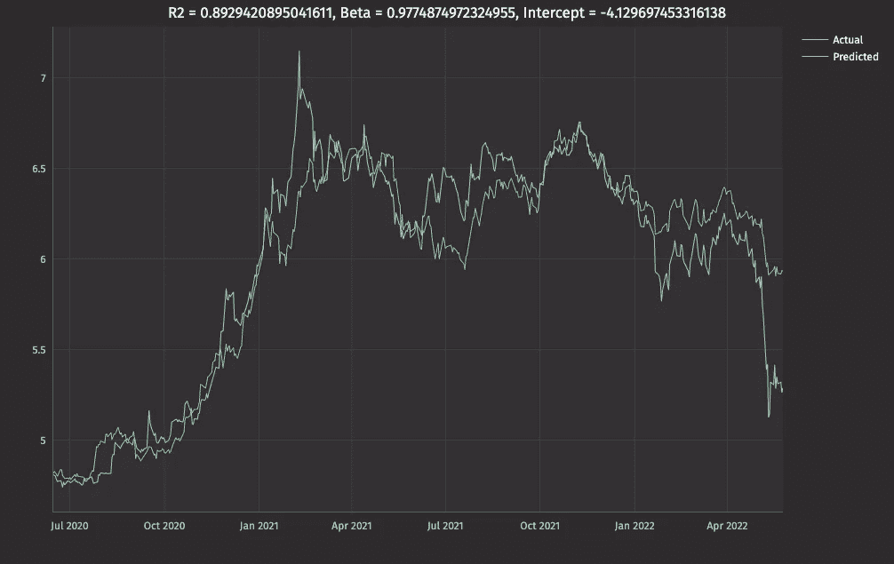
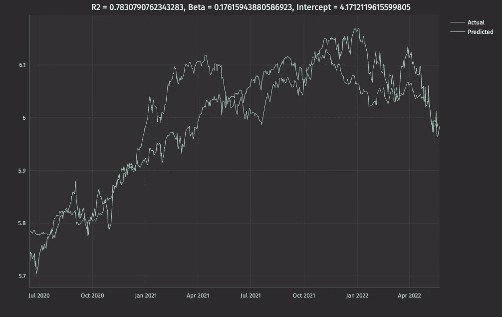
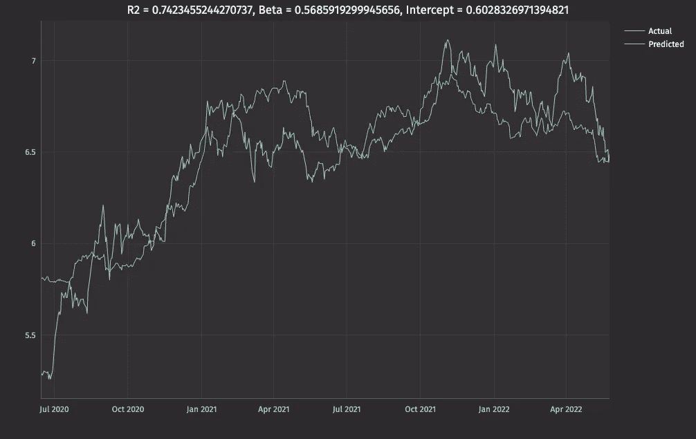

# 揭开比特币股东的真相

> 原文：<https://medium.com/coinmonks/uncovering-the-truth-about-bitcoin-stockholders-5e1ff4aef44a?source=collection_archive---------12----------------------->

## 实习第三天:把我学到的知识整合起来，进行准确的股票分析

约书亚·希尔加特纳


在我的上一篇文章中，我用我对 Deephaven 及其工具的理解来预测一些股票价格。这一分析是我对股票市场更广泛研究的一部分。

> 交易新手？试试[密码交易机器人](/coinmonks/crypto-trading-bot-c2ffce8acb2a)或者[复制交易](/coinmonks/top-10-crypto-copy-trading-platforms-for-beginners-d0c37c7d698c)

今年 3 月，一家名为 MicroStrategy 的公司获得了一笔 2 . 05 亿美元的比特币支持贷款，用于购买大量额外的比特币。他们想保护他们的货币资产免受通货膨胀的影响。这种购买——或者更确切地说是押注——是非常冒险的，因为像比特币价格低时追加保证金这样的事情可能会让他们损失很多钱。一个可能的副作用是股价根据比特币的价格波动。利用历史数据，我分析了这次购买对他们的股价以及其他几家持有更多比特币的公司的影响。

经过分析，我发现 MicroStrategy 的股价与比特币的股价高度相关。这导致了高波动性并带来了许多风险，甚至随着比特币价格的下跌，MicroStrategy 的市值减少了 10 亿美元。此外，对 MicroStrategy 的追加保证金通知可能会让它们损失惨重。

这个项目测试了我的知识，并给了我足够的信心，让我很快转向实时数据项目。我在下面向你展示我的代码。

# 寻找对投资者的影响[](http://localhost:3001/blog/2022/06/30/stock-relationships-analysis/#finding-the-impact-on-investors)

首先，在 MicroStrategy 的收购完成后，我从雅虎财经获取了一些数据。除了 Microstrategy，我还提取了特斯拉的一些数据，因为它也持有比特币，还提取了标准普尔 500 信托的一些数据，因为它代表了整个市场。在这一点上，我没有花时间来访问和导入这些数据。

```
from deephaven import read_csv#Create data table from bitcoin information
bitcoin = read_csv("[https://query1.finance.yahoo.com/v7/finance/download/BTC-USD?period1=1592179200&period2=1653523200&interval=1d&events=history&includeAdjustedClose=true](https://query1.finance.yahoo.com/v7/finance/download/BTC-USD?period1=1592179200&period2=1653523200&interval=1d&events=history&includeAdjustedClose=true)")\
  .update(["Date = convertDateTime(Date + `T00:00:00 NY`)", "BTCLogPrice = log(Close)"])\
  .view(formulas=["Timestamp = Date", "BTCPrice = Close", "BTCLogPrice"])#Create data table from Microstrategy information
microstrategy = read_csv("[https://query1.finance.yahoo.com/v7/finance/download/MSTR?period1=1592179200&period2=1653523200&interval=1d&events=history&includeAdjustedClose=true](https://query1.finance.yahoo.com/v7/finance/download/MSTR?period1=1592179200&period2=1653523200&interval=1d&events=history&includeAdjustedClose=true)")\
  .update(formulas=["Date = convertDateTime(Date + `T00:00:00 NY`)", "MSTRLogPrice = log(Close)"])\
  .view(formulas=["Timestamp = Date", "MSTRPrice = Close", "MSTRLogPrice"])#Create data table from Tesla information
tesla = read_csv("[https://query1.finance.yahoo.com/v7/finance/download/TSLA?period1=1592179200&period2=1653523200&interval=1d&events=history&includeAdjustedClose=true](https://query1.finance.yahoo.com/v7/finance/download/TSLA?period1=1592179200&period2=1653523200&interval=1d&events=history&includeAdjustedClose=true)")\
  .update(formulas=["Date = convertDateTime(Date + `T00:00:00 NY`)", "TSLALogPrice = log(Close)"])\
  .view(formulas=["Timestamp = Date", "TSLAPrice = Close", "TSLALogPrice"])#Create data table from SPY information
spy = read_csv("[https://query1.finance.yahoo.com/v7/finance/download/SPY?period1=1592179200&period2=1653350400&interval=1d&events=history&includeAdjustedClose=true](https://query1.finance.yahoo.com/v7/finance/download/SPY?period1=1592179200&period2=1653350400&interval=1d&events=history&includeAdjustedClose=true)")\
  .update(formulas=["Date = convertDateTime(Date + `T00:00:00 NY`)", "SPYLogPrice = log(Close)"])\
  .view(formulas=["Timestamp = Date", "SPYPrice = Close", "SPYLogPrice"])
```



首先，我做了一个图表，直接比较价格。因为我知道与其他公司相比，比特币的价格如此之高，所以我用对数来缩小它们的规模。

```
from deephaven.plot.figure import Figure
from deephaven.plot import PlotStyle, Colors, Shapelog_price_comparison_plot = Figure()\
  .plot_xy(series_name="MicroStrategy", t=microstrategy, x="Timestamp", y="MSTRLogPrice")\
  .plot_xy(series_name="Bitcoin", t=bitcoin, x="Timestamp", y="BTCLogPrice")\
  .plot_xy(series_name="Tesla", t=tesla, x="Timestamp", y="TSLALogPrice")\
  .plot_xy(series_name="SPY", t=spy, x="Timestamp", y="SPYLogPrice")\
  .show()
```



如你所见，这不是很有帮助。因此，我使用 Deephaven 的一个绘图工具在我的图上创建了多个 y 轴，以便更好地显示彼此相邻的价格。

```
price_comparison_plot = Figure()\
  .plot_xy(series_name="Bitcoin", t=bitcoin, x="Timestamp", y="BTCPrice")\
  .x_twin()\
  .plot_xy(series_name="MicroStrategy", t=microstrategy, x="Timestamp", y="MSTRPrice")\
  .plot_xy(series_name="Tesla", t=tesla, x="Timestamp", y="TSLAPrice")\
  .plot_xy(series_name="SPY", t=spy, x="Timestamp", y="SPYPrice")\
  .show()
```



这个图表无疑更有帮助，但它仍然没有告诉我价格有多大关系的更多细节。

下一步是分别比较每只股票。我观察了价格之间的直接关联，在 x 轴上绘制了比特币的价格，同时也绘制了股票的相应价格。

```
#Combined tables of prices for Bitcoin and Microstrategy/Tesla/SPY
mstr_btc = microstrategy\
  .join(table=bitcoin, on=["Timestamp"])\
  .update(formulas=["MSTRLogDiff = MSTRLogPrice_[ii] - MSTRLogPrice_[ii-1]", "BTCLogDiff = BTCLogPrice_[ii] - BTCLogPrice_[ii-1]"])tsla_btc = tesla\
  .join(table=bitcoin, on=["Timestamp"])\
  .update(formulas=["TSLALogDiff = TSLALogPrice_[ii] - TSLALogPrice_[ii-1]", "BTCLogDiff = BTCLogPrice_[ii] - BTCLogPrice_[ii-1]"])spy_btc = spy\
  .join(table=bitcoin, on=["Timestamp"])\
  .update(formulas=["SPYLogDiff = SPYLogPrice_[ii] - SPYLogPrice_[ii-1]", "BTCLogDiff = BTCLogPrice_[ii] - BTCLogPrice_[ii-1]"])direct_comparison_MSTR_BTC = Figure()\
  .plot_xy(series_name="MicroStrategy vs Bitcoin", t=mstr_btc, x="BTCPrice", y="MSTRPrice" )\
  .axes(plot_style=PlotStyle.SCATTER)\
  .point(shape=Shape.SQUARE, size=10, label="Big Point", color=Colors.RED)\
  .show()direct_comparison_TSLA_BTC = Figure()\
  .plot_xy(series_name="Tesla vs Bitcoin", t=tsla_btc, x="BTCPrice", y="TSLAPrice" )\
  .axes(plot_style=PlotStyle.SCATTER)\
  .point(shape=Shape.SQUARE, size=10, label="Big Point", color=Colors.RED)\
  .show()direct_comparison_SPY_BTC = Figure()\
  .plot_xy(series_name="SPY vs Bitcoin", t=spy_btc, x="BTCPrice", y="SPYPrice" )\
  .axes(plot_style=PlotStyle.SCATTER)\
  .point(shape=Shape.SQUARE, size=10, label="Big Point", color=Colors.RED)\
  .show()
```



由此，我开始看到自己的第一个暗示，即微观策略与比特币的价格有着更强的相关性。与特斯拉和 SPY 的图表中看到的更随机的曲线相比，MicroStrategy 在价格之间有非常线性的关系。然后，我查看了比特币和其他股票每天的价格变化百分比，以证实我的怀疑。

```
return_comparison_MSTR_BTC = Figure()\
  .plot_xy(series_name="MicroStrategy vs Bitcoin", t=mstr_btc, x="BTCLogDiff", y="MSTRLogDiff" )\
  .axes(plot_style=PlotStyle.SCATTER)\
  .point(shape=Shape.SQUARE, size=10, label="Big Point", color=Colors.RED)\
  .show()return_comparison_TSLA_BTC = Figure()\
  .plot_xy(series_name="Tesla vs Bitcoin", t=tsla_btc, x="BTCLogDiff", y="TSLALogDiff" )\
  .axes(plot_style=PlotStyle.SCATTER)\
  .point(shape=Shape.SQUARE, size=10, label="Big Point", color=Colors.RED)\
  .show()return_comparison_SPY_BTC = Figure()\
  .plot_xy(series_name="SPY vs Bitcoin", t=spy_btc, x="BTCLogDiff", y="SPYLogDiff" )\
  .axes(plot_style=PlotStyle.SCATTER)\
  .point(shape=Shape.SQUARE, size=10, label="Big Point", color=Colors.RED)\
  .show()
```



正如你所看到的，特斯拉和 SPY 与比特币的相关性很小，因为它们的点数在图表中随机分布。然而，微策略在第一和第三象限有更多的点，这意味着比特币价格的变化通常会导致微策略中类似的价格变化。那又怎样？很可能你用很少的图表就能猜到这个结果。但是有了这些知识，我可以进一步分析并尝试预测 MicroStrategy 的价格。

# 预测股票价格[](http://localhost:3001/blog/2022/06/30/stock-relationships-analysis/#predicting-stock-prices)

因为我知道微策略与比特币的价格有线性关系，所以我认为预测股价的最佳方法是使用线性回归。这样，我预测了三家公司的股价。为了确保预测尽可能准确，我使用了价格日志。

```
import numpy as np
import numpy.polynomial.polynomial as poly
from deephaven.pandas import to_pandas#Calculate linear regression for each stock
def calc_reg(x,y):
  x = np.array(x)
  y = np.array(y)
  reg, stats = poly.polyfit(x,y, 1, full=True)
  m = reg[1]
  c = reg[0]
  SSR = stats[0][0]
  diff = y - y.mean()
  square_diff = diff ** 2
  SST = square_diff.sum()
  R2 = 1- SSR/SST
  return (m, c, R2)get_val = lambda rst, i: rst[i]mstr_btc_with_reg = mstr_btc\
  .group_by()\
  .update(formulas=["Reg = calc_reg(vec(BTCLogPrice), vec(MSTRLogPrice))", "Beta = (double) get_val(Reg,0)", "Intercept = (double) get_val(Reg,1)", "R2 = (double) get_val(Reg,2)"])\
  .drop_columns(cols=["Reg"])\
  .ungroup()\
  .update("MSTRLogPred = Beta * BTCLogPrice + Intercept")\
  .move_columns(idx = 7, cols = "MSTRLogPred")tsla_btc_with_reg = tsla_btc\
  .group_by()\
  .update(formulas=["Reg = calc_reg(vec(BTCLogPrice), vec(TSLALogPrice))", "Beta = (double) get_val(Reg,0)", "Intercept = (double) get_val(Reg,1)", "R2 = (double) get_val(Reg,2)"])\
  .drop_columns(cols=["Reg"])\
  .ungroup()\
  .update("TSLALogPred = Beta * BTCLogPrice + Intercept")\
  .move_columns(idx = 7, cols = "TSLALogPred")spy_btc_with_reg = spy_btc\
  .group_by()\
  .update(formulas=["Reg = calc_reg(vec(BTCLogPrice), vec(SPYLogPrice))", "Beta = (double) get_val(Reg,0)", "Intercept = (double) get_val(Reg,1)", "R2 = (double) get_val(Reg,2)"])\
  .drop_columns(cols=["Reg"])\
  .ungroup()\
  .update("SPYLogPred = Beta * BTCLogPrice + Intercept")\
  .move_columns(idx = 7, cols = "SPYLogPred")
```



既然我已经预测了价格，最后要做的事情就是绘制价格图，看看我的预测有多准确。

```
#Create pandas dataframes to display regression values as chart title
reg_MSTR = to_pandas(mstr_btc_with_reg.first_by())
reg_TSLA = to_pandas(tsla_btc_with_reg.first_by())
reg_SPY = to_pandas(spy_btc_with_reg.first_by())#Show the predicted price from the linear regression vs the actual price of each stock
mstr_prediction_plot = Figure()\
  .plot_xy(series_name="Actual", t=mstr_btc_with_reg, x="Timestamp", y="MSTRLogPrice")\
  .plot_xy(series_name="Predicted", t=mstr_btc_with_reg, x="Timestamp", y="MSTRLogPred")\
  .chart_title(title=f"R2 = {reg_MSTR['R2'][0]}, Beta = {reg_MSTR['Beta'][0]}, Intercept = {reg_MSTR['Intercept'][0]}") \
  .show()tsla_prediction_plot = Figure()\
  .plot_xy(series_name="Actual", t=tsla_btc_with_reg, x="Timestamp", y="TSLALogPrice")\
  .plot_xy(series_name="Predicted", t=tsla_btc_with_reg, x="Timestamp", y="TSLALogPred")\
  .chart_title(title=f"R2 = {reg_TSLA['R2'][0]}, Beta = {reg_TSLA['Beta'][0]}, Intercept = {reg_TSLA['Intercept'][0]}") \
  .show()spy_prediction_plot = Figure()\
  .plot_xy(series_name="Actual", t=spy_btc_with_reg, x="Timestamp", y="SPYLogPrice")\
  .plot_xy(series_name="Predicted", t=spy_btc_with_reg, x="Timestamp", y="SPYLogPred")\
  .chart_title(title=f"R2 = {reg_SPY['R2'][0]}, Beta = {reg_SPY['Beta'][0]}, Intercept = {reg_SPY['Intercept'][0]}") \
  .show()
```



mstr_prediction_plot



spy_prediction_plot



tsla_prediction_plot

# 这是一个好的赌注吗？[](http://localhost:3001/blog/2022/06/30/stock-relationships-analysis/#was-this-a-good-bet)

如你所见，与特斯拉和 SPY 相比，我对 MicroStrategy 的预测非常准确。实际价格波动与我对 MicroStrategy 的预测价格非常接近，这意味着比特币和 MicroStrategy 的价格之间存在非常强的相关性。这导致了他们股价的高度波动性——当比特币短暂降低交易价格 1000 美元时，MicroStrategy 的股票暴跌了 10 亿美元。这场高风险的赌博将对微观战略产生持久的影响。

你对他们的购买有什么看法？请联系我们[并让我们知道！](https://deephaven.io/slack)

你有兴趣自己做一些分析吗？请务必查看 Deephaven 的[文档](https://deephaven.io/core/docs/)和[示例](https://github.com/deephaven-examples/)来开始。

[](https://deephaven.io/core/docs/tutorials/quickstart/) [## 快速入门|深海天堂

### Deephaven 可以在预建的 Docker 镜像中下载，只需要运行 Docker 即可。在本教程中，您将学习…

深海天堂](https://deephaven.io/core/docs/tutorials/quickstart/)