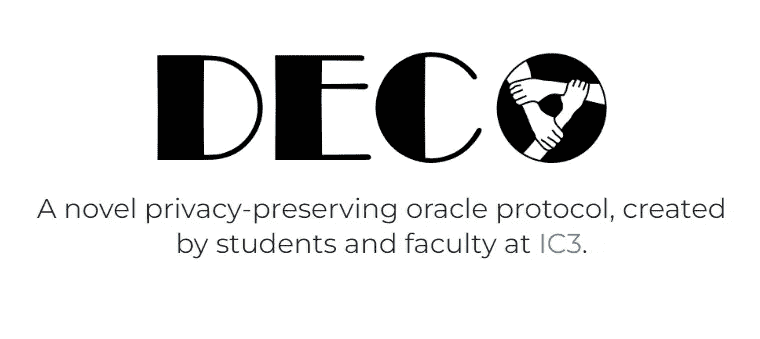
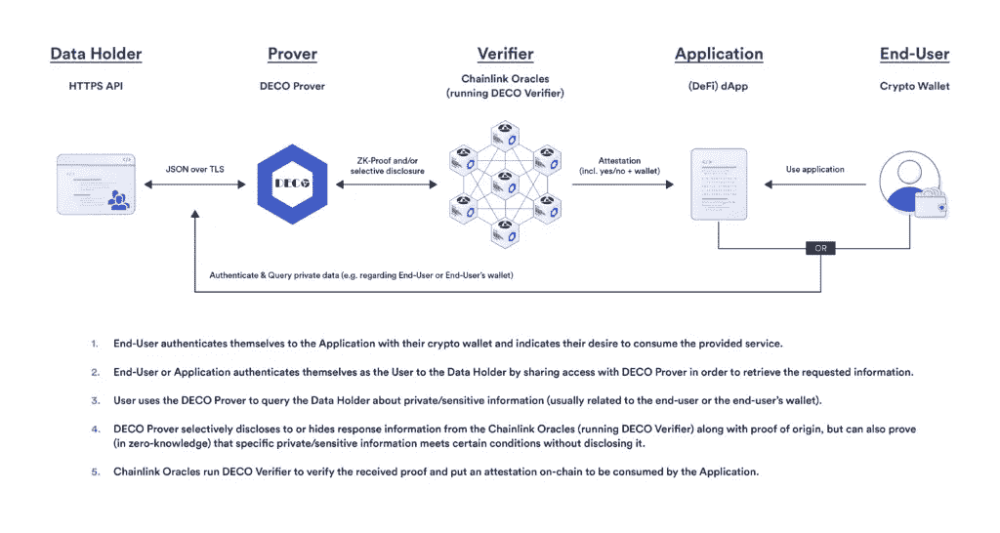

# DeFi 的抵押不足贷款

> 原文：<https://medium.com/coinmonks/undercollateralized-lending-at-defi-f1b6978eeac?source=collection_archive---------4----------------------->

任何金融体系的基础之一是有能力借出和借入资产。一方面，这对于需要获得营运资本的借款人来说是至关重要的，另一方面，对于贷款人来说，这也是至关重要的，因为他们将能够使他们的闲置资本盈利。

在区块链的贷款金融市场，借款人必须提供价值高于贷款价值的抵押品。例如，借款人需要存入 1000 美元的比特币来借 500 美元的 USDC。这被称为超额抵押，它确保如果借款人拖欠债务，抵押品可以出售，为贷款人收回资金。

过度抵押贷款的不利之处在于，贷款的资本效率不高，限制了市场增长。抵押不足的贷款协议可以获取可靠的信誉信息，以确定借款人的风险状况，而不会泄露区块链的敏感信息。由于技术的进步，如 [DECO](https://www.deco.works/) ，一种通过使用[零知识证明](https://coinmarketcap.com/alexandria/glossary/zero-knowledge-proof) (ZKP)来保护隐私的甲骨文协议，目前正在开发中，这是可能的。

> **为什么抵押不足的贷款？**

与过度抵押贷款是标准的 DeFi 不同，在传统金融中，贷款通常抵押不足，甚至没有完全抵押。DeFi 中抵押不足的贷款将允许更多的经济价值进入生态系统。这是因为用户可以从分散的应用程序中借款，通过智能合约降低交易对手风险。当从中央平台(如银行)借款时，用户依赖于中介，中介将根据他们的信用记录确定他们是否有资格获得贷款。使用 DeFi，用户不依赖于中介，这是一个很大的优势。

> **抵押不足的贷款面临哪些挑战？**

抵押不足的贷款对贷方来说风险更大，因为借款人的抵押品不足以支付全部贷款。这意味着贷款人必须对借款人偿还贷款的能力有信心。为了确保他们不会失去他们的钱，贷款人必须弄清楚哪些借款人是安全的，哪些是不安全的。

为了有一个无担保贷款市场，贷款人需要知道借款人是否有可能偿还贷款。他们通过查看借款人的信誉来做到这一点，信誉是衡量他们偿还贷款能力的指标。信用度数据可以包括信用评分、银行账户余额和支付历史等内容。然而，这些数据通常存储在离线的传统数据库中，区块链上的应用程序无法访问这些数据库。这就是神谕(如 Chainlink)的用武之地。Oracles 是安全地从链外来源获取数据并将其带到区块链的服务。这是一个问题，因为一旦数据在区块链上发布，任何人都可以看到。DECO 之类的协议可以解决这个问题。

> **DECO，一个保护隐私并允许抵押不足的贷款的协议**

DECO 是一种技术，它允许 oracle 在不向公众或 Oracle 节点本身公开数据的情况下测试数据。这是通过使用零知识证明来实现的，这意味着用户可以保留私人信息，同时测试关于他们自己的声明的真实性。

DECO uses zero-knowledge proof to ensure that the information shared is truthful while preserving the privacy of the information.

> **德科团队**

该项目由康奈尔大学开发，其参与者包括:

*➖* [**张帆**](https://www.fanzhang.me/) **:** 是康乃尔理工大学的博士候选人。他一直致力于将区块链与链外资源(如数据、计算、人员等)联系起来。)

*➖* [**赛克里希纳迪帕克玛拉姆:**](https://sites.google.com/view/deepak-maram/home) 康乃尔理工大学二年级博士生。他的研究兴趣涉及应用密码学、区块链及其交叉。

*➖* **哈尔贾丝琳·马尔瓦伊:**哈尔贾丝琳·马尔瓦伊是康乃尔大学二年级博士生，研究方向是理论和应用密码学及其在区块链的应用。

*➖* [**史蒂文·戈德费德:**](http://stevengoldfeder.com/) 史蒂文·戈德费德是康乃尔理工大学的 IC3 博士后，他在该校从事密码学和加密货币的交叉研究。

*➖* [**阿里·朱尔斯:**](https://www.arijuels.com/) 阿里·朱尔斯是康奈尔科技大学雅各布技术学院的教授，也是康奈尔大学计算机科学系的成员。

> 总之，DECO 协议使智能合约能够以保护隐私的方式提供更强大的用例。DeFi 生态系统中抵押不足的贷款代表了一个将数百万人带入分散金融经济的机会，提供了一个将现实世界与区块链连接起来的绝佳机会，这无疑将鼓励采用。这一协议将使区块链的贷款人能够更好地决定把钱借给谁，因为他们将拥有关于信用的信息，而借款人在申请贷款时将能够保持其个人信息的私密性。

> 交易新手？试试[加密交易机器人](/coinmonks/crypto-trading-bot-c2ffce8acb2a)或者[复制交易](/coinmonks/top-10-crypto-copy-trading-platforms-for-beginners-d0c37c7d698c)