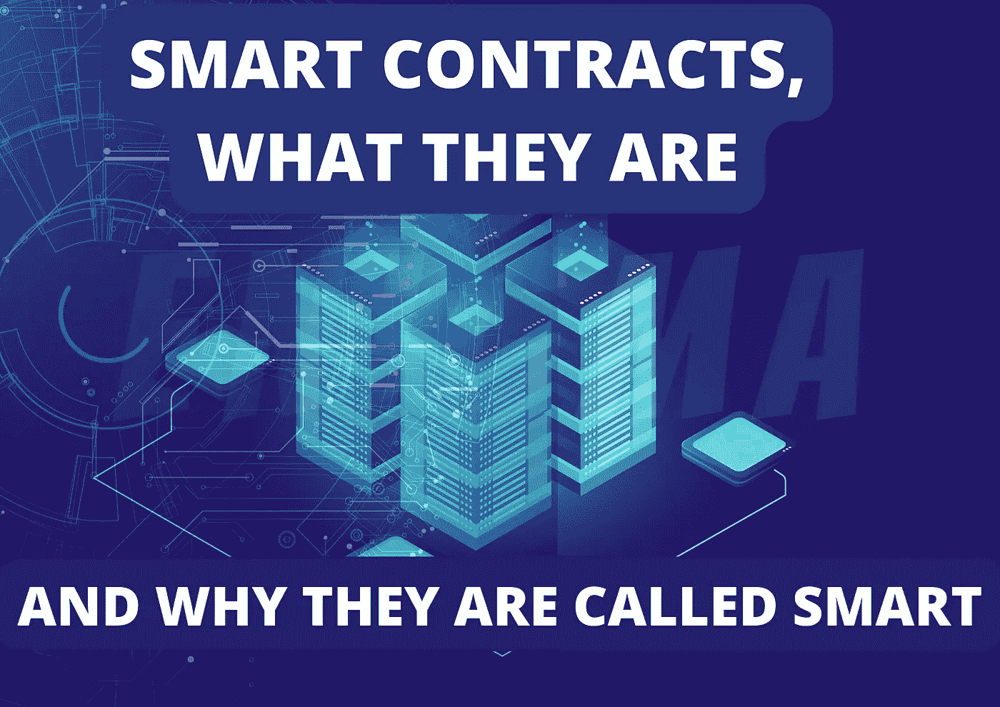
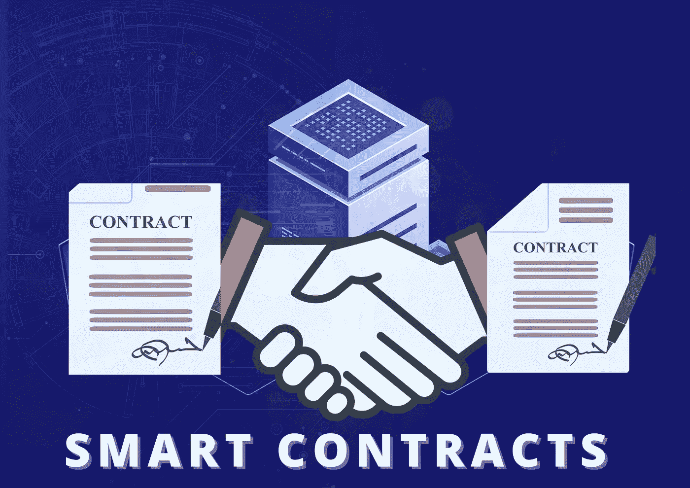
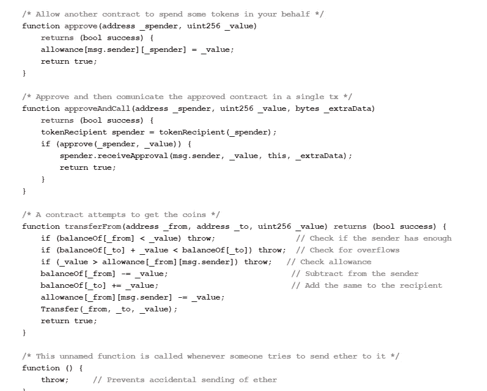

# 了解什么是智能合约，为什么叫智能合约！

> 原文：<https://medium.com/coinmonks/understand-what-smart-contracts-are-and-why-they-are-called-smart-9125c0cd6db9?source=collection_archive---------24----------------------->

智能合约的智能在哪里？

好吧，假设你想从网上的卖家那里买一块好看的手表，但是你太害怕了，不敢在网上付钱给这个不认识的卖家，可能是因为故事或者个人经历。但是这个卖家也不太信任你，在你付钱之前不会把手表寄给你。这是智能合同解决的主要问题。

智能合约是在满足创建者设置的条件时运行的程序集。这些操作可能包括向相关方发放资金、注册产品、发送通知或签发票据。当交易完成时，区块链被更新。这意味着交易不能被更改，只有被授权查看结果的人才能看到结果。

可以使用这些代码读取和更新区块链分类账中的数据。业务逻辑可以使用智能合同转换成可执行程序，所有区块链网络参与者都可以同意并验证该程序。各方之间交换的资产的定义是业务逻辑的一部分。它还包括进行交易所必需的条款和条件。通过将这些法规转换为区块链上的代码，企业可以实现业务运营、审计以及大量人工处理和文书工作的自动化。

> 交易新手？试试[加密交易机器人](/coinmonks/crypto-trading-bot-c2ffce8acb2a)或者[复制交易](/coinmonks/top-10-crypto-copy-trading-platforms-for-beginners-d0c37c7d698c)

**到底为什么叫“聪明”？**

它们之所以聪明，是因为当条件满足时，计算机会做要求它做的事情。智能合约遵循简单的 if、else 和 then 语句，这些语句被写入区块链的代码中。在一个智能合同中，可以有尽可能多的规定，以使参与者满意地完成任务。为了制定条款，参与者必须确定交易及其数据在区块链上的表示方式，就管理这些交易的“如果/当…那么…”规则达成一致，探索所有可能的例外情况，并定义解决争议的框架。

然后，智能合同可以由开发人员进行编程，尽管越来越多的使用区块链的企业提供模板、web 界面和其他在线工具来简化智能合同的结构。

区块链网络中的每个节点都将检查交易，以确保卖家发出了发货请求，客户进行了付款。在此之前，双方都将受到合同的约束。

如果网络确定这两个要求都得到满足，货物就被自动发送给买方，而卖方不需要中间人就可以从他的账户中收到钱。如果没有收到其他货物，客户将立即获得退款。

考虑另一个场景，汽车经销商、保险公司和政府机构的网络决定利用区块链来监控车辆所有权。对于所有要加入网络的汽车，智能合同可以要求它们拥有当前注册和车辆识别号。智能合同规定，当汽车被出售时，这笔钱必须由第三方保管，直到汽车的新主人在适当的机构对其进行登记。当新的注册完成并且新的所有者被记录时，钱被自动发送。

第三方托管只是一种法律安排，其中第三方代表交易的主要当事人接受和支付资金或财产，并根据这些当事人制定的条款进行支付。

**速度、效率和精度**

如果条件得到满足，合同将立即执行。智能合同是数字化和自动化的，因此不需要完成文书工作，也不需要浪费时间来纠正手动填写文档时经常出现的错误。

**透明度和可靠性**

由于没有第三方参与，参与者交换交易的加密记录，因此无需担心信息因个人利益而被更改。

## 安全性

因为区块链的交易记录是加密的，所以极难破解。此外，黑客需要改变整个链，以改变分布式分类账中的单个记录，因为每个记录都链接到它之前和之后的记录。

## 储蓄

智能合约消除了中间商进行交易的需要，从而减少了他们的时间延误和费用。

# 智能合同的优势

1.独立性ˌ自立性

智能合约完全消除了其他方影响协议的危险，因为没有经纪人或其他中间人。智能合约还可以节省资金，因为在交易中没有中介。

2.备份

区块链上的每份文件都要复制几次，因此在数据丢失的情况下，总能找到原件。

3.智能合同中采用了安全加密技术来防止篡改所有文档。

4.速度

智能合同使用计算机协议自动执行任务，减少了完成各种业务流程所需的时间。

# 智能合同的局限性

1.难以改变

改变智能合约的工作方式几乎是不可能的，修复编码错误可能既费时又费钱。

2.潜在的漏洞

诚信的理念是指双方公平交易，避免从合同中获取不道德的利益。然而，在利用智能合同时，很难保证条款得到遵守。

3.第三方

即使智能合约旨在消除第三方，这也是不可能的。与他们在传统合同中扮演的角色不同，第三方承担了新的责任。例如，律师不需要起草单独的合同，但是开发人员在为智能合同编写程序时仍然需要他们理解这些条件。

**智能合同中使用的语言**

每种智能合同语言的优势都是不同的。有趣的是，该列表还包含一种有重大承诺但没有正式发布的语言。关键是在选择创建智能合同的编程语言时，要考虑到自己的喜好，同时使用最适合这项工作的工具。

除了相当大的开发社区的帮助，Solidity 还提供了大量初学者友好的教程和文档。另一方面，Vyper 提供了简单易懂的可读性。最重要的是，Python 程序员可以开始用 Vyper 这种很有前途的语言编写智能合约。虽然 DAML 演示了如何处理分布式系统的复杂性，但 Yul 提供了函数式和简单的低级语言的优势。JavaScript 保证了智能合同解决方案的增强的可用性，并且是在创建智能合同中支持职责的好选择。

# 智能合同代码是什么样子的

sources —[**BItcoinist**](https://bitcoinist.com/confideal-brings-smart-contracts-mainstream-business-world/)

有了这么多好处，选择一种单一的智能合约编程语言可能会很有挑战性。认为任何编程语言都是创建智能合约的最佳解决方案也是荒谬的。

关注我的[T3 推特 T5](https://twitter.com/Soy_Enigma)