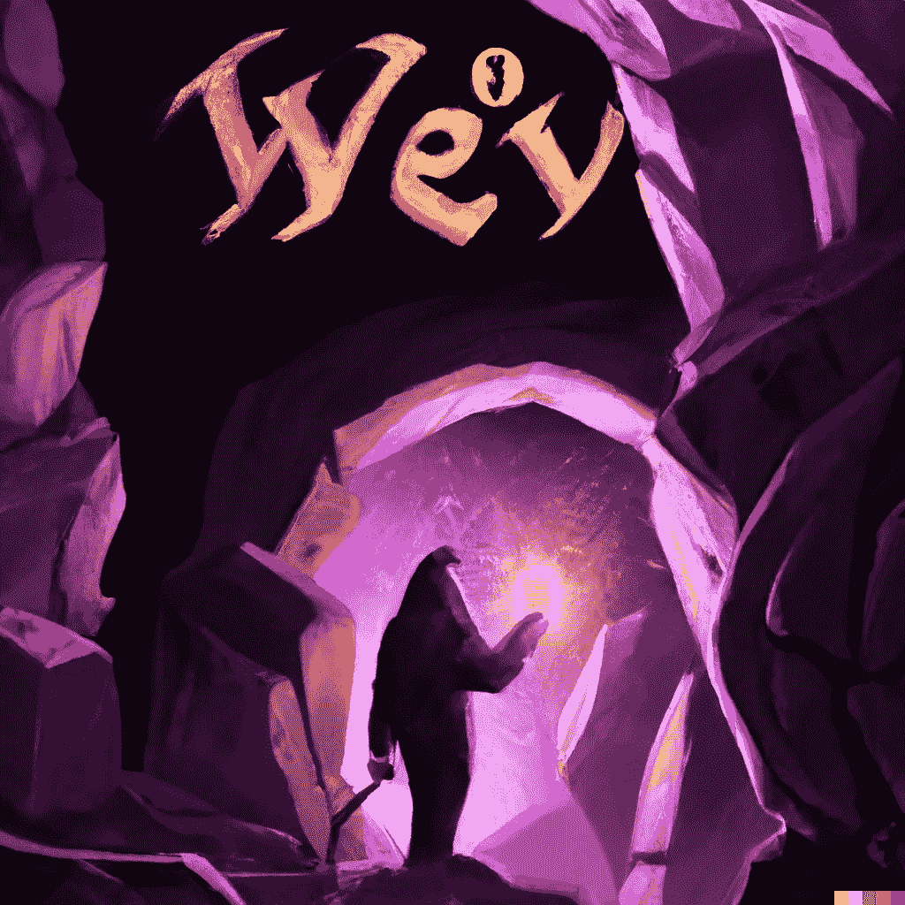
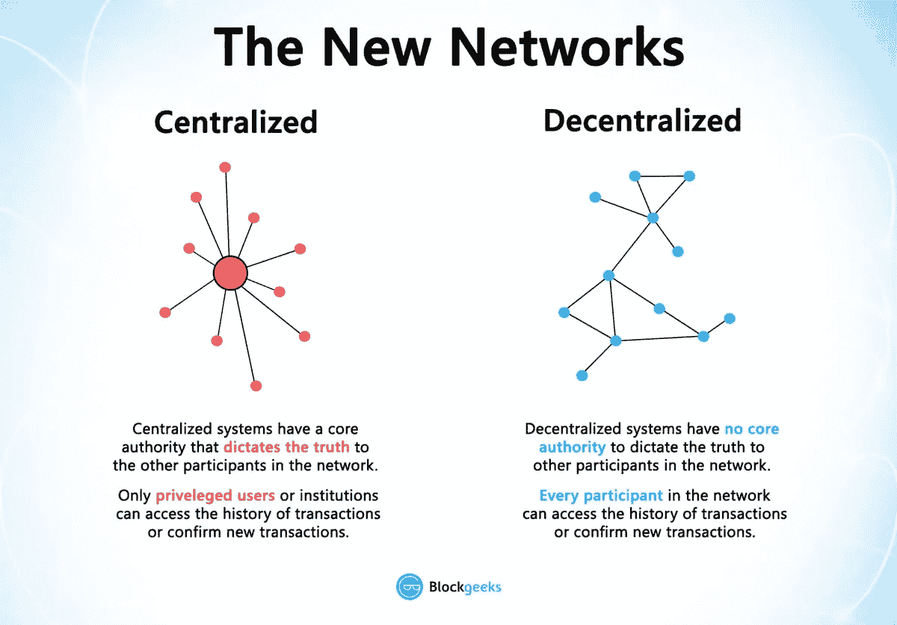
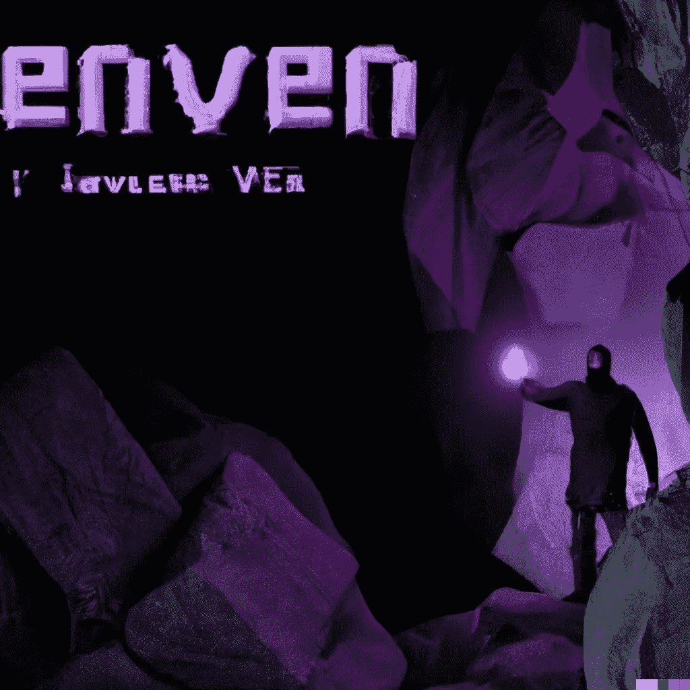

# 用简单的术语理解区块链:Web3 简介🚀

> 原文：<https://medium.com/coinmonks/understanding-blockchain-in-simple-terms-a-short-introduction-to-web3-91fd9081017f?source=collection_archive---------10----------------------->

你好。我叫 Elias，我最初为我的表弟写了这篇文章。他想了解区块链技术，但不知道如何着手。

听到关于密码的消息可能会让人不知所措:投机、巨大的碳足迹、庞氏骗局和其他形式的坏消息。我们的大脑很快就会饱和。由此，很容易将 web3 归类为骗局或泡沫，然后继续前进。但在大肆宣传的背后，隐藏着一个由充满动力和激情的建设者组成的世界，他们正朝着一个去中心化和开放的未来努力👷 🏗。

我将试着为你提供几个主题的一些基础知识，并给你指出我几个月来发现的一些很酷的资源。

Discovering a new world

# 用通俗易懂的语言解释概念(警告:过于简单化)

1.  **区块链(有时缩写为‘链’):**

一组计算机(所谓的“节点”)，全部通过互联网连接在一起。他们都持有一个账本的副本(~数据库)。这包括:跟踪用户、账户余额和应用程序([智能合同](https://www.notion.so/onboarding-to-crypto-b97fc44c0dae4d5cba1a1ceda2aa41dc))。人们通过与其他用户或智能合约进行交易来修改这个分类账:向某人支付一些以太币或比特币，或者购买 NFT 等等。

然后，该交易将被添加到区块链的当前状态中，并在网络中的所有计算机中注册。

新事务被添加到块中。块只是存储事务列表的容器。“区块链”一词指的是一个接一个地添加积木的想法，久而久之。因此块是线性排序的。

How a blockchain works, [https://munkschool.utoronto.ca/](https://munkschool.utoronto.ca/)

例如，块 1129 可能保存事务:“马克发送爱丽丝 10 以太”。后来，块 12820239 已经“爱丽丝用 10 以太买了一个 NFT”。

酷注:区块链是基于分散的系统。

Blockgeeks, Decentralised networks

> TL；DR:区块链是由一个接一个链接起来的块(一组事务)组成的。保持区块链“在线”的实体是节点(运行区块链软件的计算机)。区块链的用户有一个私钥(他们的密码)、一个地址(他们的用户名)和一个硬币余额(他们的钱)。

**2。共识，或者说如何在所有节点之间保持单一的真相来源。**

由于区块链的分散性质，节点需要同意一些共同的真理。他们通过所谓的*共识*达成一致。看看下面的视频[*证明了什么？！加密货币的 13 种不同共识算法概述！，*通过 Coinsider"](https://www.youtube.com/watch?v=ah94PuwR1DI) 了解那些。

> TL；博士:区块链被保存在网上，由全世界的计算机进行验证。为了让这些计算机同步并接受共同的现实，它们执行共识。它本质上接近民主投票选举代表，除了在我们的情况下，他们选举一个共享的现实。在最普遍的共识形式——利害关系证明中，节点投票评估一组交易是否正确。

**3。智能合同。它们只是程序💅**

智能合约本质上是部署在区块链上的应用程序(用某种编程语言编写的代码)。它们最初被命名为智能合约，因为它们能够在收到钱后自动执行某项操作。这为合同的自动执行开辟了道路。有人称之为*可编程货币*。

但它真的只是一个程序。一个游戏的逻辑，任何东西。唯一的限制是区块链的存储价格。

> TL；大卫:只是一个应用程序。当明智地使用时，可以是非常强大的(一个无许可的，分散的和全球可用的后端)🧙‍♀️.

**4。天然气:运行全球共享基础设施的成本💸**

天然气是支付你要求网络为你做的计算的方式。当你在脸书上发布图片时，你不一定会看到它，但你是在把图片上传到他们的服务器上。然后脸书会显示给任何访问你个人资料页面的人。这种存储花了他们一些钱，但他们通过卖给你一些广告(以及更多)来收回。

对于区块链来说，由于没有人真正“拥有”网络，一些计算机将为用户存储、计算交易和执行应用程序逻辑。这些操作耗费所谓的“气”。气体本质上是概念上的计算机燃料。这意味着用户为任务付费，所以不要过度使用它们。

示例:我想给我的好友 Greg 发送 1 乙醚，这将花费我 0.00075593 乙醚。这些费用中的一部分将作为计算(电力、正常运行时间、运行软件等)的报酬支付给运行网络的计算机。).注意，任何人都可以运行一个节点(使用正确的计算机)。

短暂的停顿来看看比特币是如何工作的:

How does bitcoin actually work? By 3Brown1Blue

这个创作者，3Brown1Blue，真的很酷，可以考虑看看他的视频💫。
区块链安全的一个加分项:[*256 位安全有多安全？*](https://www.youtube.com/watch?v=S9JGmA5_unY)

**5。钱包，您的数字加密货币储值工具**

web3 钱包就像现实生活中的钱包，你可以在里面存放货币(代币、以太币、比特币等。)或 NFTs(艺术等。).它们通过一个私钥(~一个密码)链接到你。

您的钱包可以通过区块链上代表您公共身份的地址(相当于您的电子邮件地址)公开访问。有人可能会用你的公钥直接把钱打到你的钱包里(有点像给一个邮箱发邮件)。

> ️️️P️lease remember:️从不与任何人分享你的私人钥匙⚠️

注意:钱包依赖于非对称加密。如果你想深入了解:考虑阅读 web3 中的[非对称加密。](https://hackernoon.com/asymmetric-cryptography-in-blockchains-d1a4c1654a71)

我花了一段时间才理解 web3 钱包的这些要点，所以我在这里与你分享:

*   创建钱包时，会随机生成一个 256 位的私钥。
*   密码短语(对应于您的 256 位私钥)可让您完全访问您的钱包。任何有你私人钥匙的人都可以完全控制你的资产。一些钱包将启用多因素认证(MFA)、电子邮件保护等。

> TL；DR:钱包相当于你在 web3 中的银行账户:它们储存了你所有的资本:密码、非功能性金融工具等等。它们是特定于链的。你的比特币钱包不一定与以太坊钱包相连。

Discovering blockchain and cryptic concepts

深潜科目:

*   那里有最好的开发者路线图:【https://www.devpill.me/ 
*   熟悉密码艺术: [Opensea](https://opensea.io/learn) ，NFT 第一平台。
*   安装一个酷钱包:[https://www.argent.xyz/](https://www.argent.xyz/)
*   探索 https://decentraland.org/的元宇宙，从这里开始探索:[https://oncyber.io/](https://oncyber.io/)或这里

谢谢你的时间👏！祝你过得愉快，如果你想聊聊天或者关注一下，可以到 https://twitter.com/ETazou[找我。](https://twitter.com/ETazou)

Post Scriptum:小心投资机会/交易广告。加密交易风险很大，不可掉以轻心。

> 交易新手？尝试[加密交易机器人](/coinmonks/crypto-trading-bot-c2ffce8acb2a)或[复制交易](/coinmonks/top-10-crypto-copy-trading-platforms-for-beginners-d0c37c7d698c)