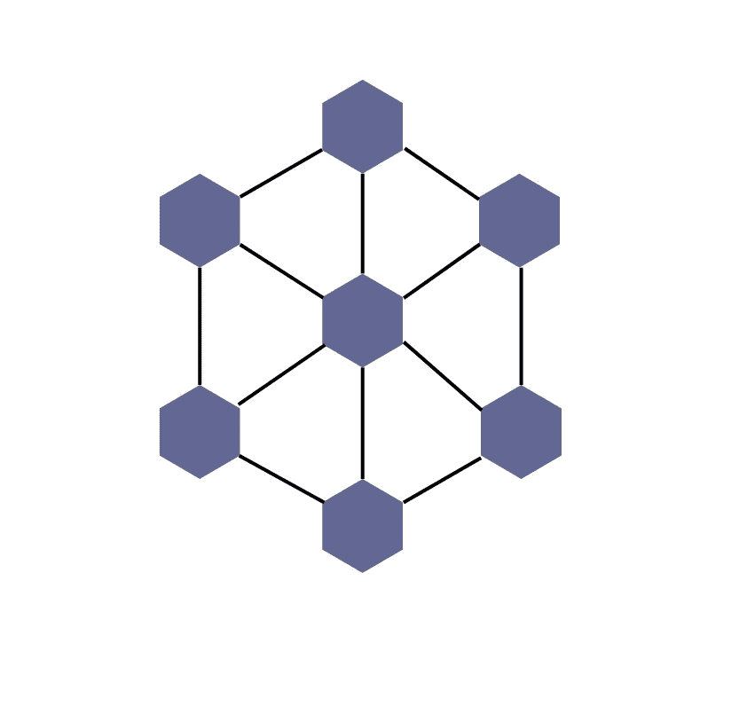
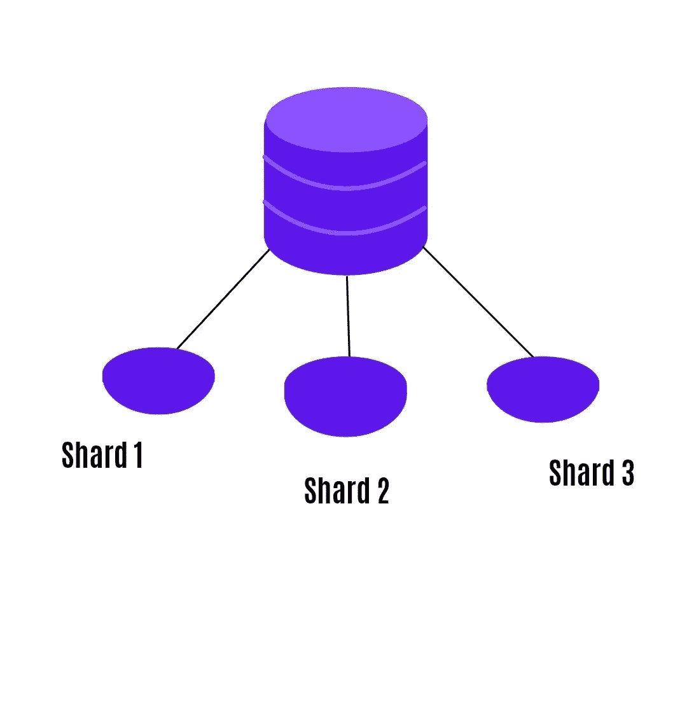
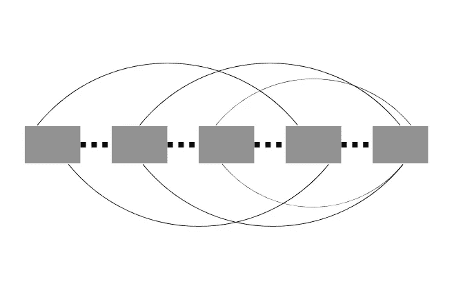

# 了解区块链可扩展性困境和解决方案

> 原文：<https://medium.com/coinmonks/understanding-blockchain-scalability-trilemma-and-solutions-a5a4e68e656b?source=collection_archive---------23----------------------->

区块链技术的受欢迎程度最近一直在稳步上升。随着最近区块链受欢迎程度的提高，这种受欢迎程度也将影响区块链技术的功能也就不足为奇了。其中一个问题是可伸缩性。因此，很好地理解这个概念将使您了解为什么加密领域的大多数讨论和研究都围绕可伸缩性。

## 什么是可伸缩性？

可伸缩性不仅仅是区块链的概念。相反，它是一个宽泛的短语，指的是一个系统或组织在工作量增加的情况下表现得和以前一样好或比以前更好的能力。在区块链技术中，可扩展性是指网络在短时间内处理大量交易的能力。可伸缩性只是速度的一个花哨的词。由于区块链的可伸缩性在区块链能否被广泛采用的问题上起着至关重要的作用，所以它被认为是至关重要的
今天大多数企业都使用信用卡进行交易。原因是大多数信用卡的吞吐量高于比特币。
信用卡公司 Visa 声称其吞吐量为 2400 TPS。尽管大多数人认为 24000 TPS 的可能性是一个神话，而是坚持一个更小的数字，但人们可以同意 Visa 比比特币更快。比特币的交易吞吐量约为 7TPS，吞吐率仍低于 Visa。
企业将会发现使用吞吐量仅为 7 TPS 的比特币进行交易具有挑战性。如果一家公司决定使用比特币进行交易，然后拥有大量的客户，比特币的交易速度会阻止客户拥有无缝、快捷的交易体验。如果交易出现延误，这些公司将不可避免地亏损。为了尽量减少网络拥塞造成的问题，许多企业会选择 Visa。

## 可伸缩性三元悖论

当中本聪发布比特币白皮书时，他提出了一个基于点对点系统的去中心化区块链。除了权力下放，区块链还被设计成高度安全。比特币使用工作证明算法来达成共识，工作证明共识将去中心化和安全性置于速度之上。随着使用的增加，人们意识到除了分散化和安全性，区块链技术还需要速度才能蓬勃发展。每个比特币区块的大小为 1MB，这意味着一次只能进行有限数量的交易。由于块大小很小，比特币每秒只能处理大约 7 笔交易。这意味着比特币选择路径 C，因此，它将安全性和去中心化置于可扩展性之上。区块链的理想属性是去中心化、安全性和可伸缩性。区块链技术的问题在于，尽管这三个特征都是必不可少的，但没有一个区块链能同时具备所有这些特征。这种现象被称为区块链三难现象。
可伸缩性三难困境是这样的，区块链要变得可伸缩，就必须牺牲三难困境三角中的一个基本特性。因此，区块链可以是可伸缩的和安全的，也可以是可伸缩的和分散的。
存在有待解决的问题。因此，为了找到区块链可扩展性问题的持久解决方案，并超越比特币，大多数区块链优先考虑可扩展性，而不是去中心化，大多数人认为去中心化是区块链技术的心脏。
虽然大多数区块链可以选择变得可扩展和分散，但这种组合并不常见。缺乏足够的安全意味着区块链的毁灭，并消除了信任的基本要素。

## 当前可扩展性解决方案

区块链可扩展性解决方案主要有两层，分别是

**第一层解决方案**

第一层可扩展性解决方案是指直接对区块链架构进行的更改。这些解决方案包括

**1。分片**

在分片中，数据库分区技术用于将大型数据库分割成较小的部分，这些较小的数据库分片称为逻辑分片。这些逻辑碎片存储在单独的服务器中，这样，区块链的事务压力就减轻了。借助分片技术，网络可以在短时间内处理数千笔交易。分片通过将主网络划分为更小的对等网络来确保各种事务同时执行。对等分片方法确保网络中的每个节点不会处理全部事务。相反，每个较小的节点将处理事务的一部分。分片确保在实现可扩展性的同时维护网络的分散性和安全性。以太坊 2.0 计划使用分片技术，并将使用利益证明而不是工作共识证明。Zilliqa 是另一个使用分片技术的第一层区块链。Zilliqa 声称，利用这项技术，网络可以处理超过 2600 TPS。Elastico 是另一个使用分片技术的区块链。这是第一个利用这项技术的区块链。

**2。更大的块**
块的大小在可以执行的事务数量中起着重要作用。由于块大小只有 1MB，比特币注定会有局限性。因此，为了增加吞吐量，网络必须增加区块链的大小。这种现象的两个主要实现是:

**比特币现金**
2017 年，比特币社区在比特币块大小、可扩展性以及交易费用成本等问题上出现分歧后，一分为二。一些开发人员认为，比特币可扩展性的问题可以通过增加块大小来更好地处理，因此从比特币中分离出来，形成块大小约为 8MB 的比特币现金。随后，块大小增加到 32MB。

**隔离见证(SegWit)**
隔离见证是 2017 年对比特币协议的升级。隔离见证是一个软叉，是 2017 年比特币可扩展性辩论的产物。
隔离见证的工作原理是通过将一个交易分成两个部分来降低一个块的交易权重。这将增加在相同大小的块上可以执行的事务量。

**3。另类共识机制**
比特币的共识机制就是管用的证明。工作证明共识有一个高能耗的问题，据说一个比特币交易可以消耗超过 700 千瓦时的能源，足以为 4 个美国家庭供电。工作一致性证明不仅消耗过多的能量，而且吞吐量低，交易费用昂贵。为了提高速度，一些区块链协议选择了替代共识，其中一些包括利害关系证明、委托利害关系证明、实用拜占庭容错、权威证明等。

**4。达格**

DAG 代表有向无环图，是一个主要用于计算机科学的术语。有向无环图是指具有确定方向的图，其中不包含有向圆。
应用于区块链时，DAG 结构是顶点和边的形式，而不是块。然后，图中的几个顶点连接到前面的顶点。这种结构不是像传统区块链模型中那样以链的形式出现，而是以树的形式出现，交易从一个分支到另一个分支。就像在传统的区块链模型中一样，交易也通过节点提交给 DAG
DAG 技术可以有效地存储数据，并确保交易处理的速度。DAG 事务的速度是因为一个以上的事务可以同时执行，因为一个事务不必在新的事务开始之前完成。

**第二层解决方案**
第二层区块链是建立在第一层区块链之上的可互操作的区块链。

**1。侧链**
侧链是连接到主区块链的独立区块链。侧链通常通过双向 peg 连接到主区块链。主链和侧链之间的连接使得它们可以互操作，但是侧链对它们自身的安全性负责。侧链允许资产在主链和侧链之间转移，以缓解主链的拥堵。
现在存在的侧链例子有

**液态网:**这是一个连接比特币区块链的侧链。灵动网络旨在解决比特币区块链的可扩展性和交易费用高的问题。液体侧链能够每分钟添加一个液体块，这是每十分钟添加一个比特币块的显著进步。通过这种方式，灵动网络解决了比特币区块链的拥堵问题。
**血浆:**血浆是连接到以太坊区块链的侧链。等离子体侧链可以执行自己的事务，并具有自己的块验证机制。血浆侧链的设计允许通过使用智能合同和 Merkle 树在主链上创建许多“子链”。
虽然等离子网络在链外执行交易，但是这些交易是在以太坊执行层结算的。这确保了子链可以享受以太坊区块链提供的安全性，尽管程度有限。通过这样做，等离子体链可以有效地减少主链上的工作量，从而允许更快的交易。

**2。支付渠道**
支付渠道类似于侧链，交易在主链之外进行。支付通道的工作原理是为两个交易方之间的交易开通一个双向通道。
支付通道通过一种机制工作，其中只有两个交易，第一个和最后一个，发生在主区块链上。智能合约和融资的创建打开了渠道，这是第一笔交易。回收资金关闭了通道，是最后一笔交易。中间的所有其他交易都将在主链之外进行。这样，在主链上结算的事务更少，从而实现了可伸缩性。
支付渠道允许交易双方之间的资金转移，但所有交易不得超过最初存入的资金。照明网络是支付渠道的一个很好的例子。

**3。交叉链**
交叉链技术涉及不同区块链的连接。这些区块链虽然独立，但可以互操作，从而形成一个广泛的区块链网络。这些区块链的连接和互操作性使它们实现可伸缩性成为可能。
Cosmos 是采用交叉链技术的网络的一个很好的例子。宇宙，作为一个网络，包括各种独立的区块链被称为区。Cosmos 网络上的众多互操作区域使其具有高度的可扩展性。

**4。Rollups**
Rollups 是最值得期待的区块链扩展解决方案。它被认为是一个非常安全的扩展选项，预计可以将以太坊网络上的事务处理速度提高 4800 TPS。
汇总利用称为排序器的第三方。定序器负责计算第二层区块链上的事务，然后将计算出的事务压缩成批，然后发布回第一层区块链。
上滚利用主区块链提供的安全性。由于计算发生在主链之外，汇总确保主链不那么拥挤，从而确保可伸缩性。有两种类型的 roll up
**乐观 roll up:**乐观 roll up 的工作逻辑是假设所有从第二层发送回主区块链的事务都是有效的。这是一种在证明有罪之前假定无罪的情况。
在无效交易的情况下，则采用争议解决的概念。如果交易被证明是欺诈性的，那么验证器可以针对该交易提供防欺诈证明，之后交易被重新执行，但这一次是在主区块链上。

**ZK 汇总:** ZK 代表零知识，与乐观汇总的工作方式相反。ZK 汇总通过使用有效性证明来提供交易有效的直接证据。
在 ZK 汇总中，通过使用 Zk-SNARK(零知识简洁的非交互式知识论证)来证明事务的有效性。Zk-SNARK 是一种加密证明，它从数学上证明交易是有效的。

## 结论

可伸缩性三元悖论只是一种假设。最近的可扩展性研究和解决方案表明，区块链网络具备理想区块链的所有三个特征是可行的。
大量研究仍在进行，区块链行业仍在发展。因此，预计旨在解决区块链业务中的基本问题(如可扩展性)的更好的解决方案将最终出现。

> 交易新手？试试[加密交易机器人](/coinmonks/crypto-trading-bot-c2ffce8acb2a)或者[复制交易](/coinmonks/top-10-crypto-copy-trading-platforms-for-beginners-d0c37c7d698c)