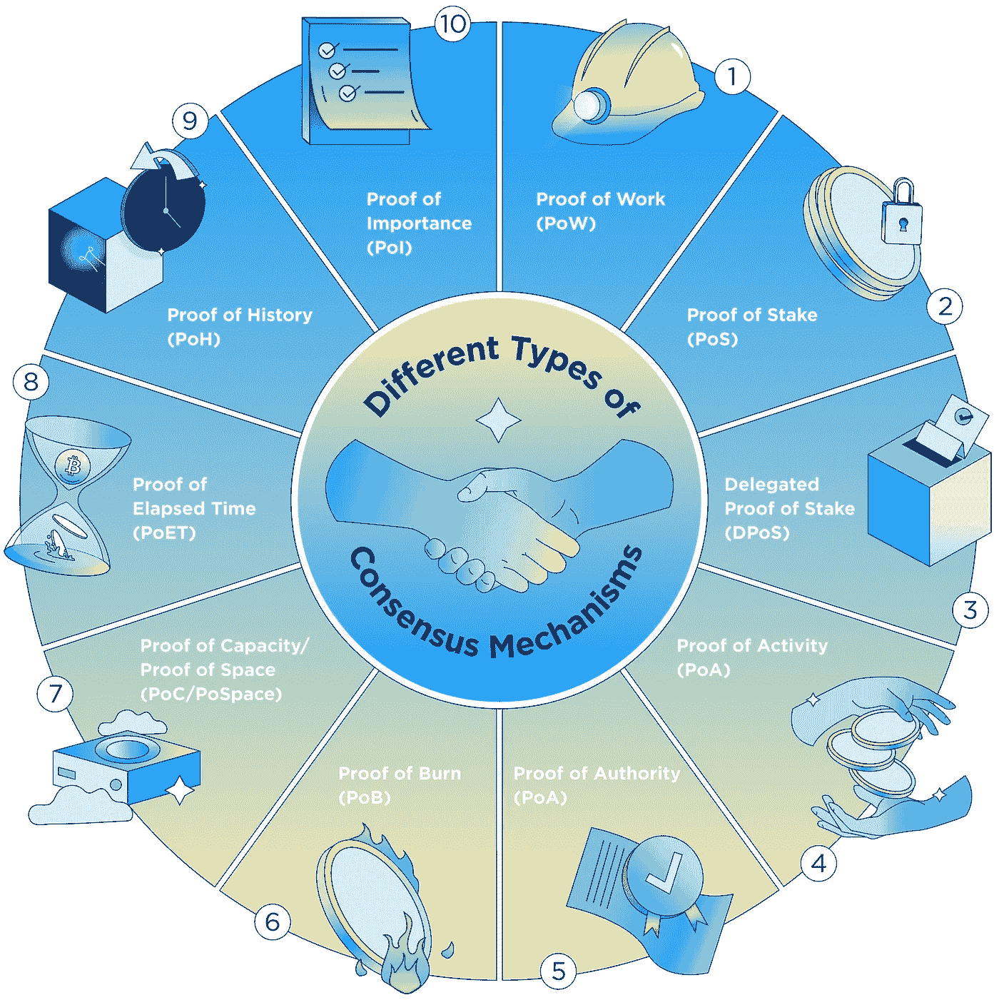

# 理解共识机制

> 原文：<https://medium.com/coinmonks/understanding-consensus-mechanisms-8ddfbbc6b75e?source=collection_archive---------29----------------------->

*Photo by* [*Miguel Á. Padriñán*](https://www.pexels.com/photo/photo-of-golden-cogwheel-on-black-background-3785929/)

**什么是共识？**

C 区块链科技中的共识是指利益相关者就特定事项达成的普遍共识。在区块链，共识是至关重要的，因为它不像传统的数据库或系统，在那里有一个中央机构来决定和批准事项。在一个公共的区块链，每个利益相关者都做出了贡献，必须有一个在链条上取得进展的普遍协议。

例如，当至少 2/3 或 66%的节点同意网络的状态时，以太坊区块链达到一致。

**什么是共识机制？**

共识机制是区块链就区块链现状达成协议的过程。区块链的当前状态需要哪个节点提交的块将被添加到链中，这导致在该过程中收集奖励和铸造新的硬币或代币。这也有助于维护区块链的安全。

共识机制通常是协议、算法和方法的形式，便于在链上达成共识。这些系统有助于确定链上各方提交的交易的真实性。

**为什么共识机制**

共识机制对区块链技术极其重要。它决定了如何确认和存储交易、网络费用、交易速度和区块链的其他功能。

共识机制也是必不可少的，因为它们作为一套规则，有助于保护网络免受不良行为者的活动——双重支出问题。

共识机制解决了这一问题，使各方提出新的确认交易变得困难和无利可图。与此同时，它激励诚实的一方提出阻止真正的块，这些块将被确认接收块奖励。

**共识机制的类型**

有各种类型的共识机制，它们基于区块链和它们的应用而不同。它们也因能源使用、安全性和速度的不同而不同。这里有一份由 Crypto.com 编辑的关于一些最常见的共识机制的概述。

1.  工作证明(PoW): 工作证明是比特币的创造者中本聪为其设计的共识机制。这是创建的第一个共识机制。
    在战俘模式中，矿工们竞相核实交易。他们使用专门为解决数学方程而设计的计算设备(通常是 GPU 和 ASICs)来快速验证加密交易，并保留区块链上先前确认的交易记录。这些等式是随机的，矿工利用他们设备的计算能力工作，有可能获得区块奖励。该过程使得防止网络上的潜在攻击(51%的攻击)变得困难。然而，这意味着需要更强大的计算机才有机会赢得奖励。这成为新矿商的进入壁垒，可能会导致集中化并限制可扩展性。
    PoW 通常被认为是所有共识机制中最可靠和最安全的。区块链目前使用的 PoW 包括比特币(BTC)、比特币现金(BCH)、Dogecoin(多格)、莱特币(LTC)、Monero (XMR)、以太坊经典(ETC)等。
2.  **利益证明(PoS):** 利益证明是一种共识机制，在这种机制中，开采和安全性由网络中利益最高的参与者决定。这个概念是由 Sunny King 和 Scott Nadal 在 2012 年为 PPCoin 撰写的白皮书中提出的。在 PoS 模型中，计算机使用交易费来决定哪一方验证下一个区块并获得奖励。
    参与者需要下注特定数量的代币，才有机会被随机选中以创建新的区块并验证新的转换。拥有更大股份的团体——持有更大数量的代币——有更大的机会被选中验证该区块。这背后的想法是，拥有更高利益的各方更有可能为整个链条的利益而行动，因为如果链条被操纵和崩溃，他们往往损失最大。然而，这种概念倾向于创建一种付费模式，其中具有较高利害关系的节点比具有较低利害关系的节点更有可能被挑选来验证交易。
    PoS 最近变得越来越受欢迎，因为它比 PoW 模式有更大的优势，如更快的交易、更低的准入门槛和更低的能耗。采用 PoS 模式的区块链有 Cardano(阿达)、algrand(ALGO)、Cosmos(原子)、币安 Coin (BNB)、Ethereum(以太)、Solana(溶胶)等。
3.  **委托利益证明(DPoS):** 委托利益证明(DPoS)是利益证明(PoS)共识机制的变体。DPoS 由 Dan Larimer 于 2013 年引入，并在他的项目 BitShares 中使用。该模型使用基于声誉的投票系统来达成共识。在这个模型中，代币持有者投票选择区块生产者或见证人来代表他们保护网络。
    用户将他们的代币加入赌注池进行投票。然后根据每个选民的股份大小对选票进行加权。成功验证街区并获得奖励的当选街区制作人或见证人将与投票支持他们的所有人分享奖励。这个过程是连续的，见证人需要保持良好的声誉，否则他们可以被用户投票选出的另一个见证人取代。这有助于确保证人始终保持诚实，从而维护区块链的完整性。df
    区块链使用 dpo 的例子包括 EOS、BitShares (BTS)、TRON 等。
4.  **活性证明(PoA):** 活性证明(PoA)是 PoW 和 PoS 共识机制的混合。在这个模型中，有挖掘器和验证器。就像在 PoW 中一样，矿工们竞相用大量的计算能力来解决随机的数学问题。一旦区块被开采，系统就切换到 PoS 模型。成功生成的块在网络上发布。然后随机选择一组验证者来认可散列，从而验证新块。就像在 PoS 中一样，验证器持有的令牌数量越多，被选中的机会就越大。块奖励通常在挖掘者和验证者之间共享。
    PoA 寻求结合 PoW 和 PoS 的优点，避免它们的缺点。DCR 的 Decred 和区块链的 Espers 是区块链使用 PoA 的例子。
5.  **授权证明(PoA):** 授权证明(PoA)是一种主要由私有区块链使用的共识机制。它还使用了一个基于信誉的共识机制，验证者用他们的信誉来验证块。这通常涉及到暴露验证者的身份，这在区块链是不会发生的。这种一致性机制不需要任何计算能力来运行，这使得它比 PoW 和 PoS 模型成本更低。对这一机制的一个主要关切是，它损害了权力下放，因为只有少数政党能够参与保障区块链的安全。VeChain (VET)和 Hyperledger Fabric 是使用 PoA 的区块链的示例。
6.  **燃烧证明(PoB):** 燃烧证明(PoB)是一种共识机制，矿工通过燃烧其令牌的预定部分获得开采区块的权利。这包括将这些令牌发送到一个无法恢复的“用户地址”。矿工烧的代币越多，被任意选中开采区块的几率就越大。
    代币一旦被烧毁，就无法挽回了。这意味着矿工需要在短期内失去财富，以获得创造新区块的终身权利，从而激励矿工承诺长期保护产业链。焚烧代币的行为减少了代币的流通供应，从而降低了通货膨胀，提振了需求。
    使用燃烧证明(PoB)共识机制的加密货币包括 Slimcoin (SLM)、Counterparty (XCP)和 Factom (FCT)。
7.  **容量证明(PoC) /空间证明(PoS):** 容量证明(PoC)或空间证明(PoS)是一种共识机制，根据矿工硬盘存储空间的空间量或容量授予挖掘或验证权限。Dziembowski 等人
    于 2013 年提出了这一概念。在概念验证中，矿工需要预先计算(“绘制”)功率函数，并将其存储在硬盘上。矿工的储物空间越大，可能的解决方案就越多。具有更高解决方案的矿工有更高的机会拥有正确的散列组合并赢得奖励。然后，矿工需要将数据存储在他们的硬盘空间中。
    PoC 不需要重型专业设备，这降低了个人加入网络的门槛。[时空证明](https://coinmarketcap.com/alexandria/glossary/proof-of-spacetime)和[复制证明](https://coinmarketcap.com/alexandria/glossary/proof-of-replication)是 PoC
    的变体，这种机制主要由提供分散存储服务的加密货币项目使用。这样区块链包括希格诺(SIGNA)——以前的 Burstcoin (BURST)、Storj (STORJ)、Chia (XCH)、Filecoin (FIL)、Arweave (AR)等。
8.  **经过时间证明(PoET):** 经过时间证明(PoET)是一种共识机制，使用基于时间抽签的共识算法。该模型为网络中的每个节点随机分配不同的等待时间 t。在等待期间，每个节点都是不活动的，直到轮到它被授予采矿权。该方法确保所有节点都有同等的可能性被选择来接收采矿权，这促进了网络中的公平性。
    PoET 被认为是高效的，需要的资源较少，可扩展性强。使用 PoET 的区块链的一个例子是 Hyperledger 的锯齿波。
9.  **历史证明(PoH):** 历史证明(PoH)是一种共识机制，提供历史事件的证明。PoH 使用时间戳来构建区块链，验证事务之间的时间流逝，而不需要依赖其他节点。js
    这种方法是由 SHA-256 顺序散列可验证延迟函数(VDF)实现的。它获取事务的输出，并将其用作下一个散列的输入，这有助于各方看到事务发生的顺序。由于
    vdf 只需要一个 CPU 内核来执行，这降低了区块链所需的处理能力。这反过来大大提高了可扩展性和能效。PoH 目前只被 Solana 使用，它还有待大规模测试。
10.  **重要性证明(PoI):** 重要性证明(PoI)是一种共识机制，最初由 NEM 发起。这种机制在一个称为“收获”的过程中，根据某个标准选择节点是否有资格向区块链添加块。该过程考虑节点对区块链的整体重要性。诸如包括最近 30 天的交易数量和规模、既得货币量和网络活动的因素被用于确定节点的重要性。分数越高，节点被选择来 harvet 下一个块并接收交易费的机会就越高。NEM 区块链是目前唯一采用 PoI 的酒店。

目前还有其他共识机制在使用，有些仍在开发中，有些则是现有共识机制的变体。其中包括:拜占庭容错(BFT)、实用拜占庭容错(PBFT)、联邦拜占庭协议(FBA)、委托拜占庭容错(DBFT)、可信证明(PoBLV)、投入证明(PoD)、声誉证明(PoR)、重量证明(PoWe)等。

**结论**

T 共识机制的多种类型和变化显示了区块链行业的持续创新水平，以开发可扩展、高能效和促进分散化的共识机制。

由于区块链基于令牌的性质以及节点和利益相关者的行为而变化，因此可能不会有普遍的共识机制。选择共识机制的决定通常由链上的节点决定，这举例说明了公共区块链和传统集中式系统之间的主要差异。这种情况的主要缺点是利益相关者在公共区块链达成共识需要时间。

最终，随着区块链的不断发展，我们将会看到更多类型和变化的共识机制。

**来源和进一步阅读**

1.  什么是共识机制？—余额
2.  [区块链中的共识机制:初学者指南](https://crypto.com/university/consensus-mechanisms-in-blockchain)
3.  [什么是共识机制？— Coindesk](https://www.coindesk.com/learn/what-is-a-consensus-mechanism/)
4.  [共识机制](https://ethereum.org/en/developers/docs/consensus-mechanisms/)
5.  [密码共识方法:你需要知道的一切！！](https://www.youtube.com/watch?v=9J1ttTzkwL8&ab_channel=CoinBureau)
6.  [工作证明 vs .利害关系证明:初学者指南！！](https://www.youtube.com/watch?v=08vnE2_cAeQ&ab_channel=CoinBureau)
7.  [利害关系证明与工作证明:利弊和差异解释](https://cointelegraph.com/blockchain-for-beginners/proof-of-stake-vs-proof-of-work:-differences-explained)
8.  [授权证明与利害关系证明:解释主要差异](https://cointelegraph.com/blockchain-for-beginners/proof-of-authority-vs-proof-of-stake-key-differences-explained)
9.  [区块链中的共识算法](https://www.geeksforgeeks.org/consensus-algorithms-in-blockchain/)
10.  [迈向绿色区块链:共识机制及其能耗综述](https://eprints.bournemouth.ac.uk/36968/1/GREEN_BLOCKCHAIN.pdf)

> 交易新手？试试[加密交易机器人](/coinmonks/crypto-trading-bot-c2ffce8acb2a)或者[复制交易](/coinmonks/top-10-crypto-copy-trading-platforms-for-beginners-d0c37c7d698c)