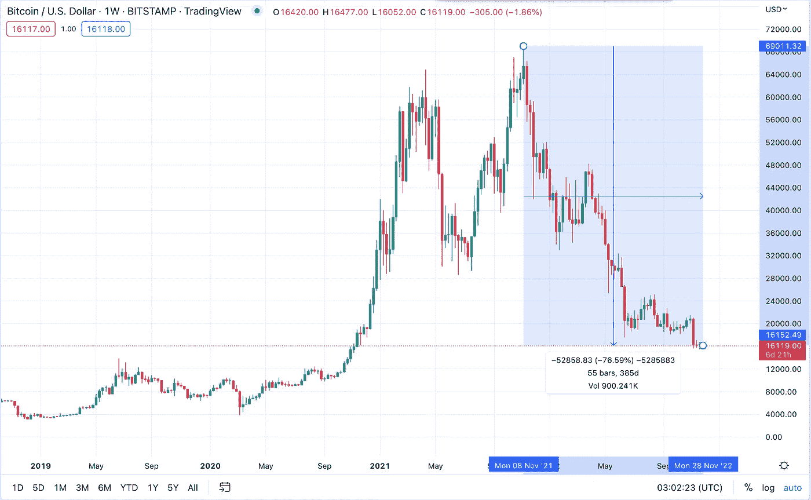
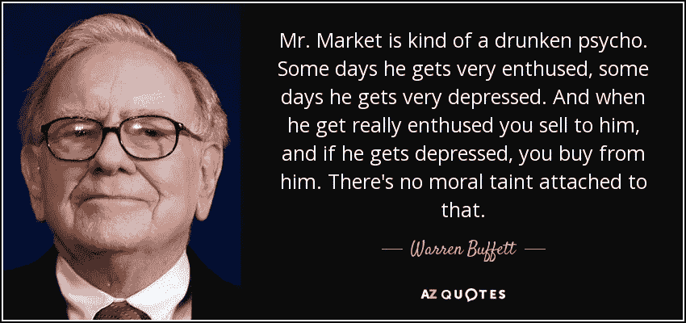

# 了解加密市场周期

> 原文：<https://medium.com/coinmonks/understanding-crypto-market-cycles-2d6946c077b3?source=collection_archive---------6----------------------->

尽管世界在不断变化，但随着时间的推移，人性往往会保持不变。这就是为什么研究历史对投资者来说是一个有价值的工具。市场是人类行为的反映，往往遵循一定的模式，通常表现为兴奋期和沮丧期。通过回顾过去，我们可以洞察当前的市场周期，并对我们的投资做出明智的决策。

> 从顶级交易者那里复制交易机器人。免费试用。

就加密货币而言，市场已经经历了几个周期，包括目前持续了很长时间的“加密冬天”。为了理解我们的立场并做出战略决策，将我们自己从强烈的情绪中抽离出来并鸟瞰形势是很重要的。研究比特币的历史可以作为理解整个加密市场周期的代理，比特币是一种拥有大量可用数据的加密货币。

为了增加你在下一轮牛市中获得可观回报的机会，熟悉过去市场周期的基础知识是至关重要的。这可以通过阅读和学习过去几个周期的主要趋势和模式来实现。由于加密货币相对较新，可供分析的数据最多的是比特币。所以让我们跳进去看看。

# 基础知识:加密货币市场周期的四个阶段

BTC Market Cycle through 2017–2018

## 积累阶段→上升阶段→分配阶段→下降阶段→积累阶段

加密货币市场遵循一个可预测的阶段循环，包括积累阶段、上涨阶段(也称为牛市)、发行阶段和下跌阶段(也称为熊市)。了解这些阶段可以帮助投资者做出明智的投资决策。

## 积累阶段

积累阶段在下跌阶段之后开始，此时市场已经触底，聪明的投资者开始买入，因为他们认为大部分下跌已经发生。这一阶段的特点是低调炒作，通常以“逢低买入”为标志。新投资者，尤其是散户投资者，很少在积累阶段进入市场，因为加密货币往往具有负面情绪，经常受到主流媒体的批评。

## 上涨阶段(牛市)

积累阶段之后是上涨阶段，或称牛市，其特点是价格大幅上涨。在这个阶段，情绪转向乐观的前景，害怕错过(FOMO)开始影响许多投资者，尤其是新投资者。随着更多的人进入市场，交易量增加，价格继续上涨。

## 分发阶段

分销阶段紧随筹备阶段，其特点是买卖双方的平衡发生变化，卖方开始超过买方。这导致了价格的缓慢下跌和复杂的情绪，因为一些人认为这是暂时的下跌，而另一些人认为这标志着熊市的开始。在分配阶段，投资者可能会被情绪所左右，并基于价格肯定会上涨的信念做出决定，而不是遵循逻辑分析。

在分销阶段的早期，你经常会看到价格空前高涨。在这个阶段，卖家开始超过买家。当你在发行阶段看到所有时间高点时，有时，它是单峰(2017 年的比特币)，但你也可以看到双峰或三峰(2021 年的比特币)。

此时，精明的投资者已经从多头头寸中套现，市场上的买家也比牛市初期要少。

## 下跌阶段(熊市)

下跌阶段，或称熊市，跟随在发行阶段之后，这时精明的投资者卖出了股票，大众纷纷跟进。对于缺乏经验的投资者来说，这可能是一个艰难的阶段，他们认为自己的资产价格肯定会上涨，但事实却是，价格继续下跌。不了解市场周期或认为这一次周期不同的投资者可能会在市场环境恶劣时晚卖或持有投资，这可能会降低他们的长期投资回报。不考虑市场周期和不惜一切代价的担忧会损害投资机会，降低长期投资回报率。这就是为什么适当的多样化和风险管理是长期成功的关键。

# 我们目前处于哪个阶段？

实时确定市场处于哪个阶段可能具有挑战性，但鉴于价格持续下跌，我们目前很可能正处于下跌阶段。我们也不太可能仍处于分销阶段，因为自 40，000 美元左右以来，市场人气一直很低。如果我们谈论的是黑天鹅式的底部事件——看看 FTX 就知道了。

# 让我们来看看以前的低迷时期…

## BTC 2012-2016 市场周期

## BTC 2016-2020 市场周期

## BTC 2020–2022 市场周期

回顾比特币的前几个周期，市场曾在 2013 年末(1160 美元的高点)、2017 年(19500 美元的高点)和 2021 年(69000 美元的高点)见顶。

在 2013 年的顶部之后，比特币在 413 天的时间里下跌了 86%，跌至 150 美元的低点。

继 2017 年的顶部之后，比特币在 371 天的时间里下跌了 83%，跌至 3200 美元的低点。

自 2021 年见顶以来，比特币已下跌约 76.5%，距离见顶还有 385 天。

作为比较，如果比特币在 2013 年至 2015 年期间下跌，我们的最低价格将为 9000 美元。如果比特币下跌相当于 2017-18 年的水平，低点将是 11700 美元。

# 机构反馈

最近接受调查的机构投资者大多认为，未来 12 个月，我们要么将走向下跌(持续下跌阶段)，要么将保持相对平稳和区间波动(积累阶段)。

尽管 29%的机构投资者认为加密货币市场将在未来 12 个月走低，但他们不会很快退出。

如果机构认为加密货币的价值仍将大幅下跌，而我们至少还没有接近熊市的尽头，我们将看到超过 6%的机构在未来 3 年内减少加密货币的配置。

之前的下跌并不预示着未来的下跌，但如果你想从试图高买低卖的角度来把握市场时机，在决定投入资金时，记住市场的历史是很重要的。

# 在弱手卖出后，比特币在前 2 个周期的累积和牛市阶段

## 2015 年初至 2017 年末的 BTC 积累和牛市阶段

## 2018 年末至 2021 年末的 BTC 积累和牛市阶段

# 关键要点:

1.  3 年以上→ 1 年以下
2.  收益递减

## 3 年以上→ 1 年以下

比特币的价格往往会经历 3 年的价格积累和 1 年的价格快速贬值。

这就是为什么加密货币的杠杆可以因为价格的快速下跌而消灭许多投资者(FTX 和 3AC 都是例子)。在 3AC 的案例中，如果他们只是在市场上进行现货交易，他们就不会被清算，因为投资者(如阿拉米达)“追逐了他们的头寸。”

比特币周期是 4 年跨度的原因是减半。由于这个行业是新兴的，比特币占据了 38%的市场份额，因此市场整体和比特币在很大程度上是同步发展的。

## 收益递减

在 2015 年初的低点之后，比特币的价格上涨了 11，612%(116 倍)，在 2017 年底达到了 19，500 美元的高点。在 2018 年末的下一个周期的低点，2.193%(21x)到 2021 年末的高点 69，000 美元。

与许多资产一样，随着时间的推移，比特币的市场价值越来越高，其收益也越来越小。

这不是比特币独有的，在许多不同的资产中都可以看到。随着一项资产的价值越大，就需要越多的资金流入，才能使价格累积达到以前的水平。

因此，当根据之前周期的历史预测比特币在下一轮牛市中将走多远时，人们可以做出的一个假设是，从本轮周期底部开始的价格累积可能不到 21 倍。

# 如何为加密市场周期做准备

为了最大限度地降低根据市场周期做出错误投资决策的风险，一个可靠的策略是平均成本投资，即不管市场状况如何，定期投资固定金额。这种方法可能是长期积累财富的安全方式，尤其是如果你投资的是优质资产。

然而，如果你想获得更高的回报，研究价格行为的历史并对技术分析有一个基本的了解是很重要的，这将有助于你的投资决策。虽然投资者在第一次尝试时犯错误是很常见的，但通过基于市场阶段的战略性买入和卖出，有可能超越长期买入并持有的回报。

在积累阶段，为了利用较低的价格，增加投资是有益的。在启动和分配阶段，获利并重新评估你的投资策略可能是明智的。通过遵循基于对市场趋势的透彻理解的严格方法，您可以最大限度地发挥自己在加密货币市场取得成功的潜力。

# 天鹅绒是如何？资本帮助你实现加密投资的成功

秘密投资可能很难，但不一定如此！投资者在助跑阶段进入或重新进入市场是很常见的，但通过从别人的错误中学习，你可以避免常见的陷阱，做出更明智的投资决策！耐心和纪律是关键。

在[天鹅绒。资本](https://velvet.capital/)，我们相信 DeFi 做得对。我们对 DeFi 的转型性质充满热情，并希望帮助下一个十亿用户使用加密技术。我们帮助人们创造具有额外收益的多样化加密产品—所有这些都不需要放弃对他们资产的监管！使用 Velvet.Capital 也非常容易采用平均成本策略。随着我们最近与 Transak、Magic Link 和 Wallet Connect 的集成，现在比以往任何时候都更容易开始您的加密投资之旅。

Start your DeFi investing journey today: [https://velvet.capital/](https://velvet.capital/)

只需点击几下鼠标，你就能接触到所有最好的项目。定位自己，以利用今天的下一轮牛市！

别忘了在[推特](https://twitter.com/Velvet_Capital)、[领英](https://www.linkedin.com/company/31423126/admin/)上关注我们，并加入我们的[不和](https://discord.gg/heXYgFZuGw) & [电报](https://t.me/velvetcapital)以获取更多更新！我们希望听到你的声音，不要害羞。

下次再见，
干杯！

*最初发布于*[*https://velvet . capital*](https://velvet.capital/tpost/dtuimzy0e1-understanding-crypto-market-cycles)*。*

> 加入 Coinmonks [电报频道](https://t.me/coincodecap)和 [Youtube 频道](https://www.youtube.com/c/coinmonks/videos)了解加密交易和投资

# 另外，阅读

*   [用信用卡购买密码的 10 个最佳地点](https://coincodecap.com/buy-crypto-with-credit-card)
*   [最好的卡达诺钱包](https://coincodecap.com/best-cardano-wallets) | [Bingbon 副本交易](https://coincodecap.com/bingbon-copy-trading)
*   [如何给 MetaMask 钱包添加 Arbitrum？](https://coincodecap.com/how-to-add-arbitrum-to-metamask-wallet)
*   [KuCoin vs 北海巨妖 vs BitYard](https://coincodecap.com/kucoin-vs-kraken-vs-bityard)
*   [加密交易的最佳 VPN](https://coincodecap.com/best-vpns-for-crypto-trading)