# 理解去中心化——什么造就了真正去中心化的区块链？

> 原文：<https://medium.com/coinmonks/understanding-decentralization-what-makes-a-blockchain-truly-decentralized-1aea2c1b2eb9?source=collection_archive---------8----------------------->

Source: pixabay.com

# 介绍

区块链基于去中心化的概念。分散式网络与集中式网络有很大的不同，因为分散式网络不是由一台服务器或一方负责所有数据或信息，而是在对等的基础上运行，用户的计算机直接通信和交互，而不使用中介。

目前，用户必须放弃他们的隐私，因为主要的跨国公司利用并出售我们的数据给出价最高的人，我们作为用户已经习惯了这一点。另一方面，一个完全分散的系统是实现互联网全部潜力的更好的选择。

随着 2009 年以来区块链技术的出现，一个新的互联网正在围绕去中心化的基本思想而建立和发展。

然而,“权力下放”一词在区块链部门被过度使用，用户需要认识到权力下放有不同的层次。这一点现在比以往任何时候都更加重要，因为并非所有声称去中心化的加密货币都是如此。

# 权力下放的程度

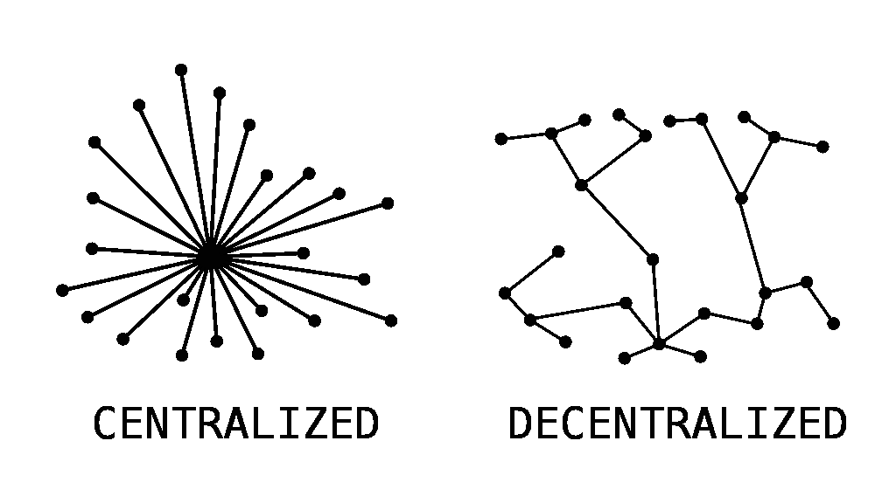

Source: commons.wikimedia.org — Kes47

去中心化是将权力从一个中心实体——无论是个人、组织还是团体——转移到分布式用户网络的过程。区块链的分权对于安全和抵制审查至关重要；否则，它将与现在的技术没有什么不同。

政府可以禁止或制裁中央集权的区块链，大型机构可以接管它们，创始人可以决定它们未来的方向和发展。

一个真正分权的区块链几乎不可能被监管、审查或关闭。

# 一级——区块链去中心化

Source: flickr

这通常是在区块链解决权力下放问题时所指的级别。由于没有集中的权力机构来管理网络，达成共识是网络用户确定交易是否有效的唯一方法。网络节点在用户之间完成这一任务，并为区块链的安全做出贡献。

因此，这种节点的数量和质量对于实现网络去中心化至关重要。

## **满节点**

完整节点是对等网络中的一台计算机，包含区块链上发生的事务和操作的完整副本。

## **验证器节点**

验证器节点是一种特殊类型的完整节点，它参与“共识”通过加入共识，验证者节点负责验证和维护交易记录。

## **案例分析:索拉纳**

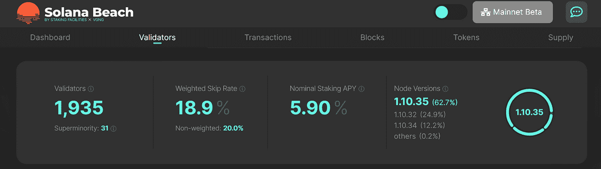

Source: solanabeach.io/validators

Solana 的区块链有超过 1900 个验证器，然而所有的交易都由一个小得多的数字处理——“超级少数”只有 31 个。这个数字代表了总共控制超过 33%股份的验证人的最小数量。这些实体理论上可以审查或停止网络，如果他们串通。

尽管有相对大量的节点，索拉纳的区块链很难是分散的，因为只有一小部分验证节点能够审查网络交易。

## **节点分布**

区块链节点有限的地理分布可能是一个令人关切的问题。更广泛的节点分布保证了如果有一个或几个政府愿意在其领土或势力范围内使用其权力，以关闭网络或制裁某些交易，它们将不得不发起一致的努力以取得成功。

## **案例分析:以太坊**

如下图所示，美国和德国占以太坊节点总数的 50%以上。

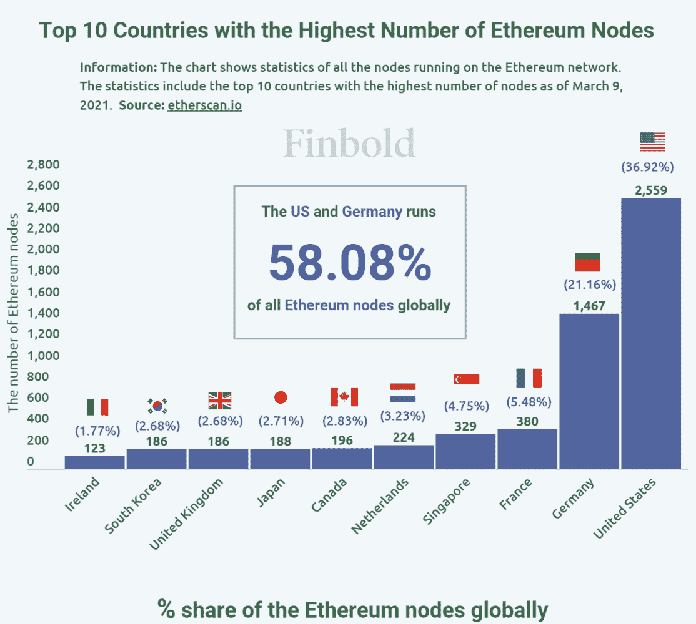

Source: finbold.com

此外，考虑下面的块验证器，其中超过 66%的信标链验证器必须遵守外国资产控制办公室(OFAC)的规定。

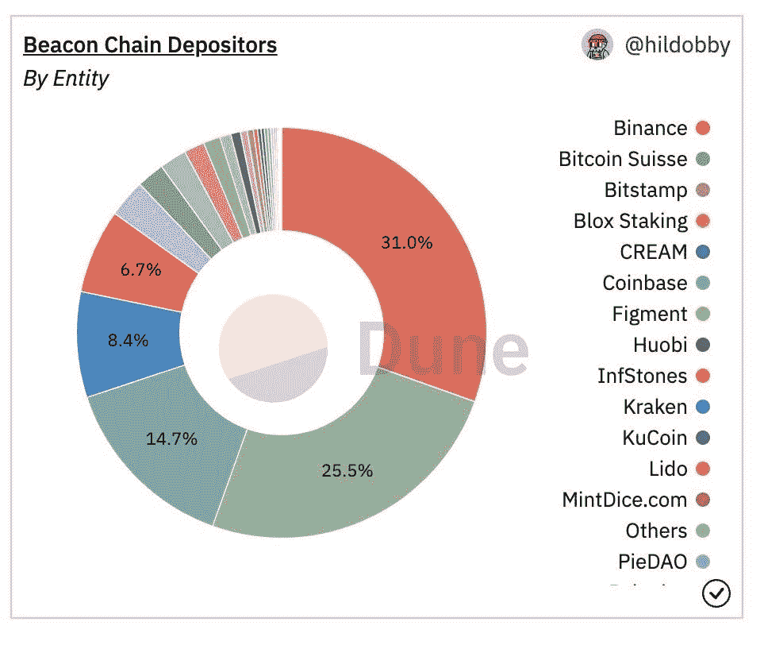

Source: dune.com

这引发了关于地理节点集中化的严重问题。如果当局强迫验证者遵守 OFAC 的制裁，以太坊可能会被迫在协议层面审查交易。不遵守 OFAC 制裁不是一个选项，特别是如果你是在美国或欧盟，这是以太坊的 PoS 验证的绝大多数。我们已经见证了 OFAC 对以太坊上一个叫做 Torando Cash 的‘去中心化协议’的制裁结果。

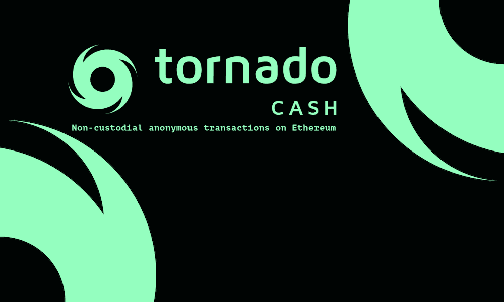

Source: twitter.com/tornadocash

8 月 8 日，广受欢迎的以太坊智能合约混合器 Tornado Cash 受到了美国财政部 OFAC 的制裁。第二天，最大的以太坊矿商以太矿(Ethermine)停止在其区块中包括 Tornado 路由器交易。考虑到以太坊当时仍在使用工作证明共识机制，现在已切换到比工作证明更容易控制和执行的利益证明，这就提出了一个问题，即以太坊的验证器是否能够摆脱监管控制。

# 第 2 级—发展

开发者级别是指创建并积极致力于开发区块链的个人或机构。开发者层面的去中心化很重要，因为这基本上避免了创始人全权决定区块链发生什么的情况。

## **案例研究:卡尔达诺**

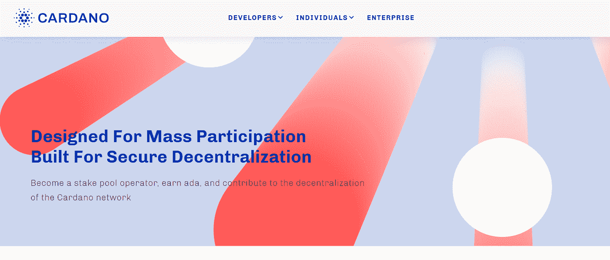

Source: cardano.org

Cardano 的首席执行官兼创始人查尔斯·霍斯金森(Charles Hoskinson)表示，Cardano 将成为世界上最分散的加密货币，比比特币分散 50 至 100 倍。

在那份声明中，霍金森提到了这样一个事实，即卡尔达诺的系统包括货币激励，以分散系统中均匀分布的股权池的数量。事实上，有超过 2500 个股份池专门负责 Cardano 网络上的区块生产，这是相当令人印象深刻的。

与 Cardano 相反，比特币的区块链主要掌握在 10 个最大的矿池手中，它们控制着网络总哈希速率的 50%以上。然而，这是一个公平的分权标准吗？

IOHK、Emurgo 和卡尔达诺基金会目前管理卡尔达诺。IOHK 进行核心科学研究和技术开发，Emurgo 专注于将业务整合到生态系统中，而 Cardano 基金会则专注于社区建设。

虽然这比单个实体控制一切要好，但它显然是集中的，因为无论有多少个赌注池，只有三个实体完全控制这些节点运行的软件。

# 第 3 级—基础设施层

基础设施是指用于与加密货币区块链交互或访问加密货币所需的不同技术。这些包括本地钱包、分散应用、节点等。

使用像 AWS 和 Google 这样的集中的歌利亚供应商，或者像 Infura 和 Alchemy 等新的供应商来驱动区块链系统会导致高度的集中。

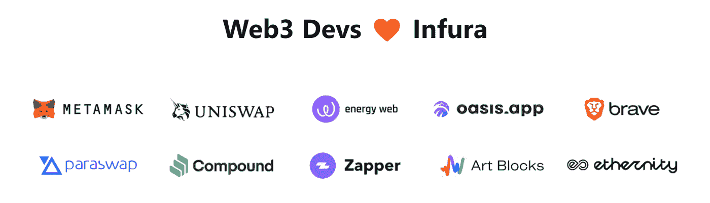

Source: infura.io

Infura 是一家 Web3 后端提供商，为区块链开发者提供一系列服务和工具，每天处理数十亿次代码请求，并为开发者提供一种无需运行完整节点即可连接以太坊的方式。

## **单点故障**

然而，Infura 依赖于亚马逊 AWS 数据中心托管的云服务器。这限制了节点的全球分布，并产生了单点故障——如果 AWS 宕机，所有依赖这些节点与区块链通信的 dApps 都会随之宕机。

回到 2021 年 12 月，亚马逊网络服务(AWS)中断迫使以太坊区块链的分散式交易所 dYdX 停止运营。

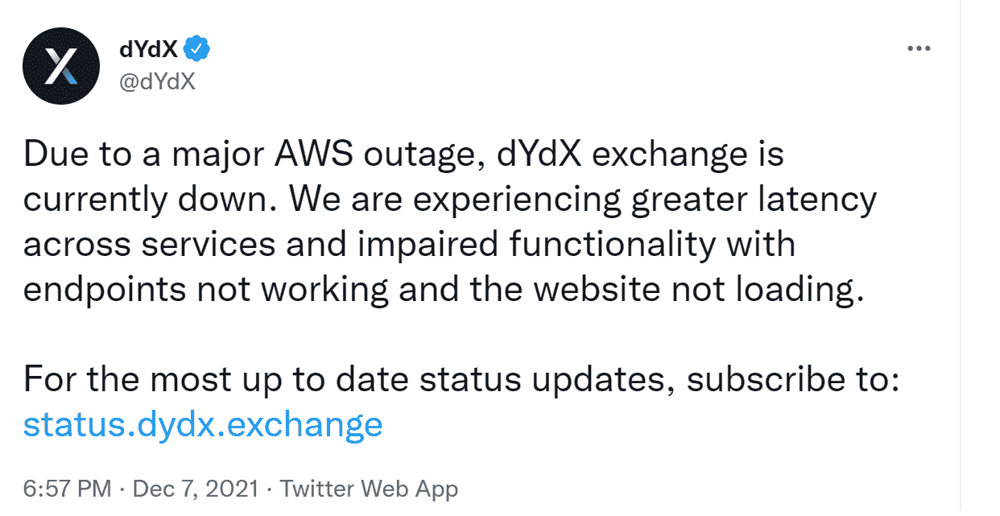

Source: twitter.com/dydx

## **审查制度**

集中式提供商可以基于位置、政府制裁或其他因素，直接或间接禁止用户使用使用其基础设施的分散式应用。

这样的案例很多。

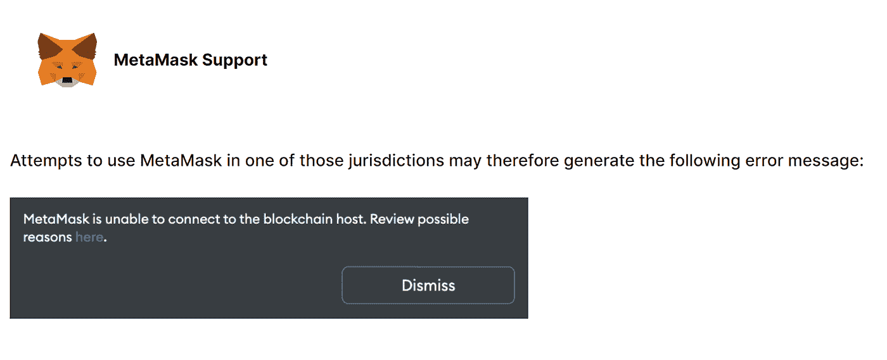

Source: metamask.io

流行的以太坊钱包 MetaMask 已经阻止了某些司法管辖区的用户访问其服务并与以太坊互动。第一例禁令是在 OpenSea 上发现的，据报道，它锁定并停用了伊朗用户的钱包。不久后，委内瑞拉用户开始报告访问自己的 MetaMask 钱包时出现问题，社交媒体上出现了数千条关于该问题的消息。

集中提供者在其服务条款中明确表示，他们必须遵守所有政府法律法规，这意味着依赖他们的 dApps 也要接受审查。

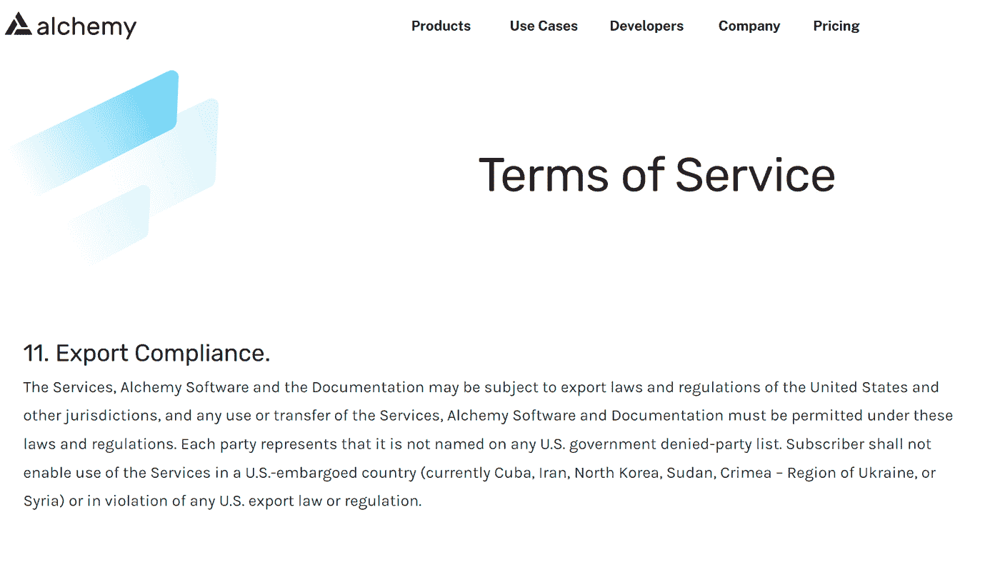

Source: alchemy.com

# 第 4 级—硬币分配

对许多区块链人来说，分散并平均分配硬币是很重要的。这是因为，对于投票支持改变区块链的硬币来说，这意味着少数硬币持有者可以轻易地垄断重大决策。

## **案例研究:波尔卡多特**

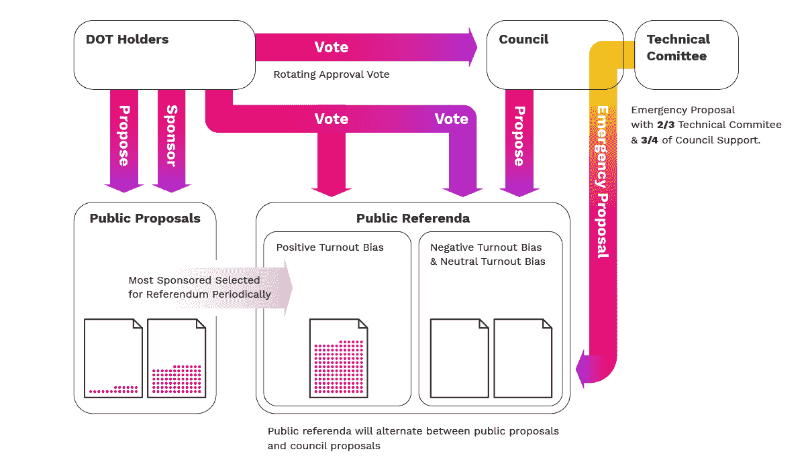

Source: polkadot.network

Polkadot 使用一种复杂的治理机制，其既定目标是确保大多数股份能够始终控制网络。DOT tokens 用于治理事务中的投票，称为全民公决。

例如，任何人都可以通过在一定时期内存放最低数量的点令牌来提议公投。如果有人同意这个提议，他们可能会存放相同数量的代币来表示支持——这种行为叫做背书。获得最高票数的提案将被选为下一轮投票的提案。

这种链上治理的系统意味着具有更大利害关系的个人/机构可以操纵投票，并将动态从用户和开发者倾斜到投资者，投资者可能只是对最大化未来利润感兴趣，而不是开发面向创新用例的协议。

2022 年 6 月，在 Polkadot Decoded 会议期间，Polkadot 核心团队承认，其当前的治理系统需要彻底改革，因为它发现它过于集中。他们表示，所谓的波尔卡多特委员会(Polkadot Council)是一个集中的行政机构，在财政支出等问题上拥有专属决策权。该团队认为，这与分权的精神背道而驰。

# 哪个是最分散的区块链？

在我们看来，不存在“更多”或“更少”权力下放的区块链。权力下放的定义很明确——权力的分配，尤其是那些与规划和决策有关的权力，远离一个中央的、权威的地点或团体。区块链要么是去中心化的，要么不是。

就目前而言，比特币仍然是当今唯一一个去中心化的区块链。考虑一下比特币在上述各个层面是如何运作的。

## 案例研究:比特币

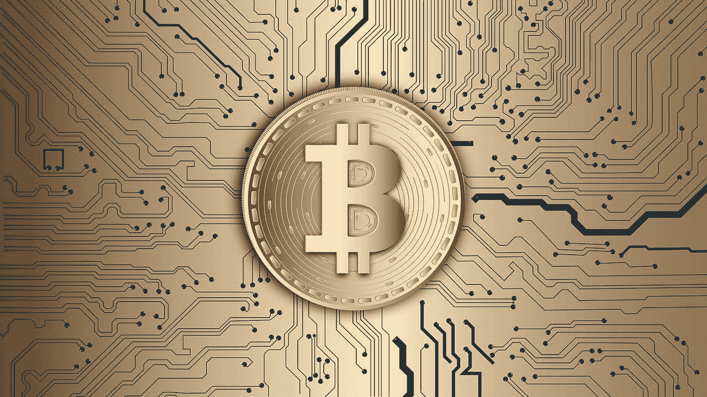

Source: pixabay.com

# 比特币的区块链

在现有的主要区块链中，比特币拥有数量最多的独立节点。这些节点在地理上分布广泛，任何人都可以在比特币的区块链上运行节点，无论是完整节点还是挖掘节点。运行一个完整的节点或甚至开采的进入门槛相当低，因为单个矿工可以简单地加入一个“采矿池”。

此外，区块选择流程利用了“Nakamoto 共识”，这是其区别于其他共识模型(如股权证明)的基本特征之一。在某些使用 pBFT(实用拜占庭容错)的 PoS 区块链中，通过投票过程选择块领导者，并在每一轮以循环方式替换。

在比特币中，没有决定区块领袖的投票过程。取而代之的是，网络中的矿工们都竞相解开这个密码难题，最先找到答案的人赢得这轮抽奖。然后，挖掘器通过网络将该块传播到其他挖掘节点，其他挖掘节点通过将该块添加到最长链中来验证和接受该块。由于该过程是随机的，并且无法预测引线，因此该过程消除了第三方对块引线的可能影响。这也称为工作验证共识机制。

# 比特币软件的开发

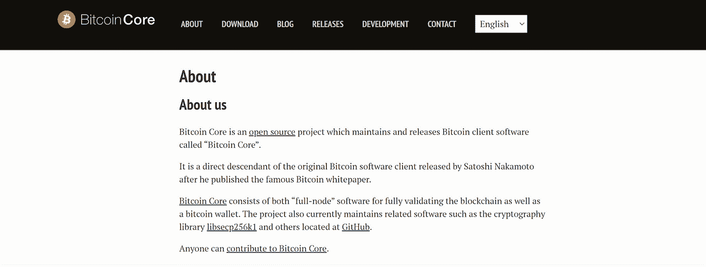

Source: bitcoincore.org

比特币也是每个节点运行的软件，以便参与网络，类似于所有其他区块链。这种软件的主要版本被称为比特币核心，它为比特币网络上的几乎所有节点提供动力，允许它们执行相同的规则并达成共识。

与其他集中的区块链开发团队不同，比特币核心开发者不是一个集中的个人群体。没有领导者指导开发人员做什么或构建什么。相反，核心开发者是独立思考者，他们选择自己希望如何为比特币做出贡献。他们来自世界各地。

在实践中，当涉及到比特币核心时，任何人都可以查看、评论或提议修改代码。虽然任何人都可以提出更改，但并不是所有提出的代码更改都集成到比特币核心中。相反，社区集中审查和讨论每一个提议的变更，然后决定接受或拒绝变更。任何人都可以参与这些讨论，而且决策是通过一致同意来达成的，而不是通过投票。

虽然有一些被称为**维护者**的个人，他们被社区信任来实际集成已经被同意的代码变更，但是这些个人几乎没有权力。这是因为，如果他们违反了信任，他们不会危及任何人的现有节点，旧的比特币核心代码可以通过忽略恶意更改轻松恢复。因此，比特币核心维护者的角色更多地被视为看门人的职能，而非权力职位。

# 比特币的基础设施

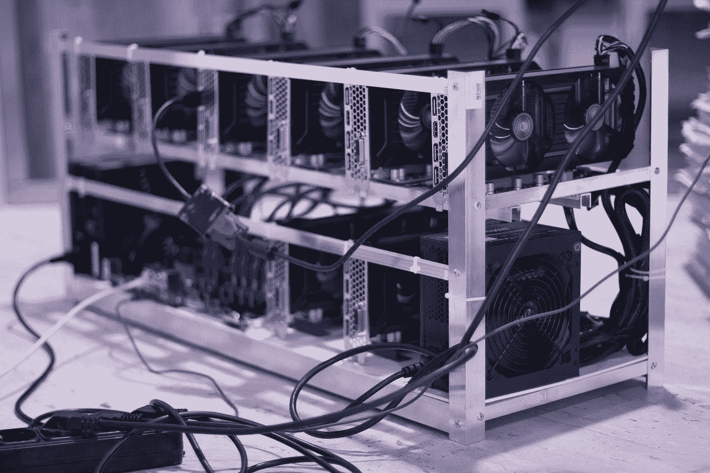

Source: pixabay.com

比特币的节点是比特币网络的底层基础设施，保护和维护比特币网络。比特币网络和比特币节点验证、广播、处理和存储 BTC 交易。由于比特币网络上没有中介或中间人来执行共识规则，节点之间必须达成共识。

## **全 BTC 节点**

当一个事务发生时，一个完整的节点拾取它。完整节点存储整个区块链历史，并可以使用比特币软件完全验证比特币网络的所有规则。完整节点根据区块链历史和比特币软件中编码的规则集检查交易的有效性。

如果事务有效，一个完整的节点会将它广播给它所连接的其他节点。这些节点经历相同的验证过程。一旦足够数量的完整节点同意该事务有效，它将被添加到未确认的其他有效事务池中。

根据比特币的设计，完整节点可以在大多数家用笔记本电脑上运行并存储完整的交易历史，甚至是一台小型单板电脑 Raspberry Pi。它们不需要中央服务器或云存储，避免了像 AWS 或 Google 这样的集中式存储提供商。

考虑以下 BTC 节点的当前分布:

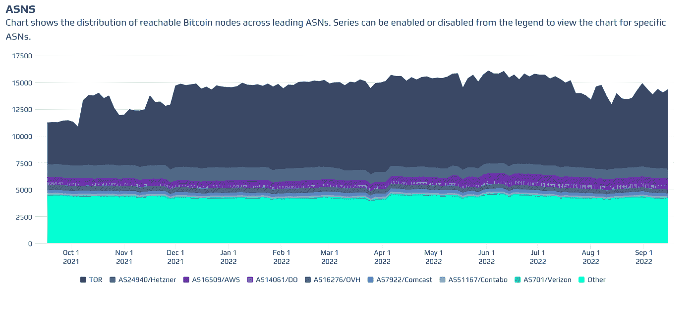

Source: bitnodes.io

数据显示，AWS 和 Hetzner 等集中式服务器仅占比特币节点存储的一小部分(分别为 4.2%和 6.5%)。绝大多数(51.7%)节点在 TOR 上匿名运行，TOR 是一个免费的开源分布式‘洋葱’网络。

## **挖掘节点**

挖掘节点从该池中选取这些未确认的事务，并将它们打包成块。

矿工运行一个版本的比特币软件，该软件包含创建和向比特币网络提交区块的特殊规则。这包括块的最大大小、如何构造事务以及如何对块进行签名。

矿工们竞相开采下一个区块。一旦一个矿工创建了一个有效的区块，它就会将提议的区块广播给比特币网络上的其他节点。

由于比特币使用工作证明 sybil 攻击机制，而不是利益证明，因此矿工必须使用专门设计的强大硬件，通过在网络上创建和提议新块来挖掘比特币。这种硬件也称为 ASIC，保存在专门的设施中。

比特币的网络非常安全，而且高度分散，因为其核心基础设施大部分是物理的和地理上分散的。

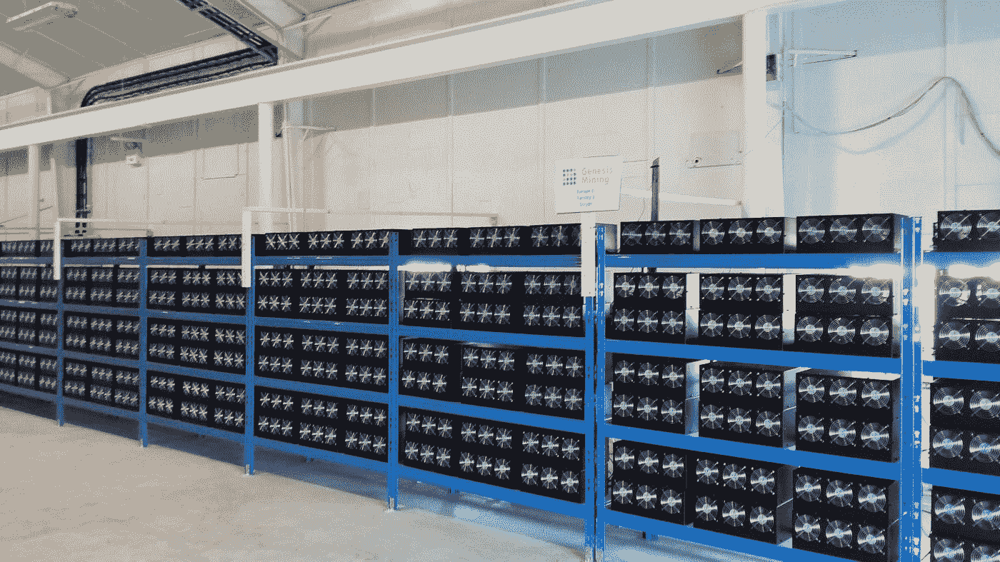

Source: wikimedia commons — Marco Krohn

节点在至少 96 个国家的地理分布如下。因为大多数节点运营商(50.51%)使用 TOR(洋葱路由器)网络，所以不知道这些用户实际上来自哪里。

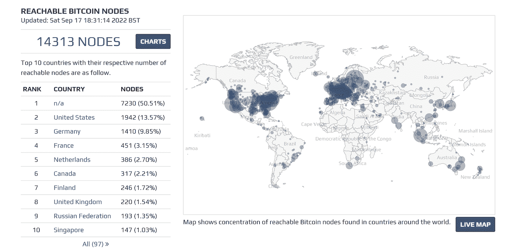

Source: bitnodes.io

# 比特币的硬币分配

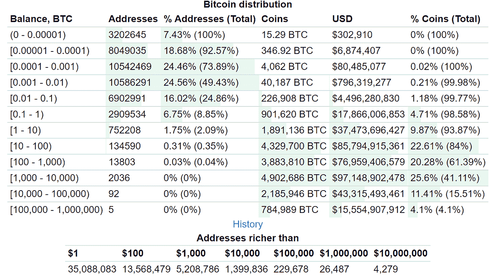

Source: bitinfocharts.com

理解比特币是一个由分散网络运行的软件很重要，这意味着没有任何一方控制软件中的规则集。这些规则必须得到网络参与者的同意，以便他们进行交易。

最根本的区别在于，决策是由完全节点间的共识来决定的，而不是通过投票。由于没有要求持有比特币才能运行一个完整的节点，因此在涉及网络控制、治理或影响力时，无论硬币分配多么不平等，都完全无关紧要。

## 矿工呢？

即使是矿工也无法控制网络。比特币的设计并没有假设采矿力量必须广泛分布。这根本不是一个要求。相反，它只是假设矿工是理性的，这是完全不同的东西。理性意味着代理人做对他们最有利的事情，即使这意味着与其他矿工合谋攻击系统。

以纽约协议为例，该协议是由 50 多家公司联合提出的一项扩展提案，到 11 月份，比特币的块大小增加了一倍。它得到了位于 22 个国家的 58 家公司的支持，拥有 83.28%的哈希能力。尽管绝大多数比特币矿工和基于比特币的公司都同意该计划，但社区本身拒绝加入，不到六个月，该协议就寿终正寝了。

## **矿工分布**

尽管根据中本聪关于比特币和“博弈论”的白皮书，比特币矿工分布不是一项要求，但全球比特币采矿地图多年来一直在发生显著变化，变得更加分散。

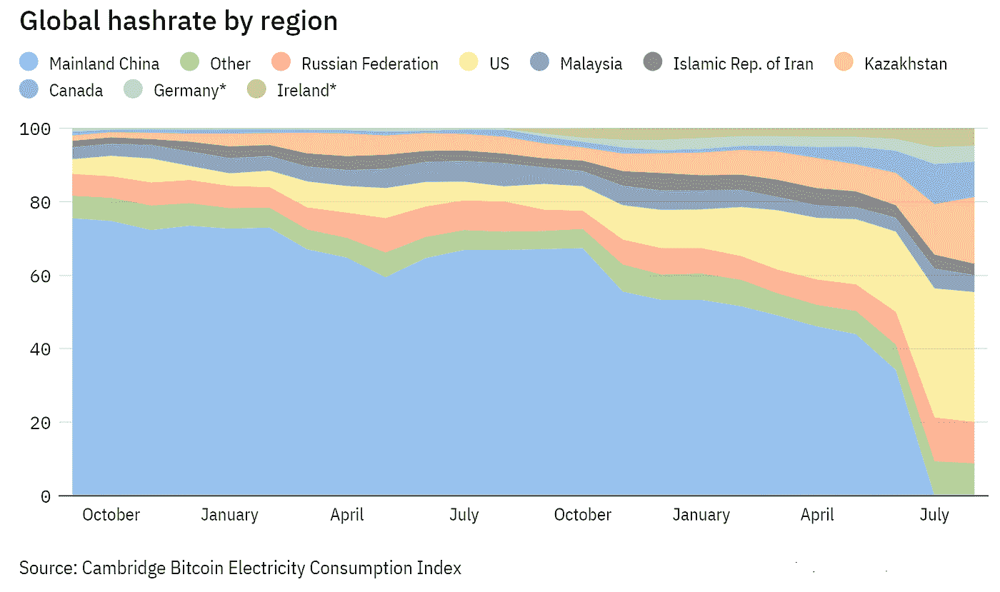

Source: investmentmonitor.ai

目前，各国领先的比特币开采及其哈希比率如下:

1.  美国:35.4%
2.  哈萨克斯坦:18.1%
3.  俄罗斯:11.23%
4.  加拿大:9.55%
5.  爱尔兰:4.68%
6.  马来西亚:4.59%
7.  德国:4.48%
8.  伊朗:3.11%

根据上面的数据，比特币挖矿在政治上和地理上是分布的。考虑到俄罗斯和伊朗等国家打算使用加密货币进行跨境交易，而且这些国家的主要采矿场都是由与政府关系密切的实体经营的，这里存在重大的政治影响。

另一方面，像美国、加拿大、德国这样的国家不想冒险错过比特币和整个加密行业可能带来的潜在经济机会。

# 摘要

在区块链权力下放问题上，不能有任何妥协。围绕 Tornado Cash 制裁的争议和一名开发者的被捕，以及其他分散式应用被迫禁止特定管辖区的用户访问，可能会导致政府向许多区块链的验证者施压，要求他们自己成为制裁者。

除此之外，最近 SEC 的律师在其针对 crypto YouTuber Ian Balina 的法庭文件中提出了前所未有的主张，即以太坊交易应被视为源自美国，尽管区块链具有分散的性质。证券交易委员会主席 Gary Gensler 也表示，为集合投资者创造新硬币的股权证明区块链，具有类似投资合同的属性，可以将其纳入其机构的权限范围。

基于以上所述，比特币仍然是现存的唯一去中心化的区块链。如果一个区块链有一个创始人、首席执行官、首席财务官、首席合规官、中央开发团队、财政部、首次发行硬币或基金会，它就不是分散的。这是一家提供区块链服务的私人软件公司。

这并不是说集中式区块链注定要失败，但几乎可以肯定的是，开发商或监管者将拥有对它们的完全控制权。

*免责声明:本文包含的信息仅用于教育目的，并不构成 Wheatstones 的任何形式的建议或推荐，用户在做出(或避免做出)任何投资决定时也不打算依赖这些信息。*

> 交易新手？试试[密码交易机器人](/coinmonks/crypto-trading-bot-c2ffce8acb2a)或者[复制交易](/coinmonks/top-10-crypto-copy-trading-platforms-for-beginners-d0c37c7d698c)