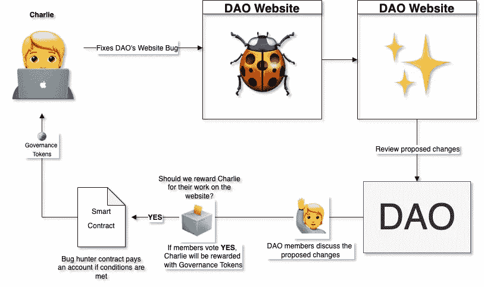
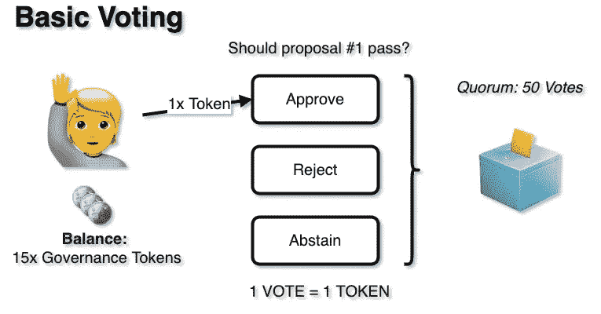
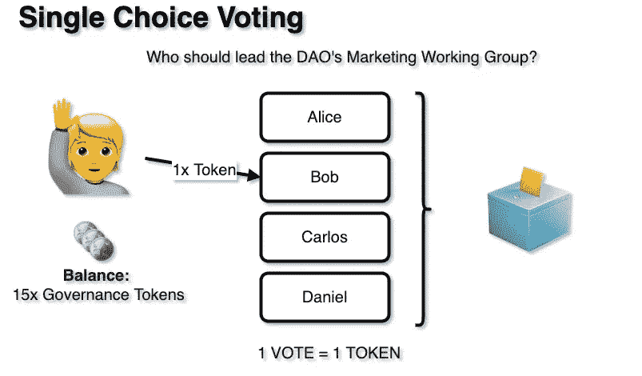
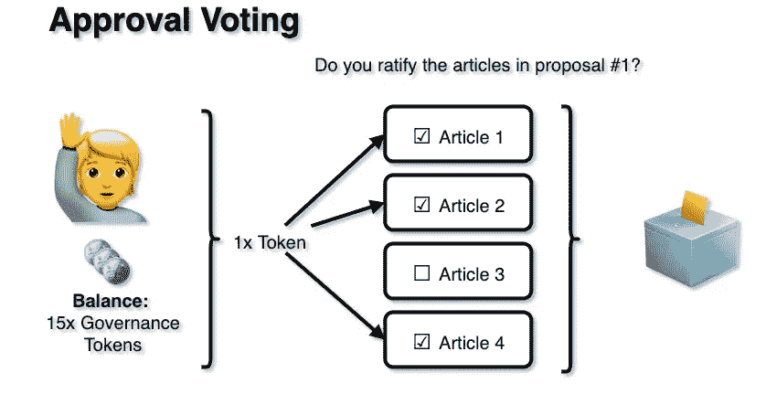
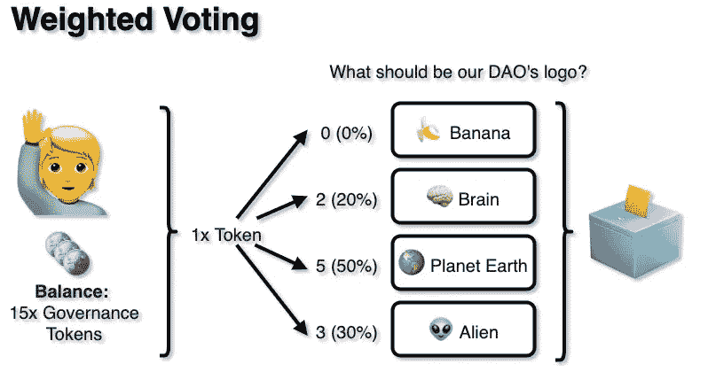
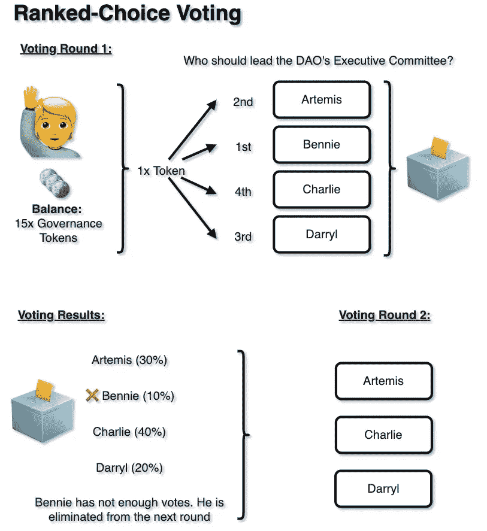
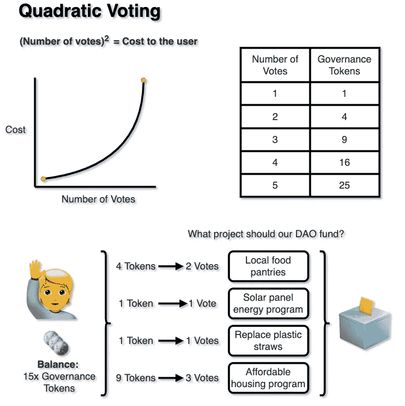

# 了解分散自治组织(Dao)

> 原文：<https://medium.com/coinmonks/understanding-decentralized-autonomous-organizations-daos-d3be4f63a5b5?source=collection_archive---------25----------------------->

> 分散自治组织(DAO)是一种没有中央管理机构的组织，其成员通过对区块链进行投票以民主方式做出决策。

让我们从介绍“道”的基本特征和其他重要概念开始，以更好地理解这些组织及其在我们社会中的当前角色。

Photo by [Cyrus Crossan](https://unsplash.com/@cys_escapes?utm_source=medium&utm_medium=referral) on [Unsplash](https://unsplash.com?utm_source=medium&utm_medium=referral)

# 什么是刀？

分散自治组织或 DAO 是一个没有中央理事机构的组织，其决策由其成员在区块链民主投票做出。Dao 是 Web3 项目中一种新颖的组织结构形式。这些组织的特点是没有一个中央管理机构，也就是说，组织的决策权是分配给其成员的，类似于合作社——很快会有更多介绍！

道具有共同的愿景和使命。他们的成员在实现有利于其社区的共同目标的基础上组织起来。与大多数传统组织相比，Dao 采用自下而上的管理方法。也就是说，无论你在组织中的职位如何，你都会对组织的管理产生影响。

## 什么是治理？

治理是治理或管理组织的行为或过程。为了使 DAO 发挥作用，必须实现一个包含其成员的治理设计或机制。如前所述，一个"一体行动"旨在实现自治，并拥有一个权力下放的管理机构。因此，治理流程必须围绕其成员进行规划，并为参与和约定创造适当的渠道。

# Dao 是如何工作的？

DAO 的规则最初是由社区成员的核心团队建立的。这是开始讨论的必要基础。这些规则一旦确立，就可以写在区块链上了。通常，这可以通过使用智能合约来实现。智能合约是用代码编写的，任何人都可以在区块链上看到。这些契约包含了治理流程背后的逻辑，并为 DAO 的运行奠定了基础。

一个 DAO 可以有不同的治理实践，这取决于它的目标及其成员的参与程度。参与可以在组织拥有的沟通渠道中非正式地发生，也可以亲自参与，或者通过投票正式参与。

投票有不同的利用方式，但将其纳入"一体行动"的最常见方式是批准或拒绝将塑造组织方向和结构的治理提案。

## 投票是如何进行的？

投票通过使用治理令牌来工作。治理令牌不同于其他类型的令牌，因为它们的唯一目的是衡量治理过程中的参与情况。这些代币需要分发给他们的成员。令牌分发可以是参与与 DAO 相关的给定交易(如在流动性池中存放令牌或在投票后获得额外令牌)、奖励参与讨论或在 DAO 平台中寻找 bug 的结果。最终，这完全取决于社区来决定代表他们声音的最佳方式，并找到前进的道路！如果您想了解更多关于令牌如何工作的信息，请查看另一篇文章！

Charlie found a bug on the DAOs website! They are ready to fix it and submit fixes to the DAO. The DAO reviews these changes and asks the community to vote to approve them or not.

# 投票的类型

## 基本投票

DAO 的成员(用户)投票支持特定的提案，以构建适合组织需求的治理新变化。

必须达到法定人数。这意味着，在一个投票周期中，至少要有足够的投票数来证明充分参与。

每个选民可以从 3 个选项中选择一个:

*   批准(是)
*   拒绝(否)
*   弃权(中立)*

* *弃权是展示参与以达到法定人数的一种好方式，而不会影响决策。*

A user (DAO member) uses 1 token to vote for “APPROVE” proposal #1\. If 50 votes are cast, a final countdown will decide if the proposal passes.

**优点:
-** 通俗易懂
-易于解读

**缺点:
-** 选择的灵活性有限

## 单项选择投票

每个选民只能选择一个选项。结果以百分比表示。有不同的选项可供投票。

A user (DAO member) votes for Bob using one of their tokens to be the leader of the working group.

**优点:
-** 简单普通

**反对:
-** 投票者只能选择一个选项

## 批准投票

每个投票人可以“批准”任意数量的选择。每个被选中的选项将获得同等的投票权。

A user (DAO member) votes to ratify Article 1, Article 2, and Article 4 of proposal #1\. But they do not ratify Article 3.

**赞成:
-** 一个提案多项决策的批准

**缺点:
-** 每个选项都是一个是或否的布尔方法。

## 加权投票

投票分布在任意数量的选项之间。投票将根据每个用户给予每个选项的权重在他们选择的选项之间进行划分。

A user (DAO member) spreads their vote between different options. The user leans towards having “🌎 Planet Earth” as the logo, but still considers “👽 Alien” and “🧠 Brain” as possible options. They do not like “🍌 Banana” as a logo option.

**赞成:
-** 选民可以支持多个选项，权衡自己的支持度

**缺点:
-** 投票机制更复杂。

## 排序选择投票

投票按顺序排列，从第一个选择开始计数。当一个选项获得超过 50%的选票时，结果的计算将停止。

*   如果该选项获得超过 50%的首选投票，则它获胜
*   如果没有一个选项获得超过 50%的首选投票，则循环继续
*   每轮过后，票数少的选项被淘汰。
*   如果投票人的第一个选项被取消，投票将转到下一个排名最高的选项
*   这个过程一直持续到只剩下两个选择。

A user (DAO member) votes for Bennie to be the DAO’s executive committee lead as their first option (1st), Artemis as a second (2nd), Darryl as third (3rd), and Charlie as fourth (4th). The user gets to rank their choices. After the voting ends, we see that Bennie actually had the worst turnout. So Bennie is now eliminated, and a new round of voting will commence with the remaining candidates.

优点:
-决定最强的选项
-减少浪费的选票

缺点:
-理解起来复杂
-只有一个赢家

## 二次投票

选票可以分散在不同的选择中。结果是通过平方计算得出的，因此个人选民的数量比投票权更重要。这种投票机制非常有利于促进个人参与，并阻止鲸鱼(许多代币的持有者)歪曲选举。

A user (DAO member) spreads their voting power (governance tokens) between the projects they believe should be funded. The more votes they cast, the more expensive is to cast them. This ensures that individuals have more representation against big players like whales.

**优点:**
——稀释投票权，有利于小股东。**人>令牌**

**缺点:**
——需要 Sybil-resistance 机制来避免在不同的钱包上拆分令牌。

# 关键要点

*   Dao 是致力于通过民主决策赋予其成员权力的组织
*   治理是构建和管理 DAO 的方式。通常遵循自下而上的方法
*   Dao 使用智能合同和区块链对治理决策进行投票
*   有不同类型的投票机制:基本、单项选择、批准、加权、分级选择和二次投票。
*   投票机制可以用来组织不同复杂程度的决策过程。为每种情况选择最佳的投票机制对于维护一个分散的治理机构是必不可少的。

# 结论

去中心化的自治组织是重新思考权力结构如何影响我们的决策过程的一个新想法。DAOs 帮助我们用创新打破集权模式。这为我们提供了与监管机构合作的机会，就我们的全球网络和日益互联的世界如何发展提出关切和解决方案。

这已经通过传统的公民参与方式实现了。分散的自治组织可以为参与式民主提供一种更简化的方法。由成员创建并为成员服务。

如果您想了解更多信息并参与构建道的讨论，[请查看我们的社区页面！](http://community.telluscoop.com)

> 交易新手？尝试[加密交易机器人](/coinmonks/crypto-trading-bot-c2ffce8acb2a)或[复制交易](/coinmonks/top-10-crypto-copy-trading-platforms-for-beginners-d0c37c7d698c)