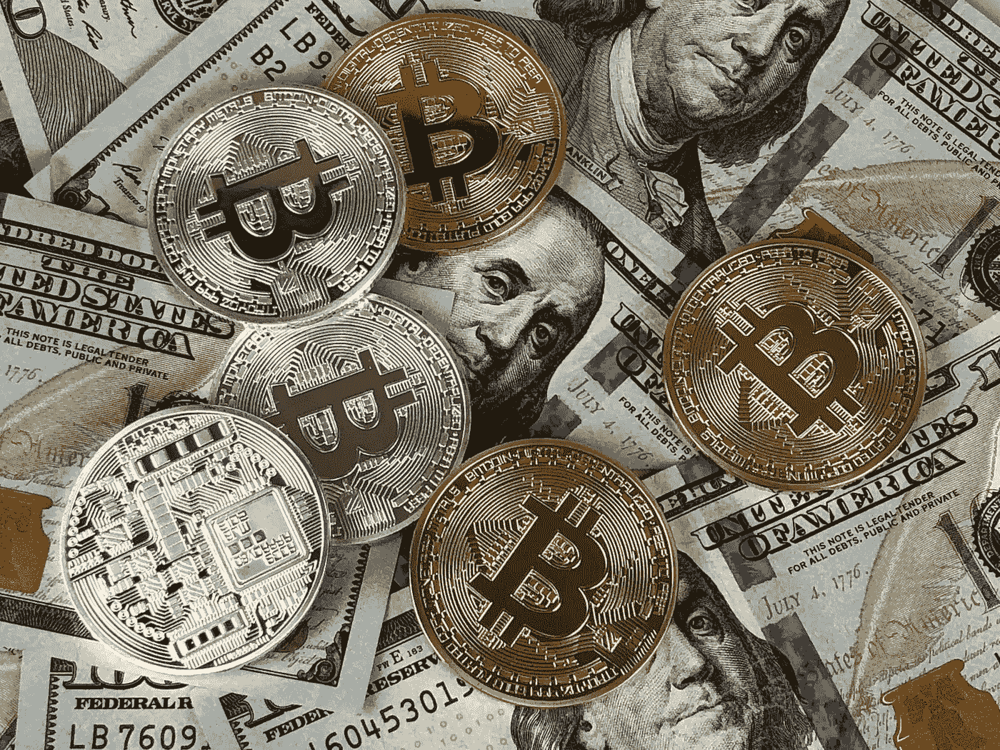
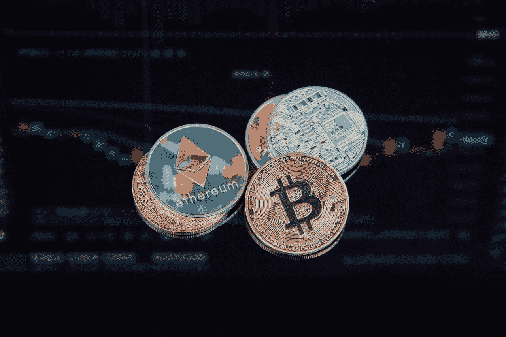

# 了解分散式交易所；初学者指南。

> 原文：<https://medium.com/coinmonks/understanding-decentralized-exchanges-beginners-guide-b6f74455a5f5?source=collection_archive---------11----------------------->

Photo by David McBee: [https://www.pexels.com/photo/round-silver-and-gold-coins-730564/](https://www.pexels.com/photo/round-silver-and-gold-coins-730564/)

区块链可能会通过创建一个无信任的中央系统来消除对中介的需求。然而，集中交易似乎否定了这一假设。或许这解释了当前分散式交易所流行的原因。

人们可以在分散的交易所直接交易加密货币，而不需要中央机构或中间人。

分散兑换允许用户在任何时候兑换他们的货币(因为流动性总是可用的)，并且不需要任何中间人(通过使用智能合约)。

> **参见:** [**什么是以太坊合并？**](/coinmonks/what-is-ethereum-the-merge-1b65f4d2c853)

# 什么是加密交换？

Photo by Crypto Crow: [https://www.pexels.com/photo/person-holding-silver-bitcoin-coin-1447418/](https://www.pexels.com/photo/person-holding-silver-bitcoin-coin-1447418/)

加密交换服务使用户能够买卖他们的加密货币(或法定货币)。通过充当买方和卖方之间的中介，他们促进了加密货币与法定货币或其他加密货币的交换。

**集中式与分散式交换**

集中式交易所(或 CEX)是一个用户可以购买、出售、存放和提取加密货币的网站。用户使用保管钱包，这意味着交易所主要负责保护用户的现金。**[***霍比***](https://www.huobi.com/en-us/login/)**[***FTX***](https://ftx.com/)不一而足****

**最早加入市场的交易所是集中交易所。所以他们的交易量和知名度更大。然而，由于最近分散加密货币交易所的兴起，这种情况正在发生变化。**

**DEX 代表“去中心化交换”，是一个点对点平台，方便用户直接交换加密货币。它们允许交易者通过使用智能合约执行交易，在区块链上相互买卖加密货币。**

> ****另见:**[**Crypto 崩溃何时结束？**](/web3-surfers/when-is-the-crypto-crash-coming-to-an-end-3342f7d47cde)**

****解释分散交易的机制****

****

**Photo by Worldspectrum: [https://www.pexels.com/photo/gold-bitcoin-844127/](https://www.pexels.com/photo/gold-bitcoin-844127/)**

**分散式交易所并不控制用户的硬币，而是采用“智能合约”，这是一种自动执行的协议，以促进个人之间的交易。**

**dex 以三种方式促进交易:链上订单簿、链下订单簿或自动做市商方法。**

**自动做市商(AMMs)不使用订单簿。在集中交易中，如果你有 BAT 代币并希望获得 Polkadot，你将需要找到另一个用户，他也有 BAT 代币并想要 Polkadot，并准备使用订单簿以商定的价格与你交易。AMMs 用定价算法取代了这个系统。**

**作为一种标准做法，分散式交易所使用“流动性池”来实现这一点。这实际上需要付费给用户，让他们在智能合约中持有一些硬币，然后用于交易。因此，个人用户在使交易成为可能方面起着关键作用。**

**通过单一的区块链，分散的交易所可以轻松跟踪所有加密货币交易。因此，许多分散的交易所都基于以太坊区块链，可以交易以太坊和以太坊代币。**

## **为什么分散式交易所越来越受欢迎**

****

**Photo by Moose Photos: [https://www.pexels.com/photo/round-gold-colored-ethereum-coin-1036637/](https://www.pexels.com/photo/round-gold-colored-ethereum-coin-1036637/)**

> **每当我需要在交易所进行简单的操作时，我都不得不进行不必要的生物识别、pin、2FA、KYC 和其他验证，我受够了！我们需要一场重大的 DEX 革命，赋予用户权力。**(匿名用户)****

**为了理解 Dexes 变得越来越流行的原因，让我们研究一下一个流行的集中式交换(比特币基地)和另一个流行的分散式交换(Uniswap)。**

**比特币基地是一家拥有办公室和员工的官方公司。因此，它属于严格的 KYC 或知道你的客户政策。另一方面，Uniswap 没有真正的公司或办公室，只有一个分布式开发团队，他们在以太坊区块链使用智能合约为交换建立协议。**

**他们的最终目标是最终将该协议的治理转移到[**UNI WAP**](https://uniswap.org/)本地令牌(UNI)的令牌持有者。**

**因为它们是分散的，没有适用于它们的法规，对客户没有 KYC 要求，任何人都可以在没有许可的基础上进入交易所。这大概是 Dexes 最吸引人的特性，也是这些年来它们越来越受欢迎的主要原因。**

****分散交易所相对于集中交易所的优势****

1.  ****隐私****

**新用户可以通过注册、提供一些个人信息和存入一些现金来使用集中交易所。有时，这可能会花费不合理的时间。**

**当局要求这些集中式加密货币交易所实施反洗钱和 KYC，因此受到监管。交易所在哪里保存所有这些信息？直接在他们的服务器上，这些服务器也容易被黑客攻击。**

**如果你非常关心隐私，那么集中交易可能对你没有吸引力，仅仅因为你在他们的数据库中存储了许多个人信息。因此，分散交易可能更适合你。**

****2。不是你的钥匙，不是你的硬币****

**在集中交易所，你没有私人钥匙，因为你的硬币存放在交易所服务器的一个热钱包里。即使你的硬币出现在交易所里，你也没有完全拥有它们。交易所通过使用保管钱包充当保管人。**

**这意味着他们可以审查你，没收你的硬币没有追索权。**

****3。黑客****

**用户的加密货币存放在集中交易所的 [***【热门钱包】***](https://www.investopedia.com/terms/h/hot-wallet.asp) 。然而，问题就在这里。网络犯罪分子经常瞄准这些热门的钱包余额。**

**许多加密货币交易所(CEXs)在过去曾受到攻击，包括*[***币安***](https://www.binance.com/en) 和[***bit MEX***](https://www.bitmex.com/)，可悲的是，我们不断听到其他 CEXs 受到严重影响。***

****4。透明度****

**尽管有规定，集中交易所的交易系统仍然不是完全透明的，这意味着它们仍然容易受到鲸鱼和大账户持有人的操纵。**

**有了分散的交易所，你可以核实区块链的所有交易。您可以查看过去的历史活动，因为区块链上的所有内容都是公开的。**

****5。更多代币可供选择****

**相比比特币基地，*[***uni swap***](https://uniswap.org/)*提供了更多的代币，用户可以交易的代币超过 1500 个。这比你在大多数中央交易所能找到的要多得多。另外，[***【Uniswap】***](https://uniswap.org/https://uniswap.org/)*相对于大多数集中交易所来说，报价相对便宜。*****

*****6。更多赚钱方式*****

***作为用户，您可以通过不同的 Uniswap 池在分散的交易所(如*[***【uni swap】***](https://uniswap.org/))提供流动性，从而获得潜在的利润。Uniswap 收取约 0.3%的交易费，这些资金流向流动性提供者。****

****7。集成****

**[***unis WAP***](https://uniswap.org/)*拥有超过 200 个与其他项目的 Defi 集成。这在集中交易中几乎是不可能的。***

*****分散交易所的弊端*****

******

***Photo by DS stories: [https://www.pexels.com/photo/coins-with-cryptocurrencies-symbols-on-the-background-of-graphs-7267598/](https://www.pexels.com/photo/coins-with-cryptocurrencies-symbols-on-the-background-of-graphs-7267598/)***

*****1。未经许可可能是危险的*****

***由于大多数分散式交换是无权限的，任何人都可以在智能合约上启动令牌。这也意味着有时会推出虚假项目，用户可能会被骗。这就是为什么你应该在投资任何项目之前做适当的研究。***

*****2。智能合同被黑的风险*****

***智能合约也有可能以某种方式受到损害或出现故障。如果发生这种情况，协议可能会失去用户的信任。***

*****3。只有基于以太坊的项目才能交易*****

***例如，通过 Uniswap，您只能交易基于以太坊的代币，因为交易所是建立在以太坊区块链上的。另一方面，比特币基地可以交易多个区块链的代币。***

*****4。高额燃气费*****

***在 Uniswap 协议下，网络上的拥塞会导致汽油费暴涨。而[***pancakeswap***](https://pancakeswap.finance/swap)等索引为 Uniswap 用户提供了一个很棒的替代方案。***

****5。没有直接加密到菲亚特转换****

**最后，虽然您可以在集中式交换中轻松地将您的密码转换为 fiat，但在分散式交换中却不能。你必须首先为你的钱包提供资金，然后将它连接到一个分散的交易所，以便能够进行交易。**

> ****另见:** [**比特币的故事:一个看不见的创造者制造的新奇技术。**](/illumination/the-story-of-bitcoin-the-novel-technology-made-by-an-invisible-creator-a58e2423063d)**

****结论****

**人们可以在分散的交易所直接交易加密货币，而不需要中央机构或中间人。分散兑换允许用户在任何时候兑换货币(流动性总是可用的)，并且不需要任何中间人(通过使用智能合约)。**

**通过单一的区块链，分散的交易所可以轻松跟踪所有加密货币交易。因为它们是分散的，没有适用于它们的法规，也没有对客户的 KYC 要求。这是 Dexes 最吸引人的特点，也是它们越来越受欢迎的主要原因。**

**有了分散的交易所，你可以核实区块链的所有交易。您可以查看过去的历史操作，因为链上的所有内容都是公开的。Uniswap 收取约 0.3%的交易费，这些资金流向流动性提供者。它与其他项目有超过 200 个 Defi 集成。**

> **交易新手？试试[加密交易机器人](/coinmonks/crypto-trading-bot-c2ffce8acb2a)或者[复制交易](/coinmonks/top-10-crypto-copy-trading-platforms-for-beginners-d0c37c7d698c)**