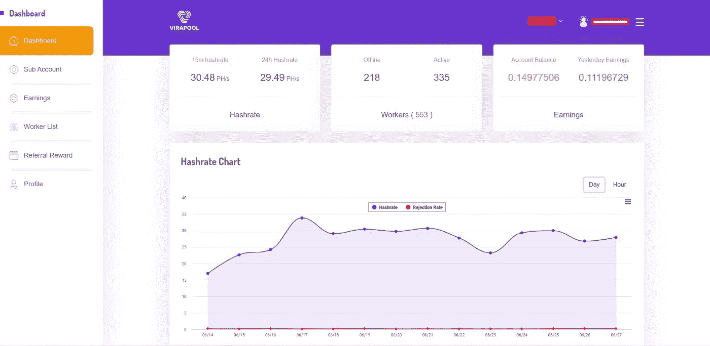
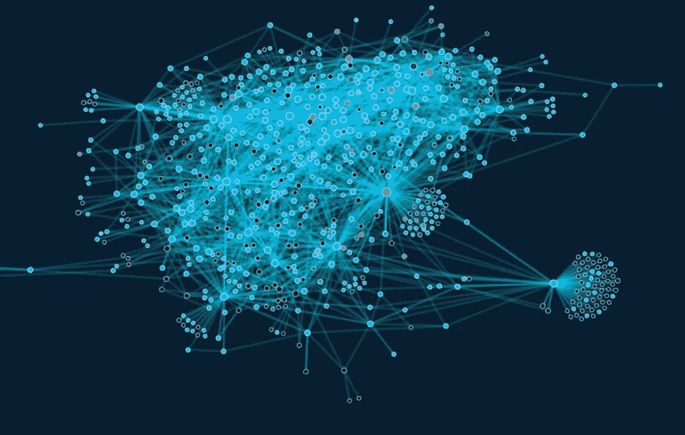

# 理解散列单元:你需要知道的一切

> 原文：<https://medium.com/coinmonks/understanding-hashrate-units-everything-you-need-to-know-2483a7aef1ec?source=collection_archive---------47----------------------->

我们知道采矿设备的等级越高，矿工生产一个矿块的收入就越多。一旦你搜索各大矿池的授权网站，如( ***F2POOL、poolin 或***[***vira poo****l*](http://www.virapool.com)*)，你经常会遇到两个数字:整个网络的哈希值和你要访问的矿池的哈希值，这对于许多新矿工来说很难区分。以下是解决方案。整个网络的哈希表显示了整个网络有多少计算能力，而挖矿池的哈希表显示了这个池中的硬币贡献了多少计算能力。*

*Hashrate 展示了挖掘设备的计算能力，特别是挖掘设备每秒可以完成的哈希处理次数。以比特币为例。比特币挖矿确实是通过一致的计算，找到一个满足函数要求的随机数的过程。哈希拉特的基本单位包括氢/硫、氢/硫、氢/硫、氢/硫、硫/硫、PH/硫和氢/硫*

*最低的 hashrate 单位是 H/s (Hash/s)，表示每秒计算中的随机哈希冲突。而每一个后续的单元相当于 1000 个之前的单元(1K = 1,000H，1M = 1,000K，1G = 1000m……)。目前常见的采矿设备的额定 hashrate 在 70 到 120 TH/s 之间，考虑一下神马 M30 S++矿机型号。它的官方 hashrate 等级是 112 级/秒，另外，比特币的全网 hashrate 是 201EH/s，换句话说，现在有 17.9 万套 M30 S++挖矿设备。*

尽管如此，各种货币的挖掘算法可能会有所不同。例如，比特币使用 sha256 算法，以太坊使用 Ethash 方法，Monero 使用 randomx 算法。加密货币的不同算法不能在同一个专用挖掘设备上运行。例如，ASIC 挖掘设备旨在使用 sha256 算法挖掘比特币，而不能用于挖掘以太坊等具有更复杂算法的替代比特币。

*此外，由于使用了各种挖掘算法，不同的加密货币具有不同的哈希单元。例如，对于 ZEC 和 ZEN 等使用 Equihash 系列挖掘算法的加密货币，最小 hashrate 单位是 Sol/s，对于 AE、GRIN 和 BFC 等使用 Cuckaroo 系列挖掘算法的加密货币，最小 hash rate 单位是 Graph/s。本质上，这两个单元和 H/s 是一样的，每增加一个单元就相当于早先的 1000 个单元。*

现在你已经熟悉了采矿池的散列，你一定渴望选择一个并开始采矿。但是请等一下！还有一点需要注意:hashrate 的变化。哈希码的易失性可能受到包括采矿设备的网络连接、操作环境和操作条件在内的因素的影响。不可预测的结果往往达不到矿工的期望，这可能是由巨大的变化造成的。

[***vira pool***](http://www.virapool.com)*推出了 hashrate 波动预警的功能，时刻牢记矿工的优点。矿工可以通过点击左上角的【池】进入*[****【ViraPool.com****](http://wwww.virapool.com)**】公司官网后加入【仪表盘】。然后，您可以单击页面底部的[散列率波动通知]来选择所需的设置，然后单击[确认]。或者，为了保证您的采矿收入，下载*[***vira pool***](http://wwww.virapool.com)**应用程序或将电报添加到您的联系人列表中。***

****

***最后但并非最不重要的一点是，除了矿工选择的开采池之外，当地电力成本对矿工的开采收入也有影响。下面是矿工最终收入的计算方法:***

***依赖于区块生成后你的 hashrate 的比率的收益——矿池扣除的费用***

***-采矿设备的电力费用***

***-采矿设备的维护费用。***

**因此，矿工应该仔细分析所有可能影响他们最终薪酬的因素。**

****作者****

**_____________________________________________________________**

** [## 威廉·布鲁斯-培养基

### 理解哈希表单位:你需要知道的一切我们知道采矿设备的哈希表越高…

medium.com](/@williambrucee1987) 

______________________________________________________________

有关采矿的更多信息，请点击此处

 [## 秘密战术

### 比特币用户应该制定应急计划，保护自己资产的未来。大约四百万比特币…

cryptotactic.io](https://cryptotactic.io) 

> 交易新手？试试[加密交易机器人](/coinmonks/crypto-trading-bot-c2ffce8acb2a)或[复制交易](/coinmonks/top-10-crypto-copy-trading-platforms-for-beginners-d0c37c7d698c)**