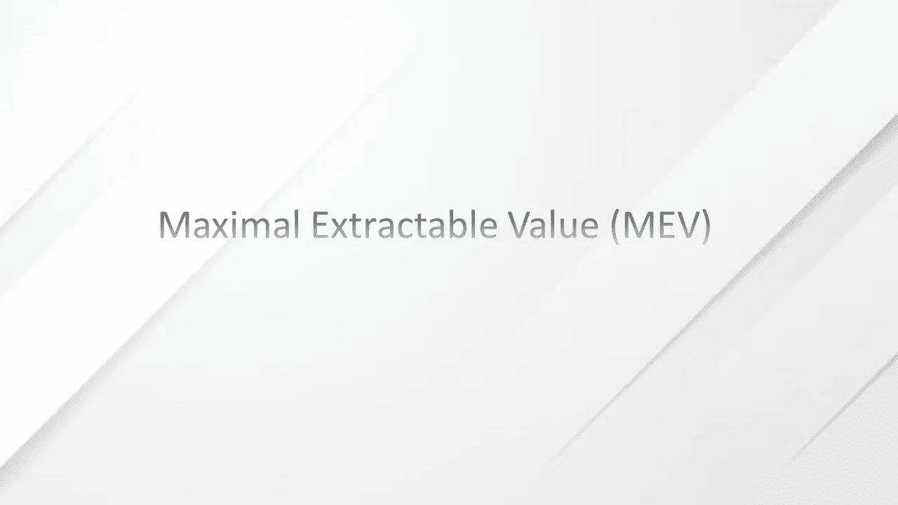

# 了解最大可提取值(MEV)

> 原文：<https://medium.com/coinmonks/understanding-maximal-extractable-value-mev-dc28bebf2e3b?source=collection_archive---------3----------------------->

MEV 是“最小可提取值”或“最大可提取值”的缩写。后者更常用，因为 MEV 不仅限于 PoW 区块链的矿工，还包括 PoS 区块链的验证者。

MEV 是区块生产商通过在他们生产的区块内任意添加、删除或重新安排交易而获得的利润。这是采矿者或验证者可以从单方面重新排序、插入或审查正在生产的区块内的交易中获得的回报。

在区块链中，挖掘者和验证者充当看门狗来保护网络和确认交易。他们是独立的，没有上级或监督者，这使他们能够以对自己有利的方式进行交易。

例如，在大宗交易导致价格下滑后，曲线上有一个 5000 美元的套利机会。套利者试图利用这个机会，并提交一个交易来抓住它。它向块生产者提供 50 美元的交易费(tx)。可能会发生两件事:

1.  块生产者复制并阻止机器人的交易，以便自己利用机会，或者
2.  其他机器人注意到了同样的机会，并支付了更高的 tx 费，这引发了一场争夺套利权的竞购战。这次拍卖被称为“优先天然气拍卖”(PGA)。

5000 美元的潜在利润是 MEV。如果大宗商品生产商选择不捕捉套利，PGA 开始，拍卖结算价格和总 MEV 之间的差异就是获胜的 bot 或交易商的利润。如果 4000 美元的费用支付给矿工或验证者，剩下的 1000 美元归交易者。

这个例子说明了区块链的砌块生产商如何利用他们的角色谋取私利。DeFi 的成功使得以太坊 MEV 以指数速度增长。这意味着，在接下来的一年，MEV 可能会产生困扰战俘和区块链战俘的重大问题。

**历史**

以太坊中的 MEV 问题最初是在 2014 年由化名为 [Pmcgoohan](https://pmcgoohan.medium.com/) 的分析程序员发现的。

当 Pmcgoohan 在 2008 年全球金融危机后听说以太坊和智能合约区块链的想法时，他真的很喜欢这个想法，并对这个想法的未来潜力感到兴奋。当他发现技术中的一个关键缺陷时，他的兴奋感减退了。Pcgoohan 意识到矿工对事务包含和排序的完全自主权和控制权。他们可以利用自己的力量从毫无戒心的协议用户那里获取额外的价值。

他开始警告这个严重的缺陷，然而，他的警告被置若罔闻。直到 2019 年，一群研究人员通过发表一篇名为 Flash Boys 2.0 的论文强调了这个问题，其中“MEV”一词首次被用来解释 Pmcgoohan 多年前发现的问题。

在圣乔治·孔斯坦托普洛斯和丹·罗宾逊分别于 2020 年 8 月和 9 月发表的《以太坊是黑暗森林》和萨姆森的《T2 逃离黑暗森林》之后，MEV 终于被认为是一个基本概念。他们将其本质解释为以太坊今天面临的最关键和最具挑战性的问题之一。

**为什么会出现最大可提取值**

每个区块链都有挖掘器(PoW)和验证器(PoS)。这些交易方负责定期整理未决交易并将其放入区块，然后添加到区块链中。他们定期更新区块链，以确保所有交易都是有效的，没有不良行为者实施欺诈。

无法确定交易是否会按照提交给区块链的方式进行安排。这是因为块生产者随意地从内存池中挑选事务，对它们进行排序，并将它们包含在自己的块中。任何区块链都没有为矿工设置标准的选择模式，这给了他们选择和订购交易的完全自主权。

区块生产商(采矿者和验证者)倾向于通过最高的交易费用来订购交易，以便在每个区块中获得最大利润。正因为如此，他们可以利用自己单方面重新订购交易的能力，创造所谓的最大可提取价值(MEV ),从用户那里获取额外利润。

MEV 现在通常不会出现在 block 制作者中，它出现在第三方机器人和聚会中。这些机器人或交易员通过改变他们支付给大宗交易生产商的交易费用，操纵大宗交易的排序方式。由于大宗商品生产商总是寻求利润最大化，他们会优先考虑交易费用最高的交易。

最终，MEV 的最高受益者是块生产者，因为他们决定块内交易的最终顺序。MEV 不利于普通用户，他们可能没有资源为其交易支付高额的 tx 费用，而这些交易在区块中被优先处理。

解释这种现象的一个简单例子是，把它看作是超市里的一次特价销售。想象一个黑色星期五的销售，顾客想要利用大量的折扣和特价。在商品有限而很多顾客愿意购买这些商品的情况下。收银员可以选择优先支付最高小费的顾客的订单。这可能会产生一个竞价过程，其中给小费最高的人得到商品，而其他人则被淘汰。然而，在这种情况下，收银员也是企业的所有者，如果他们选择不优先考虑最高出价者的订单，没有外部机构可以惩罚收银员。收银员也不会因为歧视那些在竞价过程中不能积极竞争的顾客而受到惩罚。

最高出价者从该交易中赚取最大可提取价值(MEV ),收银员以高小费出售他们的产品。

**MEV 流程中的主要参与者**

MEV 过程中的主要参与者包括块生产者、搜索者、分散的应用程序和协议开发者。

如上所述，块生产者负责对事务进行排序，并决定哪些事务进入块。区块生产商可以通过优先天然气拍卖(PGA)将稀缺的区块空间出售给非矿业 MEV 开采者，以换取高额的天然气费用，或者通过重新排序(包括或删除有利于自己的交易)来获取 MEV，从而在 MEV 流程中获利。

DApps 和协议开发人员在此过程中起支持作用。DApps 通过他们的本性和他们提供的激励(如任意性)创造 MEV 机会。协议开发人员为块生产者创建规则来订购事务，这使得他们能够捕获 MEV。

搜索者或 DeFi 交易者和机器人操作者不断寻找 MEV 机会，并以不同的方式捕捉它们。他们参与 MEV 流程，在链内 PGA 中哄抬天然气价格，让区块生产商在区块内以特定方式订购交易。通过陈述交易排序选择来阻止生产者使用 MEV 提取工具，如 Flashbots。搜索者运行复杂的算法来发现有利可图的 MEV 机会，并让机器人立即自动向网络提交这些有利可图的交易。

考虑到搜索者在经济上是理性的，他们愿意支付的交易费用应该低于他们试图捕获的 MEV 的 100%。这是因为如果交易费用高于 MEV，搜索者将会赔钱。这创造了一些极具竞争力的 MEV 机会，搜索者可能愿意向大宗生产商支付高达 99%的 MEV 总收入作为交易费，因为很多人都在追逐同样有利可图的交易。这是因为，通过支付最高的交易费，他们可以保证他们的交易在订购该区块的交易时会得到区块生产商的优先考虑。

**搜索者的典型 MEV 提取流程**

搜索者通过使用由复杂算法和自动化工具构建的机器人监控区块链来开始他们的 MEV 过程，以寻找潜在的 MEV 机会。当发现机会时，他们分析交易背后的逻辑，确定攻击媒介，并创建捆绑包。捆绑指的是按照创建顺序整理和执行的多个事务。搜索者通过这个过程来保证他们的 MEV 目标。

在一个包被创建后，搜索者将使用像 Flashbots 的 [MEV-Geth](https://docs.flashbots.net/flashbots-auction/miners/how-it-works) 这样的链外网络给它发送一个矿。这使得搜索者可以跳过公共内存池，快速、无风险地直接向块生产者表达他们的事务排序偏好。

在大量搜索者提交大量包而块空间有限的情况下，块生产者通过 Flashbots 拍卖来拍卖他们的块空间。这是一种离线的第一价格密封拍卖([盲标拍卖](https://en.wikipedia.org/wiki/First-price_sealed-bid_auction))，搜索者私下为他们喜欢的交易订单出价。基于拍卖的性质，没有一方知道其他方出价的数量。因此，最高出价者在所生产的块中获得他们的交易订单优先权。

当块生产者在其块中包括搜索器包时，MEV 提取过程完成。

**MEV 的类型**

MEV 以下列方式出现在区块链:

**前置运行**

这包括让一个事务在执行队列中排在 mempool 中一个已知事务的前面。前端运行的机器人监控进入内存池的大宗交易，并利用其先进的知识来捕捉这一机会。

例如，如果一个前端运行的机器人发现了一笔大额交易，它可以复制用户的交易并支付更高的交易费，以使他们的交易在该块的交易顺序中获得最高优先级。

**DEX 套利**

这是当今最常见的 MEV 形式。第三方机器人在两个或多个分散交易所(dex)之间执行套利。当一个交易所的加密资产价格与另一个不同时，就存在套利机会。套利机器人通过以较低的价格在交易所购买资产，并以较高的价格在交易所出售，从这种机会中获利。

DEX 套利是最简单和最受欢迎的 MEV 机会，因此也是最具竞争力的机会。机器人积极竞争这种机会，他们通过参与竞标战来实现这一点，这导致他们提高交易费，他们愿意支付给块生产者，目的是让他们的交易优先进行。

**三明治攻击**

三明治攻击是抢先交易的一种变体，其中机器人或交易者进行两次交易，一次在另一个交易者的交易之前和之后。搜索者利用这种攻击，通过操纵资产价格，从毫无戒心的 DEXes 交易者那里提取 MEV。

例如，一个交易者想在 Uniswap 上用 USDC 购买 50，000 ETH。这种规模的交易将对瑞士联邦理工学院/USDC 的组合产生重大影响。这笔交易可能会提高 ETH 相对于 USDC 的价格。搜索者可以计算这笔大宗交易对瑞士法郎/USDC 货币对的潜在价格影响，并在大宗交易前执行买入指令，以低价买入瑞士法郎，然后在同一笔交易后立即下达卖出指令，以大宗交易带来的更高价格卖出。

**倒车**

这是在一个已知的挂起的目标事务被执行后，使一个事务排在第二位或紧接在第一位的行为。搜索者通常使用后台运行的机器人来监视 mempool，寻找新的令牌对列表或在 DEXes 上创建的流动性池。当机器人发现新的令牌对列表时，它会在初始流动性后立即下单，并购买大量令牌，留下少量令牌供其他交易者稍后购买。然后，在其他交易者购买令牌后，机器人等待价格上涨，并以更高的价格出售以获利。

**清算**

清算是另一个众所周知的 MEV 实践。专门从事清算 mev 的搜索者从分散贷款平台(如 Compound、Maker、Aave 和 dYdX)上过度抵押贷款的清算中提取价值。清算人运行机器人进行前期或后期交易，成为第一个清算抵押品的人。协议通常允许任何人清算抵押品，立即还清贷款。如果抵押品被清算，借款人需要支付一笔高额的清算费用，这笔费用的一部分进入清算人，这就是 MEV 机会。

**时间强盗攻击**

这是一种阻止生产者追溯执行的攻击。他们对过去开采的区块重新排序，以捕捉 MEV 机会。他们在 MEV 足够高的情况下这样做，这在经济上是合理的，以破坏在旧区块捕获 MEV 的共识。

想象一下，有两个矿工，希迪和塞贡，他们每开采一个区块就能得到 50 美元的报酬。希迪发现了 4 个区块，第一个区块有 50，000 美元的套利机会。

塞贡可以在希迪发现的 4 个区块上采矿，或者他可以尝试重新开采第一个区块，以便为自己抓住套利机会。50，000 美元的套利比 50 美元的大宗奖励更有利可图。作为一个理性的区块生产者，Segun 决定重新开采第一个区块。当他这么做的时候，他也会重新开采第二、第三和第四个矿块，如果它们里面有 mev，他也会捕获它们。

NFT·梅夫

在 NFT 领域，这是一个相对较新的现象，不一定有利可图。

搜索者使用的技术与 NFT 市场其他 MEV 机会中使用的技术相似。

想象一下，有一个流行的 NFT 下降和一个搜索者想要 NFT 或一套非功能性交易，他们可以为他们的交易支付更高的汽油费，成为第一个购买 NFT 的人。他们还可以通过抢先购买的方式，在一次交易中抢在任何人之前购买整套 NFT。此外，在 NFT 被错误地以低价列出的情况下，搜索者可以找到任何一个买家并以低价购买。

**MEV 的影响**

根据 Flashbots 的数据，它测量总提取 MEV 的下限，并仅监控八个 DeFi 协议。据报道，截至 2022 年 8 月，已经从以太坊网络的不知情受害者那里提取了超过[6 . 73 亿](https://explore.flashbots.net/)美元。

MEV 是以太坊和其他智能合约区块链最大的问题之一。MEV 构成的一个主要问题是，它是一种由块生产者对用户进行的敲诈。用户需要支付高昂的费用来执行有利可图的交易。

MEV 还会堵塞管网，并对天然气价格构成上行压力。MEV 机器人参与天然气价格竞标战，导致普通用户为交易支付过多的天然气费用。MEV 最终恶化了用户体验。

MEV 在协议层面上破坏了区块链，因为它对事务的终结性和不变性提出了质疑。在 MEV 大于块报酬的情况下，块生产者将倾向于破坏共识。如果一个区块生产商可以重新安排以前开采的区块的交易以获取利润，那么区块链作为安全、可预测和无许可分类账的整个信念就土崩瓦解了。

最终，MEV 破坏了当今智能合约的可用性、中立性、透明性、分散性和安全性。它创造了一种环境，在这种环境中，更擅长获取 MEV 的砌块生产商以诚实的砌块生产商为代价而发展壮大。这对作为智能合同区块链安全核心的核心激励结构产生了负面影响。

**MEV 的解决方案**

当涉及到解决 MEV 问题时，主要有两种思想流派。

1.  **冒犯:**这个学派认为 MEV 会一直存在，所以我们需要找到一种方法来提取它并使之民主化。这一思想流派也被称为前置运行即服务(FaaS)或 MEV 拍卖(MEVA)。这一学派的解决方案的例子包括使用私有交易、bloXroute 的 BackRunMe、Flashbots、alchemist 的 mistX、KeeperDAO、EDEN Network (ArcherSwap)等。
2.  **辩护:**这个学派认为 MEV 不好，应该阻止。这个学派也被称为 MEV 最小化。解决方案包括输送机(自动机网络)、SecretSwap(秘密网络)、公平测序服务(Chainlink)、Arbitrum(离线实验室)等。

**结论**

MEV 问题的存在不是因为区块链设计中的技术缺陷，而是由于人的内在缺陷。人们都是自私的，总是为了自己的利益而损害他人的利益。我们都知道，没有人会因为他们的善良或者因为他们想让世界变得更好，而不是为了最大化回报而获得区块链。技术不能解决人类的所有问题；批判地看，人的问题就是人本身。因此，我们需要构建和调整技术来缓解这些问题，并阻止不良行为者。

MEV 是威胁区块链技术核心的关键问题。这一领域一直表现出高度的创新性，并不断寻求缓解问题和改进。已经出现了多种解决方案，并且将会有更多的解决方案来解决这个问题，然而，无论哪种解决方案成为 MEV 的主流，它都必须是灵活的，因为人们将继续寻找开发区块链的新方法。

**资料来源和参考文献:**

1.  [最大可提取值(MEV)](https://ethereum.org/en/developers/docs/mev/)
2.  [什么是矿工可提取值(MEV)？](https://coinmarketcap.com/alexandria/glossary/miner-extractable-value-mev)
3.  [什么是 MEV？以太坊的隐形税解读](https://cryptobriefing.com/what-is-mev-ethereums-invisible-tax-explained/)
4.  什么是矿工可提取值(MEV)？
5.  [梅维和我](https://research.paradigm.xyz/MEV)
6.  [MEV 维基](https://www.mev.wiki/)

> 交易新手？尝试[加密交易机器人](/coinmonks/crypto-trading-bot-c2ffce8acb2a)或[复制交易](/coinmonks/top-10-crypto-copy-trading-platforms-for-beginners-d0c37c7d698c)