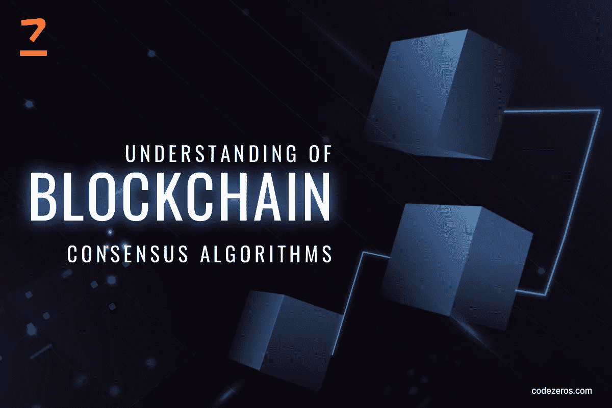

# 对区块链共识算法的理解

> 原文：<https://medium.com/coinmonks/understanding-of-blockchain-consensus-algorithms-238ea618320c?source=collection_archive---------34----------------------->

区块链是一个分散的分布式网络，提供更好的安全性、透明度和不变性。区块链 中的 [**共识机制允许区块链网络在不同节点之间建立信任并获得可靠性。它还确保了环境的安全性。**](https://www.codezeros.com/services/consensus-forking)

简而言之，这是一个区块链网络的所有节点就分布式账本的实时状态达成共识的过程。所以，跟随这篇文章去了解更多。

Blockchain Consensus Algorithms

**目标:**

区块链共识机制的普遍目标如下:

1.  **公平和公正:**它使任何人都能够使用相同的基础知识并参与网络。这样，它证明了区块链系统的去中心化和开源特性。
2.  **统一协议:**用户之间甚至不需要建立信任，就可以以分散的方式进行操作。这些协议确保流程中涉及的数据是准确和真实的，并且公共分类账的状态是最新的。
3.  **防止重复支出:**在这里，只有有效且经过验证的账本才纳入透明公共账本。因此，人们不需要在数字货币上花双倍的钱。
4.  **调节经济激励:**惩罚欺诈者，奖励在这种情况下保持良好行为的人。这样，它也符合经济激励。

**属性:**

体面的区块链共识机制的特性如下:

1.  **参与性:**在共识机制中，所有节点都积极参与，并为更新区块链上的数据库做出贡献。
2.  **安全性:**允许所有节点根据协议规则生成有效结果。
3.  **平等主义:**它给从节点收到的每一张选票以同等的权重和价值。
4.  **Inclusive:** 确保网络的每个节点都积极参与投票过程。

如果您选择了一个糟糕的共识协议，该怎么办？

[**以太坊&共识叉**](https://www.codezeros.com/services/consensus-forking) 选择一个不好的共识的一些后果。但是下面给出了更受欢迎的一些:

1.  **性能差:**当考虑到一个糟糕的共识机制时，节点要么遭受网络不良，要么出现故障。
2.  **区块链分叉:**增加了链的脆弱性，其中一个这样的脆弱性就是 [**区块链共识分叉**](https://www.codezeros.com/services/) 。当一条链被分成两条或更多条时，就会产生一种情况。
3.  **共识失败:**共识失败或共识分叉是选择错误共识机制可能面临的另一个问题。它未能产生预期的准确结果。

**区块链共识算法:**

下面给出一些流行的 [**区块链共识算法**](https://www.codezeros.com/) :

**工作证明(PoW):**

比特币利用这种 PoW 共识算法来选择矿工，以生成下一个区块。块头向区块链验证器提供数据作为输入。数据通过加密哈希函数连续运行。通过包含一个随机数，一个任意的数，验证器对输入有一个微小的变化。

PoW 需要高电力水平来处理电力，并决定将哪些数据添加到区块链中的下一代模块。这种算法的中心概念是，它解决了一个复杂的数学难题，并容易地给出一个解决方案。数学难题需要强大的计算能力，谁尽早解决它，谁就有机会挖掘下一个区块。

**委托利益证明(dpo):**

DPoS 是一种完全基于投票系统的共识算法。在这里，验证者的“代表”被认为是在新块的一致状态下他们想要帮助的人。

对于维护区块链网络和验证交易，这些验证者将只负责。作为回报，他们将因此获得交易费。每个投票者的权力与网络中的股份大小成正比。

**股权证明(PoS):**

PoS 是一种算法，其中验证者解决复杂的难题，但他们通过锁定一些硬币作为赌注来投资系统的硬币，而不是投资昂贵的硬件。在这之后，验证器开始通过在这些块上下注来验证它们。

实际的区块被添加到区块链中，并基于它们；所有的验证者都获得与其赌注成比例的奖励。这相应地增加了他们的股份。最后，基于验证者在网络中的经济利益，选择一个验证者。通过这种方式，PoS 鼓励利用激励机制来影响验证者达成协议。

**能力证明:**

在容量一致性证明的情况下，验证者投资他们的硬盘空间，而不是任何昂贵的烧钱或硬件。验证者拥有的硬盘空间越多，验证者被选中进行下一次区块挖掘并最终获得区块奖励的机会就越大。

**结论:**

上述算法在不同目标的领域上运行。它们安全、可靠且经济。节点在机构的整个过程中起主要作用。回报和投资也因人而异。要获得更多关于区块链共识算法的细节，你可以选择在线研究。

> 交易新手？试试[密码交易机器人](/coinmonks/crypto-trading-bot-c2ffce8acb2a)或者[复制交易](/coinmonks/top-10-crypto-copy-trading-platforms-for-beginners-d0c37c7d698c)