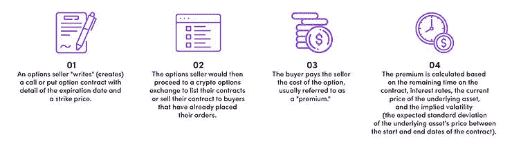

# 了解加密货币中的期权交易

> 原文：<https://medium.com/coinmonks/understanding-options-trading-in-cryptocurrency-6159f4f59755?source=collection_archive---------32----------------------->

并非所有的选择都有同样的风险，理解它们是至关重要的。如果你是持有者(买方)，你的风险和你是卖方的风险是不同的。

# 关键要点

*   期权合同为持有者提供了购买或出售的权利，但不是义务。
*   美式期权可以在到期日之前或到期日的任何时候行使合约，而欧式期权只能在到期日行使合约。
*   在钱(ITM)期权合同的成本高于在钱(自动柜员机)或在钱外(OTM)期权合同，因为他们已经有内在价值。

# 介绍

期权是一种金融工具，一种衍生工具，其价值基于股票或加密货币等基础资产。交易期权的正式日期始于 1973 年，但有证据表明它已经存在了数百年，可以追溯到公元前 350 年

期权合约赋予持有者在到期日以特定价格买入或卖出标的资产的权利，而非义务。

# 加密选项是如何工作的

加密期权可能看起来很复杂，但是通过这个指南，你可以掌握交易你的第一个加密期权的基本知识。

# 风格

当合约持有人决定在预定日期之前或之日行使其以预定价格(也称为“执行价格”)购买或出售基础加密货币的权利时，行使期权。

1.  **美国**——可以在到期日之前或到期日的任何时候行使合同。
2.  **欧式**——只能在到期日行使合约。

# 类型

你购买的期权类型将决定你是否有权在未来买卖标的资产。我们可以将其简化为:

1.  **看涨期权** —赋予**购买**基础加密货币**的权利。**
2.  **看跌期权** —赋予**卖出**基础加密货币**的权利。**

# 期权交易过程

1.  期权卖方“写”(创建)一份看涨或看跌期权合同，详细说明到期日和执行价格。
2.  然后，期权卖方将进入一个加密期权交易所，列出他们的合同或将合同出售给已经下单的买方。
3.  买方向卖方支付期权费用，通常称为“溢价”
4.  溢价的计算基于合同的剩余时间、利率、基础资产的当前价格和隐含波动率(合同开始和结束日期之间基础资产价格的预期标准偏差)。

溢价成本的最关键因素是基础资产的当前价格。

*   **(ITM):**当看涨期权的执行价格低于标的资产的当前价格时。对于看跌期权，是指执行价格高于当前价格的时候。
*   **在自动取款机上(ATM):** 看涨或看跌期权的执行价格等于当前价格。
*   **(OTM):**看涨期权的执行价格高于标的资产的当前价格。对于看跌期权，是指执行价格低于当前价格。

ITM 合约的成本高于自动柜员机和 OTM 合约，因为它们已经有内在价值。自然，这并不能保证价格会保持在执行价格之上，直到合约到期。

# 加密选项的风险

并非所有的选择都有同样的风险，理解它们是至关重要的。如果你是持有者(买方)，你的风险和你是卖方的风险是不同的。

**买入看涨:**上涨潜力无限，下跌潜力受限于你支付的溢价。你希望价格暴涨，这样你就能以较低的价格购买。

**买入看跌期权:**看跌期权的上行潜力是执行价格和当前价格之间的差额(例如，如果你以每 BTC 40，000 美元的价格买入卖出权，而价格跌至每 BTC 30，000 美元)。不利的可能性是你支付的保险费。你希望价格大幅下跌，这样你就能以“更高”的价格卖出。

**卖出看涨期权:**当你卖出看涨期权时，你实质上是把买入权卖给了别人。上涨潜力仅限于期权的溢价。下行潜力是无限的。你希望价格保持稳定(甚至小幅下跌)，这样购买你的看涨期权的人就不会行使期权。

**卖出看跌期权:**当你卖出看跌期权时，你是在向别人出售卖出的权利。期权的溢价也是上升的潜力。潜在的下跌空间是执行价格和当前价格之间的差额。你希望价格保持在执行价格之上，这样买方就不会强迫你以高于密码价值的价格出售。

# 你应该尝试加密选项吗？

加密期权可用作创收、对冲或投机的工具。当然，每一项投资都包含一定程度的风险，这取决于投资者如何管理自己的风险。如果你能很好地管理你的风险，加密选项可以是一个很好的投资组合。

> 交易新手？尝试[加密交易机器人](/coinmonks/crypto-trading-bot-c2ffce8acb2a)或[复制交易](/coinmonks/top-10-crypto-copy-trading-platforms-for-beginners-d0c37c7d698c)