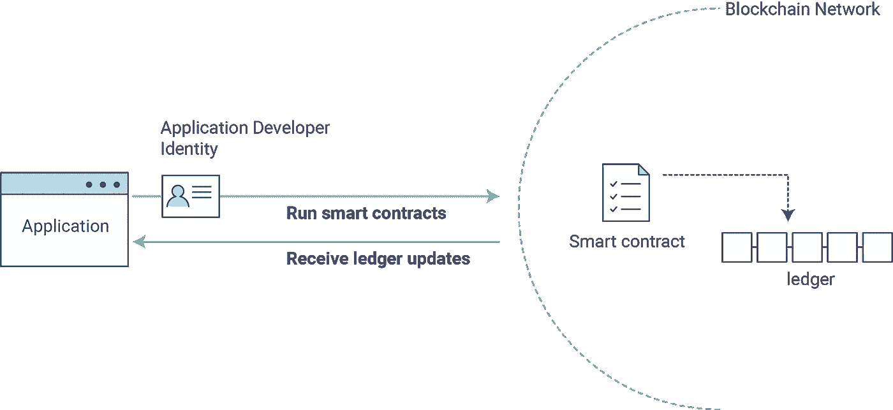

# 了解智能合同

> 原文：<https://medium.com/coinmonks/understanding-smart-contracts-7885410341b2?source=collection_archive---------19----------------------->

我们都知道在区块链网络中运行的程序被称为智能合同。但是我们知道为什么我们使用智能合约来执行交易吗？为什么我们不能在不使用智能契约的情况下调用事务呢？智能合约和集中式编程中的逻辑有什么区别？让我们找出答案。

## 集中式编程

在集中式编程中，我们有 MVC 架构、2 层、3 层、N 层架构。基本上，我们的应用程序可以分为三个组件，每个组件处理其特定的功能。逻辑层将进行检查，如果条件满足，我们将在数据库层执行 CRUD 操作。但是分散编程有什么区别呢？

## 分散编程

> 如果你不知道区块链的行话，读读[这个](https://docs.cardano.org/new-to-cardano/what-is-a-blockchain)或者[这个](https://apurbapokharel.medium.com/blockchain-101-db1201c29e37)。

分散式架构也可以分为以下三个部分:

## 应用/前端:

前端要么将交易发送到网络，要么从网络获取值并显示出来。

## 智能契约/逻辑:

智能合约将有各种检查，通过检查后，将允许在分类帐上执行交易操作。

智能合约将存在于网络上的指定地址，任何人(除非访问受控)都可以与智能合约进行交互。

## 分类帐/存储:

现在，事情变得有点棘手了。网络上的每个节点都有自己唯一的分类帐副本。这些分类帐在网络中的所有节点上必须总是处于相同的状态，并且是不可变的。

Dapp 中的流程如下所示。

[https://hyperledger-fabric.readthedocs.io/en/release-1.4/write_first_app.html](https://hyperledger-fabric.readthedocs.io/en/release-1.4/write_first_app.html)

在这些刷新/修改之后，让我们进入正题。

## 为什么选择智能合约？

## 分类帐一致性:

这是使用智能合约的主要原因。维护网络中每个节点的分类帐的一致性比听起来要繁琐和困难得多。如果许多用户可以直接交互并更改分类帐的状态，而不使用智能合约，那么将会由于状态不一致而导致混乱。智能合约在执行时将通过块挖掘、事件广播和消息传递来确保分类账的一致性。这些协议是在核心级别设计的，以确保无论执行什么操作，分类帐都是一致的。

## 维护不信任因素:

区块链是不可信的。在一个区块链应用程序中，“[代码就是法律](https://www.youtube.com/watch?v=pWGLtjG-F5c)”可能看起来不是一个有效或强大的点，但如果不使用智能合同，这是不可能实现的。

## 自动化或缺乏权威:

在集中金融中，我们不能在没有经纪人的情况下进行交易(意思是，中间人，字面意思！)但是，由于智能合约以及在我们的分散式应用程序中不需要权威机构，创新者正在提出像做市商这样的想法来实现这一壮举。如果不考虑所有的积极结果，这本身就太令人印象深刻了。

总而言之，智能合约旨在取代中间人，促进整个系统的无信任操作。

话虽如此。让我们来回答一些提出的问题。

## 为什么我们不能在不使用智能契约的情况下调用事务呢？

我们不能，因为如上所述，维护一致的分类帐的任务在区块链应用程序中非常重要。如果我们能够以某种方式改变我们自己的分类帐状态，那么我们也应该在整个网络中发送新分类帐的状态以保持一致性。想要利用 Dapp 优势的用户只想运行他们的事务，他们不想担心在运行事务之前和之后需要完成的任务。因此，智能合约被设计为解决这一问题的方案。

> 智能合约的工作原理是遵循简单的“如果/当…那么…”语句，这些语句被写入区块链的代码中。当预定条件得到满足和验证时，计算机网络执行这些动作。这些操作可能包括向相关方发放资金、注册车辆、发送通知或开罚单。然后，当交易完成时，更新区块链。这意味着交易不能被改变。

## 智能合约和集中式编程中的逻辑有什么区别？

在他们各自的核心中，两者是相同的。每个都将包含应用程序的逻辑、在执行这些逻辑之前必须满足的检查，然后是更新 DB 或分类帐的最终查询。然而，它们之间的区别不在于逻辑，而在于它们各自所能支持的逻辑类型。
集中式编程允许删除数据或修改数据，但是，区块链上的数据是不可变的，因此智能合约将永远不会具有从分类帐的先前状态删除或修改数据的逻辑。从区块被开采时起，数据可以被删除或更新，并且分类帐的状态将相应地改变，但是分类帐的先前实例将仍然具有原始数据。因此，集中式编程逻辑可以支持 CRUD 操作，而分散式编程逻辑将支持不同于前者的 CRUD。

## 奖金，为什么不支持删除/升级动作？

在区块链，删除和升级是线性的，你不能回过头去修改和删除某些东西，你只能在现在改变它，而这种改变会在未来反映出来。这是我能解释这件事的最好方式，而不用深入到技术细节中。观看[该](https://www.youtube.com/watch?v=_160oMzblY8)的技术说明。

信息链接:

1.  [https://www . quora . com/Why-cant-transactions-on-区块链-be-deleted-given-it-just-a-electronic-storage](https://www.quora.com/Why-cant-transactions-on-blockchain-be-deleted-given-that-it-is-just-an-electronic-storage)
2.  【https://www.ibm.com/topics/smart-contracts 
3.  [https://docs . cardano . org/new-to-cardano/what-is-a-a-区块链](https://docs.cardano.org/new-to-cardano/what-is-a-blockchain)

> *交易新手？试试* [*密码交易机器人*](/coinmonks/crypto-trading-bot-c2ffce8acb2a) *或* [*复制交易*](/coinmonks/top-10-crypto-copy-trading-platforms-for-beginners-d0c37c7d698c)