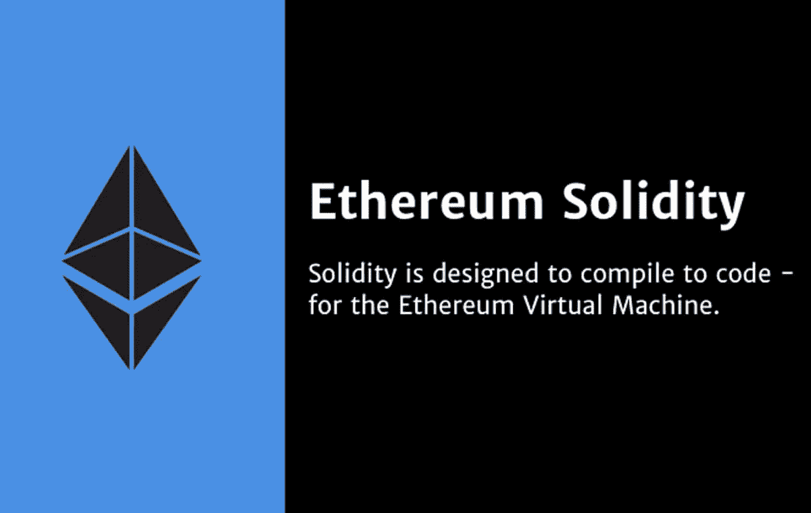

# 理解可靠性语法

> 原文：<https://medium.com/coinmonks/understanding-solidity-syntax-807ee8c4a3a8?source=collection_archive---------17----------------------->

在我们的 YouTube 上观看视频的同时，享受这个流的资源！

YouTube:[https://youtu.be/srINuNy7uco](https://youtu.be/srINuNy7uco)

不和:【https://discord.gg/J73qhkj7kr】T2

推特:【https://twitter.com/CryptoverseDAO】

linktree:[https://linktr.ee/cryptoversedao](https://linktr.ee/cryptoversedao)

理解实体语法:

当你想到‘扎实好学吗？’后续会冒出很多问题。然而，正如前面讨论中强调的，编写智能契约的可靠性语法提供了更好的理解。建立基本智能合约的 solidity 程序代码是任何 Solidity 教程的灵魂。

杂注

Solidity 智能合约代码的第一行是 pragma 指令。这里突出显示的 Solidity 例子的特点是 pragma 指令通知 Solidity 版本 0.4.16 的源代码的编写。此外，它还指定了智能合约对指定版本以上的 Solidity 版本的支持。智能合约中的 pragma 指令也将 Solidity 的使用限制在 0.9.0 版本。

在大多数情况下，pragma 指令本质上始终是源文件的本地指令。因此，导入另一个文件并不意味着该文件的 pragma 会自动应用于导入的文件。因此，用户可以使用以下命令为一个文件编写一个 pragma，该文件不能在 0.4.0 之前的版本以及从 0.5.0 开始的编译器版本上运行:

^0.4.0 实用主义；

在这种情况下，^有助于添加第二个条件。

合同

您可能已经在本 Solidity 教程概述的示例中找到了 uintstoredData 组件。它只不过是可靠性契约，是位于以太坊区块链特定地址的代码和数据的集合。契约的不同组件有助于声明状态变量，并配置修改或检索变量值的函数。
文件导入

初学者在学习 solidity 语法时也可能会遇到导入文件的需求。现在，您可能要在讨论的例子中搜索 import 语句。然而，Solidity 提供了对 import 语句的支持，这些语句与 JavaScript 中的 import 语句非常相似。您可以在 solidity 教程中找到以下语句作为从 xyz 导入全局符号的示例。

导入“XYZ”；

此外，下面的语句也可以作为创建一个新的全局符号的有希望的例子。标题为“symbolName”的新全局符号将来自“xyz”的全局符号作为其成员。

从“xyz”导入*作为 symbolName

当您想要从当前文件所在的目录中导入名为“x”的文件时，您可以使用，

进口”。/x "作为 x

此外，将“x”作为 x 导入有助于引用全局“包含目录”中的不同文件

保留关键字

理解 Solidity 教程中语法的最重要的方面也涉及到保留关键字。solidity 中的保留关键字是使用编程语言的重要要求。关键字的知识对于帮助初学者更好地理解 solidity 是必不可少的，因为他们可以正确地识别它们。用户可以很容易地依靠他们对保留关键字的了解来开发应用程序代码的逻辑。下面是一些在 Solidity 中可以找到的保留关键字的概要，

摘要
Auto
别名
默认
覆盖
Sizeof
未检查
Typedef
内联
Copyof
应用
引用
尝试
静态
定义
后
切换
事例
不可变
类型

> 交易新手？试试[加密交易机器人](/coinmonks/crypto-trading-bot-c2ffce8acb2a)或者[复制交易](/coinmonks/top-10-crypto-copy-trading-platforms-for-beginners-d0c37c7d698c)

此外，您可以在 solidity 区块链示例中找到许多其他关键字，以提高您对基本 solidity 语法的了解。

学习坚固的运作

既然你对 solidity 语法中的不同组件以及它们与智能合约功能的关系有了清晰的印象，那么深入研究 Solidity 的工作原理就很重要了。让我们举一个最常见的固体例子来理解工作。

在下面的例子中，为 Solidity 环境选择的编译器是— Remix IDE。它还有助于运行 Solidity 代码库。这里有一些重要的步骤，你可以按照这些步骤开始使用 solidity 的基本工作。现在，为了解释它是如何工作的，你应该假设这个 solidity 教程中有下面的代码。

^0.5.0 实用主义；

合同可靠性测试{

构造函数()public{

}

函数 getResult()公共视图返回(uint){

uint a = 1；

uint b = 2；

uint 结果= a+b；

返回结果；

}

}

初学者工作区块链基础示例第一步，你要复制 Remix IDE 代码段的具体代码。
现在，你必须选择‘编译’选项卡，然后你可以点击‘开始编译’按钮。
随后，您必须将注意力转向“运行”选项卡，在这里您必须单击“部署”按钮。
在下一步中，用户仍然在“运行”选项卡上，您必须打开下拉框来选择“0x 的坚固性测试”选项。
最后，用户可以点击 getResult 按钮，显示用 Solidity 语言编写的代码的输出。

在 Solidity 中完成编写代码和编译代码的所有步骤后，您会发现下面的输出。

0: uint256: 3

评论的重要性

注释在任何 solidity 教程中的重要性是毋庸置疑的，Solidity 为 C-type 和 C++类型的注释提供了深刻的支持。因此，字符“/”和“/”之间的任何类型的文本都被称为可以跨越多行的注释。此外，在“//”和行尾之间找到的任何类型的文本都被称为注释，最重要的是，Solidity 编译器会忽略这些文本。这里有一个例子可以概括注释的理想用法。

函数 getResult()公共视图返回(uint){

//这是评论。它类似于 C++中的注释

/*

*这是 solidity 中的多行注释

*它非常类似于 C 编程中的注释

*/

uint a = 1；

uint b = 2；

uint 结果= a+b；

返回结果；

}

> 加入 Coinmonks [电报频道](https://t.me/coincodecap)和 [Youtube 频道](https://www.youtube.com/c/coinmonks/videos)了解加密交易和投资

# 另外，阅读

*   [Botsfolio vs nap bots vs Mudrex](/coinmonks/botsfolio-vs-napbots-vs-mudrex-c81344970c02)|[gate . io 交流回顾](/coinmonks/gate-io-exchange-review-61bf87b7078f)
*   [CoinFLEX 评论](https://coincodecap.com/coinflex-review) | [AEX 交易所评论](https://coincodecap.com/aex-exchange-review) | [UPbit 评论](https://coincodecap.com/upbit-review)
*   [AscendEx 保证金交易](https://coincodecap.com/ascendex-margin-trading) | [Bitfinex 赌注](https://coincodecap.com/bitfinex-staking) | [bitFlyer 点评](https://coincodecap.com/bitflyer-review)
*   [Bitget 回顾](https://coincodecap.com/bitget-review) | [双子座 vs BlockFi](https://coincodecap.com/gemini-vs-blockfi) cmd| [OKEx 期货交易](https://coincodecap.com/okex-futures-trading)
*   [AscendEx Staking](https://coincodecap.com/ascendex-staking)|[Bot Ocean Review](https://coincodecap.com/bot-ocean-review)|[最佳比特币钱包](https://coincodecap.com/bitcoin-wallets-india)