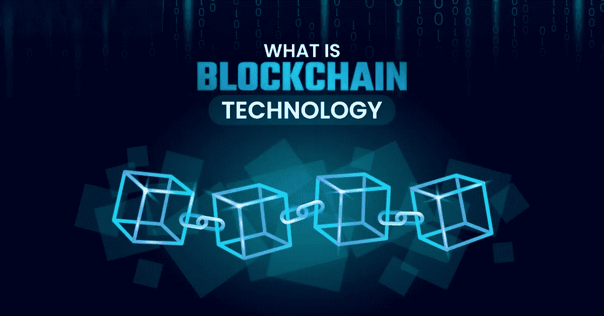

# 了解区块链中智能合约的缺点

> 原文：<https://medium.com/coinmonks/understanding-the-downsides-of-smart-contracts-in-blockchain-1714cc9ed17?source=collection_archive---------31----------------------->

在[区块链](https://www.ibm.com/topics/what-is-blockchain)的世界里，[加密货币](https://www.nerdwallet.com/article/investing/cryptocurrency)是全世界讨论的最热门的概念。然而，[智能合同](https://www.ibm.com/topics/smart-contracts)的概念正赶上数字经济的步伐。

智能合同的好处跨越了各种保险、医疗保健和物流行业。然而，难题仍然是智能合约是否如人们所想的那样。毫无疑问，智能合约在未来会很有帮助。

然而，最好把真相和炒作分开。这项技术很有潜力。然而，仍然存在限制其成功实施的技术和法律因素。

本文将详细介绍智能合约的缺点。

# 区块链智能合同的概念

智能合同是处理合同自动化的算法。他们执行交易，销售房地产经纪人，交换金钱，文件，很容易被分享。智能联系人实现不允许中介服务完成交易。这些中间人是经纪人、代理人和公证人。

智能合同指的是一旦所有相关方满足特定条款就会运行的程序。它们使用条件语句来触发执行给定任务的动作。从技术上讲，智能合约可以描述为[自执行](https://www.geeksforgeeks.org/what-is-the-self-executing-function/)代码。在部署到区块链之前，开发人员可以编写指示智能合同的[业务逻辑](https://www.investopedia.com/terms/b/businesslogic.asp)。因此，智能合同可以被视为独立的，因为它们不需要第三方控制。

智能合约之所以受欢迎，是因为它们是独立的。然而，它们往往缺乏集中控制，这意味着软件可以在没有可信第三方的情况下执行其规定。

# 合同的类比

在讨论智能合约之前，我们必须先了解合约是如何工作的。典型的合同包含以下要素:

*   要约
*   接受
*   交易

我们可以假设一个租房的房东来更好地理解这些元素。我们可以和房东达成协议，以每周 30 美元的价格租一套房子，租期三周。

合同的三个部分如下:

## 要约

[报价](https://www.upcounsel.com/what-is-an-offer-in-law-of-contract)将代表我们给房东的承诺，我们将在三周内每周支付 30 美元。要约表明双方之间的义务，给予他们之间的价值交换。

## 接受

[承诺](https://www.upcounsel.com/elements-of-acceptance-in-contract-law)指一方提出的条件之间的协议。在我们的例子中，房东同意出租房子三周，条件是我们每周支付 30 美元。

## 交易

在[交易](https://smallbusiness.chron.com/contractual-transaction-marketing-33390.html)阶段，各方按照协议履行各自的义务。在我们的例子中，我们支付 30 美元作为房租，房东把房子租给我们。是实现合同履行的阶段。

如果付款后房东不把房子钥匙租给我们，就是违约。如果我们在完成第一个星期后拒绝支付第二个星期的款项，也会发生同样的情况。

合同法明确规定，如果任何一方不履行协议，他们可以被起诉。因此，我们可以得出这样的结论，契约允许相关方相互信任。原因是有一个可信的中介来执行协议。

# 智能合同是如何工作的？

智能合同确保没有中介强制执行协议。在这种情况下，代码充当第三方验证器。一旦当事人满足了设定的条件，智能合同的业务逻辑就会处理协议中编码的条款。

我们可以用一个很好的例子来解释智能合约的类比，那就是自动售货机是如何工作的。一旦用户完成支付，它就会发布一份小吃/饮料。它不需要中间人或操作员，因为它已经被开发成一旦付款就发放小吃/饮料。

智能合约的工作原理与自动售货机一样，唯一的区别是它们比处理支付更加多样化。它们通常用于 [Defi](https://ethereum.org/en/defi/) 系统、交换[NFT](https://ethereum.org/en/nft/)以及许多其他系统。

# 智能合同流行的原因

智能合约有几个优点，如下所述:

*   **透明性:**它是通过监控区块链中签订合同的各方之间的交易来实现的。这确保了交易之间的透明度。
*   **不变性:**智能合约不能被任何一方或创建者更改或篡改。一旦将合同托管在区块链分类帐中，就不能更改或覆盖其规则。因此，让智能联系人变得有用。
*   **管理交易:**如前所述，一旦合同生效，各方或公司就不能更改合同的协议条款。这在处理区块链中的不同交易时很有用。由于智能合约利用简单的逻辑来执行交易，因此可以快速处理交易。此外，用户可以放心，他们的索赔将得到更快的处理，导致快速支付。
*   最少的文书工作:智能合同确保减少文书工作，因为它不需要律师来达成协议。此外，由于协议中不涉及签约前的谈判，因此所需时间更少。

# 智能合同面临的挑战

正如我们已经看到的，智能合约是有帮助的，但是它们也面临一些问题，这将在下一节中解释。

## 外部数据问题

要执行智能合同，必须事先提供信息。例如，智能合同可以指示`Person A`在为给定商品付款后应该从`Person B`收到钱。智能合同需要事先了解货物到达的时间。然后它可以继续处理`Person A`的付款。

但是，区块链不允许在网络之外进行通信。这给智能合约带来了挑战。为了应对这一挑战，聪明的契约开发者使用了[神谕](https://ethereum.org/en/developers/docs/oracles)。Oracles 是从外部获取数据的应用程序。然后，数据被输入区块链，供智能联系人使用。在上面我们强调的例子中，oracle 可以帮助从外部数据源获取数据。反过来，它将帮助智能合同检查产品是否已经交付。

此外，如此依赖神谕构成了另一个智能合约挑战。用户被迫相信 oracle 提供的数据是准确的。此外，智能合约会产生更多错误。智能合约在最初的开发过程中可能会遇到垃圾输入、垃圾输出(GIGO)的挑战。

这个挑战可以通过使用来自不同神谕的信息来解决。然而，这将增加交易成本，因为神谕是付费的。此外，依赖各种来源的信息是不明智的，因为这违反了[共识](https://ethereum.org/en/developers/docs/consensus-mechanisms/)规则。

请注意，系统中的每个节点都必须符合契约的状态。否则，交易将被视为无效。从各种神谕接收信息的节点可能无法达成共识。

## 不变

区块链面临的主要挑战之一是智能合约的不变性。不变性意味着一旦在区块链上部署了智能合约，就不能修改协议的规则。

事实是，他们帮助锁定可能改变合同信息的不良行为者。然而，它们使得智能合约难以使用。这意味着任何人想改变合同，反思协议。这是不可能的，因为智能合同不允许这样做。

智能合约的不变性使得修复代码中的错误变得不可能。这使得开发人员在 bug 出现时提供解决方案的选择有限。

## 保密问题

区块链公开了节点执行的所有活动的交易信息。这些信息有助于确保透明度和防止欺诈，因为用户可以访问这些信息。然而，大多数用户不希望每个人都可以访问他们合同的机密信息。

用户希望这些信息是保密的，只有他们可以访问。一个很好的例子是在网页的 HTML 文件中发现的隐藏源代码数据。用户可以使用[查看源](https://www.computerhope.com/issues/ch000746.htm)功能查看信息，违反了保密性。

智能合同也是如此，恶意用户可以干扰区块链应用程序来揭示合同的状态。因此，这将意味着用户数据的隐私和保密性受到侵犯。此外，智能合约中隐私的缺乏极大地干扰了用户的信任。

## 法律问题

在使用智能合同时，律师不需要见证和签署协议。然而，这是有风险的，因为没有官方法律保护智能合同的合法性。如果一方违反合同，就有失去交易的风险。

大多数智能合同不受法律管辖或控制。缺乏法律支持是限制智能合同的重大挑战之一。然而，如果智能合约的使用增加，情况可能会改变。

法律问题仍将是采用智能合同的一个限制因素。仍然需要一个能够充当可信中介的法律。

## 安全问题

智能合约仍然可能出现错误，与普通软件错误相比，这些错误可能具有破坏性并产生巨大影响。如今，智能合同正在为 Defi 系统提供动力。这意味着一个漏洞或弱点就可能给用户造成巨大的损失。

然而，智能合同正在改进，安全性将不再是一个重要的问题。问题是，大多数智能合同项目都专注于营销和获取新用户。因此，他们不太关心系统的安全性。

## 简单自然

智能合约很简单，无法在想象的情况下发挥作用。他们必须经历彻底的升级。任何代码都不应该包含难以用二进制表示的模糊语句。这给智能合约带来了挑战。

编写一个智能合同来接受付款并启动给定产品的转让并不困难。然而，当编写不明确的语句时，挑战出现了，这带来了如何在代码中表示它们的困境。

总之，当在给定的协议中需要解释不明确的陈述时，智能合同可能没有帮助。然而，它们可以用于简单的应用，如加密货币交易。在这些交易中，数据都在区块链，很容易理解。

# 包扎

智能合约仍然面临着一些挑战。然而，随着他们变得越来越富裕，他们也会有所帮助。智能合约在未来成为现实是所有区块链用户的愿望。

开发人员面临着解决智能合约所面临的这些缺点的艰巨任务。如果所有建议的改进都被采纳，智能合同可以被广泛采用。在未来的智能合约中，技术是有前途的，会更有帮助。

快乐阅读！

> 交易新手？试试[加密交易机器人](/coinmonks/crypto-trading-bot-c2ffce8acb2a)或者[复制交易](/coinmonks/top-10-crypto-copy-trading-platforms-for-beginners-d0c37c7d698c)