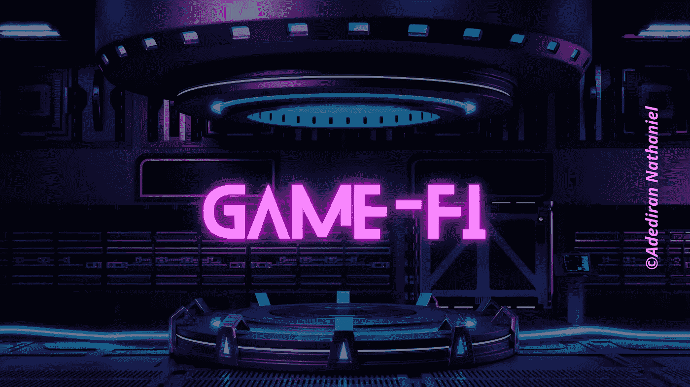

# 理解游戏-Fi 经济模型

> 原文：<https://medium.com/coinmonks/understanding-the-game-fi-economic-model-995ec20116e7?source=collection_archive---------5----------------------->

Game-Fi Economic Model

区块链博彩业发展迅速，因为它现在是玩家和企业的经济机会来源。

在过去的十年里，元宇宙、NFT 和区块链的博彩业有了惊人的发展，用户数量和公司收入都有了大幅增长。2022 年 2 月，GameFi 的总市值达到 553.8 亿美元。据进行市场研究的组织 [Absolute Reports](https://www.globenewswire.com/news-release/2022/07/26/2485687/0/en/Play-to-Earn-NFT-Games-Market-Worth-USD-2845-1-million-by-2022-2028-Opportunities-Challenges-Drivers-Trends-Key-Players-Regional-Analysis-Size-Shares-Developments-Types-Application.html) 称，到 2028 年，区块链博彩预计将达到 28 亿美元的市场潜力。

***要理解 P2E 博彩业，就必须理解支撑 P2E 博彩业的经济模式。***

# GameFi 是什么？

GameFi 是两个词的组合: ***博彩和去中心化金融(DeFi)。***

Game-Fi

GameFi 建立在区块链的基础上，在经济上奖励玩家。传统的付费游戏模式要求玩家支付大量金钱来玩游戏，与之相反，它提供了一种“玩到赚”的可能性，玩家可以从玩区块链的游戏中获利。GameFi 通过创建一个边玩边赚钱的经济框架，向世界介绍了加密货币的一个新用例。

GameFi 平台结合了区块链游戏技术和分散金融(DeFi)活动。通过完成任务，与其他玩家竞争，或通过不同的游戏关卡，玩家通常可以获得游戏内奖励，如加密令牌、虚拟土地、化身和其他非功能性游戏。一些“玩赚”游戏甚至通过挖掘流动性或将其游戏资产借给其他玩家，让玩家在根本不玩游戏的情况下产生被动收入。

> **先玩后赚游戏模式、令牌组学和令牌组学可持续性是构建游戏虚拟化项目的三大支柱。**

# 玩到赚的游戏模式。

“玩到赚”(P2E)游戏模式是发展中的元宇宙最吸引人的特色之一，它使玩家能够从他们的游戏实力中赚钱。

不可否认的是，动态生态系统有机会突出并为玩家提供可观的收入流，无论是通过完成任务还是交易游戏内的 NFT。通过参与这些游戏并获得奖励，如游戏中的 NFT 资产和可兑换成真钱的代币，玩家可以将他们的技能和时间货币化。

> 游戏赚钱的经济以玩家而非开发者为中心。

# 令牌组学

令牌组学是包括游戏在内的任何区块链项目的核心组成部分之一。

投资者特别关注项目白皮书的这一部分，并主要根据其令牌组学设计来评估游戏。这也不奇怪，因为它讨论了游戏内 NFTs 和原生令牌之间的关系，这对玩家的收入有直接影响。

为了更好地理解记号经济学在区块链空间中的含义，请阅读下面的文章。

 [## 记号组学入门指南。

### 一个项目的词汇学应该是你决定它是否是一个好项目的首要考虑因素之一。

medium.com](/coinmonks/a-beginners-guide-to-tokenomics-acb09c6e3047) 

# 游戏币组学

游戏币经济学指的是一种游戏赚钱项目在游戏中采用的经济模型。

Game-Fi Tokenomics

GameFi 项目的盈利能力将受到适当的令牌组学的显著影响。具有深思熟虑的令牌组学的项目具有越来越大的价值和娱乐性。相反，那些使用不正确的表征组学的人将最终在游戏中经历金融崩溃。

> 单令牌经济模型和双令牌经济模型是两种不同的博弈 Fi 令牌经济模型。

# 单令牌经济模型。

在单令牌经济模型中，单个令牌用于所有与平台相关的活动，包括游戏内动作、项目治理和二次经济交易。

这种模式要想获得 100%的外循环，必须有源源不断的新玩家加入，或者现有玩家必须再次投入。它的优点是作为一个简单和直接的模型。玩游戏，一个玩家只需要一个令牌，玩家交易更容易，资源整合挑战性更小。

缺点也很明显，因为所使用的代币也是玩家希望保留以增加其价值的资产。

利用单代币经济模型的 Game-Fi 项目的例子有*[*无线电台 Caca*](https://www.radiocaca.com/) 等。*

# *双令牌经济模型*

*双令牌令牌经济模型是由于单令牌经济模型在游戏 Fi 项目中的失败而引入的。*

*双代币模型是一种经济模型，具有主要代币和次要游戏内代币。主要令牌通常是治理令牌，用于实用目的，而次要令牌通常用于游戏内机制并用于安全性。双令牌系统有助于减少开放市场对游戏的影响。*

*Axie Infinity 是 NFT 的一个游戏项目，它提供了两个代币，SLP 和 AXS，这两个代币都是作为对玩游戏的用户的奖励而提供的，这是一个利用双代币经济模型的游戏保真项目的例子。*

*阅读下面的文章，了解 Axie Infinity 如何在其游戏中成功地使用双令牌经济模型。*

* [## 如何在 Axie Infinity 上玩和赚？

### 自 2021 年开始玩赚取游戏以来，对传统游戏赚取机会的渴望一直在上升…

medium.com](/@Angelnath/how-to-play-and-earn-on-axie-infinity-3441102e0dbe) 

# 令牌组学可持续性

自从区块链领域的游戏保真项目开始以来，游戏经济的可行性就一直是一个令人担忧的问题。

Token Sustainability

通货膨胀模式和通货紧缩模式之间的平衡是游戏经济可持续发展必须考虑的一个关键因素。因此，决定一个游戏保真项目如何维持游戏的经济性是至关重要的。

# 充气模型

在通货膨胀的代币经济模型中，可以创造的代币数量没有严格的上限。通货膨胀代币模型已经经历了几次迭代，一些代币发行者将代币发行限制为每年一次，一些代币发行者按照设定的时间表操作，而其他代币发行者选择根据按需信息做出供应决策。

# 通货紧缩模型

在通货紧缩的代币经济模型中，代币的生产总量有一个硬上限，因此随着时间的推移，需求会上升，而供给不会上升。由于需求的增加，代币的价值和价格也会增加。

Play to Earn games

大多数具有双令牌经济模型的游戏 Fi 项目将其治理令牌指定为通货紧缩，将其游戏内令牌指定为通货膨胀，以维持游戏令牌组学中的均衡。

# 结论

一个 GameFi 项目的衡量指标，比如新玩家数量、活跃玩家总数、产出增长的悬殊等等，都是必不可少的组成部分。随着 GameFi 的发展，新的模型和创新不断推出，每种都有优点和缺点。* 

*你觉得这篇文章怎么样？下面分享一下你的想法。*

*不要忘了订阅这个频道，继续关注游戏行业和游戏赚钱项目的更多更新。*

****只有质量含量****

> *交易新手？尝试[加密交易机器人](/coinmonks/crypto-trading-bot-c2ffce8acb2a)或[复制交易](/coinmonks/top-10-crypto-copy-trading-platforms-for-beginners-d0c37c7d698c)*