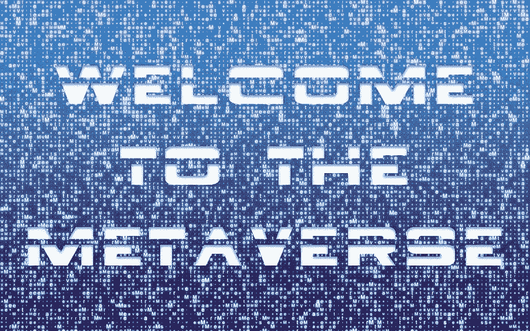

# 了解元宇宙以及为什么您应该接受它

> 原文：<https://medium.com/coinmonks/understanding-the-metaverse-and-why-you-should-embrace-it-64db08fb0995?source=collection_archive---------30----------------------->

pixabay

令人毛骨悚然的是，三十年前，作家尼尔·斯蒂芬森在他的书《冰雪奇缘》中提出了元宇宙的概念。

这部科幻惊悚片发生在 21 世纪后世界经济崩溃时期。美国的生活方式已经一去不复返了。新的现实类似于适者生存模型，其中最大的…