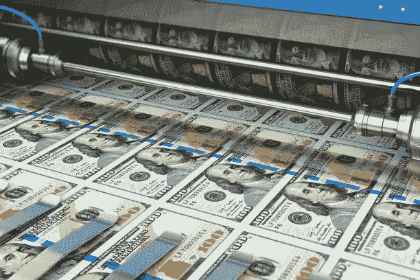
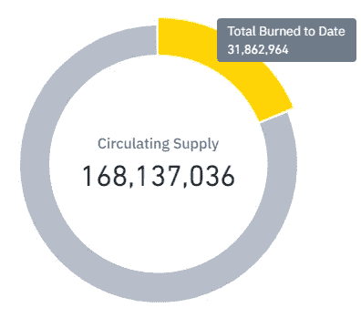
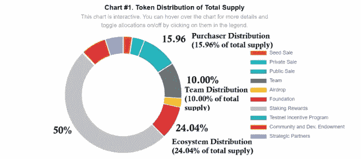

# 理解记号组学；

> 原文：<https://medium.com/coinmonks/understanding-tokenomics-1d0787c91948?source=collection_archive---------11----------------------->

## 加密货币的供给和需求

photo by scanrail on iStock

在今天的金融世界里，中央银行扮演着金融监管者的角色，控制和监督与一国货币(或国家集团)有关的一切。

中央银行是独立的机构，制定并执行旨在稳定经济、降低或避免通货膨胀的政策。他们是唯一的货币印刷商，这意味着他们控制这些货币的供应，并试图保持其价值。

这是关于记号经济学的一瞥。代币经济学是代币和经济学的结合，这直接意味着代币的经济学。本文中的代币既代表代币，也代表硬币。代币组学处理代币的创建和分发、其效用、供给和需求、燃烧计划(要燃烧并退出流通的代币量)、奖励活跃用户以及其他因素。

这些记号经济学规则是通过代码执行的(不同于法定货币)，对所有人开放，很难改变。

在分析令牌时，令牌的令牌组学应该是首先要经历的事情之一。记号组学是加密项目的一个重要方面，因为它的设计可以制造或标记它们。也是基本面分析的重要组成部分。理解它，并知道如何分析令牌和项目的令牌组学，对于做出更好的决策是必不可少的。

## **分解记号组学；元素。**

在考虑加密货币的令牌组学设计时，应该考虑以下因素。

**代币供应量:**在做研究的时候，检查任何代币的最大供应量和流通供应量是必不可少的。

BNB’s circulating supply (Feb 2022)

代币的流通供应量表示流通中的数量。更多的代币可以通过铸造加入其中，代币可以通过焚烧从流通中去除。这些都会影响代币的价格。

令牌的最大供应量仅仅意味着令牌在其生命周期内存在的总数。AVAX 最大供应量 7.2 亿币，SOL 最大供应量 4.89 亿，比特币最大供应量 2100 万。

一些代币没有最大供应量。像 USDT 和 USDC 这样的稳定货币可以一直保持供应增长，因为它们与法定美元挂钩，并根据其储备发行。

**激励机制；挖掘和赌注:**这就是代币奖励积极参与者的方式，因为这对于代币(或项目)的长期平稳运营至关重要。

挖掘:挖掘用于奖励那些为基础层区块链验证交易的人。这可以是一组计算机，它们将刚刚发现并填充了数据的新块添加到区块链中。比特币就是利用了这个机制。

打桩:这类似于采矿，最近被新的令牌和项目使用。这里，验证器在智能契约中锁定一定数量的令牌。锁定的令牌越多，验证交易的机会就越大。

**分析代币燃烧:**代币永久退出流通及其总供应量有助于增加代币价格的价值，因为稀缺性会导致更多的需求。

一些代币每隔一段时间就会燃烧一定的数量，例如 BNB 每季度燃烧一次，直到流通总量的 50%被销毁。而以太坊在 2021 年开始烧 ETH。

代币供应量的减少会导致通货紧缩，而代币供应量的持续增加会导致通货膨胀。

**代币分配:**代币的分配是需要注意的一个重要方面，因为它对代币的现在和未来价值也起着巨大的作用。

代币通过公平发布或开采前发布进行发布。在公平发行中，代币以相同的时间和速率向市场发行，不会提前给任何人发行。Btc 就是这一类的一个例子。

AVAX’s token distribution

在开采前启动阶段，在向公众发布之前，会向特定群体分配和发放一定数量的资源。这可以是空投或者允许机构投资者投资。ETH 和 AVAX 就是这样的例子。

持有大量代币的机构投资者或大投资者可能会导致未来价值损失，因为他们可以随时抛售代币。但是，如果创始团队成员和优秀的投资者持有一个令牌，长期的成功将是可以实现的。

令牌的某些部分也可以被锁定，在特定时间被释放。请注意这一点，如果将来要发行大量的令牌，这可能会对令牌的价值产生负面影响。

总之，研究和分析代币的代币组学对于做出更好的投资选择至关重要，应该在购买任何代币之前进行。这种分析应该基于许多单独的因素，但也应该作为一个整体来分析。

通过一个令牌的经济性，它将如何被使用和它的可扩展性将变得清晰。

总是检查令牌组学！

> 交易新手？试试[密码交易机器人](/coinmonks/crypto-trading-bot-c2ffce8acb2a)或[复制交易](/coinmonks/top-10-crypto-copy-trading-platforms-for-beginners-d0c37c7d698c)