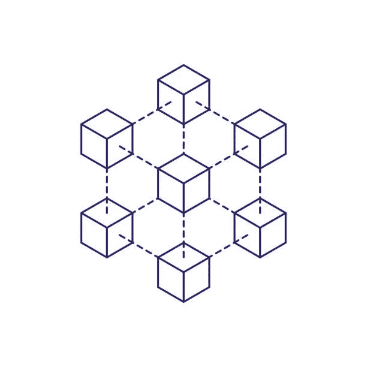

# 了解事务最终性

> 原文：<https://medium.com/coinmonks/understanding-transaction-finality-310e46b47a22?source=collection_archive---------19----------------------->

Source: iStock

交易最终性是保证交易一旦完成就不能被撤销、更改或取消。区块链的速度会影响链条终结的速度。

终结性的主要用途是测量用户接收到在链上执行的加密事务是最终的(不可逆转或更改)的保证所花费的时间。

终局性在金融中非常重要，因为完成一项交易花费的时间越长，出错或发生意外的风险就越高。这就是为什么加密交易具有快速终结率将是关键，因为企业和用户不希望无休止地等待交易被确认。

交易终结有三种类型:概率终结、确定性终结和经济终结

**概率终结**

在概率终结中，随着更多的块被产生并在事务之后被添加到区块链，事务被认为是最终的。这意味着添加的块越多，在区块链中连接和引用的事务就越多，使其更难被更改或撤销。这种方法依赖于随着更多块的加入，有缺陷或坏块将被检测到的概率。由于区块链的连续性质，在添加新块之前，挖掘器或验证器总是检查先前的块。创建下一个区块的一方通常是随机的，使得单个一方不可能添加两个后续区块，从而降低了欺诈的可能性。

使用概率终结性的协议具有在事务之后添加的固定数量的块，因为它被认为是最终的。例如，在比特币区块链中，一方必须等到添加了六个额外的区块后，交易才算完成。今天大多数网络使用概率终结。一个主要的缺点是，在这种方法下，一些网络达到终结需要时间。以比特币区块链为例，平均阻塞时间(区块链网络确认交易所需的时间)或延迟为 10 分钟。比特币需要六个额外的区块才能最终完成交易，这意味着在交易最终完成之前需要大约 60 分钟或 1 小时(6 个区块 x 10 分钟)。尽管有些网络的阻塞时间较短，例如 BNB 的阻塞时间为 3 秒。

**确定性终结**

在这种方法中，交易在加入区块链后立即被视为最终交易。领导者节点必须提出要添加的块，然后大多数人(通常 66%的验证者)必须在它成为最终之前批准事务。然而，确定性终结不像概率性终结那样常见，仅由基于拜占庭容错(BFT)的算法提供。

基于拜占庭容错(BFT)的协议被构建来抵抗源自[拜占庭将军问题](https://academy.binance.com/en/articles/byzantine-fault-tolerance-explained)的故障类型。在构建 BFT 协议时，有多种方法可以解决拜占庭将军问题中的困境。其中之一是确保至少有 2/3 或更多的可靠和诚实的网络节点。这意味着只有当大约 66%的网络决定恶意行为时，系统才可能遭受攻击。

即使当一些节点拒绝与其他节点同步或选择恶意行为时，BFT 协议也可以继续运行。

许多利害关系证明网络使用 BFT 算法来达成共识和终结。这些算法也被称为决赛小工具。这些包括嫩薄荷，卡斯帕 FFG，爷爷，龙葵终结小工具和 Afgjort，HotStuff，Doomslug 等。

**经济终结**

这种方法使用财务激励来防止恶意验证者试图更改或撤销交易。这个概念是基于这样一种想法，即在某一点上，改变系统的成本太高了。在 POS 区块链中使用经济终结，验证者需要标记令牌来保护网络。由于验证者在网络上削减令牌的可能性，恶意方将被阻止，因为他们不想丢失他们的赌注令牌。

**结论**

快速安全的交易终结对于任何区块链的扩展都至关重要。每个区块链都需要采用适合其用例并能为其所有用户服务的终结协议。交易终结将成为加密货币广泛采用的关键驱动因素之一，因为用户已经在 Tradfi 中享受到相对快速的交易完成。用户不会希望转而使用速度更慢的加密货币，尽管它比传统金融系统更加分散和安全。

**来源和参考:**

1.  [区块链的终结](/minima-global/finality-in-blockchain-e5a62ca0f9f4)
2.  [交易终结(概率性/确定性)](https://smithandcrown.com/glossary/transaction-finality-probabilisticdeterministic/)
3.  [LayerX 研究:终结小工具](https://scrapbox.io/layerx/Finality_Gadget)
4.  [拜占庭容错解释](https://academy.binance.com/en/articles/byzantine-fault-tolerance-explained)

> 交易新手？试试[加密交易机器人](/coinmonks/crypto-trading-bot-c2ffce8acb2a)或者[复制交易](/coinmonks/top-10-crypto-copy-trading-platforms-for-beginners-d0c37c7d698c)