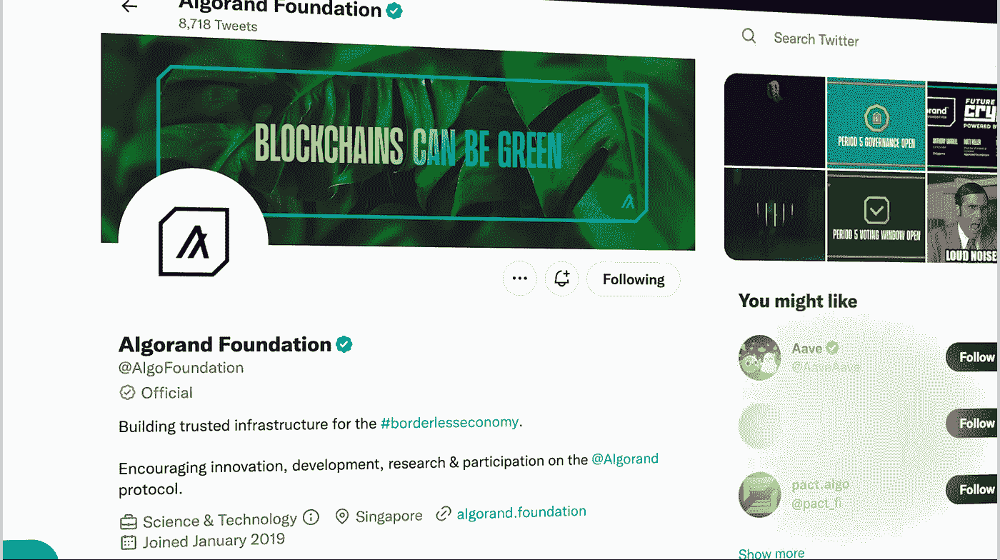
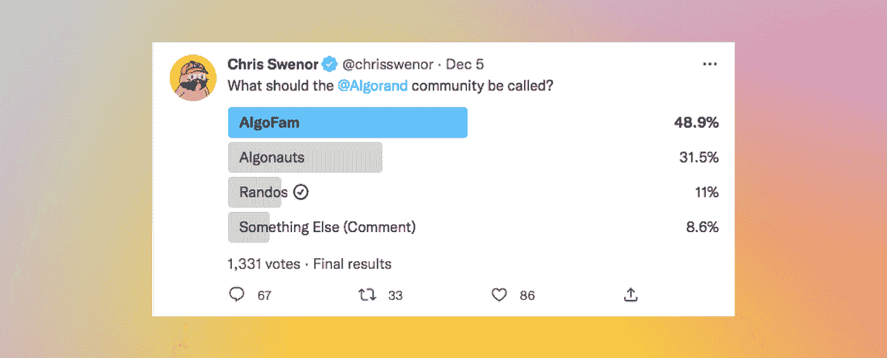

# 理解加密社区中的部落主义，特别是 algrand——它会导致区块链的垮台吗？

> 原文：<https://medium.com/coinmonks/understanding-tribalism-in-crypto-communities-specifically-algorand-could-it-lead-to-a-495e08ac6255?source=collection_archive---------37----------------------->

这个博客是阿尔格兰德区块链的数字收藏品。如果你想买这篇文章的出版权，去[*token blogs . app*](https://tokenblogs.app/listing/buynow/973824074)

> *部落主义的定义—* 强烈的群体内忠诚。

我第一次接触加密货币是在 2015 年，我深情地记得在 2018 年 1 月 3 日卖掉了我的密码。我打扫干净了吗？没有你想的那么多，但不管怎样，我所取得的任何收益都慢慢地被网络钓鱼诈骗和毫无价值的 ico 骗走了。尽管如此，随着比特币、Opensea、去中心化金融以及最近的赌注平台的兴起，我已经学会了一套仔细观察加密项目的技巧。现在快进到今天，2022 年底，我得到的一个启示是，社区比产品更重要。

你可能需要几年时间才能来到 mainnet，并不断推迟你的发布，但如果你有一个充满活力的 Twitter 追随者，他们有自己的标签，NFT 收藏，独特的短语，你最终会创造出一个令人难以置信的忠诚的追随者，他们只需要社会团队的一些更新和参与，就可以让他们保持平静。

本文无意以任何形式诋毁加密货币社区或其用户；这些只是我所做的一系列观察，实际上我认为任何加密项目的目标实际上都是让他们的**任务**围绕他们的业务创建*邪教*或*部落*，因为它刺激病毒式传播和指数式增长。

部落主义和区块链之间的比较，在这篇文章中，将具体指的是阿尔格兰德；一个我已经加入超过 2.5 年的组织。我将探索这些社区是如何开始的，他们的动机是什么，共同的兴趣是如何随着这些群体的新术语的形成而发展的。更重要的是，我将深入探讨区块链基金会在管理这些社区方面的挑战性角色，或者他们是否应该真正注意到这一点。

# 定义部落主义

部落主义的定义意味着， ***【强烈的群体内忠诚】*** ，完美地概括了这一点。但是他们是如何开始的，是什么吸引了他们的成员？

在这样一个相互联系的世界里，没有比 Twitter 这样的平台更好的了，它能让用户与全球受众分享简短的文本信息，从而即时激发对话。我对阿尔格兰德的了解是通过崇高的 T2 YC 支持的房地产创业公司建立在阿尔格兰德的基础上。有了房地产方面的背景，我立刻被吸引住了，心想这真是太棒了。后来点击了几个社交链接，我关注了许多 Algorand 项目，我的 Twitter 时间表到处都是$algo #ALGO #algofam 标签。

你无意中加入了 algo 社区，因为你必须跟随这个领域的每个人，以便在新闻周期中占据优势，并尽可能多地了解区块链以及从中涌现的新创业公司。

有趣的是，当我加入阿尔格兰德公司时，这里没有 dApps。NFTs 刚刚开始， [Ab2 画廊](https://ab2.gallery/)开始起飞。

# 组成一个部落

所以这一切都很友好和有趣，一些人在 Twitter 上分享 Algorand 新闻，彼此的兴奋在互联网上流露出来——无害的，对吗？当然，社区和部落不一定有负面的含义，因为它可以只是在一个共同的地方分享想法。

在我的研究中有趣的是，部落是人类进化的产物。我们通常不喜欢大群体和在大群体中同化。我们喜欢在我们的社区中有清晰可辨的特征，无论是我们的名字、NFT 个人资料图片还是共同的想法。我们很大程度上喜欢根据自己的信念组织自己，并为此奉献一生。没有比区块链更值得你奉献一生的信仰了——这是一项创新的改变游戏规则的技术，完全重新定义了所有权，并能提供世代财富的机会。许多人会认为这是阿尔格兰德。

# 社区如何转向部落主义？

> 部落主义意味着拥有强烈的文化或种族特征，将一个群体的成员与另一个群体的成员区分开来。

# 是什么让阿尔格兰德变得如此部落化？

其他区块链也有自己充满活力的社区，他们也相信自己的连锁店是最好的……但不像阿尔格兰德社区。

无法妥协和看到任何其他区块链的观点是不可能的阿尔格朗用户，因为他们相信他们的技术优于其他任何东西。然而，他们确实有道理。希尔维奥·米卡利创立的 L1 链没有停机时间，零碳排放，即时终结。因此，人们可以看到，事实上阿尔格兰德社区*有理由成为这项技术的热心倡导者。*

*我想引用特伦斯·麦肯纳的这句话:*

> *“部落主义是一种可以存在于任何技术水平的社会形式。把它和低水平的技术联系在一起完全是一种错觉。事实上，它可能是一种社会组织形式，其持久能力仅次于家庭”。*

*因此，他们焦虑和沮丧背后的动机可能源于这样一种信念:他们的*技术是最好的，应该是市场的领导者。其他的不满包括阿尔格兰德想要成为 [CMC](https://coinmarketcap.com/) 的前五名，拥有两位数的象征性价格，甚至可能受到竞争对手链中其他社区的尊重。**

> *你不再仅仅把自己看作或认同为一个部落的成员，而是一个为共同目标而努力的民族的公民― Idowu Koyenikan。*

# *社会结构是如何形成的？*

*社区形成于成员之间的共同兴趣和相似之处，通常来自面对面的接触。这一切都是在网上完成的，怎么可能发生呢？*

# *你如何识别阿尔格兰德社区？*

# *。algo 手柄*

*。algo 是由 [NFDomains](https://nf.domains/) 为用户创建的 Algorand 命名服务，是该领域最成功的产品之一，迄今为止已售出超过 300 万个 Algos。用户通常将他们的。algo handle 作为他们的 Twitter 显示名称，并允许其他用户查找和检查他们的 NFT 和社交句柄等。*

# *NFT 个人资料图片*

*algofam 社区的大多数用户也有相应的 Algo NFT 作为他们在 Twitter 上的显示图片。这些可能是最新的系列或永恒的经典，但这与一个. algo 域结合在一起，立即表明你在社区中，你认识到这项技术有多棒。*

# *术语*

> **识别一个社区的一个关键区别因素是他们何时使用自己的语言专门称呼“* **人** *”或何时描述自己****。****

***这些是关键的标识符，允许用户立即发现新成员并达成共识。最近，Reach 联合创始人克里斯·斯温诺(Chris Swenor)进行了一项民意调查，旨在找出会员的最佳名字。***

******

***免责声明:仅仅因为你有一个 nfd，一个 nft pfp 或者说 algofam 并不意味着你在一个邪教或者一个部落里。写完博客。***

# ***这些只是相似性标识符，还有什么统一了 Algorand 社区？***

***除了对链的共同兴趣和对数字艺术的热爱，我认为还有更多统一的特征可以在追随者之间建立更强的联系。***

# ***象征性价格***

***由于 ALGO 是这种虚拟的数字货币，它偶尔会像一堆“可有可无的有趣代币”，因为投资者可能会一直持有，直到一个不切实际的价格，因此更愿意逢低买入，并将其用于非金融交易。***

***当社区说“ALGO 永远不会回到 1 美元以下……”或“ALGO 到 2023 年将回到 5 美元”时，它可以引发对 FOMO 的深刻感受，吸引社区购买更多的“低吸”并增加他们的头寸。***

***但是当经济衰退来临时，ATH 的代币价格下降了 90%,就像我们现在这样，社区会*变得焦躁不安，并在 Twitter 上抱怨，这是可以理解的。无论是实现还是未实现的 pnl，每个人都在赔钱。这创造了一种团结的感觉，因为“我们在一起”，这给他们带来了安慰，因为他们知道他们不是唯一一个在水下的人。但是谁该为他们的损失负责呢？他们认为 Algorand 是最高级的加密货币，并把厨房水槽押在了 10 美元上。那么为什么 Algo 的表现并不比 SOL 或者 ASA 好呢？为什么我付的钱比他们少？****

# ***进入阿尔格兰德基金会***

***现在部落需要一个领袖来加强忠诚、服从和吸引新成员。我认为该基金会是阿尔格兰德社区的领导者，因为他们负责传递消息，通知我们协议的更新，并被迫增长链。当社区内开始出现对*兵变*的不信任和抱怨时，他们会立即在基金会发推特。***

> ****“当领导者采取立场，当他们与他们的部落联系时，当他们帮助部落联系自己时，他们就是领导者。”――Seth Godin，部落:我们需要你来领导我们。****

***阿尔格兰德社区的另一个共同点是对阿尔格兰德基金会的不信任或缺乏信任。区块链基金会本质上管理该链，处理建立在其上的项目，并负责业务发展，而公司建立它并改进协议。***

***在过去的一年中，机构群体出现了各种公开的焦虑事件，即关于现在已经破产的 3AC 的 OTC 交易；对霍德瑙特和各种赞助的 3500 万美元损失。这经常导致针对基金会及其工作人员的公开帖子被撰写，导致来自社区的大量沮丧的消息，所有这些都增加了彼此的不满。就我个人而言，我总是优先考虑私人信息，而不是公开诽谤，因为这可能会意外地导致用户离开敌对部落，并由于不良的在线情绪和激烈的社区而推迟未来的开发者和企业。然而，伊西·格林斯班提出了一个很好的观点，“试着想想其他人来自哪里，而不是部落主义。”伊西·格林斯班，时尚芭莎，2022 年 11 月 17 日。人们在一个项目中的挫败感能显示出他们有多热情，有多渴望成功吗？***

***在我的介绍中，我说基金会应该关注社区吗？“社区建设”和参与式农业的结果是，你会在不经意间围绕你的产品创造出一种*崇拜*和*部落主义*。不管这是不是故意的，这取决于领导者如何保持团结，让他们的追随者快乐和忠诚，以努力保持增长。*“如果没有领袖来建设部落，平庸的文化将会盛行。没有一个有灵感的部落，领导者是无能的。”* ―戴夫·洛根，*部落领导:利用自然群体建立一个繁荣的组织****

***现在，就我个人而言，我确实相信阿尔格兰德社区在他们与基金会的沟通中有大量的权利。成员们总是发号施令，要求领导层对与他们无关的事情做出解释。***

***事实上，我认为 crypto 吸引了那些只为钱而来、读过百万富翁故事的人，他们在研究后强烈认为 Algorand 是下一枚让他们致富的硬币。因此，当他们看不到巨大的收益时，他们的愤怒和沮丧会召集他们部落中的军队，要求立即给出答案并改变政权。***

***部落主义的负面影响开始显现。各种网络暴力都有可能发生，比如侮辱和辱骂。长期的后果可能会使区块链两极分化，名声不佳，而且不管技术如何都极具破坏性。***

***企业明白，哪怕是一丁点儿的错误信息都可能造成严重损害——不仅损害市值，还会损害他们的网上观感。***

# ***结论:实际上是一个部落吗？***

> ****“一群高尚的个体道德家，在社交媒体上攻击道德上对立的观点，不是一个部落。这么说是对部落社会微妙的合作生活的侮辱。”――杰拉尔德·f·高斯，开放社会及其复杂性****

***高斯在这里提出了一个很好的观点，也许它是一个社区而不是一个部落。如果会员愿意在熊市或财务收益损失时离开，那么他们显然不是他们应该放弃的基础技术的狂热信徒。代币价格是社区焦虑的集中点，但当所有市场都关闭时，你怎么能责怪基金会呢？诚然，相对于价格的历史低点，有些市场比其他市场更重要，但加密市场与 BTC 密切相关；因此，当市场情绪发生变化、购买压力在 ALGO 重现时，价格肯定会上涨。***

***我不得不得出结论，algofam 不是一个普通的加密社区，而是由于 Algorand 的卓越技术，该社区正在落后——它导致人们坚定不移地认为**这个** [Algorand]是最卓越的链；然后你再加上低估值和 it 领导的缓慢沟通——结果就是一个部落主义的环境。***

****这个博客是阿尔格兰德区块链的数字收藏品。如果你想购买这篇文章的出版权，请前往*[*token blogs . app*](https://tokenblogs.app/listing/buynow/973824074)***

****本文是数字收藏品，可以在*[*token blogs*](https://tokenblogs.app/admin/mint)*上购买，给你在自己平台上使用的出版权。* *****

> ***交易新手？在[最佳加密交易](/coinmonks/crypto-exchange-dd2f9d6f3769)上尝试[加密交易机器人](/coinmonks/crypto-trading-bot-c2ffce8acb2a)或[副本交易](/coinmonks/top-10-crypto-copy-trading-platforms-for-beginners-d0c37c7d698c)***