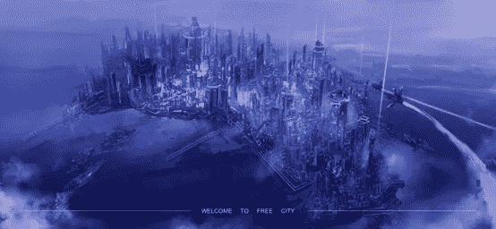
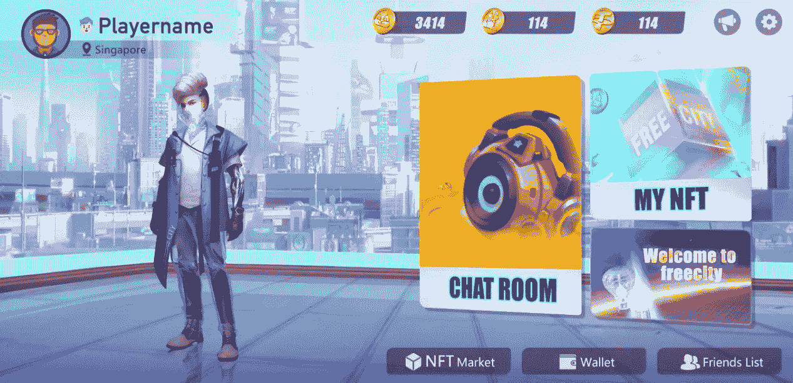
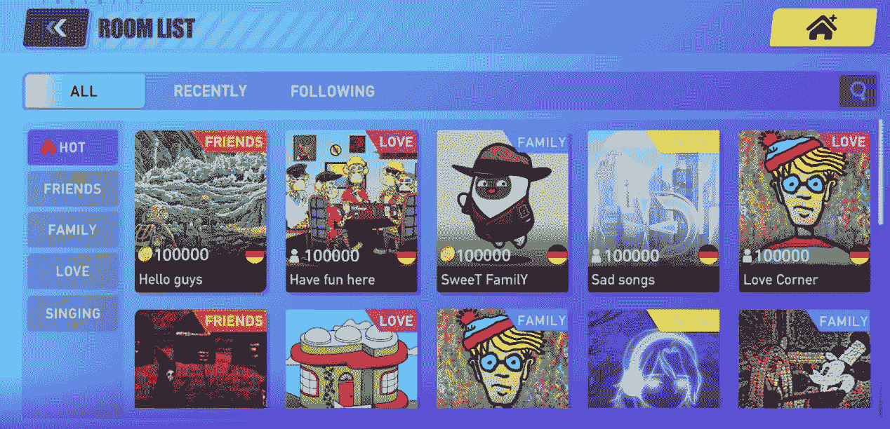
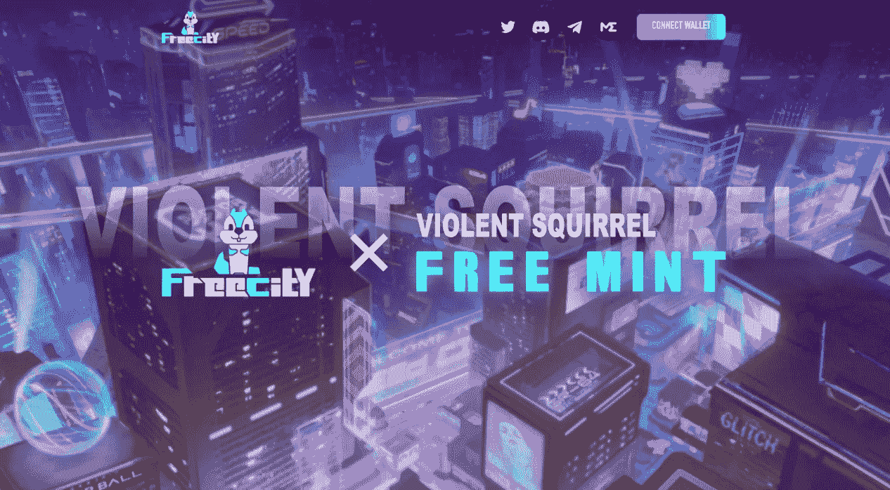

# Web3.0 热浪中的独角兽——自由城的黑马潜力

> 原文：<https://medium.com/coinmonks/unicorns-in-the-web3-0-heat-wave-the-dark-horse-potential-of-freecity-eabeea125549?source=collection_archive---------23----------------------->

**web 3.0 中 SocialFi 的未来**

Welcome to FreeCity

在21 世纪，社交媒体已经成为我们社会真正重要的一部分。从 MySpace 的诞生到脸书、Twitter 的出现，再到关注生活方式的 Instagram。所有这些都是 Web 2.0 带来的热潮的一部分，这些平台的引入凸显了许多问题， [Web 3.0](https://www.blogs.free-city.io/web-3-0-and-the-future-of-internet/) 可以很好地接管这些问题。Web 3.0 将改变社交媒体和在线内容的模式。

Web 2.0 的社交媒体模式以积累用户的海量数据为前提，这样只有少数公司(如 Meta)控制市场，后者可以利用这些数据获得广告收入。然而，这些平台的用户本身并没有从他们产生的数据中受益。分散式网络将有可能改变这种权力平衡。

在 [Web 3.0](https://www.blogs.free-city.io/web-3-0-and-the-future-of-internet/) 场景中，网络将由社区所有，而不是由中央机构所有。平台的治理，规则的设定，平台的一般运营都会回到用户身上，更大份额的潜在利润也会回到用户身上。在一个去中心化的平台中，一个人的价值，以及最终他们的活动，很大程度上决定了他们的身份以及他们在平台上创造的价值。

作为数字账本，区块链的作用至关重要。用户的个人资料将被放在他们自己的 Web 3.0 应用程序中，该应用程序可以在任何去中心化的平台上使用。这种跨平台的集成被称为[元宇宙](https://www.blogs.free-city.io/what-is-metaverse/)，用户所做的一切或交易也将被存储在[区块链](https://www.blogs.free-city.io/introduction-to-blockchain-technology/)上，以实现透明和安全。

> 交易新手？尝试[加密交易机器人](/coinmonks/crypto-trading-bot-c2ffce8acb2a)或[复制交易](/coinmonks/top-10-crypto-copy-trading-platforms-for-beginners-d0c37c7d698c)

**什么是 FreeCity？**

F reeCity 是一种共识[元宇宙](https://www.blogs.free-city.io/what-is-metaverse/)建立在[区块链技术](https://www.blogs.free-city.io/introduction-to-blockchain-technology/)之上，基于 3D 虚拟图像和虚拟城市。随着用数字社交取代真实社交的愿景，这是一个未来的城市，社会影响力将从基于人群转变为金融化和符号化。

FreeCity Overview

在 GameFi 1.0 时代，游戏赚钱的概念需要特定应用程序的持续活动，这些应用程序通常是由最初的开发者创建的。[自由城市](https://www.free-city.io/)想要找到一种方法来奖励和激励互联网计算机上的所有类型的活动。

**“参与赚取”模式**

F reeCity 首创“Engagement-to-Earn”模式，最大程度的丰富了元宇宙社交场景，让资产为拥有者赚取被动收入，以更多的游戏内消费维持经济运行。通过社交共识生态和丰富的游戏玩法，快速建立共识，融合更多娱乐方式和使用场景。从而最终形成飞轮效应。

*FreeCity App Interface*

在这个自由的城市里，社交网络是核心，3D 头像、金融领地、金融麦克风和 [NFT 市场](https://www.blogs.free-city.io/what-is-nft-how-is-it-related-to-metaverse-and-gaming/)是玩家展现社交价值的工具。FreeCity 的愿景是把玩家的社交价值当做平台的“哈希力”。展现其社会价值的玩家将产生平台的治理令牌，对整个城市进行治理、定制和铸造。FCC 是自由城的治理令牌，总供应量 100 亿。FCC 持有者可以在令牌上下注，玩游戏，参与相关治理投票，他们将获得奖励。更有甚者，玩家可以通过在自由城玩各种游戏，完成各种任务来赚取 FCC。

**核心玩法**

金融麦克风展示了自由城玩家的社会价值。 [NFT 麦克风](https://www.free-city.io/)的质量越高，玩家的追随者就越多。麦克风充分结合了 [GameFi](https://www.blogs.free-city.io/gamefi/) 和 [SocialFi](https://www.blogs.free-city.io/socialfi-and-web3/) 的概念，诠释了整个平台关于“赚”的核心。

F reeCity 玩家以麦克风的形式为自己配置 NFT，加入城市建筑中多样化的语音室，通过语音聊天来展现自己的社交价值。这样他们就能获得他人的认可并获得象征性的奖励。不同品质的麦克风对应不同的社会地位。玩家所有的努力都是为了拥有更多的关注者，创造更大的社会价值来增加收入。任何人都可以在平台上创造自己的价值。

Core Gameplay

**全新的模式转变**

F reeCity 吸取了教训，避免了 [GameFi](https://www.blogs.free-city.io/gamefi/) 1.0 的短期资本运作模式。合理高效的良性经济模式，通过设计一个具有创新功能的元宇宙应用生态，促进整个元宇宙生态的长远发展，提高用户粘性，聚焦乐趣。系统为用户提供高端体验，让用户在参与的过程中获得快感和满足感，从而达到经济收益和精神满足的双重目的。

自由城市的愿景不局限于游戏或社交，而是成为一个充满无限遐想的元宇宙世界。为此，我们将进一步完善 Defi 和 NFT 基础设施建设，逐步形成游戏、、DEX、道治等覆盖 [NFT](https://www.blogs.free-city.io/what-is-nft-how-is-it-related-to-metaverse-and-gaming/) 、DeFi、[元宇宙](https://www.blogs.free-city.io/what-is-metaverse/)的闭环全生态产品。每个人都可以参与元宇宙生态的方方面面，享受一切。可想而知，这是一款全新的车型。

**免费薄荷赠品**

FreeCity X Violent Squirrel FREE MINT

F reeCity X 暴力松鼠白名单事件正在如火如荼的进行中。每个完成任务的地址都将有机会获得白名单，每个地址只能释放一只暴力松鼠 NFT。首批暴力松鼠免费薄荷名额 2000 个，将于 7 月 22 日活动结束时选出优胜者。此外，我们计划赠送 1000 USDT。幸运的 30 名获奖者将每人获得 33 USDT！点击获取白名单，加入元宇宙世界的自由城！

【https://gleam.io/zORJ0/ongoing-free-mint-wl-giveaway】事件链接:

我们很高兴能与您分享这一旅程！

欲了解更多信息，请访问任何免费的城市社交网站； [**网站**](https://www.free-city.io/) **|** [**中**](/@freecity)|[**不和**](https://bit.ly/FreeCity_Discord) **|** [**电报**](https://bit.ly/FreeCity_Telegram) **|** [**推特**](https://twitter.com/FreeCity_OS)**|**[**insta gram**](https://www.instagram.com/freecity_official/)