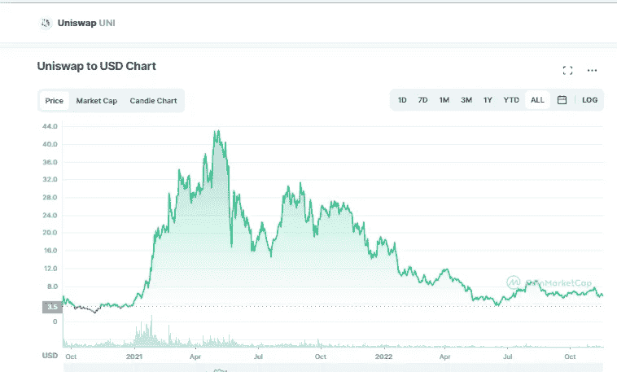

# UNI WAP(UNI)2022–2025 年价格预测

> 原文：<https://medium.com/coinmonks/uniswap-uni-price-prediction-2022-2025-4f73d4f055e3?source=collection_archive---------37----------------------->

Source photo [Uniswap price today, UNI to USD live, marketcap and chart | CoinMarketCap](https://coinmarketcap.com/currencies/uniswap/)

## 什么是 Uniswap？

Uniswap 是一个流行的以太坊区块链分散交易系统，目标是实现 DeFi 令牌的自动化交易。基于 ERC20 标准的令牌，如以太坊的本地 ETH 令牌，可以在用户之间进行交易，这要归功于该协议。没有中间人，任何有以太坊地址的人都可以增加交易所的流动性和利润…