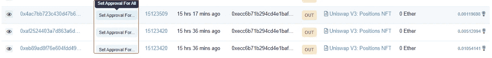
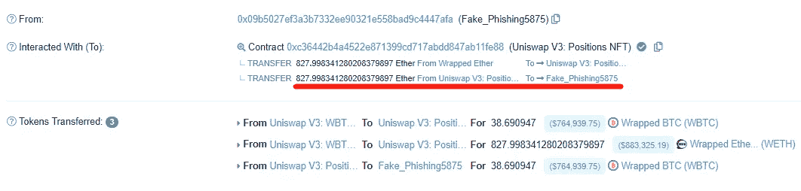

# uni swap V3--新的网络钓鱼骗局？

> 原文：<https://medium.com/coinmonks/uniswap-v3-new-phishing-scam-97f43f7b423a?source=collection_archive---------3----------------------->

## 0x01 预览

**币安** CEO 创始人声称他们的威胁英特尔在区块链联邦理工学院的 **Uniswap V3** 上发现了一个潜在漏洞。黑客目前已经盗取了 4295 个 ETH，他们正在通过**龙卷风现金、**地址洗钱

[https://ethers can . io/address/0x 09 b 5027 ef 3a 3b 7332 ee 90321 e 558 bad 9 c 4447 AFA # internal tx](https://etherscan.io/address/0x09b5027ef3a3b7332ee90321e558bad9c4447afa#internaltx)

几个小时后，多名 Twitter 用户发帖称，黑客攻击中转移资金的交易没有任何异常，并表示这是一次**网络钓鱼攻击**，这意味着此次入侵对 Uniswap 本身没有风险。

在 CZ tweed 提到它与 uniswap 团队连接之后。协议是安全的。该攻击看起来像是网络钓鱼攻击。两队反应都很快。一切都好。抱歉，警报响了。学会保护自己免受网络钓鱼。不要点击链接。

## 0x02 更多详细信息

**攻击者地址**

0x 3 cafc 86 a 98 b 77 eed CD 3 db 0 ee 0 AE 562d 7 Fe 1897 a 2

0x 09 b 5027 ef 3a 3b 7332 ee 90321 e 558 bad 9 c 4447 AFA

**进攻者合同(**UniswapLP.com(UniswapLP.com)**)**

0 xcf 39 b 7793512 f 03f 2893 c 16459 FD 72 e 65 D2 ed 00 c

**受害者地址**

0 xec 6b 71 b 294 CD 4 E1 BAF 87 e 95 FB 1086 b 835 bb 4 EBA

0x 15 c 853 BD AFC 9132544 a 10 ed 222 aeab 1 f 239414 Fe

0 xc8 c 9771 b 59 F9 f 217 e 8285889 b 9 cdd 7 b 9 ddce 0 e 86

**unis WAP V3:NFT 阵地**

0xc 36442 b4a 4522 e 871399 CD 717 abdd 847 ab 11 Fe 88

**0x03 攻击分析**

1.攻击者提前部署了攻击合同($ UniswapLP.com(Uniswap . com))，注意这里的名字，里面的一些关键信息包含了 unis WAP 和 UniswapLP.com 的网址，仔细查看后会发现并不是官方的 unis WAP 网址，仔细看了会发现和官网很像。

2.Uniswap V3:通过攻击合同定位 NFT (UNI-V3-POS)合同调用，将名为(＄UniswapLP.com(UNI WAP . com))的资金发送到受害者的地址。

这一步也是网络钓鱼攻击的关键，通过发送名为($ UniswapLP.com(unis WAP . com))的代币资金，它会给资金接收者一种错觉，认为 Uniswap V3 已经将 UniswapLP.com 发送到了接收者的地址，此时攻击者可能会访问 UniswapLP.com 网站并进行下一步。

> 交易新手？尝试[加密交易机器人](/coinmonks/crypto-trading-bot-c2ffce8acb2a)或[复制交易](/coinmonks/top-10-crypto-copy-trading-platforms-for-beginners-d0c37c7d698c)

3.受害者点击网址，授权他的资金到攻击者预先写好的地址。请看下面其中一名受害者的具体行动。受害者执行多个 setApprovalForAll 授权。

查看任何交易的详细信息

可以清楚地看到，受害者调用 Uniswap V3 的 setApprovalForAll 方法:posses NFT 契约将其 NFT 资产授权给攻击者的地址。

4.成功授权后，攻击者使用授权帐户将受害者的 NFT 资产转出。

5.攻击者通过 Uniswap V3:头寸 NFT 合同将 NFT 资产转换为 ETH 资产。

攻击者最终将获得的 7,500 ETH 转移到了龙卷风。现金混搭平台。

## 0x04 摘要

上述事件揭示了攻击者主要使用社交工程和社交网络钓鱼的混合来引诱用户点击钓鱼网站并授权他们的 NFT。然而，与大多数以前的网络钓鱼事件不同，这种网络钓鱼攻击的初始阶段是在区块链浏览器中展开的，通过伪造合同名称和硬币产品来迷惑用户，并最终诱使用户授权他们的 NFT 资产。

**安全建议**

1.  当访问一个不特定的网站时，一定要仔细检查它是否是预定的官方网站。
2.  如果你认为你受到了这些骗局的影响，请确保通过 [https://revoke.cash](https://t.co/9JJbceL1xf) 撤销对你所有 NFT 的访问，或者尽快将它们转移到硬件钱包中。

> 加入 Coinmonks [电报频道](https://t.me/coincodecap)和 [Youtube 频道](https://www.youtube.com/c/coinmonks/videos)了解加密交易和投资

# 另外，阅读

*   [氹欞侊贸易评论](https://coincodecap.com/anny-trade-review) | [霍比融资融券交易](/coinmonks/huobi-margin-trading-b3b06cdc1519)
*   [分散交易所](https://coincodecap.com/what-are-decentralized-exchanges) | [比特 FIP](https://coincodecap.com/bitbns-fip) | [Pionex 审查](https://coincodecap.com/pionex-review-exchange-with-crypto-trading-bot)
*   [用信用卡购买密码的 10 个最佳地点](https://coincodecap.com/buy-crypto-with-credit-card)
*   [最好的卡达诺钱包](https://coincodecap.com/best-cardano-wallets) | [Bingbon 副本交易](https://coincodecap.com/bingbon-copy-trading)
*   [如何给 MetaMask 钱包添加 Arbitrum？](https://coincodecap.com/how-to-add-arbitrum-to-metamask-wallet)