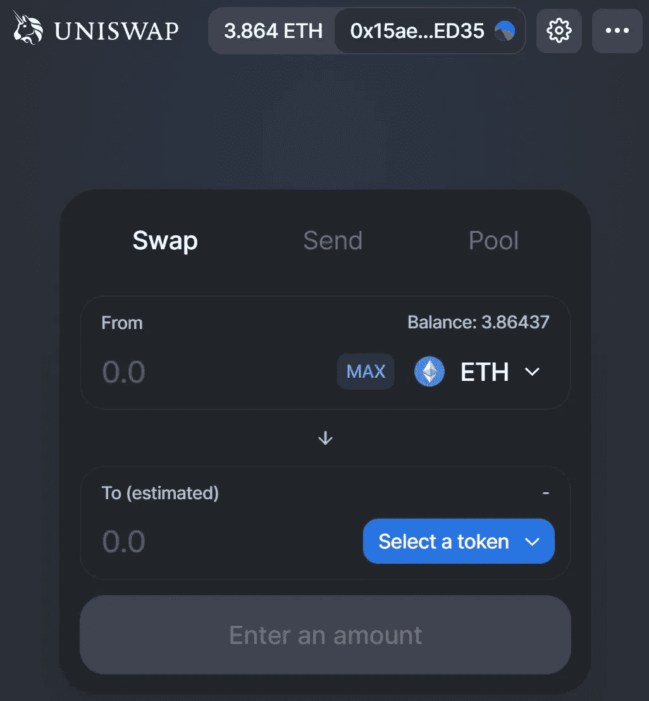
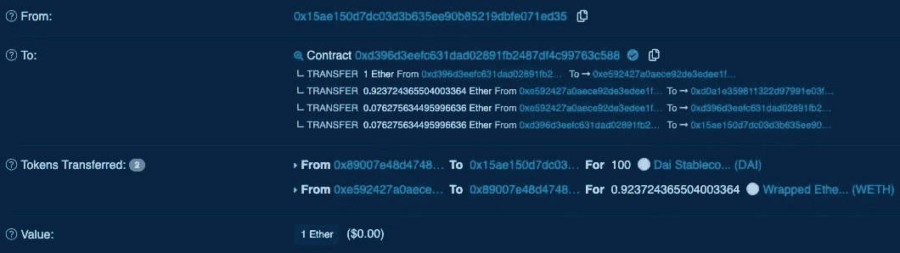
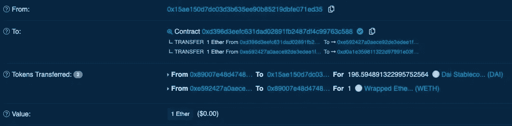

# Uniswap v3。使用您的合同

> 原文：<https://medium.com/coinmonks/uniswap-v3-using-to-your-contracts-19032a62e4e8?source=collection_archive---------3----------------------->

*uni WAP v3 的新增功能以及如何集成 uni WAP v3*


如果你还不熟悉 Uniswap，它是以太坊上自动化流动性供应的完全去中心化的协议。一个更容易理解的描述是，它是一个依赖外部流动性提供商的分散式交易所(DEX)，可以向智能合约池添加令牌，用户可以直接交易这些令牌。

因为它是在以太坊上运行的，我们可以交易的是以太坊 ERC-20 代币。每种代币都有自己的智能合约和流动性池。Uniswap 是完全分散的，对可以添加哪些令牌没有限制。如果还没有令牌对的合约，任何人都可以使用他们的工厂创建一个，任何人都可以向池提供流动性。每笔交易收取 0.3%的费用，作为对流动性提供者的激励。

代币的价格由资金池中的流动性决定。例如，如果用户用**托 EN2** 购买**托 EN1** ，那么库存中**托 EN1** 的供应量将会减少，而**托 EN2** 的供应量将会增加，托 EN1 的价格将会上涨。同样，如果用户正在出售**托克 EN1** ，那么**托克 EN1** 的价格将会下降。因此，代币价格总是反映供求关系。

当然，用户不一定是人，也可以是智能合同。这使我们能够将 Uniswap 添加到我们自己的合同中，为我们合同的用户增加额外的支付选项。Uniswap 使这一过程非常方便，见下文如何整合它。



# UniSwap v3 有什么新功能？

您可以在这里阅读更多关于 Uniswap v2 [的信息，但现在让我们看看 Uniswap v3 的新功能:](https://v2.info.uniswap.org/)

*   流动性提供者的新功能，允许他们定义有效的价格范围。每当该池当前在该范围之外时，它们的流动性被忽略。这不仅降低了流动性提供者的非永久性损失的风险，也大大提高了资本效率，因为…
*   不同的费用等级，由资金池的风险水平决定。有三个不同的等级:
    **1)** **稳定对** : 0.05%。这些费用应该是针对像和戴这样波动风险较低的投资组合的。由于两者都是稳定的硬币，潜在的非永久性损失是非常低的。这对于交易者来说尤其有趣，因为它将允许稳定硬币之间非常便宜的互换。
    **2)中等风险对** : 0.30%。中等风险被认为是任何具有高交易量/受欢迎程度的非相关货币对，受欢迎的货币对往往具有稍低的波动风险。
    **3)高风险对** : 1.00%。任何其他外来货币对将被视为流动性提供者的高风险，并产生 1%的最高交易费。
*   改进的 uni WAP v2 TWAP Oracle 机制，其中单个链上调用可以检索最近 9 天的 TWAP 价格。为了实现这一点，不是只存储一个累计价格总和，而是将所有相关的价格总和存储在一个固定大小的数组中。这可能会略微增加汽油成本，但总的来说，对于 oracle 的大规模增强来说是值得的。

## 更多 Uniswap v3 资源

*   [自 2021 年 5 月 5 日起在 Mainnet 上直播](https://uniswap.org/blog/launch-uniswap-v3/)
*   [单据](https://docs.uniswap.org/)
*   [白皮书](https://uniswap.org/whitepaper-v3.pdf)

> **uni swap v2 会怎么样？** “uni swap 是一套自动化、去中心化的智能合约。只要以太坊存在，它就会继续运作。”—海登·亚当斯。

# 集成 UniSwap v3

Uniswap 如此受欢迎的原因之一可能是将它们集成到您自己的智能合同中的简单方式。假设你有一个系统，用户用戴付款。有了 Uniswap，只需几行代码，您就可以为他们添加在 ETH 中支付的选项。ETH 可以在实际逻辑之前自动转换为 DAI。它看起来会像这样

在函数开始时做一个简单的检查就足够了。至于`convertEthToExactDai`函数，它看起来像这样:

这里有几样东西需要解开。

*   交换路由器(Swap Router):交换路由器将是 Uniswap 提供的一个包装器契约，具有多种安全机制和便利功能。您可以使用`ISwapRouter(0xE592427A0AEce92De3Edee1F18E0157C05861564`为任何 main 或 testnet 实例化它。接口代码可以在这里找到[。](https://github.com/Uniswap/uniswap-v3-periphery/blob/main/contracts/interfaces/ISwapRouter.sol)
*   **我们**:你可能会注意到我们这里用的是 ETH。在 Uniswap 中，不再有直接的 ETH 对，所有的 ETH 必须首先转换成 WETH(即包装为 ERC-20 的 ETH)。在我们的例子中，这是由路由器完成的。
*   [**exactOutputSingle**](https://docs.uniswap.org/reference/periphery/interfaces/ISwapRouter#exactoutputsingle)**:**该函数可用于使用 ETH 并为其接收精确数量的令牌。任何剩余的 ETH 将被退还，但**不会自动**！我自己并没有首先意识到这一点，ETH 最终签订了交换路由器合同。所以**互换之后别忘了调用** `**uniswapRouter.refundETH()**`！并确保您的合同中有一个后备功能来接收 ETH: `receive() payable external {}`。`deadline`参数将确保矿商不能扣留互换，并在以后更有利可图的时候使用。确保从您的前端传递这个 UNIX 时间戳，**不要在契约**中使用 `**now**` **。**
*   退款:一旦交易完成，我们可以将剩余的 ETH 退还给用户。这将发送合同中的所有 ETH，因此如果您的合同由于其他原因可能有 ETH 余额，请确保更改这一点。
*   **费用**:这是一个不稳定的，但受欢迎的一对，所以我们在这里使用的费用是 0.3%(见上面的费用部分)。
*   **sqrtPriceLimitX96** :可用于确定互换不能超过的池价格限制。如果将它设置为 0，它将被忽略。

# 如何在前端使用它

我们现在面临的一个问题是，当用户调用支付功能并希望在 ETH 中支付时，我们不知道他需要多少 ETH。我们可以使用 [quoteExactOutputSingle](https://docs.uniswap.org/reference/periphery/interfaces/IQuoter#quoteexactoutputsingle) 函数来精确计算。

但是请注意，我们没有将它声明为视图函数，但是**不要在链上调用这个函数**。它仍然意味着作为一个视图函数被调用，但由于它使用了非视图函数来计算结果，所以它不可能声明它本身是一个视图函数(Solidity 特性请求？).例如，使用 Web3 的 [call()](https://web3js.readthedocs.io/en/v1.3.4/web3-eth-contract.html#methods-mymethod-call) 功能在前端读取结果。

现在我们可以在前端调用`getEstimatedETHforDAI`。为了确保我们发送足够的 ETH，并且事务不会被恢复，我们可以将 ETH 的估计量增加一点:

```
const requiredEth = (await myContract.getEstimatedETHforDAI(daiAmount).call())[0];
const sendEth = requiredEth * 1.1;
```

# 如果没有可用于交换的直接池，该怎么办？

在这种情况下，您可以使用以`path`为参数的[精确输入](https://docs.uniswap.org/reference/periphery/interfaces/ISwapRouter#exactinput)和[精确输出](https://docs.uniswap.org/reference/periphery/interfaces/ISwapRouter#exactoutput)功能。该路径是令牌地址的字节编码数据(为气体效率而编码)。

任何交换都需要有开始和结束路径。虽然在 Uniswap 中，您可以拥有直接的令牌对，但并不总是保证这样的池确实存在。但是只要你能找到一条路径，你仍然可以交易它们，例如**token 1**→**token 2**→**WETH**→**token 3**。在这种情况下，您仍然可以用令牌 1 交换令牌 3，这只会比直接交换多花一点汽油。

下面你可以看到如何在前端计算这个路径的 Uniswap 示例代码。

# 完全工作的例子

这里有一个完全可行的例子，你可以直接用在混音上。它允许您用 ETH 交换[多整理剂 Kovan DAI](https://oasis.app/borrow?network=kovan) 。它还包括对 [exactOutputSingle](https://docs.uniswap.org/reference/periphery/interfaces/ISwapRouter#exactoutputsingle) 的替代方案，即[exact output single](https://docs.uniswap.org/reference/periphery/interfaces/ISwapRouter#exactinputsingle)，并允许您交易 ETH 以获得您将获得的 DAI。

# 精确输入和精确输出的区别

一旦您执行了这些功能，并在 Etherscan 中查看它们，差异就会变得非常明显。这里我们用精确输出进行交易。我们提供 1 个 ETH，希望得到 100 DAI 的回报。多余的 ETH 将退还给我们。



这里我们使用 exactInput 进行交易。我们提供 1 个 ETH，并希望收到我们所能得到的 DAI，正好是 196 个 DAI。



这里我使用了一个旧的测试网络。要在另一个测试网络(如 Goerli)中实现这一点，请找到一个水龙头或创建自己的 DAI 和 WETH 令牌进行交换。

***感谢您的关注，后会有期！😉***

> 交易新手？试试[加密交易机器人](/coinmonks/crypto-trading-bot-c2ffce8acb2a)或者[复制交易](/coinmonks/top-10-crypto-copy-trading-platforms-for-beginners-d0c37c7d698c)