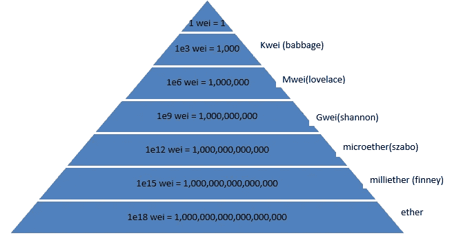
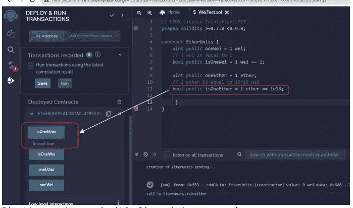
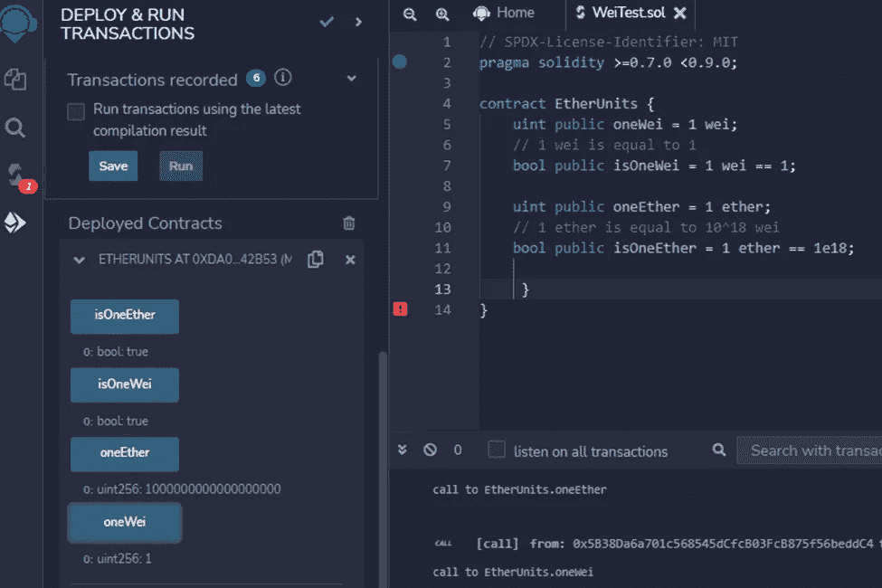
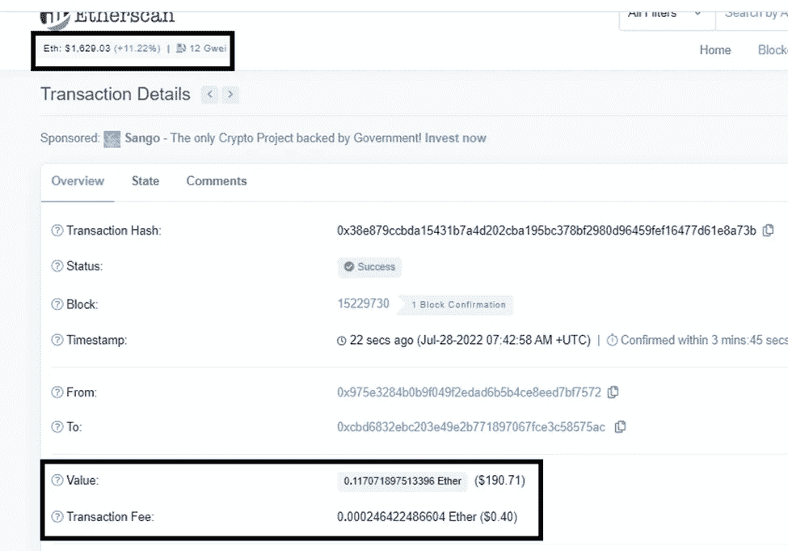

# 坚固的单元

> 原文：<https://medium.com/coinmonks/units-in-solidity-d9d0a8eb3fff?source=collection_archive---------19----------------------->

几乎在所有的编程语言中，我们都必须听说过局部变量、静态变量和全局变量。类似地，坚固度也有单位和全局可用的变量。单位分为以太单位和时间单位。以太很重要，用于账户间转账和支付交易费用。

## ***以太单位:***

我们需要货币来进行商品和服务的交易，类似地，以太也被用来支付计算交易，这就是以太坊虚拟机的货币。它被称为命名。

Ether Units

在以太单位中，最小的单位是微，最大的单位是以太，它们可以像美元和美分一样进行换算。字面意思可以带卫，芬尼，萨博这样的后缀。不带后缀的货币默认为更小的单位，即卫。

在下面的例子中，Etherunits 契约是在 Remix IDE 中编写和执行的。该程序有两个功能:isOneEther 和 isOneWei。当 1 wei 等于 1 literal 时，isOneWei 将返回 true。同样，当 1 ether 等于 1e18 (1 x 1018)时，isOneEther 将返回 true。该程序还显示 1 魏和 1 乙醚的值。

EtherUnit contract is executed and isOneEther method returns true value.

isOneWei is returns true. oneEther and oneWei value are also displayed.

您可以在 etherscan.io 中列出的任何交易中找到设备详情

Transaction fee is displayed Ether

# 时间单位

类似于货币单位，固体有时间单位来指定秒、分、小时、周和日作为后缀。下层单位次之。由于闰秒计算困难，0.5.0 版本中去掉了后缀 ***年*** 。

在代码中，它可以被称为，

**uint a = 3 分钟// 180 或 3*60**

**uint b = 2 小时；// 7200 或 2*60*60**

**uint c = 3 周// 1814400 或 3*7*24*60*60**

也可以对任何时间单位使用+和-符号等数学运算。

**uint date = 1658997083；**

**uint laterDate =日期+ 1 天；**

**uint beforeDate = date — 3 天；**

**uint prevWeek = date — 1 周；**

我们希望这有助于更好地理解以太和固体的时间单位。享受阅读:) :)

> 交易新手？尝试[加密交易机器人](/coinmonks/crypto-trading-bot-c2ffce8acb2a)或[复制交易](/coinmonks/top-10-crypto-copy-trading-platforms-for-beginners-d0c37c7d698c)