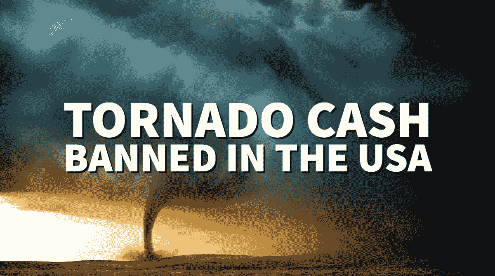
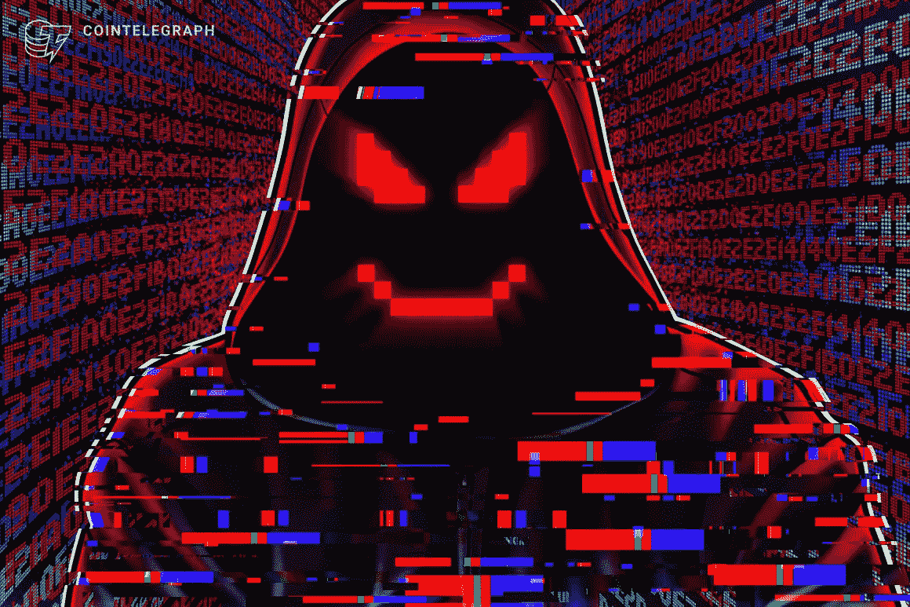

# 释放龙卷风现金中的龙卷风。

> 原文：<https://medium.com/coinmonks/unleashing-the-tornado-in-tornado-cash-c60239868646?source=collection_archive---------23----------------------->

The U.S government is still the most dominant, powerful force in the world.

美国政府的力量不容小觑。

去中心化、匿名、权力给人民以及在网络空间的流动，根本不能保护你免受美国政府强大而可怕的力量的影响。

至少龙卷风现金的开发者是这么发现的。

" 8 月 12 日，荷兰当局逮捕了 Tornado Cash 开发商 Alexy Pertsev，此举遭到了加密界的广泛谴责。"

简而言之，美国政府觉得黑客在利用龙卷风现金洗钱(尤其是朝鲜黑客)。

他们非常不高兴，并彻底禁止美国公民以任何方式使用龙卷风现金。

这甚至包括从使用 Tornado Cash 的用户那里收钱(这在加密世界里是无法阻止的！).

他们决定在阿姆斯特丹逮捕龙卷风现金的主要开发者(令人惊讶的是他们能找到一个匿名分散协议的头头！).

最棒的是，阿列克谢·佩尔采夫既不是 Tornado Cash 的联合创始人，也不是其雇员。

Alleged Tornado Cash Developer Alexey Pertsev to stay in jail.

他只是一个像其他人一样为分散式协议贡献代码的开发人员。

本质上，一个自由职业者或志愿者，如果你愿意。

恐惧、怀疑、不确定、爆发和抗议出现了。

“龙卷风现金张贴禁令更新:龙卷风删除了他们的不和。刀已关闭。主角戴夫已经被捕了。然而，不知何故，Celsius、Terra 和 Voyager 的创始人仍然很富有&可以自由走动。教训:你可以撒谎/欺骗/偷窃……但你不能给人们提供可以保护隐私的工具！”

有趣的想法，嗯？

一方面，你有坏演员，他们可能变得贪婪，导致市场崩溃，逍遥法外，没有忏悔。

另一方面，为软件编写代码以允许他人在网络空间匿名交易的人被抓进监狱，并被毫不客气地关闭。

对比鲜明，现实残酷。

不要妨碍美国政府的正义之路。

看到美国政府到底有多强大，让我感到震惊，尤其是在这样一个充满泡沫的环境下。

发布禁令，说服荷兰警方逮捕开发者，对抗整个密码社区，在这样一个艰难的时刻竟敢煽动 FUD。

How do you ban something decentralised, anonymous and faceless?

美国政府专门针对龙卷风现金，以儆效尤。

有很多类似于 Tornado Cash 的网站，它们也应该被关闭吗？

龙卷风现金是完全分散的，应该是匿名的，只作为代码存在于网络空间。

is 可以被美国政府“攻击”并拿下的事实向我们展示了他们是多么的无所不能。

我曾经认为像《杰森·伯恩》这样的电影纯粹是虚构的。

现在，我不再确定了。

是的，龙卷风现金可能犯了错误，但它值得世界上最强大的政府之一做出这样的反应吗？

龙卷风现金的下一步是什么？

他们的国库里还有 2200 万美元！

那会发生什么？

-

美国政府专门禁止龙卷风现金的做法对吗？

-

# startups # business # startupx # growth # success # social media # culture # web 3 # strategy # hacks # tornado cash # tornado # alexypertsev # developers # us government # privacy # laiming #非法#网络安全# eth # btc # crypto #黑客#钱包

> 交易新手？试试[加密交易机器人](/coinmonks/crypto-trading-bot-c2ffce8acb2a)或者[复制交易](/coinmonks/top-10-crypto-copy-trading-platforms-for-beginners-d0c37c7d698c)