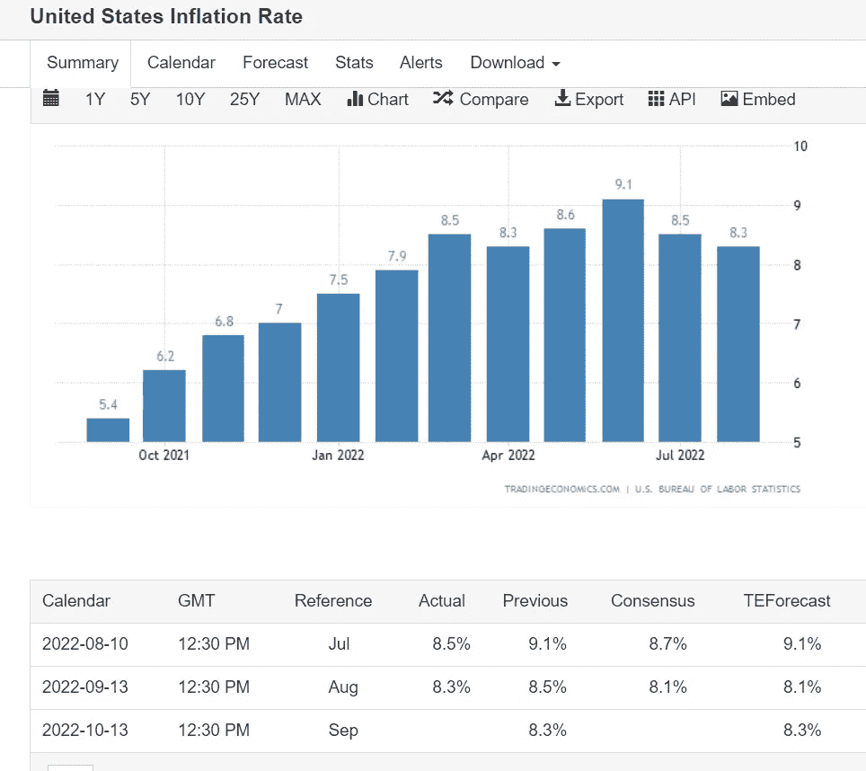
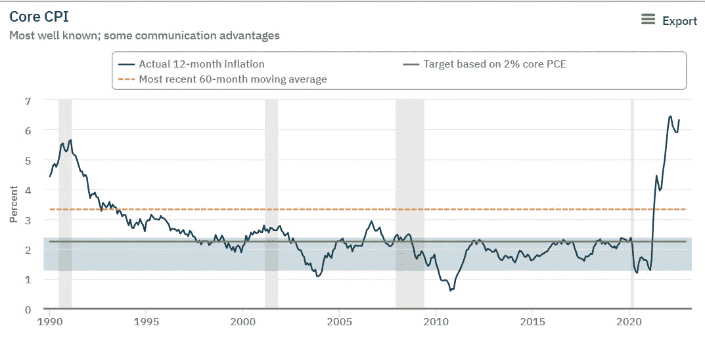
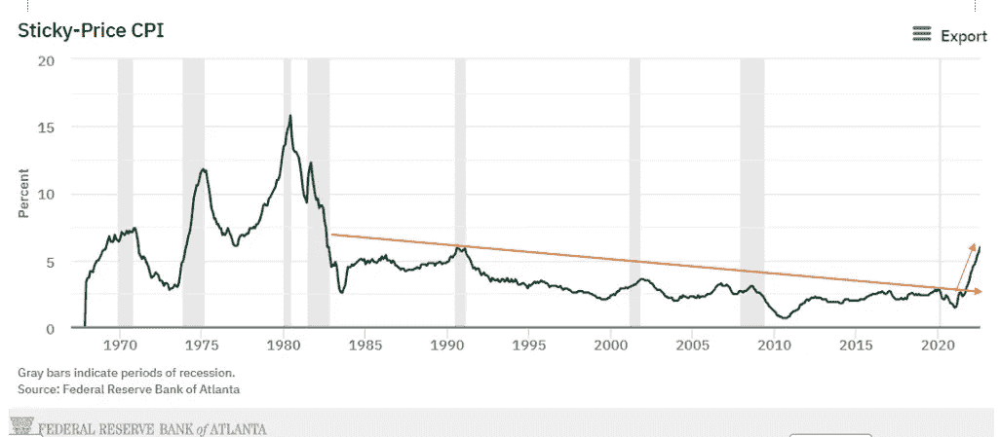
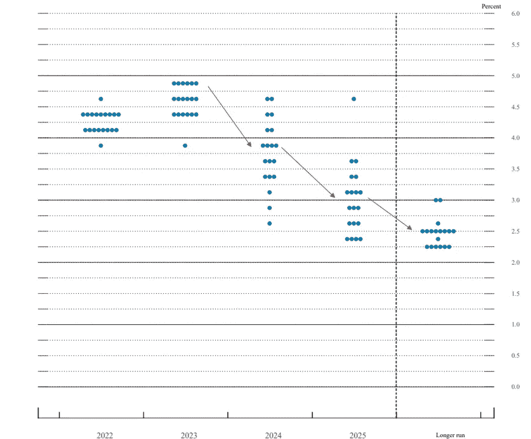
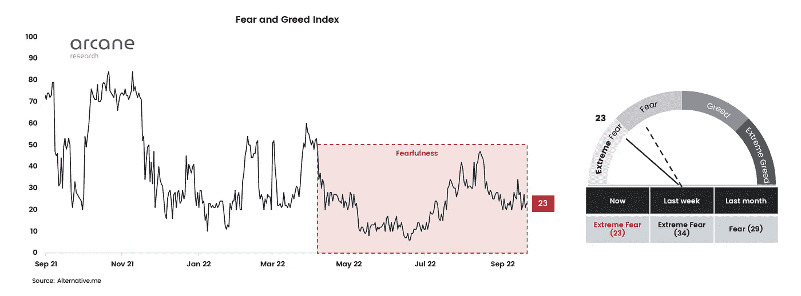

# 美联储史无前例地加息进入放缓的经济。小心！！

> 原文：<https://medium.com/coinmonks/unprecedented-hiking-from-the-fed-into-a-slowing-economy-watch-out-34e8a251d914?source=collection_archive---------14----------------------->

我以一些对加密行业和已经发生的机构采用增加的积极消息开始这篇文章，一旦宏观经济形势稳定下来，监管变得更加清晰，这种情况将进一步加剧。

常言道，熊市是建立和发展的最佳时期，我们看到**越来越多的机构在大公司中采用。 [Fidelity、Schwab 和 Citadel](https://www.coindesk.com/business/2022/09/13/charles-schwab-citadel-fidelity-and-others-start-crypto-exchange-edx-markets/) 也加入了这一行列，计划为散户和机构投资者推出自己的监管加密交易所，为用户提供高安全性标准和合规性。加上[贝莱德，后者也宣布](https://blog.coinbase.com/coinbase-selected-by-blackrock-provide-aladdin-clients-access-to-crypto-trading-and-custody-via-b9e7144f313d)与比特币基地达成协议，向他们的机构投资者提供比特币，这四大巨头管理着大约 20 万亿美元的资产。**

让我们假设一个现实的 5%的数字资产分配，四大巨头将使密码行业目前低于 1 万亿美元的市值翻一番。从全球股票市场的角度来看，它的市值不到 100 万亿美元，如果加密成为一种新的受监管的资产类别，它可以在未来 5-10 年内轻松达到 10 万亿美元的市值。

尽管如此，这些发展并没有在熊市中推动指针，因为它会在牛市中轻松创造 10%的上涨。

所以让我们继续前进，

【2022 年 8 月 CPI 读数

比 7 月份略有下降，为 8.3%(低于 8.5%)，但下降速度没有投资者预期的那样快，引发了对加密、股票甚至黄金的大幅抛售。除此之外，被称为核心通胀的通胀率(不包括能源和食品价格)比上月上涨 0.6 %，增幅高于 7 月，同比涨幅达到 6.3 %。这里最重要的组成部分是住房、医疗服务、教育、家居装饰、保险、机票、通信和二手车价格。在这些指数中，住房和医疗服务的涨幅最大，这些指数往往更具粘性，这让投资者有更多的理由担忧。还记得杰罗姆·鲍威尔去年唱的“短暂”这个词吗？如果你还没有忘记这个词，我们都可以忘记。

CPI inflation-lower than July, 8.5 % vs 8.3 %, but higher than the consensus forecast of 8.1%

这是个好消息，通货膨胀缓慢下降..如前所述，麻烦制造者是核心 CPI。在过去的二十年里，我们没有看到过这样的水平，实际核心通胀率远高于美联储 2%的目标，如图中灰色水平线所示。是否需要重新调整，新的 2%将变成 4%？尽管这种变化看起来很小，但它可以产生结构性变化，改变通胀预期，从而改变人们投资、储蓄和消费的方式。

Core CPI-well above the target based of 2% (Atlantafed.org)

我们中的大多数人都是在过去的一二十年里投资的，所以我们不熟悉在几十年的高通胀、持续高利率和紧缩的金融条件下投资。与大多数人认为将这次熊市与以前的熊市进行比较，只是不断购买下跌可能成为一种代价高昂的策略相反，在他们看来，每次下跌都是一次购买机会，但正如经济学家凯恩斯在 20 世纪 30 年代所说的那样，市场保持非理性的时间可能超过我们保持偿付能力的时间。

我倾向于认为，投资界正在发生一些结构性变化，轻松赚钱的时代至少现在已经结束，财富保值可以再次成为一种性感的策略，而不是我们习惯的天文数字般的收益。投资的美妙之处在于不断变化的宏观环境，因此，如果美联储决定在某个时候转向，我们应该做出相应调整，资产价格可能会迅速上涨。目前，我的主要资金处于待命状态，只在价格下跌时小批量积累。(对我来说，最有吸引力的是比特币和其他雄心勃勃的数字资产)

下图显示了 CPI(消费者价格指数)中变化缓慢的成分，因此被称为“粘性”,我们可以注意到持续了 30 多年的下降趋势线出现了明显的突破。

Sticky price CPI chart since 1960's

继昨天的杰罗姆·鲍威尔·FOMC 会议后，利率被上调，市场和大多数分析师预期为 0.75%。市场犹豫不决，直到杰罗姆·鲍威尔的讲话提供了更多信息，他重申了他的鹰派立场。我们可以预期家庭的痛苦，低于趋势的增长，通过破坏需求降低通胀的严肃承诺，失业率上升，以及如前所述的未来几年利率上升，因此所有资产类别的财务状况都将更加紧张。

大多数 FOMC 参与者预计利率将进一步上升，2023 年联邦基金利率的目标区间为 4.25%至 5%，中位数为 4.6%，远高于美联储在 6 月份的预测。许多人怀疑美国是否能在这样的利率水平上偿还债务，以及能维持多久。

正如美联储的点阵图所示，预计利率只会从 2024 年开始下降。这可能预示着未来 6-12 个月的不利宏观环境，价格趋势下跌，是积累的理想时机。风险较高的资产往往在具有扩张性货币政策的宏观环境中表现，如果通胀下降足够快，从 2023 年年中到年底可能会出现更宽松的金融条件，并更接近适当的目标利率。如果一切顺利，我预计接下来的几个季度将在数字资产领域带来巨大的机遇，并有可能在未来 5 年内改变生活。

FED Dot Plot and expected FED funds rate in the following years (Federalreserve.gov)

回到加密领域，恐惧和贪婪指数反映了投资者对该领域的乐观情绪，该指数已在令人恐惧的领域停留了 169 天，这是自 2018 年问世以来最长的一段时间。在最近的美联储会议和监管逆风以及最近 SEC 的以太坊审查之后，我预计这将持续另一个重要时期。

Fear and Greed index sits at Extreme Fear levels

正如我在之前的文章中所表达的，数字资产领域是比赛中最快的马，当转折点到来时，它将是对流动性改善反应最快的。

目前，我们都在等着看美联储会走多远，会给已经放缓的经济带来多大的痛苦，并关注价格何时会达到更低的水平。

祝您有美好的一天，感谢您的阅读！

免责声明:我必须警告你，有些观点可能是我个人的偏见，但是，我会尽我所能为你提供关于特定主题的客观观点。我还不是理财顾问，所有文章只会有严格的教育目的。

> 加入 Coinmonks [电报频道](https://t.me/coincodecap)和 [Youtube 频道](https://www.youtube.com/c/coinmonks/videos)了解加密交易和投资

# 另外，阅读

*   [有哪些交易信号？](https://coincodecap.com/trading-signal) | [Bitstamp vs 比特币基地](https://coincodecap.com/bitstamp-coinbase) | [买索拉纳](https://coincodecap.com/buy-solana)
*   [加密交易机器人](/coinmonks/crypto-trading-bot-c2ffce8acb2a) | [维护审查](https://coincodecap.com/uphold-review)
*   [如何给 MetaMask 钱包添加 Arbitrum？](https://coincodecap.com/how-to-add-arbitrum-to-metamask-wallet)
*   [KuCoin vs 北海巨妖 vs BitYard](https://coincodecap.com/kucoin-vs-kraken-vs-bityard)
*   [加密交易的最佳 VPNs】](https://coincodecap.com/best-vpns-for-crypto-trading)